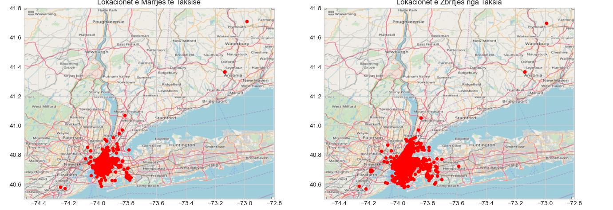
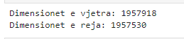

```{r setup, include=FALSE}
    library(knitr)
    library(tidyverse)
knitr::opts_chunk$set(
comment=NA,
error=F, 
warning=F,
tidy=TRUE, 
fig.align = 'center',
message=F, 
warning=F,
tidy.opts=list(width.cutoff=60),
fig.width=4, 
fig.height=4, 
fig.path='Figs/')
```


# Parashikimi i Tarifës së Taksive në New York City

## Leximi i të dhënave dhe eksplorimi i parë

\AddToHookNext{env/Highlighting/begin}{\tiny}   

```{python, eval = FALSE}
# ngarkoni disa module të parazgjedhura të Python
import numpy as np
import pandas as pd
import matplotlib.pyplot as plt
import seaborn as sns

# List available styles and choose an available one
print(plt.style.available)
plt.style.use("seaborn-v0_8-whitegrid")

%matplotlib inline
```

## Leximi i të dhënave dhe eksplorimi i parë

  - Si një dataset i madh, leximi i të gjitha të dhënave do të kërkonte shumë memorie. 
  
  - Prandaj lexojmë një numër të kufizuar rreshtash dhe eksplorojmë të dhënat. 
  

## Leximi i të dhënave dhe eksplorimi i parë

\AddToHookNext{env/Highlighting/begin}{\tiny}   

```{python, eval = FALSE}
# lexoni të dhënat në kuadrin e të dhënave të pandas
df_train = pd.read_csv('data/newyork/train.csv', nrows=2_000_000, parse_dates=["pickup_datetime"])

# listoni rreshtat e parë (pikë të dhënash)
df_train.head()
```


## Leximi i të dhënave dhe eksplorimi i parë


## Leximi i të dhënave dhe eksplorimi i parë

\AddToHookNext{env/Highlighting/begin}{\tiny}   

```{python, eval = FALSE}
# kontrolloni llojet e të dhënave
df_train.dtypes
```

## Leximi i të dhënave dhe eksplorimi i parë


## Leximi i të dhënave dhe eksplorimi i parë

\AddToHookNext{env/Highlighting/begin}{\tiny}   

```{python, eval = FALSE}
# kontrolloni statistikat e veçorive
df_train.describe()
```

## Leximi i të dhënave dhe eksplorimi i parë


## Leximi i të dhënave dhe eksplorimi i parë

Pikat e mëposhtme bien në sy:
  
  - Tarifa minimale është negative. 
  
  - Kjo nuk duket të jetë realiste, kështu që do t'i heqim nga seti i të dhënave.


## Leximi i të dhënave dhe eksplorimi i parë

  - Disa nga koordinatat minimale dhe maksimale të gjerësisë/gjatësisë janë shumë të largëta, kështu që do t'i heqim      ato gjithashtu.

  - Tarifa mesatare është rreth 11.4 USD me një devijim standard prej 9.9 USD.


## Leximi i të dhënave dhe eksplorimi i parë

\AddToHookNext{env/Highlighting/begin}{\tiny}   

```{python, eval = FALSE}
print('Madhësia e vjetër: %d' % len(df_train))
df_train = df_train[df_train.fare_amount >= 0]
print('Madhësia e re: %d' % len(df_train))
```

## Leximi i të dhënave dhe eksplorimi i parë


## Leximi i të dhënave dhe eksplorimi i parë

\AddToHookNext{env/Highlighting/begin}{\tiny}   

```{python, eval = FALSE}
# grafiku i histogramit të tarifës
df_train[df_train.fare_amount < 100].fare_amount.hist(bins=100, figsize=(14,3))
plt.xlabel('tarifa $USD')
plt.title('Histogram')
plt.show()
```


## Leximi i të dhënave dhe eksplorimi i parë


## Leximi i të dhënave dhe eksplorimi i parë

  - Në histogramin e **fare_amount** ka disa pika të vogla midis 40 dhe 60 dollarë. 
  
  - Kjo mund të tregojë një çmim fiks të tarifës (p.sh. për/nga aeroporti). 
  
  - Kjo do të eksplorohet më tej më poshtë


## Pastrimi i të dhënave

Fillimisht kontrollojmë për të dhëna të munguar dhe heqim rreshtat me mungesë të dhënash për të pasur një dataset të pastër për analizë.

## Pastrimi i të dhënave

\AddToHookNext{env/Highlighting/begin}{\tiny}   

```{python, eval = FALSE}
# Kontrollo për të dhëna të munguar
print(df_train.isnull().sum())
```

## Pastrimi i të dhënave


## Pastrimi i të dhënave

\AddToHookNext{env/Highlighting/begin}{\tiny}   

```{python, eval = FALSE}
# Shfaq numrin e rreshtave të vjetra dhe pastroni datasetin nga të dhënat e munguar
print('Numri i rreshtave të vjetra: %d' % len(df_train))
df_train = df_train.dropna(how = 'any', axis = 'rows')
print('Numri i rreshtave të reja: %d' % len(df_train))
```

## Pastrimi i të dhënave


## Të dhënat e testimit

Të dhënat e testimit ngarkohen për të krahasuar statistikat me datasetin e trajnimit.

\AddToHookNext{env/Highlighting/begin}{\tiny}   

```{python, eval = FALSE}
# Lexoni të dhënat e testimit
df_test = pd.read_csv('data/newyork/test.csv')
df_test.head(5)
```

## Të dhënat e testimit


## Statistikat e datasetit të testimit

\AddToHookNext{env/Highlighting/begin}{\tiny}   

```{python, eval = FALSE}
df_test.describe()
```


## Statistikat e datasetit të testimit


## Lokacionet

  - Duke qenë se kemi të bëjmë me të dhënat e vendndodhjes, duam të shfaqim koordinatat në një hartë. 
  
  - Kjo jep një pamje më të mirë të të dhënave. 
  
## Lokacionet

Koordinatat e qytetit të Nju Jorkut janë (https://www.travelmath.com/cities/New+York,+NY):

  - longitude = -74.0063889

  - lattitude = 40.7141667

## Lokacionet

  - Përcaktojmë një kuti kufizuese nga [long_min, long_max, latt_min, latt_max] duke përdorur koordinatat minimale dhe    maksimale nga të dhënaat **test**. 
  
## Lokacionet

  - Në këtë mënyrë, sigurohemi se do trajnojmë një model për gamën e plotë të koordinatave 
  

  - Nga Open Street Map  marrim një hartë dhe fshijmë çdo pikë të dhënash jashtë kësaj kutie.

## Lokacionet

\AddToHookNext{env/Highlighting/begin}{\tiny}   

```{python, eval = FALSE}
# Koordinatat e minimumit dhe maksimumit për longitude dhe latitude në setin e testimit
min(df_test.pickup_longitude.min(), df_test.dropoff_longitude.min()), \
max(df_test.pickup_longitude.max(), df_test.dropoff_longitude.max())
```


## Lokacionet

\AddToHookNext{env/Highlighting/begin}{\tiny}   

```{python, eval = FALSE}
import ssl
import urllib.request
from PIL import Image
import numpy as np
import matplotlib.pyplot as plt

# Disable SSL verification temporarily
ssl._create_default_https_context = ssl._create_unverified_context

# Funksioni për të filtruar të dhënat brenda kutisë së kufizuar
def select_within_boundingbox(df, BB):
    return (df['pickup_longitude'] >= BB[0]) & (df['pickup_longitude'] <= BB[1]) & \
           (df['pickup_latitude'] >= BB[2]) & (df['pickup_latitude'] <= BB[3]) & \
           (df['dropoff_longitude'] >= BB[0]) & (df['dropoff_longitude'] <= BB[1]) & \
           (df['dropoff_latitude'] >= BB[2]) & (df['dropoff_latitude'] <= BB[3])

# Funksioni për të lexuar imazhin duke përdorur PIL dhe urllib
def load_image(url):
    with urllib.request.urlopen(url) as url_data:
        img = Image.open(url_data)
        return np.array(img)

# Imazhi kryesor
BB = (-74.5, -72.8, 40.5, 41.8)
nyc_map_url = 'https://aiblog.nl/download/nyc_-74.5_-72.8_40.5_41.8.png'
nyc_map = load_image(nyc_map_url)

# Imazhi i zoom-ur
BB_zoom = (-74.3, -73.7, 40.5, 40.9)
nyc_map_zoom_url = 'https://aiblog.nl/download/nyc_-74.3_-73.7_40.5_40.9.png'
nyc_map_zoom = load_image(nyc_map_zoom_url)
```


## Lokacionet

\AddToHookNext{env/Highlighting/begin}{\tiny}   

```{python, eval = FALSE}
# Shfaq imazhin me matplotlib
fig, ax = plt.subplots(1, 2, figsize=(15, 7))

ax[0].imshow(nyc_map)
ax[0].set_title("NYC Map")
ax[0].axis('off')

ax[1].imshow(nyc_map_zoom)
ax[1].set_title("NYC Map Zoomed")
ax[1].axis('off')

plt.tight_layout()
plt.show()

```

## Lokacionet


## Lokacionet

\AddToHookNext{env/Highlighting/begin}{\tiny}   

```{python, eval = FALSE}
# Filtroni të dhënat sipas kutisë së kufizuar dhe shfaqni numrin e rreshtave të rinj
print('Numri i rreshtave të vjetra: %d' % len(df_train))
df_train = df_train[select_within_boundingbox(df_train, BB)]
print('Numri i rreshtave të rinj: %d' % len(df_train))
```

## Lokacionet


## Vizualizimi

Vizualizoni të dhënat e trajnimit mbi hartën e NYC duke përdorur funksionin e mëposhtëm.

\AddToHookNext{env/Highlighting/begin}{\tiny}   

```{python, eval = FALSE}
# Funksioni për të vizualizuar të dhënat mbi hartë
def plot_on_map(df, BB, nyc_map, s=10, alpha=0.2):
    fig, axs = plt.subplots(1, 2, figsize=(16,10))
    axs[0].scatter(df.pickup_longitude, df.pickup_latitude, zorder=1, alpha=alpha, c='r', s=s)
    axs[0].set_xlim((BB[0], BB[1]))
    axs[0].set_ylim((BB[2], BB[3]))
    axs[0].set_title('Lokacionet e Marrjes të Taksisë')
    axs[0].imshow(nyc_map, zorder=0, extent=BB)

    axs[1].scatter(df.dropoff_longitude, df.dropoff_latitude, zorder=1, alpha=alpha, c='r', s=s)
    axs[1].set_xlim((BB[0], BB[1]))
    axs[1].set_ylim((BB[2], BB[3]))
    axs[1].set_title('Lokacionet e Zbritjes nga Taksia')
    axs[1].imshow(nyc_map, zorder=0, extent=BB)
```


## Vizualizimi

\AddToHookNext{env/Highlighting/begin}{\tiny}   

```{python, eval = FALSE}
# Vizualizoni të dhënat e trajnimit në hartë
plot_on_map(df_train, BB, nyc_map, s=1, alpha=0.3)
```


## Vizualizimi


## Vizualizimi

Vizualizimi në hartën e zoom-ur


\AddToHookNext{env/Highlighting/begin}{\tiny}   

```{python, eval = FALSE}
# Vizualizoni të dhënat e trajnimit në hartën e zoom
plot_on_map(df_test, BB, nyc_map, alpha=1.0, s=20)
```

## Vizualizimi



## Vizualizimi

  - Nga grafiku i shpërndarjes së të dhënave të **train** shohim se disa lokacione janë në ujë. 
  
  - Ose këto konsiderohen si zhurmë, ose i heqim nga grupi i të dhënave. 
  
  - Do t'i heqim në vazhdim
  
  
## Vizualizimi

  - Një mënyrë tjetër interesante për të vizualizuar të dhënat:

  - Duke përdorur përmasa shumë të vogla pikash, rrugët aktuale të Nju Jorkut bëhen të dukshme.


## Vizualizimi


\AddToHookNext{env/Highlighting/begin}{\tiny}   

```{python, eval = FALSE}
def plot_hires(df, BB, figsize=(12, 12), ax=None, c=('r', 'b')):
    if ax == None:
        fig, ax = plt.subplots(1, 1, figsize=figsize)

    idx = select_within_boundingbox(df, BB)
    ax.scatter(df[idx].pickup_longitude, df[idx].pickup_latitude, c=c[0], s=0.01, alpha=0.5)
    ax.scatter(df[idx].dropoff_longitude, df[idx].dropoff_latitude, c=c[1], s=0.01, alpha=0.5)
```    


## Vizualizimi


\AddToHookNext{env/Highlighting/begin}{\tiny}   

```{python, eval = FALSE}
plot_hires(df_train, (-74.1, -73.7, 40.6, 40.9))
plot_hires(df_train, (-74, -73.95, 40.7, 40.8))

```


## Vizualizimi


## Heqja e pikave të të dhënave në ujë

  - Siç mund të shihet nga harta + parcelat e shpërndarjes më sipër, disa pika të dhënash ndodhen në ujë. 
  
  - Këto janë padyshim pika të dhënash **noise**. 
  
  - Për të hequr këto pika të dhënash, krijojmë një hartë **boolean** tokësore/ujore nga harta e NYC. 
  
## Heqja e pikave të të dhënave në ujë


\AddToHookNext{env/Highlighting/begin}{\tiny}   

```{python, eval = FALSE}
import ssl
import urllib.request
from PIL import Image
import numpy as np
import matplotlib.pyplot as plt

# Disable SSL verification temporarily
ssl._create_default_https_context = ssl._create_unverified_context

# Function to read image from URL using PIL and urllib
def load_image(url):
    with urllib.request.urlopen(url) as url_data:
        img = Image.open(url_data)
        return np.array(img)

# URL of the NYC mask
nyc_mask_url = 'https://aiblog.nl/download/nyc_mask-74.5_-72.8_40.5_41.8.png'

# Load the mask image and convert to boolean map
nyc_mask_image = load_image(nyc_mask_url)
nyc_mask = nyc_mask_image[:, :, 0] > 0.9
```


## Heqja e pikave të të dhënave në ujë (vazhdim)


\AddToHookNext{env/Highlighting/begin}{\tiny}   

```{python, eval = FALSE}
# URL e hartës të NYC
nyc_map_url = 'https://aiblog.nl/download/nyc_-74.5_-72.8_40.5_41.8.png'
nyc_map = load_image(nyc_map_url)

# Ndërtojmë hartën dhe maskën
plt.figure(figsize=(8, 8))
plt.imshow(nyc_map, zorder=0)
plt.imshow(nyc_mask, cmap='gray', zorder=1, alpha=0.3)  # Adjust `alpha` as needed
plt.axis('off')
plt.title(' Harta e NYC Map me Mask Overlay')
plt.show()
```


## Heqja e pikave të të dhënave në ujë (vazhdim)


## Heqja e pikave të të dhënave në ujë

  - Më pas, duhet të konvertojmë koordinatat e gjatësisë/gjerësisë gjeografike në koordinatat **piksel xy**. 
  
  - Funksioni **lonlat_to_xy** zbaton këtë transformim. 

## Heqja e pikave të të dhënave në ujë

  - Vini re se koordinata y duhet të kthehet mbrapsht pasi boshti y i imazhit drejtohet nga lart poshtë.

  - Kur për të gjitha pikat e të dhënave janë llogaritur koordinatat xy pixel, një indeks boolean llogaritet duke         përdorur maskën NYC.
  


## Heqja e pikave të të dhënave në ujë


\AddToHookNext{env/Highlighting/begin}{\tiny}   

```{python, eval = FALSE}
# përktheni koordinatat e gjatësisë/gjerësisë gjeografike në koordinatën xy të imazhit
def lonlat_to_xy(longitude, latitude, dx, dy, BB):
    return (dx*(longitude - BB[0])/(BB[1]-BB[0])).astype('int'), \
           (dy - dy*(latitude - BB[2])/(BB[3]-BB[2])).astype('int')
```


## Heqja e pikave të të dhënave në ujë


\AddToHookNext{env/Highlighting/begin}{\tiny}   

```{python, eval = FALSE}
pickup_x, pickup_y = lonlat_to_xy(df_train.pickup_longitude, df_train.pickup_latitude, 
                                  nyc_mask.shape[1], nyc_mask.shape[0], BB)
dropoff_x, dropoff_y = lonlat_to_xy(df_train.dropoff_longitude, df_train.dropoff_latitude, 
                                  nyc_mask.shape[1], nyc_mask.shape[0], BB)
```


## Heqja e pikave të të dhënave në ujë


\AddToHookNext{env/Highlighting/begin}{\tiny}   

```{python, eval = FALSE}
idx = (nyc_mask[pickup_y, pickup_x] & nyc_mask[dropoff_y, dropoff_x])
print("Numri i udhëtimeve në ujë: {}".format(np.sum(~idx)))
```


## Heqja e pikave të të dhënave në ujë


## Heqja e pikave të të dhënave në ujë

  - Krijojmë një funksion që heq pikat e të dhënave nga uji


## Heqja e pikave të të dhënave në ujë


\AddToHookNext{env/Highlighting/begin}{\tiny}   

```{python, eval = FALSE}
import ssl
import urllib.request
from PIL import Image
import numpy as np

# Çaktivizo përkohësisht verifikimin SSL
ssl._create_default_https_context = ssl._create_unverified_context

# Funksioni për të lexuar një imazh nga URL-ja duke përdorur PIL dhe urllib
def load_image(url):
    with urllib.request.urlopen(url) as url_data:
        img = Image.open(url_data)
        return np.array(img)

# Funksioni i modifikuar remove_datapoints_from_water
def remove_datapoints_from_water(df):
    def lonlat_to_xy(longitude, latitude, dx, dy, BB):
        x = (dx * (longitude - BB[0]) / (BB[1] - BB[0])).astype(int)
        y = (dy - dy * (latitude - BB[2]) / (BB[3] - BB[2])).astype(int)
        # Sigurohu që koordinatat janë brenda kufijve të imazhit
        x = np.clip(x, 0, dx - 1)
        y = np.clip(y, 0, dy - 1)
        return x, y
```

## Heqja e pikave të të dhënave në ujë


\AddToHookNext{env/Highlighting/begin}{\tiny}   

```{python, eval = FALSE}


    # Defino kutinë e kufizuar (bounding box)
    BB = (-74.5, -72.8, 40.5, 41.8)

    # URL-ja e maskës së NYC
    nyc_mask_url = 'https://aiblog.nl/download/nyc_mask-74.5_-72.8_40.5_41.8.png'

    # Ngarko imazhin e maskës dhe ktheje në hartë booleane
    nyc_mask_image = load_image(nyc_mask_url)
    nyc_mask = nyc_mask_image[:, :, 0] > 0.9

    # Llogarit koordinatat xy të maskës për secilin koordinatë lon/lat
    pickup_x, pickup_y = lonlat_to_xy(df.pickup_longitude, df.pickup_latitude, 
                                      nyc_mask.shape[1], nyc_mask.shape[0], BB)
    dropoff_x, dropoff_y = lonlat_to_xy(df.dropoff_longitude, df.dropoff_latitude, 
                                      nyc_mask.shape[1], nyc_mask.shape[0], BB)
    # Llogarit indekset booleane
    idx = nyc_mask[pickup_y, pickup_x] & nyc_mask[dropoff_y, dropoff_x]

    # Kthe vetëm pikat e të dhënave në tokë
    return df[idx]
```


## Heqja e pikave të të dhënave në ujë


\AddToHookNext{env/Highlighting/begin}{\tiny}   

```{python, eval = FALSE}
print('Dimensionet e vjetra: %d' % len(df_train))
df_train = remove_datapoints_from_water(df_train)
print('Dimensionet e reja: %d' % len(df_train))
```


## Heqja e pikave të të dhënave në ujë



## Kontrollojmë

\AddToHookNext{env/Highlighting/begin}{\tiny}   

```{python, eval = FALSE}

plot_on_map(df_train, BB, nyc_map)
```


## Kontrollojmë


    

## Dendësia e pikave të të dhënave për milje katror

  - Një përmbledhje e lokacioneve të marrjes dhe zbritjes jep një përshtypje të shpejtë të densitetit. 
  
  - Sidoqoftë, është më e saktë të numërohet numri i pikave të të dhënave për zonë për të vizualizuar densitetin. 
  
## Dendësia e pikave të të dhënave për milje katror  
  
  - Kodi më poshtë numëron pikat e të dhënave të marrjes dhe lëshimit për milje katrore. 
  
  - Kjo jep një pamje më të mirë në 'pikat e nxehta'.


## Dendësia e pikave të të dhënave për milje katror

\AddToHookNext{env/Highlighting/begin}{\tiny}   

```{python, eval = FALSE}

import numpy as np
import matplotlib.pyplot as plt

# Funksioni për të llogaritur distancën në milje midis vendndodhjeve në koordinatat gjerësi, gjatësi
# ktheni distancën në milje

def distance(lat1, lon1, lat2, lon2):
    p = 0.017453292519943295  # Pi/180
    a = 0.5 - np.cos((lat2 - lat1) * p) / 2 + np.cos(lat1 * p) * 
    np.cos(lat2 * p) * (1 - np.cos((lon2 - lon1) * p)) / 2
    return 0.6213712 * 12742 * np.arcsin(np.sqrt(a))  # 2*R*asin...

# Fillimisht llogaritim dy vektorë me dendësinë e pikave të të dhënave për milje katrore
n_lon, n_lat = 200, 200  # numri i koshave të rrjetit për dimensionin gjerësi, gjatësi
density_pickup, density_dropoff = np.zeros((n_lat, n_lon)), np.zeros((n_lat, n_lon))  # përgatisni grupet
```


## Dendësia e pikave të të dhënave për milje katror (vazhdim)

\AddToHookNext{env/Highlighting/begin}{\tiny}   

```{python, eval = FALSE}
# Për të llogaritur numrin e pikave të të dhënave në një zonë rrjeti, përdoret funksioni numpy.digitize().
# Ky funksion ka nevojë për një vektor me array (vendndodhje) për numërimin e pikave të të dhënave për kosh.
bins_lon = np.zeros(n_lon + 1)  # koshi
bins_lat = np.zeros(n_lat + 1)  # koshi
delta_lon = (BB[1] - BB[0]) / n_lon  # gjerësia e koshit të gjatë
delta_lat = (BB[3] - BB[2]) / n_lat  # lartësia e koshit të gjerësi
bin_width_miles = distance(BB[2], BB[1], BB[2], BB[0]) / n_lon  # gjerësia e koshit në milje
bin_height_miles = distance(BB[3], BB[0], BB[2], BB[0]) / n_lat  # lartësia e koshit në milje
for i in range(n_lon + 1):
    bins_lon[i] = BB[0] + i * delta_lon
for j in range(n_lat + 1):
    bins_lat[j] = BB[2] + j * delta_lat
```

## Dendësia e pikave të të dhënave për milje katror (vazhdim)

\AddToHookNext{env/Highlighting/begin}{\tiny}   

```{python, eval = FALSE}
# Ndërtojmë për dimensionin gjatësi, gjerësi
inds_pickup_lon = np.digitize(df_train.pickup_longitude, bins_lon)
inds_pickup_lat = np.digitize(df_train.pickup_latitude, bins_lat)
inds_dropoff_lon = np.digitize(df_train.dropoff_longitude, bins_lon)
inds_dropoff_lat = np.digitize(df_train.dropoff_latitude, bins_lat)

# Numëroni për array rrjeti
# shënim: mqs density_pickup do të shfaqet si imazh, indeksi i parë është drejtimi y,
#          indeksi i dytë është drejtimi x. Gjithashtu, drejtimi y duhet të përmbyset për
#          shfaqur si duhet (prandaj termi (n_lat-j))
dxdy = bin_width_miles * bin_height_miles
for i in range(n_lon):
    for j in range(n_lat):
        density_pickup[j, i] = np.sum((inds_pickup_lon == i + 1) & (inds_pickup_lat == (n_lat - j))) / dxdy
        density_dropoff[j, i] = np.sum((inds_dropoff_lon == i + 1) & (inds_dropoff_lat == (n_lat - j))) / dxdy

# Vizato grupet e dendësisë
fig, axs = plt.subplots(2, 1, figsize=(18, 24))
axs[0].imshow(nyc_map, zorder=0, extent=BB)
im = axs[0].imshow(np.log1p(density_pickup), zorder=1, extent=BB, alpha=0.6, cmap='plasma')
axs[0].set_title('Dendësia e marrjes [pika të dhënash për milje katrore]')
cbar = fig.colorbar(im, ax=axs[0])
cbar.set_label('log(1 + #pikave të dhënash për milje katrore)', rotation=270)


```


## Dendësia e pikave të të dhënave për milje katror (vazhdim)

\AddToHookNext{env/Highlighting/begin}{\tiny}   

```{python, eval = FALSE}

axs[1].imshow(nyc_map, zorder=0, extent=BB)
im = axs[1].imshow(np.log1p(density_dropoff), zorder=1, extent=BB, alpha=0.6, cmap='plasma')
axs[1].set_title('Dendësia e zbritjes [pika të dhënash për milje katrore]')
cbar = fig.colorbar(im, ax=axs[1])
cbar.set_label('log(1 + #pikave të dhënash për milje katrore)', rotation=270)
```


## Dendësia e pikave të të dhënave për milje katror (vazhdim)


## Dendësia e pikave të të dhënave për milje katror (vazhdim)


  - Këto harta tregojnë qartë se pikat e të dhënave përqendrohen rreth Manhatenit dhe tre aeroporteve (JFK, EWS, LGR). 
  
  -  Ekziston gjithashtu një pikë e nxehtë pranë Seymour (këndi i sipërm i djathtë). 
  
  - Meqenëse nuk jam nga SHBA-ja, a ka dikush një ide se çfarë është kaq e veçantë për këtë vendndodhje?

## Dendësia e trafikut të marrjes

  - Grafikët e dendësisë së mësipërme na nxitin të shohim nëse mund ta përfytyrojmë densitetin e trafikut për orë (dhe     vit). 
  
  - Duke numëruar numrin e marrjeve të taksive në një zonë, duhet të kemi një përshtypje të densitetit të trafikut. 
  
  - Sa më shumë trafik, aq më shumë mund të duhet për të bërë një rrugë.
  
  
## Dendësia e trafikut të marrjes

\AddToHookNext{env/Highlighting/begin}{\tiny}   

```{python, eval = FALSE}
# shtojmë info për kohën
df_train['year'] = df_train.pickup_datetime.apply(lambda t: t.year)
df_train['weekday'] = df_train.pickup_datetime.apply(lambda t: t.weekday())
df_train['hour'] = df_train.pickup_datetime.apply(lambda t: t.hour)
```


  
## Dendësia e trafikut të marrjes

\AddToHookNext{env/Highlighting/begin}{\tiny}   

```{python, eval = FALSE}
# disa konstante të nevojshme për të llogaritur dendësinë e trafikut të marrjes
n_hours = 24
n_weekdays = 7
n_years = 7
n_bins_lon = 30
n_bins_lat = 30

# fokusimi në trafikun në Manhattan
BB_traffic = (-74.025, -73.925, 40.7, 40.8)
```


## Dendësia e trafikut të marrjes

\AddToHookNext{env/Highlighting/begin}{\tiny}   

```{python, eval = FALSE}

# përkufizo funksionin për të llogaritur dendësinë e trafikut të marrjes
def calculate_trafic_density(df):
    traffic = np.zeros((n_years, n_weekdays, n_hours, n_bins_lat, n_bins_lon))
    
    # Për të llogaritur numrin e pikave të të dhënave në një zonë rrjeti, përdoret funksioni numpy.digitize().
    # Ky funksion ka nevojë për një vektor me kosha (vendndodhje) për numërimin e pikave të të dhënave
    # për kosh.
    bins_lon = np.zeros(n_bins_lon+1)  # koshi
    bins_lat = np.zeros(n_bins_lat+1)  # koshi
    
    delta_lon = (BB_traffic[1] - BB_traffic[0]) / n_bins_lon  # gjerësia e koshit të gjatë
    delta_lat = (BB_traffic[3] - BB_traffic[2]) / n_bins_lat  # lartësia e koshit të gjerësi
    
    for i in range(n_bins_lon+1):
        bins_lon[i] = BB_traffic[0] + i * delta_lon
    for j in range(n_bins_lat+1):
        bins_lat[j] = BB_traffic[2] + j * delta_lat
```
 
## Dendësia e trafikut të marrjes (vazhdim)

\AddToHookNext{env/Highlighting/begin}{\tiny}   

```{python, eval = FALSE} 
 
    # Numëroni për kosh rrjeti
    # shënim: pasi që density_pickup do të shfaqet si imazh, indeksi i parë është drejtimi y,
    #          indeksi i dytë është drejtimi x. Gjithashtu, drejtimi y duhet të përmbyset për
    #          shfaqur si duhet (prandaj termi (n_lat-j))
    for y in range(n_years):
        for d in range(n_weekdays):
            for h in range(n_hours):
                idx = (df.year == (2009 + y)) & (df.weekday == d) & (df.hour == h)

                # Digjitoni për dimensionin gjatësi, gjerësi
                inds_pickup_lon = np.digitize(df[idx].pickup_longitude, bins_lon)
                inds_pickup_lat = np.digitize(df[idx].pickup_latitude, bins_lat)

                for i in range(n_bins_lon):
                    for j in range(n_bins_lat):
                        traffic[y, d, h, j, i] = traffic[y, d, h, j, i] + \
                                                 np.sum((inds_pickup_lon == i + 1) & (inds_pickup_lat == j + 1))
    
    return traffic
```

## Dendësia e trafikut të marrjes (vazhdim)

\AddToHookNext{env/Highlighting/begin}{\tiny}   

```{python, eval = FALSE}
# përkufizo funksionin për të vizatuar dendësinë e trafikut të marrjes
def plot_traffic(traffic, y, d):
    days = {'monday': 0, 'tuesday': 1, 'wednesday': 2, 'thursday': 3, 'friday': 4, 'saturday': 5, 'sunday': 6}
    fig, axs = plt.subplots(3, 8, figsize=(18, 7))
    axs = axs.ravel()
    for h in range(24):
        axs[h].imshow(traffic[y - 2009, days[d], h, ::-1, :], zorder=1, cmap='coolwarm', clim=(0, traffic.max()))
        axs[h].get_xaxis().set_visible(False)
        axs[h].get_yaxis().set_visible(False)
        axs[h].set_title('h={}'.format(h))
    fig.suptitle("Dendësia e trafikut të marrjes, viti={}, dita={} (max_pickups={})".format(y, d, traffic.max()))

```


## Dendësia e trafikut të marrjes

  - Tani, le të llogarisim densitetin dhe të përfytyrojmë parcelat.

  - cilësia e grafikëve varet nga numri i pikave të të dhënave të përdorura. 

## Dendësia e trafikut të marrjes

  - Përdorim si parazgjedhje 500 mijë pika, të cilat nuk mjaftojnë për parcela me densitet të mirë trafiku. 
  
  - Rritni numrin e pikëve dhe merrni parcela më të mira.


## Dendësia e trafikut të marrjes 

\AddToHookNext{env/Highlighting/begin}{\tiny}   

```{python, eval = FALSE}
traffic = calculate_trafic_density(df_train)
plot_traffic(traffic, 2009, 'monday')
plot_traffic(traffic, 2009, 'friday')
plot_traffic(traffic, 2009, 'sunday')
```


## Dendësia e trafikut të marrjes 


## Dendësia e trafikut të marrjes 

  - Tashmë nga këto parcela mund të shohim modelet e ndryshme të densitetit të trafikut sipas orës, por edhe sipas        vendndodhjes. 
  
  - P.sh. të dielën h=0-3 orë (e shtunë mbrëma deri të dielën) ka më shumë trafik se në ditët e javës. 
  
## Dendësia e trafikut të marrjes   
  
  - Supozojmë se kjo është nga njerëzit që dalin dhe shijojnë fundjavën. 
  
  
  - Le të përfytyrojmë edhe një vit tjetër.


## Dendësia e trafikut të marrjes 


\AddToHookNext{env/Highlighting/begin}{\tiny}   

```{python, eval = FALSE}
plot_traffic(traffic, 2014, 'monday')
plot_traffic(traffic, 2014, 'friday')
plot_traffic(traffic, 2014, 'sunday')
```


## Dendësia e trafikut të marrjes 


## Analiza e Dendësisë dhe Distancës së Trafikut"

Përpara se të ndërtojmë një model, duam të testojmë disa 'intuicione':

  - Sa më e gjatë distanca midis vendndodhjes së marrjes dhe zbritjes, aq më i lartë është çmimi.
  
  - Disa udhëtime, si p.sh. nga/te një aeroport, kanë tarifa të përcaktuara.

  - Tarifa gjatë natës është ndryshe nga ajo e ditës.

## Analiza e Dendësisë dhe Distancës së Trafikut"

  - Pra, le të kontrollojmë.

## Distanca dhe Çmimi

  - Sa më e gjatë distanca midis vendndodhjes së marrjes dhe zbritjes, aq më i lartë është çmimi.


## Distanca dhe Çmimi

Për të vizualizuar lidhjen distancë-çmim, së pari duhet të llogarisim distancën e një udhëtimi.

\AddToHookNext{env/Highlighting/begin}{\tiny}   

```{python, eval = FALSE}
# shtoni një kolonë të re në dataframe me distancën në milje
df_train['distance_miles'] = distance(df_train.pickup_latitude, df_train.pickup_longitude, \
                                      df_train.dropoff_latitude, df_train.dropoff_longitude)
```

## Distanca dhe Çmimi

\AddToHookNext{env/Highlighting/begin}{\tiny}   

```{python, eval = FALSE}
# Trego histogramin e distancave të udhëtimeve në milje
df_train.distance_miles.hist(bins=50, figsize=(12,4))
plt.xlabel('distanca në milje')
plt.title('Histogrami i distancave të udhëtimeve në milje')
df_train.distance_miles.describe()
```

## Distanca dhe Çmimi


## Distanca dhe Çmimi

  - Rezultatet e këtij operacioni tregojnë se shumica e udhëtimeve janë të shkurtra, me një kulm të vogël rreth ~13      milje.
  
  - Ky kulm mund të jetë për shkak të udhëtimeve të aeroportit.


## Numri i Pasagjerëve

Të shohim gjithashtu ndikimin e numrit të pasagjerëve.

\AddToHookNext{env/Highlighting/begin}{\tiny}   

```{python, eval = FALSE}
# Llogarisni mesataren e distancave dhe tarifave në varësi të numrit të pasagjerëve
df_train.groupby('passenger_count')[['distance_miles', 'fare_amount']].mean()
```

## Numri i Pasagjerëve


## Numri i Pasagjerëve

  - Rezultati: Një numër pasagjerësh prej zero duket i çuditshëm. 
  
  - Ndoshta një taksi që transporton disa mallra ose një gabim administrativ?

## Tarifa për Milje

Në vend që të shohim **fare_amount**, përdorimi i 'fare per mile' gjithashtu ofron disa njohuri.

\AddToHookNext{env/Highlighting/begin}{\tiny}   

```{python, eval = FALSE}
# Llogaritni mesataren e USD për milje
print("Mesatarja USD/Mile : {:0.2f}".format(df_train.fare_amount.sum()/df_train.distance_miles.sum()))
```


## Grafiku i Pikave për Distancën dhe Tarifën


\AddToHookNext{env/Highlighting/begin}{\tiny}   

```{python, eval = FALSE}
# Trego grafikun e pikave për distancën dhe tarifën
fig, axs = plt.subplots(1, 2, figsize=(16,6))
axs[0].scatter(df_train.distance_miles, df_train.fare_amount, alpha=0.2)
axs[0].set_xlabel('distanca në milje')
axs[0].set_ylabel('tarifa USD')
axs[0].set_title('Të gjitha të dhënat')
```


## Grafiku i Pikave për Distancën dhe Tarifën (vazhdim)


\AddToHookNext{env/Highlighting/begin}{\tiny}   

```{python, eval = FALSE}
# Trego një pamje të të dhënave të filtruara
idx = (df_train.distance_miles < 15) & (df_train.fare_amount < 100)
axs[1].scatter(df_train[idx].distance_miles, df_train[idx].fare_amount, alpha=0.2)
axs[1].set_xlabel('distanca në milje')
axs[1].set_ylabel('tarifa USD')
axs[1].set_title('Pjesë e të dhënave me distancë < 15 milje, tarifë < $100')
```

## Grafiku i Pikave për Distancën dhe Tarifën


## Grafiku i Pikave për Distancën dhe Tarifën (vazhdim)

Nga ky grafik vërejmë se:

  - Ka udhëtime me distancë zero, por me një tarifë jo zero.
  
  - Ka disa udhëtime me >50 milje distancë udhëtimi por tarifë të ulët.

  - Linjat horizontale në grafikun e djathtë mund të tregojnë përsëri udhëtimet me tarifë fikse.

## Informacione mbi Tarifat e Taksive

Kur kërkojmë për çmimet e taksive në NYC në Google, gjejmë:

  - $4.00 – $10.00 për një udhëtim prej 3 km.

  - Fillimi varion nga $2.50 - $3.30.
  
  
## Informacione mbi Tarifat e Taksive

  - Tarifa fillestare për shumicën e udhëtimeve (me përjashtim të JFK dhe aeroporteve të tjera) është 2,50 dollarë       pas hyrjes.
  
  - Pas kësaj ka 0,5 dollarë çdo njësi ku njësia përcaktohet si 1/5 e miljes ose kur taksi po udhëton 12 milje në orë    ose më shumë.
  
## Informacione mbi Tarifat e Taksive 

  - 0,5 dollarë shtesë shtesë midis orës 20:00 - 06:00.

  - Tarifa shtesë për orët e pikut të javës prej 1 dollarë e hënë-e premte nga ora 16:00-20:00.

  - Ka një shtesë prej 0,5 dollarësh MTA për të gjitha udhëtimet që përfundojnë në qarqet e Nju Jorkut ose Nassau,      Suffolk, Westchester, Rockland, Dutchess, Orange ose Putnam.

## Informacione mbi Tarifat e Taksive

  - Ka një shtesë prej 0,3 dollarësh për përmirësim

## Informacione mbi Tarifat e Taksive

\AddToHookNext{env/Highlighting/begin}{\tiny}   

```{python, eval = FALSE}
# hiqni pikat e të dhënave me distancë <0.05 milje
idx = (df_train.distance_miles >= 0.05)
print('Madhësia e vjetër: %d' % len(df_train))
df_train = df_train[idx]
print('Madhësia e re: %d' % len(df_train))
```

## Informacione mbi Tarifat e Taksive

Kjo pastron të dhënat dhe bën analizën më të besueshme.


## Udhëtime me Tarifa Fikse

  - Disa udhëtime, si ato drejt/nga aeroporti, kanë tarifa fikse. 
  
  - Një mënyrë për të eksploruar të dhënat është duke kontrolluar udhëtimet drejt/nga vende të njohura. 
  
  - P.sh., një udhëtim drejt Aeroportit JFK, që shpesh ka çmim të fiksuar në varësi të distancës.

## Koordinatat e Aeroportit JFK


\AddToHookNext{env/Highlighting/begin}{\tiny}   

```{python, eval = FALSE}
jfk <- c(-73.7822222222, 40.6441666667)
nyc <- c(-74.0063889, 40.7141667)
```


## Funksioni për të Vizualizuar Tarifën pranë Aeroportit


\AddToHookNext{env/Highlighting/begin}{\tiny}   

```{python, eval = FALSE}
def plot_location_fare(loc, name, range=1.5):
     # Zgjedh të gjitha pikë të dhënave me vendin e ngritjes brenda rrezes së aeroportit
    fig, axs = plt.subplots(1, 2, figsize=(14, 5))
    idx = (distance(df_train.pickup_latitude, df_train.pickup_longitude, loc[1], loc[0]) < range)
    df_train[idx].fare_amount.hist(bins=100, ax=axs[0])
    axs[0].set_xlabel('Tarifa USD')
    axs[0].set_title('Histogram vendi i marrjes brenda {} miles of {}'.format(range, name))

    idx = (distance(df_train.dropoff_latitude, df_train.dropoff_longitude, loc[1], loc[0]) < range)
    df_train[idx].fare_amount.hist(bins=100, ax=axs[1])
    axs[1].set_xlabel('Tarifa USD')
    axs[1].set_title('Histogram vendi i mbrritjes brenda {} miles of {}'.format(range, name));
```


## Vizualizoni Tarifën për JFK


\AddToHookNext{env/Highlighting/begin}{\tiny}   

```{python, eval = FALSE}
plot_location_fare(jfk, 'Aeroporti JFK')
```


## Vizualizoni Tarifën për JFK


## Aeroporte të Tjera

Po përsërisim analizën për aeroportet e tjera të NYC:

\AddToHookNext{env/Highlighting/begin}{\tiny}   

```{python, eval = FALSE}
ewr = (-74.175, 40.69) # Aeroporti Newark
lgr = (-73.87, 40.77) # Aeroporti LaGuardia

plot_location_fare(ewr, 'Aeroporti Newark')
plot_location_fare(lgr, 'Aeroporti LaGuardia')
```


## Aeroporte të Tjera


## Tarifat Ndryshojnë Natën Krahasuar me Ditën

Për të parë lidhjen mes kohës dhe tarifës/km, shtojmë tre kolona të reja në të dhëna: vitin, orën e ditës dhe tarifën USD për KM.

\AddToHookNext{env/Highlighting/begin}{\tiny}   

```{python, eval = FALSE}
df_train['fare_per_mile'] = df_train.fare_amount / df_train.distance_miles
df_train.fare_per_mile.describe()
```


## Tarifat Ndryshojnë Natën Krahasuar me Ditën


## Tarifat Ndryshojnë Natën Krahasuar me Ditën

  - Tarifa maksimale USD/milje duket e lartë. 
  
  - Kjo mund të jetë për shkak të të dhënave të gabuara të distancës ose tarifës.
  
## Tarifat Ndryshojnë Natën Krahasuar me Ditën

Tarifa e taksisë në përgjithësi llogaritet nga:

\[
y_{\text{tarifa}} = \theta_0 + \theta_1 \cdot x_{\text{distanca}} + \theta_2 \cdot x_{\text{koha}}
\]


## Tarifat Ndryshojnë Natën Krahasuar me Ditën

Për të shprehur tarifën për distancë:

\[
\frac{y_{\text{tarifa}}}{x_{\text{distanca}}} = \theta_0 \cdot x_{\text{distanca}} + \theta_1 + \theta_2 \cdot \frac{x_{\text{koha}}}{x_{\text{distanca}}}
\]

## Tarifat Ndryshojnë Natën Krahasuar me Ditën

Nëse supozojmë që për udhëtime më të shkurtra:


\[
x_{\text{distanca}} = c \cdot x_{\text{koha}}
\]

atëherë shprehet si:

## Tarifat Ndryshojnë Natën Krahasuar me Ditën

\[
\frac{y_{\text{tarifa}}}{x_{\text{distanca}}} = \theta_0 \cdot x_{\text{distanca}} + \theta'_1
\]

me:

\[
\theta'_1 = \theta_1 + \frac{\theta_2}{c}
\]

## Tarifat Ndryshojnë Natën Krahasuar me Ditën

Në përfundim, tarifa për distancë është proporcionale me 1/distanca_milje. Tani të vizatojmë grafikun.

\AddToHookNext{env/Highlighting/begin}{\tiny}   

```{python, eval = FALSE}
idx = (df_train.distance_miles < 3) & (df_train.fare_amount < 100)
plt.scatter(df_train[idx].distance_miles, df_train[idx].fare_per_mile)
plt.xlabel('Distanca milje')
plt.ylabel('Tarifa për distancë milje')

theta = (16, 4.0)
x = np.linspace(0.1, 3, 50)
plt.plot(x, theta[0]/x + theta[1], '--', c='r', lw=2);
```


## Tarifat Ndryshojnë Natën Krahasuar me Ditën


## Tarifat Ndryshojnë Natën Krahasuar me Ditën

  - Vini re se tarifa për distancë ka më shumë përhapje për distanca më të vogla (<0,5 milje) sesa distanca më të        mëdha. 
  
  - Kjo mund të shpjegohet si më poshtë: ne matim distancën nga pika në pikë dhe jo me rrugë. 
  
## Tarifat Ndryshojnë Natën Krahasuar me Ditën

  - Për distanca më të vogla, diferenca midis këtyre dy metodave të matjes pritet të jetë më e madhe.
  
  - Një arsye tjetër pse përhapja për distanca më të vogla është më e madhe mund të jetë për shkak të ngadalësimit të    trafikut në orët e pikut. 
  
  - Udhëtimet e shkurtra në orët e pikut ndryshojnë më shumë në kohëzgjatje.

## Tarifat Ndryshojnë Natën Krahasuar me Ditën

  - Le të vazhdojmë me analizën e kohës dhe tarifës për distancë. 

## Tarifat Ndryshojnë Natën Krahasuar me Ditën

  - Dp përdorim një tabelë **pivot** panda për të bërë një përmbledhje dhe për t'i vizatuar ato.


## Tarifat Ndryshojnë Natën Krahasuar me Ditën

\AddToHookNext{env/Highlighting/begin}{\tiny}   

```{python, eval = FALSE}
df_train.pivot_table('fare_per_mile', index='hour', columns='year').plot(figsize=(14,6))
plt.ylabel('Tarifa $USD / milje');
```


## Tarifat Ndryshojnë Natën Krahasuar me Ditën


## Tarifat Ndryshojnë Natën Krahasuar me Ditën

Mund të shihet qartë se tarifa $USD/milje ndryshon me kalimin e viteve dhe me kalimin e orëve.

## Tarifat Ndryshojnë Natën Krahasuar me Ditën

Për të hetuar më tej këtë, përdorim hartën e Google për të llogaritur kohëzgjatjen e pritshme të dy udhëtimeve:

  - Udhëtimi 1: nga Muzeu i Qytetit të Nju Jorkut në Teatrin Beacon, 4.5 km, pa lënë Manhatten

  - Udhëtimi 2: nga Times Squared në Parkun Maria Hermandez, 12 km, duke lënë Times Squared nëpërmjet tunelit Queens Midtown (rruga me pagesë)

## Tarifat Ndryshojnë Natën Krahasuar me Ditën

  - Sasia e trafikut përcakton kohëzgjatjen e udhëtimit dhe rrjedhimisht tarifën. 

  - Ndërsa sasia e trafikut varet nga ora e ditës.
  
  
  
## Tarifat Ndryshojnë Natën Krahasuar me Ditën 

\AddToHookNext{env/Highlighting/begin}{\tiny}   

```{python, eval = FALSE}
hours = [0, 1, 2, 3, 4, 5, 6, 7, 8, 9, 10, 11, 12, \
         13, 14, 15, 16, 17, 18, 19, 20, 21, 22, 23]

# kohëzgjatja minimale dhe maksimale në minuta
trip1_min = [10, 10, 10, 10, 10, 10, 10, 12, 14, 14, 14, 14, \
             14, 14, 14, 14, 14, 12, 12, 12, 12, 12, 10, 10]
trip1_max = [20, 18, 16, 16, 16, 18, 22, 26, 40, 35, 35, 35, \
             35, 35, 35, 40, 35, 30, 28, 28, 26, 26, 24, 24]

trip2_min = [18, 18, 18, 18, 18, 18, 20, 24, 28, 30, 30, 30, \
             28, 28, 26, 28, 30, 28, 26, 22, 22, 22, 20, 20]
trip2_max = [35, 35, 30, 28, 28, 30, 40, 55, 75, 75, 70, 70, \
             60, 60, 60, 60, 60, 65, 55, 45, 45, 50, 45, 40]
```


## Tarifat Ndryshojnë Natën Krahasuar me Ditën (vazhdim)

\AddToHookNext{env/Highlighting/begin}{\tiny}   

```{python, eval = FALSE}
# Vizato grafikun e kohës së udhëtimit të vlerësuar për dy udhëtime duke përdorur informacionin e trafikut të Google Maps
plt.figure(figsize=(12, 5))

# Vizato trip1 (2.7 milje) me kohën minimale dhe maksimale të udhëtimit
plt.plot(hours, trip1_min, '--', c='b', label="trip1 (2.7 milje) - koha minimale")
plt.plot(hours, trip1_max, '-', c='b', label="trip1 (2.7 milje) - koha maksimale")

# Vizato trip2 (7.2 milje) me kohën minimale dhe maksimale të udhëtimit
plt.plot(hours, trip2_min, '--', c='r', label="trip2 (7.2 milje) - koha minimale")
plt.plot(hours, trip2_max, '-', c='r', label="trip2 (7.2 milje) - koha maksimale")

# Vendos etiketën e boshtit x si 'ora e ditës'
plt.xlabel('ora e ditës')

# Vendos etiketën e boshtit y si 'koha e drejtimit (min)'
plt.ylabel('koha e drejtimit (min)')

# Vendos titullin e grafikut si 'Koha e vlerësuar e drejtimit për dy udhëtime duke përdorur informacionin e trafikut të Google Maps'
plt.title('Koha e vlerësuar e drejtimit për dy udhëtime duke përdorur informacionin e trafikut të Google Maps')

# Shto një legjendë për të dalluar vizatimet
plt.legend()

```
  
## Tarifat Ndryshojnë Natën Krahasuar me Ditën

  
  
  
  
  
