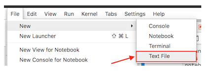
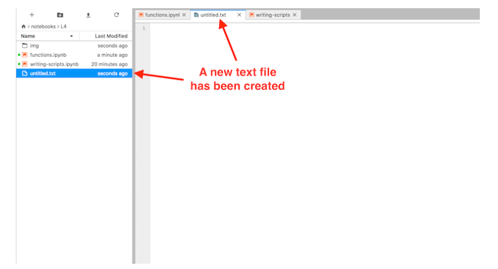
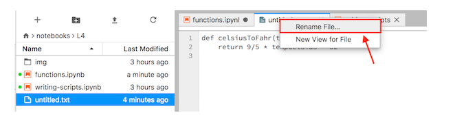
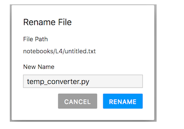

```{r setup, include=FALSE}
    library(knitr)
    library(tidyverse)
knitr::opts_chunk$set(
comment=NA,
error=T, 
warning=T,
tidy=TRUE, 
fig.align = 'center',
message=F, 
warning=F,
tidy.opts=list(width.cutoff=60),
fig.width=4, 
fig.height=4, 
fig.path='Figs/')
```

# Kushtet në Python

## Përmbledhje e Deklaratave të Kushtëzuara (Conditional Statements)

  - Deklaratat kushtetuese në Python (if, elif, else) mundësojnë marrjen e vendimeve në kod.
  
  - Ato vlerësojnë kushte Booleane (True ose False) për të përcaktuar rrugët e ekzekutimit të kodit.


## Bazat e Deklaratave të Kushtëzuara

  - e Deklaratave e Kushtëzuara mund të ndryshojnë sjelljen e kodit bazuar në kushte të caktuara.
  
  - Struktura bazë: NËSE një kusht plotësohet, ATËHERË një grup veprimesh ekzekutohet.

## Deklaratë e Thjeshtë me Kusht

Shembull i thjeshtë për temperaturën, për të parë nëse është e nxehtë apo jo:

``` python
temperatura = 17
if temperatura > 25:
    print("është nxehtë!")
else:
    print("nuk është nxehtë!")
```    

## Deklaratë e Thjeshtë me Kusht

  - Fillimisht, përdorëm deklaratat **if** dhe **else** për të vendosur cilat pjesë të kodit të ekzekutohen. 
  
  - Deklarata **if** kontrollon për të parë nëse vlera e variablës për temperaturën është më e madhe se 25. 
  
  - Nëse ky kusht është i plotësuar, 'është nxehtë' do të shkruhet në ekran. 
 
  - Mqs 17 është më e vogël se 25, kodit nën **else** ekzekutohet. 
 
## Deklaratë e Thjeshtë me Kusht

  - Kodi nën deklaratën **else** do të ekzekutohet kur testi i **if** është i pasaktë.

  - Le të përditësojmë temperaturën në një temperaturë "e nxehtë" dhe të përsërisim të njëjtën proces:


## Deklaratë e Thjeshtë me Kusht

``` python
temperatura = 30
if temperatura > 25:
    print("është nxehtë!")
else:
    print("nuk është nxehtë!")
```    


## Deklaratat If pa Else

  - **Else** nuk është gjithmonë i nevojshëm në deklaratat e Kushtëzuara.

  - Nëse kushti është **False** dhe nuk ka **Else**, Python nuk bën asgjë.
  
  

## Deklaratat If pa Else

``` python
temperature = 17

if temperature > 25:
  print(temperature, "është më shume se 25")  
```  


## Deklaratat If pa Else

  - Deklaratat e kushtëzuara gjithmonë kontrollojnë nëse shprehja e kushtëzuar është e vërtetë ose e gabuar. 
  
  - Nëse është e vërtetë, blloku i kodit nën deklaratën e kushtëzuar ekzekutohet. 
  
  - Asgjë nuk printohet në ekran nëse temperatura është më e vogël se 25.


## Deklaratat If pa Else

Imagjinoni që jeni duke u përgatitur për të dalë nga shtëpia dhe dëshironi të vendosni çfarë të vishni. 

  - Mund të shikoni jashtë për të kontrolluar kushtet e motit. 
  
  - Nëse po bie shi, do të vishni një xhaketë shiu. 
  

## Shembull

Python-i përdor operatorin **==** për të provuar nëse një vlerë është e barabartë me një tjetër.

``` python
moti = "shi"

if moti == "shi":
  print("Vish një xhaketë shiu!")
else:
  print("Nuk ka nevojë për xhaketën e shiut.")
```

## Deklaratat e kushtëzuara

  - Njësoj si me ciklin **for**, Python-i përdor **(:)** dhe hapësirën e bardhë (indentimet; shpesh katër hapësira) për të strukturuar deklaratat     e kushtëzuara. 
  
  - Nëse kushti është i vërtetë, blloku i kodit i shkruar me indentim pas colon (:) ekzekutohet. 

## Deklaratat e kushtëzuara

  - Blloku i kodit mund të përmbajë disa rreshta kodi, por të gjithë duhet të jenë të indentuar identikisht. 
  
Do të merrni një **IndentationError**, një **SyntaxError**, ose sjellje të pa dëshiruara nëse nuk e keni indentuar kodin tuaj në mënyrë të saktë.

## Deklaratat e kushtëzuara

  - Duhet pasur kujdes që edhe teksti që krahasohet (shkronjat e mëdha ose të vogla) janë të rëndësishme. 
  
  - Për shembull, në shembullin më sipër, nëse ne definonim **motin = 'Shi'**, krahasimi **moti == 'shi'** do të ishte i gabuar.
  
  - - Një zgjidhje e mundshme për këtë problem është përdorimi i metodës **.lower()** për stringje, e cila do të konvertojë tekstin në të cilin aplikohet në shkronja të vogla. 
  

## Deklaratat e kushtëzuara

  
``` python
moti = "Shi"

if  moti.lower() == 'shi':
  print("Vish një xhaketë shiu!")
else:
  print("Nuk ka nevojë për xhaketën e shiut.")
```


## Operatorët krahasues

  - Operatorët krahasues si **>** dhe **==** krahasojnë vlerat në të dy anët e operatorit. 
  
| Operatori | Përshkrimi                   |
|-----------|------------------------------|
| <         | Më pak se                    |
| <=        | Më pak se ose e barabartë me |
| ==        | E barabartë me               |
| >=        | Më e madhe se ose e barabartë me |
| >         | Më e madhe se                |
| !=        | Jo e barabartë me            |

  
## Vlerat Booleane

  - Operacionet krahasuese japin vlera booleane **(True ose False)**. 
  
  - Në Python, fjalët **True** dhe **False** janë të rezervuara për këto vlera Booleane dhe nuk mund të përdoren për asgjë tjetër.


## Vlerat Booleane

Le të kontrollojmë vlerën aktuale të kushteve që përdorëm në shembujt e mëparshëm:

``` python
temperature > 25

moti == "shi"

```


## If, elif dhe else:

  - Mund të lidhim disa kushte së bashku duke përdorur deklaratën "else if" - elif. 
  
  - Python-i kontrollon deklaratat **elif** dhe **else** vetëm nëse kushtet e mëparshme ishin të pavërteta. 
  
  - Mund të kemi shumë deklarata **elif** për të kontrolluar kushte shtesë.

```{python}
temperature = -3
if temperature > 0:
    print(temperature, "gradë Celsius janë mbi temperatura e ftohjes")
elif temperature == 0:
    print(temperature, "gradë Celsius janë në pikën e ftohjes")
else:
    print(temperature, "gradë Celsius janë poshtë temperatures së ftohjes")
```


## Kombinimi i kushteve

  - Ne gjithashtu mund të përdorim **and** dhe **or** për të kombinuar kushte të shumëfishta në vlera boolean

: _**Tabela**. Logjika për fjalëkalimet and dhe or në Python._

| Fjalëkalim | Shembull  | Përshkrim        |
|:-----------|:---------:|:-----------------|
| and        | a and b   | E vërtetë nëse të dy a dhe b janë të vërteta |
| or         | a or b    | E vërtetë nëse a ose b është e vërtetë         |

## Kombinimi i kushteve

```{python}
if (1 > 0) and (-1 > 0):
    print("Të dy pjesët janë të vërteta")
else:
    print("Të paktën një pjesë nuk është e vërtetë")
```


## Kombinimi i for-loops dhe deklaratave kushtore

  - Gjithashtu mund të kombinojmë **for-loops** dhe deklarata kushtore. 
  
  - Le të iterojmë nëpër një listë temperature dhe të kontrollojmë nëse temperatura është e nxehtë apo jo:

```{python}
temperatura = [0, 12, 17, 28, 30]

# Për çdo temperaturë, nëse temperatura është më e madhe se 25, printo "..është e nxehtë"
for temperatura in temperatura:
    if temperatura > 25:
        print(temperatura, "është e nxehtë")
    else:
        print(temperatura, "nuk është e nxehtë")
```        

# Funksionet

## Funksionet

  - Do prezantojmë funksionet si një mënyrë për të krijuar blloqe të kodit për një detyrë të caktuar që janë të lehta për tu përdorur dhe            ripërdorur në programet tuaja.

## Çfarë është një funksion?

  - Një funksion është një bllok kodi i organizuar, i ripërdorshëm që mund të bëjë programet tuaja më efektive, më të lehta për t'u lexuar dhe të     thjeshta për t'u menaxhuar.

  - Mund ta mendojmë funksionin si program i vogë i pavarur që mund të kryejë një detyrë specifike dhe që mund të përdoret përsëri në kodin tuaj.

## Çfarë është një funksion?

  - Një nga principet themelore në programimin e mirë është "mos e përsërisni veten". 
  
  - Me fjalë të tjera, duhet të shmangni linja kodi të përsëritura në skriptet tuaja. 

## Çfarë është një funksion?

  - Funksionet janë një mënyrë e mirë për të shmangur situata të tilla dhe kursejnë kohë dhe përpjekje, pasi nuk ju nevojitet të tregoni kompjuterit përsëri çfarë të bëjë çdo herë që bën një detyrë të zakonshme, si konvertimi i temperaturave nga Fahrenheit në Celsius.

## Anatomia e një funksioni

  - Le të shohim përsëri detyrën e konvertimit të temperaturave nga Celsius në Fahrenheit. 
  
  - Një operacion i tillë është një detyrë e zakonshme kur punojmë me të dhënat e temperaturës. 
  
  - Prandaj mund të nevojitet të përsërisim këto llogaritje shpesh kur analizojmë ose krahasojmë të dhëna të motit ose klimës midis Shqipërisë     dhe Greqisë, për shembull.

## Krijimi i funksionit të parë

  - Le të përcaktojmë funksionin tonë të parë të quajtur **cel_ne_farh**.

```python
def cel_ne_farh(temp):
    return 9 / 5 * temp + 32
```

## Thirrja e një funksioni
  
  - Tani le të provojmë të përdorim funksionin tonë. 
  
  - Thirrja e funksionit të paracaktuar nuk është ndryshe nga thirrja e ndonjë funksioni tjetër siç është **print()**. 
  
  - Duhet ta thërresim me emrin e tij dhe të siguroni vlerën/vlerat tuaja si parametrat e kërkuara brenda thonjëzave.


## Thirrja e një funksioni
  
```python
pike_ngrirje = cel_ne_farh(0)
print("Pika e ngrirjes së ujit në Fahrenheit është:", pike_ngrirje)
```

## Krijimi i një funksioni tjetër

  - Tani që e dimë si të krijojmë një funksion për të konvertuar Celsius në Fahrenheit, le të krijojmë një funksion tjetër të quajtur **kelv_ne_cel**.
  
```python
def kelv_ne_cel(temp_kelv):
    return temp_kelv - 273.15
```

## Krijimi i një funksioni tjetër

  - E përdorim në të njëjtën mënyrë si më herët duke përcaktuar një variabël të ri **zero_absolute** që është temperatura Celsius e 0 Kelvins.

```python
zero_absolute = kelv_ne_cel(temp_kelv=0)
print("Zero absolut në Celsius është:", zero_absolute)
```


## Funksionet brenda funksionit

  - Si do vepronim për konvertimin e Kelvins në Fahrenheit? 
  
  - Ne mund të shkruajmë një formulë për këtë, por nuk kemi nevojë. 
  

## Funksionet brenda funksionit
  
  - Në vend të kësaj, mund të bëjmë konvertimin duke përdorur dy funksionet që kemi krijuar tashmë dhe duke i thirrur ato nga funksioni që po krijojmë tani. 
  
  - Le të krijojmë një funksion të ri **kelv_ne_fahr** që merr temperaturën në Kelvins si parametër **temp_kelv** dhe përdor funksionet tona **kelv_ne_cel** dhe **cel_ne_farh** brenda funksionit të ri për të konvertuar temperaturat nga Kelvins në Fahrenheit.

## Funksionet brenda funksionit

```python
def kelv_ne_fahr(temp_kelv):
    temp_cels = kelv_ne_cel(temp_kelv)
    temp_fahr = cel_ne_farh(temp_cels)
    return temp_fahr
```    

## Funksionet brenda funksionit

  - Tani le të përdorim funksionin për të llogaritur temperaturën zero absolute në gradë Fahrenheit. 
  
  - Pastaj mund ta printojmë atë vlerë në ekran përsëri.

## Funksionet brenda funksionit

```python
zero_abs_fahr = kelv_ne_fahr(temp_kelv=0)
print("Zeroja absolute në Fahrenheit është:", zero_abs_fahr)
```

## Funksionet dhe emrat e variablave

  - Një pikë e zakonshme e konfuzionit për programuesit e rinj është kuptimi se si emrat e variablave në funksione lidhen me ato që janë përcaktuar në vende të tjera të shënimet tuaja. 
  
*Kur përcaktohet një funksion, emrat e variablave të dhënë në definicionin e funksionit ekzistojnë dhe do të përdoren vetëm kur funksioni thirret*

  - Le ta kuptojmë këtë me një shembull.

## Definimi i një funksioni të modifikuar

  - Le të përcaktojmë një version të modifikuar të funksionit tonë **kelv_ne_cel**, ku vlera e parametrit vazhdon të quhet **temp_kelv**, por tani së pari do ruajmë temperaturën e konvertuar si **temp_cels**  dhe do kthejmë atë vlerë.

```python
def kelv_ne_cel(temp_kelv):
    temp_cels = temp_kelv - 273.15
    return temp_cels
```

## Definimi i një funksioni të modifikuar

  - Pra, kemi përcaktuar funksionin tonë për të pranuar temp_kelv si parametër të vetëm
  
  - Kemi llogaritur **temp_cels**, dhe kthyer atë vlerë. 
  

## Definimi i një funksioni të modifikuar

  **Por, variablat e përcaktuara në funksion ekzistojnë vetëm në hapësirën e tij.**
  
  
## Konfirmimi

  - Këtu, në hapësirën globale (global namespace), ne marrim një **NameError** kur përpiqemi të qasemi në variablat **temp_kelv** ose **temp_cels** sepse ato janë përcaktuar vetëm brenda funksionit **kelv_ne_cel**.

```python
temp_kelvins
temp_celsius
# Output: NameError: name 'temp_celsius' is not defined
```

## Definimi i një funksioni të modifikuar

  - Në këtë rast, edhe pse funksioni është përcaktuar, variablat brenda tij nuk janë në dispozicion jashtë tij.

## Përdorimi i funksionit

  - Tani le të përdorim funksionin për të parë nëse vlerat e këtyre variablave do të përcaktohen pasi të ketë ndodhur thirrja e funksionit.

```python
kelv_ne_cel(temp_kelv=293.15)
# Output: 20.0
temp_kelv
# Output: NameError: name 'temp_kelvins' is not defined
```


## Përdorimi i funksionit

  - Siç mund të shihni, **temp_kelv** ende nuk është i përcaktuar në hapësirën globale, ku vlera si **pike_ngrirje** janë të përcaktuara.

## Pse punon Python-i kështu?

  - Në Python, e mira e një hapësire të veçantë për funksionet është që mund të përcaktojmë një variabël në hapësirën globale, siç është **temp_kelv**, dhe të mos kemi pse shqetësohemi për emrin e këtij variabli brenda një funksioni, ose përdorimin e një funksioni që e ndryshon vlerën e variablit. 
  
## Pse punon Python-i kështu?

  - Brenda funksionit, vlera që kalohet do të njihet si **temp_kelv**, por ndryshimi i kësaj vlere nuk do të ndryshojë një variabël me të njëjtën emër në hapësirën globale.
  
## Shembull

Le të shohim një shembull tjetër duke përdorur një funksion të modifikuar **kelv_ne_cel2()**.

```python
def kelv_ne_cel2(temperature):
    temperature = temperature - 273.15
    return temperature
```

## Përdorimi i funksionit të modifikuar

  - Tani le të përcaktojmë një variabël temperature në hapësirën globale dhe të përdorim funksionin tonë për ta ndryshuar atë.

```python
temperature = 303.15
kelv_ne_cel2(temperature=temperature)
# Output: 30.0

temperature
# Output: 303.15
```

## Përdorimi i funksionit të modifikuar

  - Siç mund të shihni, vlera e variablit **temperature** në hapësirën globale ishte **303.15** dhe mbetet **303.15** pas përdorimit të              funksionit **kelv_ne_cel2**. 
  
  - Edhe pse ka një variabël brenda atij funksioni me të njëjtin emër si vlera në hapësirën globale, përdorimi i funksionit cakton vlerën e          temperature brenda funksionit dhe manipulon atë vlerë vetëm brenda funksionit.


## Mundësia për të qasur vlerat e variablave globale në funksione

  - Është e rëndësishme të kuptojmë se është e mundur të thërresim vlerat e variablave që janë të përcaktuara në hapësirën globale brenda            funksioneve, edhe nëse vlera nuk është kaluar si argument në funksion.

  - Kjo ndodh sepse Python-i do të kërkojë për variablat e përcaktuara në hapësirën globale brenda funksioneve, dhe nëse gjen një variabël me        emrin e dhënë, atëherë do ta përdorë atë në funksion.

### Shembuj

```python
# Definimi i një variabli global
temperature <- 303.15

# Definimi i një funksioni që përdor variabël global
kelv_ne_cel3 <- function(temp) {
    temp <- temperature - 273.15
    return(temp)
}

# Thirrja e funksionit dhe përdorimi i variablit  global
kelv_ne_cel3(273.15)  # Output: 30.0
```


## Dokumentimi i funksioneve me docstrings

  - Dokumentimi i funksioneve është i rëndësishëm për të kuptuar se çfarë bën një funksion, si dhe se si duhet të përdoret.

  - Një mënyrë e zakonshme për të dokumentuar funksionet në Python është përdorimi i **docstrings**.

## Shembuj

```python
def kelv_ne_cel(temp_kelv):
    """
    Konverton temp nga Kelvin ne grade Celcius.

    Parametra
    ----------
    temp_kelv: <numerical>
        Temperatura ne Kelvin

    Kthen
    -------
    <float>
        Temperatura e konvertuar
    """
    return temp_kelv - 273.15
```


# Shkrimi i skripteve

## Shkrimi i skripteve

  - Deri më tani kemi mbajtur kodin tonë Python dhe komentet Markdown në një dokument të vetëm të Jupyter notebook.
  
  - Kjo është ok, por ka raste kur kodi ynë Python është i gjatë ose kur kemi një set funksionesh të përdorura në shumë Jupyter notebooks
  
## Shkrimi i skripteve  
  
  - Në këto raste, mund të duam të kemi kodin Python në një dokument të veçantë
  
  - Alternativa për të shtypur të gjitha komandat që dëshironi të ekzekutoni është t'i listoni ato në një skedar Python *{term}`skript`*. 
  
  - Skedarët skript Python tradicionalisht përdorin zgjatjen e skedarit `.py` në emrat e tyre.


## Shkrimi i skripteve  

Së pari, duhet të krijoni një skedar tekst duke klikuar në **File -> New -> Text File** në shiritin e menusë të **JupyterLab**.





## Shkrimi i skripteve  


Kjo do të krijojë një fletë të re në dritaren tuaj të JupyterLab që duhet të duket diçka e ngjashme me më poshtë, një hapësirë bosh.




## Shkrimi i skripteve  

Filloni duke kopjuar dhe ngjitur tekstin më poshtë në panelin e redaktorit të fajlit tuaj të tekstit të ri.


```python

def cels_ne_fahr(temp_cels):
    return 9/5 * temp_cels + 32

```


## Shkrimi i skripteve  

  - Skriptet Python janë thjesht fajle teksti të rregullt me prapashtesën **.py** për t'i identifikuar ato si burime kod për Python-in. 
    
  - Për tu siguruar që fajli ynë i ri tekst të njihet si një fajl burimi Python në JupyterLab, ne duhet ta riemërtojmë për të pasur një prapashtesë **.py**. 
  
  - Mund ta riemërtoni fajlin duke djathtas-klikuar mbi skedën me titullin untitled.txt dhe duke e riemërtuar si temp_converter.py. 
  
## Shkrimi i skripteve  




## Shkrimi i skripteve  



## Shkrimi i skripteve 

  - Sigurohuni të ruani fajlin tuaj **temp_converter.py** pasi të kryeni ndryshimet. 
  
  - Nëse gjithçka shkon mirë, tani duhet të shihni sintaksën Python që është shënuar në ngjyra të ndryshme në panelin e redaktimit të JupyterLab. 
  
## Ruajtja dhe ngarkimi i funksioneve

  - Natyrisht, pasi të keni ruajtur funksionet si ato më sipër në një fajl skripti, është e rëndësishme të dini si ti përdorim. 
  
  - Siç u tha më herët, shpesh është e dobishme të krijohet një bibliotekë funksionesh të dedikuar për funksionet që përdorni shpesh.
  

## Ruajtja e funksioneve në një  skript

  - Para se të vazhdojmë të diskutojmë se si të përdorim funksionet në skript, le të shtojmë disa funksione të tjera që kemi përdorur në leksionin tonë. 
  
  - Thjesht kopjoni dhe ngjitni tekstin më poshtë në fajlin tuaj **temp_converter.py**, duke lënë një vijë të zbrazët midis secilit funksion.

## Ruajtja e funksioneve në një  skript

```python
def cels_ne_fahr(temp_cels):
    return 9/5 * temp_cels + 32

def kelv_ne_cel(temp_kelv):
    return temp_kelv - 273.15

def kelv_to_fahr(temp_kelv):
    temp_cels = kelv_to_cel(temp_kelv)
    temp_fahr = cels_ne_fahr(temp_cels)
    return temp_fahr
```

## Ruajtja e funksioneve në një  skript

  - Për të thirrur funksionet nga skripti, fillimisht është e rëndësishme të sigurohemi që jemi në direktorinë e duhur për punën tonë. 
  
  - Kemi nevojë të ndryshojmë direktorinë e punës në Jupyter Lab që të jetë ai ku ndodhet fajli **temp_converter.py**.

## Ruajtja e funksioneve në një  skript

Mund të shikojmë cilat fajla janë të pranishme në direktorinë ku jemi duke përdorur një komandë magjike të IPython quajtur **%ls**.

```python
%ls
```


## Importimi i Funksioneve nga një Skedar tjetër

  - Për të importuar një funksion nga një skedar tjetër, mund të përdorim një deklaratë importimi.

  - Le të importojmë funksionin `cels_ne_fahr()` nga skedari `temp_converter.py` duke përdorur kodin më poshtë:

```python
from temp_converter import cels_ne_fahr
```

## Përdorimi i Funksioneve të Importuara

  - Tani mund të përdorim funksionin e importuar për të llogaritur temperaturën në Fahrenheit ku uji ngrin.

  - Le të shohim shembullin më poshtë që përdor funksionin `cels_ne_fahr()`:


## Përdorimi i Funksioneve të Importuara

```python
print("The freezing point of water in Fahrenheit is:", cels_ne_fahr(0))
```

## Importimi i Shumë Funksioneve

  - Gjithashtu, është e mundur të importoni disa funksione njëherësh duke i ndarë me presje.

  - Nëse duam të importojmë të gjitha funksionet nga një skedar, mund të përdorim një tjetër deklaratë importimi.

  - Le të importojmë të gjitha funksionet nga **temp_converter.py** me pseudonimin **tc**:


## Importimi i Shumë Funksioneve

```python
import temp_converter as tc
```

Tani mund të përdorim funksionet nga tc, siç është bërë më poshtë:

## Importimi i Shumë Funksioneve

```python
print("Pika e ngrirjes së ujit në Fahrenheit është:", tc.cels_ne_fahr(0))
```
## Krijimi i një Funksioni të Ri

  - Tani do të krijojmë një funksion të ri që pranon temperatura në Kelvin dhe i konverton në Celsius ose Fahrenheit.

  - Funksioni do të quhet **temp_calc** dhe do të ketë dy parametra: **temp_k** për temperaturën në Kelvin dhe **convert_to** për të zgjedhur llojin e konvertimit.


## Krijimi i një Funksioni të Ri

```python
def temp_calc(temp_k, convert_to):
    # Check if user wants the temperature in Celsius
    if convert_to == "C":
        # Convert the value to Celsius using the dedicated function for the task that we imported from another script
        converted_temp = kelv_ne_cel(temp_kelv=temp_k)
    elif convert_to == "F":
        # Convert the value to Fahrenheit using the dedicated function for the task that we imported from another script
        converted_temp = kelv_ne_fahr(temp_kelv=temp_k)
    # Return the result
    return converted_temp
```


## Krijimi i një Funksioni të Ri

Nëse duam të marrim temperaturën absolute zero në Celsius, mund të përdorim funksionin e ri si në shembullin më poshtë:

```python
print("Absolut zero në Celsius është:", temp_calc(0, "C"))
```

## Krijimi i një Funksioni të Ri

Tani, për të marrë temperaturën absolute zero në Fahrenheit:

```python
print("Absolut zero në Fahrenheit është:", temp_calc(0, "F"))
```

# Modulet

## Përdorimi i Moduleve në Python

  - Në këtë pjesë, ne do të shohim disa informacione rreth ngarkimit dhe përdorimit të moduleve në Python.

  - Një modul në Python është një pjesë kodi që përmban funksione dhe deklarata për të kryer detyra specifike.

  - Python ka shumë module të gatshme që mund të përdoren për detyra të ndryshme, gjë që e bën Python shumë fleksibël.

## Çfarë janë Modulet, Paketat dhe Libraritë?

  - **Moduli** është një skedar Python që përmban funksione dhe deklarata (p.sh., `.py`).

  - **Paketa** është një mënyrë për të organizuar module në entitete më të mëdha.

  - **Biblioteka** është një term i përgjithshëm që i referohet grupeve të moduleve ose paketave që kryejnë detyra specifike.

## Ngarkimi i Moduleve

  - Modulet ngarkohen me deklaratën `import`.

  - Shembull: Ngarkimi i modulit `math` dhe përdorimi i funksionit `sqrt()`:
  
```python
  import math
  math.sqrt(81)
```


## Funksionet Built-In

  - Disa funksione janë të ndërtuara dhe nuk kërkojnë importim.

  - Shembull: Funksioni **print()** për të shtypur tekst në konsolë:

```python
print("Hello world!")
```

## Riemërtimi i Moduleve

  - Mund të riemërtoni modulet për t'i bërë më të lehta për t'u përdorur.

  - Shembull: Riemërtimi i **math** në **m** dhe përdorimi i funksionit **sqrt()**:

```python
import math as m
m.sqrt(49)
```

## Importimi i Një Funksioni të Vetëm
  
  - Mund të importoni një funksion të vetëm nga një modul.

  - Shembull: Importimi i sqrt() nga math:

```python
from math import sqrt
sqrt(121)
```

## Importimi i Nënmoduleve
  
  - Disa module kanë nënmodule që mund të importohen veçmas.

  - Shembull: Importimi i pyplot nga matplotlib për të bërë grafika:

```python
import matplotlib.pyplot as plt
plt.plot([1, 2, 3, 4, 5], [5, 2, 3, 4, 1])
```

## Kontrollimi i Funksioneve dhe Moduleve të Disponueshme

  - Për të parë funksionet në një modul, mund të përdorni dir().

  - Shembull: Kontrollimi i funksioneve në modulit math:

```python
dir(math)
```

## Çfarë të Shmangni?

  - Mos përdorni from X import *, pasi kjo mund të shkaktojë konflikte emërimesh.

  - Përdorni emra të qartë kur riemërtoni modulet.

  - Importoni modulet në fillim të skedarit, sipas praktikave të mira të kodimit.


# Praktikë

## Ushtrimi 1 - Fillimi me Python

Qëllimi i këtij ushtrimi është të shtypësh tekst në ekran bazuar në vlerat e variablave që ke përcaktuar.

## Pjesët që duhen bërë:

  - Krijo tre variabla: një numër të plotë për vlerësimin e kafes, një numër të plotë për vlerësimin e gjumit, dhe një varg karakteresh për    emrin tënd.

  - Llogarit mesataren e dy vlerësimeve dhe ruaje rezultatin në një variabël për lumturinë.

  - Gjej tipin e të dhënave për secilin variabël. A ka ndonjë befasi?

  - Riprodho tekstin e shembullit duke përdorur funksionin `print()` dhe variablat që ke përcaktuar.

## Zgjidhje:

```python
emri = "Endri"
vleresimi_kafe = 9
vleresimi_gjumit = 8
lumturia = (vleresimi_kafe + vleresimi_gjumit) / 2

print(f"Emri im është {emri} dhe i jap pirjes të kafes një vlerësim prej {vleresimi_kafe} nga 10!")
print(f"Vlerësimi im për kënaqësinë e gjumit është {vleresimi_gjumit} / 10!")
print(f"Duke u bazuar në faktorët e mësipërm, vlerësimi im për lumturinë është {lumturia} nga 10 ose {lumturia * 10} %!")
```

## Ushtrimi 2 - Krijimi dhe Ndryshimi i Listave

Në këtë ushtrim, do të përdorësh të dhënat nga tabela për të krijuar lista për emrat e stacioneve dhe vitet e para të funksionimit.

| Emri i Stacionit FM | Viti i Parë i Trasmetimit | Grupi |
|---------------------|-----------------------|-------|
| TopRadio         | 2003                  | 1     |
| Energy            | 2001                  | 1     |
| Shqip FM | 2016                | 1     |
| Klan             | 2005                  | 1     |
| City FM          | 2010                  | 1     |
| Tirana      | 2009                 | 2     |
| BBF    | 2012                  | 2     |
| Magic FM         | 2013                  | 2     |


## Pjesët që duhen bërë:

  - Krijo dy lista: një për emrat e stacioneve dhe një për vitet e para të funksionimit për stacionet në Grupin 1.

  - Modifiko listat që sapo krijove për të shtuar vlerat nga Grupi 2.

  - Radhit listat: radhit listën e emrave në mënyrë alfabetike dhe listën e viteve që të fillojë me vitin më të fundit.

## Shembull:

```python
emrat_grupi_1 = ["lighthouse", "Harmaja", "Suomenlinna aaltopoiju", "Kumpula", "Kaisaniemi"]
vitet_grupi_1 = [2003, 1989, 2016, 2005, 1844]

emrat_grupi_2 = ["Malmi airfield", "Vuosaari harbour", "Kaivopuisto"]
vitet_grupi_2 = [1937, 2012, 1904]
```


## Shembull:

```python
# Shtimi i Grupeve 2
emrat_grupi_1.extend(emrat_grupi_2)
vitet_grupi_1.extend(vitet_grupi_2)

# Radhitja e listave
emrat_grupi_1.sort()  # Radhitje alfabetike
vitet_grupi_1.sort(reverse=True)  # Viti më i fundit në fillim
```

## Ushtrimi 3 - Listat dhe Vlerat e Indeksit

Në këtë ushtrim, do të përdorësh të dhënat nga Tabela 2.6 për të krijuar lista me muajt dhe temperaturat mesatare.

##  Pjesët që duhen bërë:

  - Krijo dy lista me muajt dhe temperaturat mesatare.

  - Përdor një deklaratë print() për të prodhuar rezultatet bazuar në indeksin e listave.

## Shembull:

```python
muaj = ["Janar", "Shkurt", "Mars", "Prill", "Maj", "Qershor", "Korrik", "Gusht", "Shtator", "Tetor", "Nëntor", "Dhjetor"]
temperatura = [-3.5, -4.5, -1.0, 4.0, 10.0, 15.0, 18.0, 16.0, 11.5, 6.0, 2.0, -1.5]

print(f"Temperatura mesatare në Tiranë në {muajt[2]} është {temperaturat[2]}")
```


## Ushtrimi 4 - Përpunimi me një Cikël for

  - Në këtë ushtrim, synohet të krijosh një listë me emra skedarësh që mund të përdoren për të përpunuar të dhënat me një cikël for.

##  Pjesët që duhen bërë:

  - Përdor një cikël for për të krijuar një listë me emra skedarësh.

## Shembull:

```python
emrat_skedareve = [f"Station_{i}.txt" për i në varg(21)]

print(emrat_skedareve)
```

## Ushtrimi 5 - Klasifikimi i Temperaturave

  - Në këtë ushtrim, do të përdorësh një cikël for dhe deklarata if, elif, else për të klasifikuar temperaturat në lista të ndryshme.

##  Pjesët që duhen bërë:

  - Krijo lista bosh për secilën kategori: "cold", "slippery", "comfortable", "warm".

  - Klasifiko temperaturat në lista për secilën kategori.

## Shembull:

```python
temperaturat = [-5.4, 1.0, -1.3, -4.8, 3.9, 0.1, -4.4, 4.0, -2.2, -3.9, 4.4]

ftohte = []
rreshqitje = []
rehat = []
ngrohte = []

for temp in temperaturat:
    if temp < -2:
        ftohte.append(temp)
    elif -2 <= temp < 2:
        rreshqitje .append(temp)
    elif 2 <= temp < 15:
        rehat.append(temp)
    else:
        ngrohte.append(temp)

print("ftohte:", ftohte)
print("rreshqitje:", rreshqitje )
print("rehat:", rehat)
print("ngrohte:", ngrohte)
```


## Pyetje për t'u përgjigjur:

  - Sa herë ishte ftohtë në Tirane në Prill 2013?

  - Sa herë ishte rehat?

  - A ishte ndonjëherë ngrohtë?

##  Një Funksion për Konvertimin e Temperaturave

  - Në këtë ushtrim, duhet të krijosh një funksion që konverton temperaturat nga Fahrenheit në Celsius.

## Pjesët që duhen bërë:

  - Krijo një funksion që konverton nga Fahrenheit në Celsius.

  - Përdor funksionin për të konvertuar temperaturat e mëposhtme në Celsius.

## Shembull:

```python
def fahrenheit_ne_celsius(temp_fahr):
    """
    Ky funksion konverton nga Fahrenheit në Celsius.
    """
    return (temp_fahr - 32) * (5/9)

temperatura_1 = fahrenheit_ne_celsius(32)
temperatura_2 = fahrenheit_ne_celsius(68)
temperatura_3 = fahrenheit_ne_celsius(91)
temperatura_4 = fahrenheit_ne_celsius(-17)

print("Temperatura 1:", temperatura_1)
print("Temperatura 2:", temperatura_2)
print("Temperatura 3:", temperatura_3)
print("Temperatura 4:", temperatura_4)
```

## Ushtrimi 6 - Një Funksion për Klasifikimin e Temperaturave

  - Ky ushtrim përdor të njëjtën logjikë si Ushtrimi 2.5, por tani duke përdorur një funksion për të klasifikuar temperaturat.

## Pjesët që duhen bërë:

  - Krijo një funksion që klasifikon temperaturat sipas Tabelës
  
| Kategoria   | Gama e Temperaturës              | Emri i Listës |
|-------------|---------------------------------|--------------|
| Ftohtë      | Më pak se -2 gradë C            | cold         |
| Rrëshqitëse  | Më shumë ose e barabartë me -2 gradë C dhe më pak se +2 gradë C | slippery    |
| Komode      | Më shumë ose e barabartë me +2 gradë C dhe më pak se +15 gradë C | comfortable|
| Ngrohtë     | Më shumë ose e barabartë me +15 gradë C | warm        |
  
Funksioni duhet të kthejë vlera të ndryshme për kategoritë e ndryshme.

## Shembull:

```pythonpython

def klasifikues_temperaturash(temp):
    """
    Klasifikon temperaturat sipas kategorive të përcaktuara.
    Kthen një vlerë të ndryshme për çdo kategori.
    """
    if temp < -2:
        return 0  # Ftohtë
    elif -2 <= temp < 2:
        return 1  # Rrëshqitëse
    elif 2 <= temp < 15:
        return 2  # Komode
    else:
        return 3  # Ngrohtë

```


