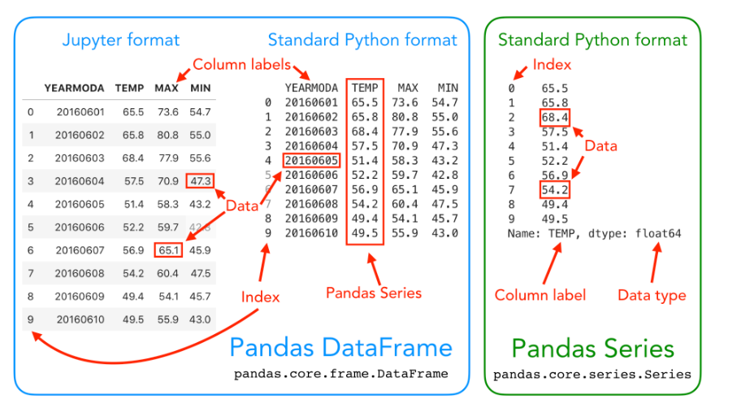

```{r setup, include=FALSE}
    library(knitr)
    library(tidyverse)
knitr::opts_chunk$set(
comment=NA,
error=T, 
warning=T,
tidy=TRUE, 
fig.align = 'center',
message=F, 
warning=F,
tidy.opts=list(width.cutoff=60),
fig.width=4, 
fig.height=4, 
fig.path='Figs/')
```

# Hyrje në Analizën e të Dhënave


## Çfarë është pandas?

  - Pandas është një bibliotekë Python që ofron një paketë të fuqishme për analizën e të dhënave.

  - Është një mjet i lehtë për t'u përdorur, por shumë i fuqishëm për analizën e të dhënave.

## Instalimi i pandas

``` shell
mamba install -c conda-forge pandas
```

## Veçoritë e Pandas

  - Pandas është një paketë "nivel i lartë", që përdor shumë biblioteka të tjera si NumPy, matplotlib, dhe SciPy.

  - Një nga veçoritë më të dobishme të pandas është aftësia për të ndërvepruar me shumë formate të të dhënave.

## Formatet e të Dhënave të Mbështetura nga Pandas

  - Pandas mund të lexojë dhe shkruajë të dhëna nga shumë formate:
  
  - CSV
  
  - JSON
  
  - HTML
  
  - MS Excel

## Formatet e të Dhënave të Mbështetura nga Pandas

  - Stata

  - SAS

  - SQL (Postgresql, MySQL, Oracle, MariaDB, etj.)


## Strukturat e të Dhënave në Pandas

  - Në pandas, të dhënat në formë tabulare ruhen në objekte të tipit DataFrame me rreshta dhe kolona të etiketuara.



  
## Strukturat Bazë të pandas në Python

**pandas DataFrame**

  - **DataFrame** është një strukturë e të dhënave 2-dimensionale e përdorur për ruajtjen dhe manipulimin e të dhënave në formë tabelare (të dhëna me rreshta dhe kolona) në Python.

  - **DataFrame** mund të krahasohet me një spreadsheet të programueshëm, ku mund të ruani, organizoni dhe analizoni të dhënat me lehtësi.

## Strukturat Bazë të pandas në Python

**pandas Series**

  - **Series** është një strukturë e të dhënave 1-dimensionale që përdoret për ruajtjen dhe manipulimin e një vargu vlerash.

  - **Series** është e ngjashme një listë, por më e zgjuar. Një rresht ose një kolonë në një DataFrame të pandas është në fakt një Series e pandas.
  
## Tiparet e Përbashkëta

**Indekse**

  - Të dy strukturat kanë indekse (indices) që ju lejojnë të qasni të dhënat lehtësisht.


## Strukturat e të Dhënave në Pandas


## Leximi i të Dhënave Tabulare

  - Krijojmë një folder **data** në folderin tonë të punës
  
   - Shkarkojmë në folderin data skedarin nga linku:
   
[https://github.com/endri81/instatgis/blob/master/data/albania-Meteo-metadata.txt](https://github.com/endri81/instatgis/blob/master/data/albania-Meteo-metadata.txt)


## Leximi i të Dhënave Tabulare


  - Për të lexuar të dhënat nga një skedar CSV, përdorim funksionin `read_csv()` nga pandas.

  - Shembull: Leximi i të dhënave nga një skedar CSV me të dhënat e motit nga Kumpula, Helsinki:
  
```python
  import pandas as pd
  data = pd.read_csv("data/albania-Meteo-metadata.txt")
```

## Leximi i të Dhënave Tabulare

  - Ky funksion lexon skedarin CSV dhe ruan përmbajtjen në një DataFrame të quajtur data.

  - Mund të përdorim metodën head() për të shfaqur disa nga rreshtat e parë të DataFrame.

```python
data.head(10)  # Kthen 10 rreshtat e parë
```

## Leximi i të Dhënave Tabulare


## Analiza e të dhënave me pandas

- Gjatë analizës së një DataFrame, mund të hasim disa probleme si:
 
  - **Vlerat e çuditshme**: Si NaN ("not a number"), që mund të tregojë një problem me leximin e skedarit.
  
  - **Vlerat jo të pritura**: Indeksi tregon 36 rreshta, ndërsa duhet të ketë vetëm 30.
  
  - **Metadata**: Rreshtat e parë përmbajnë informacione që nuk duam t'i procesojmë.

## Analiza e të dhënave me pandas

Për të zgjidhur këto probleme:
  
  - Përdorni opsionin `skiprows` për të anashkaluar rreshtat me metadata. Për shembull, për të lexuar vetëm të dhënat relevante:
  
```python
reg_data = pd.read_csv("data/albania-Meteo-metadata.txt", skiprows=8)
```


## Analiza e të dhënave me pandas

  - Kontrolloni DataFrame-in pas leximit të të dhënave. Përdorni funksionin `.head()` për të parë rreshtat e parë dhe `.tail()` për rreshtat e fundit:

```python

reg_data.head()
reg_data.tail()
```

## Analiza e të dhënave me pandas


        
    
    
## Analiza e të dhënave me pandas    
    
  - Verifikoni llojin e të dhënave për të konfirmuar që është një DataFrame i pandas:

```python
    type(reg_data)
```


## Analiza e të dhënave me pandas  

Për të lexuar vetëm disa kolona specifike nga një skedar CSV:
  
  - Përdorni opsionin `usecols` për të lexuar vetëm kolonat e dëshiruara. 
  
  - Për shembull:
    
```python
temp_data = pd.read_csv("data/albania-Meteo-metadata.txt", skiprows=8, usecols=["YEAR", "TEMP"])
temp_data.head()
```

## Eksplorimi i DataFrame

**Hapat e parë pas ngarkimit të të dhënave**:

  - Kontrolloni madhësinë e DataFrame për të kuptuar se sa rreshta dhe kolona përmban.

  - Përdorni funksionin `len()` për të marrë numrin e rreshtave:

```python
    len(reg_data)
```

## Eksplorimi i DataFrame

  - Përdorni atributin `shape` për të marrë një përmbledhje të shpejtë të madhësisë së të dhënave:

```python
    reg_data.shape
```
    - Kjo tregon numrin e rreshtave dhe kolonave në DataFrame.

## Eksplorimi i DataFrame

**Kontrolloni emrat e kolonave**:
  
  - Për të parë emrat e kolonave në DataFrame, përdorni `data.columns.values`:

```python
    reg_data.columns.values
```

  - Kjo do të shfaqë të gjitha etiketat e kolonave.


## Eksplorimi i DataFrame

**Indikatorët e rreshtave**:

  - Atributi `index` tregon se si janë indeksuar rreshtat:

```python
    reg_data.index
```
  - Indeksi zakonisht fillon nga 0, përfundon në 30, dhe rritet me 1. Por, në pandas, rreshtat mund të indeksohen edhe me karaktere ose data.

## Eksplorimi i DataFrame

**Llojet e të dhënave për çdo kolonë**:

  - Përdorni `data.dtypes` për të parë llojet e të dhënave në çdo kolonë:

```python
    reg_data.dtypes
```
**YEAR** është një vlerë e tipit integer (int64), ndërsa kolonat e tjera janë float64.


## Zgjedhja e Kolonave

**Sintaksa bazë për zgjedhjen e kolonave**:

  - Për të zgjedhur një ose më shumë kolona nga një DataFrame, përdorni sintaksën `dataframe[value]`, ku `value` mund të jetë emri i një kolone    ose një listë emrash kolonash.
  
  - Për shembull, për të zgjedhur kolonat "YEARMODA" dhe "TEMP":

```python
    selection = reg_data[["YEAR", "TEMP"]]
    selection
```

## Zgjedhja e Kolonave

**Kontrollimi i tipit të nën-pjesës së zgjedhur**:

  - Pasi të keni zgjedhur kolonat, mund të kontrolloni tipin e kësaj nën-pjesë:

```python
    type(selection)
```
    
   - Kjo nën-pjesë është ende një DataFrame i pandas dhe mund të përdorni të gjitha metodat dhe atributet e lidhura me një DataFrame.


## Zgjedhja e Kolonave

**Kontrollimi i formës (shape) të zgjedhjes**:
  
  - Për të marrë madhësinë e nën-pjesës së zgjedhur, përdorni `shape`:
  
```python
    selection.shape
```

## Zgjedhja e Kolonave

**Qasja e një kolone të vetme**:
  
  - Për të zgjedhur një kolonë të vetme, përdorni emrin e kolonës brenda kllapave katrore:

```python
    reg_data["TEMP"]
```

## Zgjedhja e Kolonave

**Kontrollimi i tipit të një kolone të vetme**:
  
  - Për të parë tipin e një kolone të vetme, përdorni `type()`:
  
```python
    type(reg_data["TEMP"])
```
Çdo kolonë dhe çdo rresht në një DataFrame është në fakt një Series i pandas, një strukturë të dhënash 1-dimensionale.

## Zgjedhja e Kolonave

**Sintaksë alternative për zgjedhjen e kolonave**:
  
  - Ju mund të përdorni një sintaksë alternative për të zgjedhur një kolonë:
  
```python
    reg_data.TEMP
```
  - Kjo funksionon vetëm nëse emri i kolonës është një emër i vlefshëm për një variabël Python, dhe nuk përmban hapësira. 
  
  - Sintaksa `data["column"]` punon për çdo emër kolone, ndaj rekomandohet të përdorni këtë qasje.


# Statistikat Përshkruese

## Statistikat Përshkruese për DataFrame dhe Series

**Metodat e zakonshme për statistikat përshkruese**:
  
  - pandas DataFrames dhe Series ofrojnë metoda për të marrë statistikat përshkruese, duke përfshirë `mean()`, `median()`, `min()`, `max()`, dhe `std()` (devijimin standard).


## Statistikat Përshkruese për DataFrame dhe Series

**Marrja e vlerës mesatare**:

  - Për të kontrolluar vlerën mesatare për një kolonë të vetme (Series):

```python
    reg_data["TEMP"].mean()
```
 
 
## Statistikat Përshkruese për DataFrame dhe Series

  - Për të marrë vlerën mesatare për të gjitha kolonat në një DataFrame:

```python
    reg_data.mean()
```

## Statistikat Përshkruese për DataFrame dhe Series

**Marrja e statistikave përshkruese për të gjitha kolonat**:
  
  - Metoda `describe()` ofron një përmbledhje të shpejtë të statistikave kryesore për të gjitha atributet në DataFrame:
  
```python
    reg_data.describe()
```


# Vizualizimi i të Dhënave në pandas

## Vizualizimi i të Dhënave në pandas

**Grafikët bazë në pandas**:

  - pandas ka metoda të integruara për vizualizimin e të dhënave, duke përdorur bibliotekën **Matplotlib**.
  
  - Për të krijuar një grafiq të thjeshtë që tregon temperaturat:

```python
    reg_data[["TEMP", "MAX", "MIN"]].plot()
```
  - Ky grafik tregon të dhënat për temperatura mesatare, maksimale dhe minimale.
  


## Krijimi i pandas Series nga Listat

**Krijimi i një Series**:

  - Ju mund të krijoni një Series nga një listë e numrave. Kjo mund të jetë e dobishme për të punuar me të dhënat më shpejt dhe më lehtë:
    
```python
    number_series = pd.Series([4, 5, 6, 7.0])
    print(number_series)
```

## Krijimi i pandas Series nga Listat

  - pandas automatikisht konverton tipet e të dhënave, duke përdorur **float64** kur është e nevojshme.

  - Për të vendosur një indeks të personalizuar për Series:

```python
    number_series = pd.Series([4, 5, 6, 7.0], index=["a", "b", "c", "d"])
    print(number_series)
```

## Krijimi i pandas DataFrames nga Lista

**Krijimi i një DataFrame nga disa lista**:

  - Përdorni një fjalor Python për të krijuar një DataFrame nga disa lista:

```python
 # Emrat e stacioneve të motit
    stacionet = ["Tirana", "Durrës", "Shkodra", "Elbasan"]

    # Koordinatat e gjerësisë gjeografike të stacioneve të motit
    gjeresia = [41.33, 41.32, 42.07, 41.11]

    # Koordinatat e gjatësisë gjeografike të stacioneve të motit
    gjatesia = [19.82, 19.45, 19.52, 20.07]

    # Krijimi i DataFrame nga listat
    new_data = pd.DataFrame(data={"Emri i Stacionit": stacionet, "Gjerësia": gjeresia, "Gjatësia": gjatesia})
    new_data
```

## Krijimi i një DataFrame bosh

**Punimi me DataFrames bosh**:

  - Ndonjëherë do të filloni me një DataFrame bosh dhe do të shtoni të dhënat më vonë:

```python
    df = pd.DataFrame()
    print(df)
```

# Manipulimi i të dhënave

## Krijimi i Kolonave të Reja në DataFrame

**Krijimi i kolonave të reja**:

  - Një nga gjërat më të zakonshme për të bërë në pandas është krijimi i kolonave të reja bazuar në kalkulime midis kolonave të ndryshme.

  - Për të krijuar një kolonë të re, thjesht specifikoni emrin e kolonës dhe caktoni një vlerë të paracaktuar. 
  
  - Për shembull, për të krijuar një kolonë "DIFF" me vlerën 0.0:

```python
    reg_data["DIFF"] = 0.0
```


## Krijimi i Kolonave të Reja në DataFrame

**Kontrollimi i tipit të të dhënave për kolonën e re**:

  - Mund të kontrolloni tipin e të dhënave të kolonës së re për të konfirmuar që pandas e ka njohur si float:

```python
    reg_data["DIFF"].dtypes
```

## Përditësimi i kolonës "DIFF" me kalkulime

**Përditësimi i kolonës "DIFF" me kalkulime**:

  - Për të llogaritur diferencën midis kolonave "MAX" dhe "MIN", mund të përdorni një operacion matematikor dhe të përditësoni kolonën "DIFF":

```python
    reg_data["DIFF"] = reg_data["MAX"] - reg_data["MIN"]
    reg_data.head()
```


## Krijimi i një kolone për të kthyer Celsius në Fahrenheit

**Krijimi i një kolone për të kthyer Celsius në Fahrenheit**:

  - Për të kthyer vlerat nga Celsius në Fahrenheit dhe t'i ruani në një kolonë të re, mund të përdorni formulën \(F = (C \times 9/5) + 32\):

```python
    reg_data["TEMP_FAHRENHEIT"] = (reg_data["TEMP"] * (9/5)) + 32
    reg_data.head()
```

# Zgjedhja e rreshtave dhe shtyllave

## Zgjedhja e rreshtave dhe shtyllave

  - Shpesh të zgjidhni rreshta dhe kolona të veçanta në një DataFrame pandas. 
  
  - Këtu janë disa mënyra të ndryshme për të zgjedhur nënsete të një DataFrame, të shpjeguara me shembuj dhe në formatin R Markdown.

## Zgjedhja e disa rreshtave:

  - Për të zgjedhur një nëngrup të veçantë të rreshtave nga një DataFrame, mund të përdorni indeksimin për të marrë pjesë të DataFrame.

  - Këtu është një shembull që zgjedh pesë rreshtat e parë dhe i ruan në një variabël të quajtur selection:

```python
selection = reg_data.iloc[0:5]  # Zgjidhni pesë rreshtat e parë
selection  # shfaq përzgjedhjen

```

  - Në këtë rast, kemi zgjedhur pesë rreshtat e parë (indekset 0-4) duke përdorur indeksimin e thjeshtë.

## Zgjedhja e disa rreshtave dhe kolonave

  - Për të zgjedhur një subset të rreshtave dhe kolonave, mund të përdorni **loc** që zgjedh të dhënat bazuar në emrat e kolonave dhe rreshtave.

  - Këtu është një shembull që zgjedh vlerat e kolonës "TEMP" nga rreshtat 0-5:

```python
selection = reg_data.loc[0:5, "TEMP"]
selection
```

  - Në këtë rast, marrim gjashtë rreshtat e parë (indekset 0-5) duke përdorur emrat e rreshtave.

## Zgjedhja e shumëfishtë e kolonave me loc:

  - Mund të zgjidhni më shumë se një kolonë duke përdorur loc me një listë kolonash.

  - Këtu është një shembull që zgjedh kolonat "TEMP" dhe "TEMP_FAHRENHEIT" nga rreshtat 0-5:

```python
# Përdorim të saktë të loc me lista të kolonave
selection = reg_data.loc[0:5, ["TEMP", "TEMP_FAHRENHEIT"]]  # Zgjedh pesë rreshtat e parë dhe dy kolon
selection
```

## Zgjedhja e një rreshti të vetëm
  
  - Mund të zgjidhni gjithashtu një rresht të vetëm nga një pozicion i caktuar duke përdorur indeksimin `.loc[]`. 
  
  - Këtu zgjedhim të gjitha vlerat e të dhënave duke përdorur indeksin 4 (rreshti i 5-të):
    
  - Zgjidhni një rresht duke përdorur indeksin
  
```python  
# Select one row using index
row = reg_data.loc[4]
row
```


## Zgjedhja e një rreshti të vetëm

  - Indeksimi `.loc[]` kthen vlerat nga ajo pozicion si një pd.Series ku indekset në fakt janë emrat e kolonave të atyre variablave.
  
  - Prandaj, mund të hyni në vlerën e një kolone të veçantë duke u referuar në indeksin e saj duke përdorur formatin e mëposhtëm (të dy duhet të funksionojnë):
  

## Zgjedhja e një rreshti të vetëm

  - Printoni një atribut nga rreshti i zgjedhur
  
```python  
row["TEMP"]
```  
        

## Zgjedhja e një vlere të vetme bazuar në rresht dhe kolonë

  - Në disa raste është mjaftueshëm të hysh në një vlerë të vetme në një DataFrame. 
  
  - Në këtë rast, mund të përdorim `DataFrame.at` në vend të `Data.Frame.loc`.

## Zgjedhja e një vlere të vetme bazuar në rresht dhe kolonë

  - Zgjidhni temperaturën (kolonën TEMP) në rreshtin e parë (indeksi 0) të DataFrame tonë.
  
```python  
reg_data.at[0, "TEMP"]
```    

## Zgjedhjet nga pozicioni integer (opsionale)

   - `.loc` dhe `.at` bazohen në *etiketat e aksit*, emrat e kolonave dhe rreshtave. 
   
   - Etiketat e aksit mund të jenë gjëra të tjera përveç vlerave "tradicionale" të indeksit  (p.sh., `0`, `1`, ...). 
   
   - Për shembull, datat kohore shpesh përdoren si indeksi i rreshtave për rreshtat e listuara sipas dates dhe kohës së të dhënave.

## Zgjedhjet nga pozicioni integer (opsionale)
   
   - `.iloc` është një operator tjetër indeksimi që bazohet në *vlerat e integer* indeksit. 
   
   - Duke përdorur `.iloc`, është e mundur të referohemi gjithashtu në kolonat bazuar në vlerën e tyre të indeksit. 
   
   - Për shembull, `reg_data.iloc[0,0]` do të kthejë `20160601` në DataFrame-in tonë shembull.


## Zgjedhjet nga pozicioni integer (opsionale)

  - Për shembull, mund të zgjidhni nga një grup rreshtash tek kolonat YEAR dhe TEMP bazuar në indeksin e tyre.

```python
reg_data.iloc[0:5:, 0:2]
```


## Zgjedhjet nga pozicioni integer (opsionale)

  - Për të aksesuar vlerën në rreshtin e parë dhe kolonën e dytë (TEMP), sintaksa për iloc do të ishte:

```python
reg_data.iloc[0, 1]
```

## Zgjedhjet nga pozicioni integer (opsionale)

  - Gjithashtu mund të qaseni në rreshta individuale duke përdorur iloc. 
  
  - Le të shohim rreshtin e fundit të të dhënave:

```python
reg_data.iloc[-1]
```


# Filtrimi dhe përditësimi i të dhënave

## Filtrimi dhe përditësimi i të dhënave

  - Një veçori shumë e dobishme në pandas është aftësia për të filtruar dhe zgjedhur rreshtat në bazë të një deklarate me kusht. 
  
  - Në vijim është një shembull se si të zgjidhni rreshtat kur temperatura në Celsius ka qenë më e lartë se 15 gradë dhe t'i ruani ato në            variabël **temp_ngroht** (temperature të ngrohta). 
  
  - pandas kontrollon nëse kushti është i vërtetë ose fals për çdo rresht, dhe kthen ato rreshta ku kushti është i vërtetë:

```python
# Kontrollo kushtin
reg_data["TEMP"] > 15
# Zgjidh rreshtat me temperaturë Celsius më të lartë se 15 gradë
temp_ngroht = reg_data.loc[reg_data["TEMP"] > 15]
temp_ngroht
```

## Filtrimi dhe përditësimi i të dhënave

  - Është gjithashtu e mundur të kombinoni disa kritere njëkohësisht. 
  
  - Këtu, zgjedhim temperaturat mbi 15 gradë që u regjistruan në gjysmën e dytë të qershorit në vitin 2016 (pra. YEAR >= 20160615). 
  
  - Kombinimi i kritereve të shumta mund të bëhet me operatorin & (DHE) ose operatorin | (OSE). 
  
  - Është shpesh e dobishme të ndani kushtet e ndryshme duke përdorur paranteza ().

## Filtrimi dhe përditësimi i të dhënave

```python
# Zgjidh rreshtat me temperaturë Celsius më të lartë se 15 gradë nga fundi i qershorit 2016
temp_ngroht = reg_data.loc[(reg_data["TEMP"] > 15) & (reg_data["YEAR"] >= 20160615)]
temp_ngroht
```

  - Tani kemi një nën-set të DataFrame tonë me vetëm rreshtat ku TEMP është mbi 15 dhe datat në kolonën YEAR fillojnë nga 15 qershori.

## Filtrimi dhe përditësimi i të dhënave

  - Vini re se vlerat e indeksit (numrat në të majtë) tregojnë ende pozicionet nga DataFrame origjinale. 
  
  - Është e mundur të rivendosni indeksin duke përdorur funksionin **reset_index()**, i cili mund të jetë i dobishëm në disa raste për të qenë në gjendje të shkëputni të dhënat në një mënyrë të ngjashme me atë më lart. 
  
## Filtrimi dhe përditësimi i të dhënave

  - Në mënyrë parazgjedhëse **reset_index()** do të krijojë një kolonë të re quajtur **index** për të mbajtur gjurmën e indeksit të mëparshëm, që mund të jetë e dobishme në disa raste. 
  
  - Ky nuk është rasti këtu, kështu që mund ta injorojmë këtë veprim duke kaluar parametrin drop=True.


## Filtrimi dhe përditësimi i të dhënave

```python
# Rivendos indeksin
temp_ngroht = temp_ngroht.reset_index(drop=True)
temp_ngroht
```

Siç mund të shihni, tani vlerat e indeksit shkojnë nga 0 në 12 tani.


# Vlerat që mungojnë (Missing values)

## Vlerat që mungojnë (Missing values)

  - Siç mund të keni vënë re deri më tani, kemi disa vlera të humbura në kolonat e temperaturës minimale, maksimale, dhe diferencës (MIN, MAX, dhe DIFF). 
  
  - Këto vlera të humbura shënohen si **NaN** (jo një numër). 
  
  
## Vlerat që mungojnë (Missing values)

  - Të dhënat e munguara në tabelë është një situatë e zakonshme dhe zakonisht duam t'i trajtojmë ato
  
  - Procedurat e zakonshme për të trajtuar vlerat NaN janë ose t'i largoni ato nga DataFrame ose t'i mbushni ato me një vlerë tjetër. 
  
  - Në pandas të dyja këto opsione janë të lehta për tu bërë.

## Vlerat që mungojnë (Missing values)

  - Le të shohim së pari si mund të largojmë vlerat e munguara (pra, të pastroni të dhënat) duke përdorur funksionin **.dropna()**. 
  
  - Brenda funksionit mund të kaloni një listë të kolonave nga të cilat vlerat duhet të gjeni NaN  duke përdorur parametrin subset. 
  
  - Outputi do të heqë çdo rresht që përmban vlera NaN nga grupi i kolonave të dhëna në parametrin subset.


## Vlerat që mungojnë (Missing values)


```python
# Largo vlerat NaN bazuar në kolonën MIN
    temp_ngroht_clean = temp_ngroht.dropna(subset=["MIN"])
    temp_ngroht_clean
```
Siç mund të shihni nga tabela e mësipërme (dhe ndryshimi në vlerat e indeksit), tani kemi një DataFrame pa vlerat NaN.


## Vlerat që mungojnë (Missing values)

  - Vini re se zëvendësuam variablin fillestare 'temp_ngroht' me versionin ku nuk ka të dhëna missing. 
  
  - Funksioni `.dropna()` mund të aplikohet edhe "inplace" që do të thotë që funksioni përditëson objektin DataFrame dhe kthen `None`:

```python
    temp_ngroht.dropna(subset=['MIN'], inplace=True)
```

## Vlerat që mungojnë (Missing values)

  - Një opsion tjetër është të mbushni vlerat e munguara me një vlerë duke përdorur funksionin **fillna()**. 
  
  - Këtu mund të mbushni vlerat e munguara me vlerën -9999. 
  
  - Vini re që këtë herë nuk i jepni parametrin subset.


## Vlerat që mungojnë (Missing values)


```python
# Mbush vlerat NaN
fill_data = reg_data.fillna(-9999)
fill_data.head(5)
```

Si rezultat tani kemi një DataFrame ku vlerat e munguara janë mbushur me vlerën -9999.


## Vlerat që mungojnë (Missing values)

  - Në shumë raste, mbushja e të dhënave me një vlerë specifike është e rrezikshme sepse ju përfundoni duke ndryshuar të dhënat reale, e cila        mund të ndikojë në rezultatet e analizës suaj. 
  
  - Për shembull, në rastin e mësipërm do të kishim ndryshuar dramatikisht kolonat e diferencës së temperaturës sepse vlerat -9999 nuk janë një      diferencë temperaturash aktuale! 
  
  
# Konvertimi i tipit të të dhënave

## Konvertimi i tipit të të dhënave
  
  - Ka raste kur do të duhet të kthejmë të dhënat e ruajtura brenda një Series në një lloj tjetër të të dhënave, për shembull, nga float në          integer.

  - Kujtoni, që kemi bërë konvertimin e llojeve të të dhënave duke përdorur funksionet e ndërtuara në Python si int() ose str().

  - Për vlerat në pandas DataFrames dhe Series, mund të përdorim metodën astype().

## Konvertimi i tipit të të dhënave

  **Kujdes me konvertimet nga float në integer.** 
  
  - Konvertimi thjesht heq pjesën pas presjes dhjetore, kështu që të gjitha vlerat janë rrumbullakosur poshtë në numrin e plotë më të afërt.
  
  - Për shembull, 99.99 do të shkurtohet në 99 si një integer, kur duhet të rrumbullohet lart në 100.

## Konvertimi i tipit të të dhënave

  - Lidhja e funksioneve **round** dhe konvertimi i tipeve e zgjidh këtë situatë, pasi komanda `.round(0).astype(int)` fillimisht rrumbullon vlerat me zero presje dhe pastaj i konverton ato në integer.

## Konvertimi i tipit të të dhënave

```python
print("Vlerat origjinale:")
reg_data["TEMP"].head()
```

```python
print("Vlerat e shkurtra në integer:")
reg_data["TEMP"].astype(int).head()
```

```python
print("Vlerat e rrumbulluara në integer:")
reg_data["TEMP"].round(0).astype(int).head()
``` 


# Vlerat unike

## Vlerat unike

  - Ndonjëherë është e dobishme të gjeni vlerat unike që keni në shtyllë. 
  
  - Mund ta bëjmë këtë duke përdorur metodën **unique()**:


## Vlerat unike

```python
# Merrni vlerat unike të celsiusit
unik = reg_data["TEMP"].unique()
unik
```

Si rezultat, marrim një varg vlerash unike në atë kolonë.


## Vlerat unike

  - Ndonjëherë nëse keni një listë të gjatë vlerash unike, nuk i shihni domosdoshmërisht të gjitha vlerat unike direkt pasi IPython/Jupyter mund     t'i fshehë ato. 
  
  - Megjithatë, është e mundur të shihni të gjitha këto vlera duke i printuar ato si një listë.

## Vlerat unike

```python
# vlerat unike si listë
list(unik)
```
## Sa ditë me temperaturë mesatare unike kemi pasur në qershor 2016

Mund ta verifikojmë këtë!

```python
# Numri i vlerave unike
temperatura_unike = len(unik)
print(f"Ka pasur {temperatura_unike} ditë me temperature mesatare unike në qershor 2016.")
```

# Sortimi i të dhënave

## Sortimi i të dhënave

  - Shpeshherë është e dobishme të jemi në gjendje të sortojmë të dhënat(në rritje/zbritje) bazuar në vlera në një kolonë. 
  
  - Kjo mund të bëhet lehtësisht me pandas duke përdorur funksionin **sort_values(by='EmriKolonësTuaj')**.

  - Le të sortojmë së pari vlerat në rend rritës bazuar në kolonën **TEMP**:


## Sortimi i të dhënave

```python
# Sortoni DataFrame sipas temperaturës, në rritje
reg_data.sort_values(by="TEMP")
```

## Sortimi i të dhënave

Sigurisht, është gjithashtu e mundur t'i sortoni ato në rend zbritës me parametrin ascending=False:


```python
# Sortoni DataFrame sipas temperaturës, në zbritje
data.sort_values(by="TEMP", ascending=False)
```


## Shkrimi i të dhënave në një file

  - Është e rëndësishme të jeni në gjendje të shkruani të dhënat që keni analizuar në një skedar në kompjuterin tuaj. 
  
  - Kjo është shumë kollaj në pandas pasi panda supporton shumë formate
  
  
## Shkrimi i të dhënave në një file

  - Formati më tipik output është pa dyshim një skedar CSV. 
  
  - Funksioni **to_csv()** mund të përdoret për të ruajtur lehtësisht të dhënat tuaja në formatin CSV. 
  
  - Le të bëjmë save së pari të dhënat nga DataFrame ynë në një skedar të quajtur TiranaMeteo.csv.


## Shkrimi i të dhënave në një file

```python
# përcaktoni emrin e skedarit të daljes
output_fp = "TiranaMeteo.csv"

# Ruaj DataFrame në csv
reg_data.to_csv(output_fp, sep=",")
``` 

Tani kemi të dhënat nga DataFrame ynë të ruajtura në një skedar


## Shkrimi i të dhënave në një file

  - Siç mund të shihni, vlera e parë në skedarin e të dhënave tani përmban vlerën e indeksit të rreshtave. 
  
  - Ka gjithashtu një numër të madh të presjeve dhjetore të pranishme në kolonat e reja që krijuam. 
  
  - Le të merremi me këto dhe të ruajmë vlerat e temperaturës nga DataFrame warm_temps pa indeksin dhe vetëm me 1 decimal për numrat me presje dhjetore.


## Shkrimi i të dhënave në një file

```python
# përcaktoni emrin e skedarit të daljes
output_fp2 = "TiranaMeteo2.csv"

# Ruaj DataFrame në csv
temp_ngroht.to_csv(output_fp2, sep=",", index=False, float_format="%.1f")
```

## Shkrimi i të dhënave në një file

  - Neglizhimi i indeksit mund të bëhet me parametrin **index=False**. 
  
  - Përcaktimi se sa presje dhjetore duhet të shkruhen mund të bëhet me parametrin **float_format** ku teksti **%.1f** udhëzon panda-n të përdorë 1 decimal në të gjitha kolonat kur shkruan të dhënat në një skedar.
  
  - Ndryshimi i vlerës 1 në 2 do të shkruante 2 presje dhjetore, dhe kështu me radhë


# Analiza e avancuar me Python

## Shkarkojmë të dhënat

  - Shkarkojmë skedarin **rar** nga linku:
  
  [https://github.com/endri81/instatgis/blob/master/data/029440.rar](https://github.com/endri81/instatgis/blob/master/data/029440.rar)

  
Ekstraktojmë përmbajtjen në folderin tonë **data**


## Analiza e avancuar me Python

  - Në këtë fazë duhet të keni një dosje të re quajtur data që përmban të dhënat me skedarin **029440.txt** në të. 
  
  - Mund ta konfirmoni këtë duke shfaqur përmbajtjen e dosjes data:

```bash
ls data
```


## Rreth të dhënave

  - Të dhënat input janë të ndara me numër të ndryshëm të hapësirave (dmth, me gjerësi të caktuar të fiksuar). 
  
  - Rreshtat dhe kolonat e para të të dhënave duket si më poshtë:

```python
  USAF  WBAN YR--MODAHRMN DIR SPD GUS CLG SKC L M H  VSB MW MW MW MW AW AW AW AW W TEMP DEWP    SLP   ALT    STP MAX MIN PCP01 PCP06 PCP24 PCPXX SD
029440 99999 190601010600 090   7 *** *** OVC * * *  0.0 ** ** ** ** ** ** ** ** *   27 **** 1011.0 ***** ****** *** *** ***** ***** ***** ***** ** 
029440 99999 190601011300 ***   0 *** *** OVC * * *  0.0 ** ** ** ** ** ** ** ** *   27 **** 1015.5 ***** ****** *** *** ***** ***** ***** ***** ** 
029440 99999 190601012000 ***   0 *** *** OVC * * *  0.0 ** ** ** ** ** ** ** ** *   25 **** 1016.2 ***** ****** *** *** ***** ***** ***** ***** ** 
029440 99999 190601020600 ***   0 *** *** CLR * * *  0.0 ** ** ** ** ** ** ** ** *   26 **** 1016.2 ***** ****** *** *** ***** ***** ***** ***** **
```

## Analiza e avancuar me Python

  - Ne do të zhvillojmë rrjedhën tonë të analizës duke përdorur të dhënat për një stacion. 
  
  - Më pas, do të përsërisim të njëjtën proces për të gjithë stacionet.

## Leximi i të dhënave

Për të filluar, le të importojmë pandas:

```python
import pandas as pd
```

## Leximi i të dhënave

  - Në këtë pikë, ne tashmë mund të hedhim një shikim të shpejtë në dosjen e të dhënave 029440.txt
  
  - Ne mund të vëmë re të paktën dy gjëra që duhet të kemi parasysh kur lexojmë të dhënat:


## Leximi i të dhënave

```python
import pandas as pd

# Definoni rrugën relative të skedarit
file_path = "data/029440.txt"

# Lexoni skedarin duke përdorur Pandas
data = pd.read_csv(
    file_path,
    sep='\s+',
    na_values=["*", "**", "***", "****", "*****", "******"]
)
```


## Lexojmë të dhënat edhe njëherë

  - Do lexojmë përsëri të dhënat duke mbajtur vetëm disa shtylla
  
  -   Duke përdorur `usecols`, ne lexojmë vetëm kolonat që janë të nevojshme për analizën tonë. 

```python
# Lexoni skedarin duke përdorur Pandas
data = pd.read_csv(
    file_path,
    sep='\s+',
    usecols=["USAF", "YR--MODAHRMN", "DIR", "SPD", "GUS", "TEMP", "MAX", "MIN"],
    na_values=["*", "**", "***", "****", "*****", "******"]
)

# Kontrolli i pjesës së parë të të dhënave të lexuara
data.head()
  
```

## Riemërtimi i Kolonave

  - Disa nga emrat e kolonave janë të vështirë për t'u interpretuar. 
  
  - Me funksionin **rename**, mund të ndryshojmë emrat e kolonave që të jenë më të kuptueshme.


## Riemërtimi i Kolonave

```python
# Krijo një fjalor për emrat e rinj të kolonave
new_names = {"YR--MODAHRMN": "TIME", "SPD": "SPEED", "GUS": "GUST", "TEMP": "TEMP_F", "USAF": "STATION_NUMBER"}

# Riemërto kolonat duke përdorur dictionary-n e krijuar
data = data.rename(columns=new_names)
```


## Kontrollo emrat e rinj të kolonave

```python
data.columns
```


## Kontrollimi i Të Dhënave

  - Pasi kemi lexuar të dhënat, është e rëndësishme të kontrollojmë formën e tyre dhe tipet e kolonave. 
  
  - Këtu, ne kontrollojmë rreshtat e parë dhe të fundit, si dhe disa statistika përshkruese.


## Kontrollimi i Të Dhënave


```python
# Kontrollo formën e të dhënave
data.shape
```


## Kontrollo rreshtat e parë dhe të fundit

```python
data.head()
data.tail()
```


## Kontrollo tipet e kolonave

```python
data.dtypes
```


## Konvertimi i Temperaturave

  - Temperaturat janë në Fahrenheit, por ne duam t'i konvertojmë ato në Celsius. 
  
  - Për ta bërë këtë, ne krijojmë një funksion dhe e aplikojmë atë në kolonën që përmban temperaturat në Fahrenheit.


## Konvertimi i Temperaturave

```python
# Funksioni për konvertimin nga Fahrenheit në Celsius
def fahr_to_celsius(temp_f):
    return (temp_f - 32) / 1.8
```


## Krijo një kolonë të re për temperaturat në Celsius

```python
data["TEMP_C"] = data["TEMP_F"].apply(fahr_to_celsius)

# Kontrollo rreshtat e parë pas konvertimit
data.head()
```


## Testimi i funksionit


```python
# Testimi i funksionit
fahr_to_celsius(32)  # Rezultati duhet të jetë 0.0
```


## Iterimi mbi rreshtat

  - Për të iteruar mbi rreshtat, përdorim metodën **iterrows()**. 
  
  - Kjo metodë na lejon të kalojmë mbi çdo rresht të një DataFrame-i. 
  
  - Më poshtë, tregojmë një shembull të përdorimit të kësaj metode.


## Iterimi mbi rreshtat

```python
# Për të iteruar mbi rreshtat
for idx, row in data.iterrows():
    # Printimi i vlerës së indeksit
    print(f"Indeksi: {idx}")

    # Printimi i temperaturës në Fahrenheit
    print(f"Temp F: {row['TEMP_F']}")

    break  # Thyerja e ciklit pas rreshtit të parë për testim
```


## Iterimi mbi rreshtat

Krijojmë një kolonë të re për temperaturat në Celsius dhe përdorim funksionin e mëparshëm për të bërë konvertimin.

```python
# Krijimi i një kolone të re për Celsius
data["TEMP_C"] = 0.0

# Iterimi mbi rreshtat dhe konvertimi në Celsius
for idx, row in data.iterrows():
    # Konvertimi i Fahrenheit në Celsius
    celsius = fahr_to_celsius(row["TEMP_F"])
    
    # Përditësimi i kolonës TEMP_C
    data.at[idx, "TEMP_C"] = celsius
```


## Aplikimi i funksionit

  - Metoda **apply()** në pandas lejon aplikimin e funksioneve në kolonat e caktuara. 
  
  - Këtu, do të përdorim apply() për të aplikuar funksionin e konvertimit nga Fahrenheit në Celsius.

## Aplikimi i funksionit

```python
# Aplikimi i funksionit në TEMP_F
data["TEMP_F"].apply(fahr_to_celsius)

# Ruajtja e rezultateve në TEMP_C
data["TEMP_C"] = data["TEMP_F"].apply(fahr_to_celsius)
```

