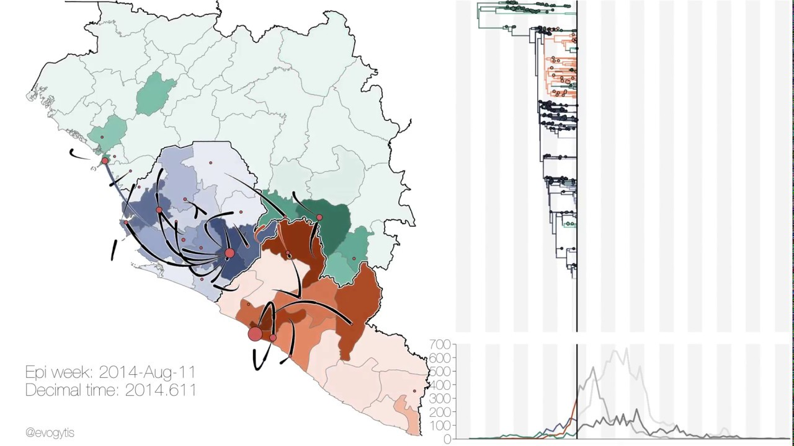
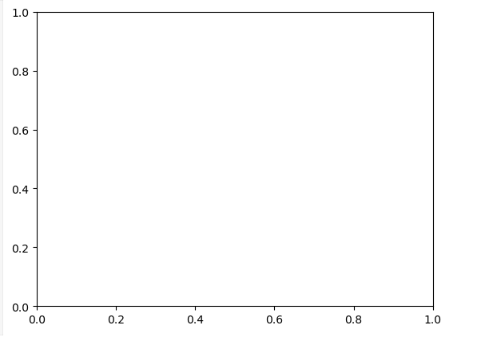
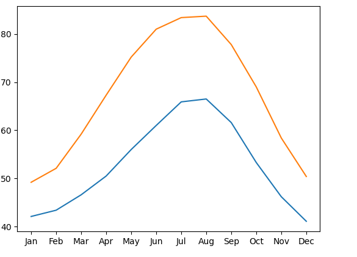

```{r setup, include=FALSE}
    library(knitr)
    library(tidyverse)
knitr::opts_chunk$set(
comment=NA,
error=F, 
warning=F,
tidy=TRUE, 
fig.align = 'center',
message=F, 
warning=F,
tidy.opts=list(width.cutoff=60),
fig.width=4, 
fig.height=4, 
fig.path='Figs/')
```

# Matplotlib

## Visualizimi i të Dhënave me Matplotlib


  - Një imazh vlen një mijë fjalë. 
  
  - Visualizimet e të dhënave na lejojnë të nxjerrim përfundime nga të dhënat dhe t'ia komunikojmë ato të tjerëve.


## Visualizimi i të Dhënave me Matplotlib

  - Për shembull, kjo vizualizim tregon një histori të animuar të një shpërthimi të Ebola-s në Afrikën Perëndimore. 
  
  



  
## Visualizimi i të Dhënave me Matplotlib  
  
  
  - Sasia e informacionit në këtë vizualizim kompleks është thjesht e mahnitshme! 
  
  - Ky vizualizim u krijua duke përdorur **Matplotlib**, një bibliotekë Python që përdoret gjerësisht për të vizualizuar të dhënat. 
  
  
## Visualizimi i të Dhënave me Matplotlib

  - Ka shumë biblioteka softuerike që vizualizojnë të dhëna. 
  
  - Një nga avantazhet kryesore të Matplotlib është që ju jep kontroll të plotë mbi atributet e grafikut tuaj. 
  
  - Kjo ju lejon të personalizoni dhe kontrolloni çdo veçori të vizualizimeve tuaja. 
  
  
## Prezantimi i ndërfaqes pyplot


  - Ka shumë mënyra të ndryshme për të përdorur Matplotlib. 
  
  - Në këtë leksion, ne do të përdorim ndërfaqen kryesore të orientuar ndaj objekteve. 
  
  - Kjo ndërfaqe ofrohet përmes nën-modulit **pyplot**. 
  
  
## Prezantimi i ndërfaqes pyplot

```
import matplotlib.pyplot as plt
```

## Prezantimi i ndërfaqes pyplot

  - Këtu, ne importojmë këtë nën-modul dhe e quajmë **plt**. 
  
  - Edhe pse përdorimi i emrit **plt** nuk është i domosdoshëm për të funksionuar, kjo praktikë këshillohet. 
  
  
## Prezantimi i ndërfaqes pyplot

\AddToHookNext{env/Highlighting/begin}{\scriptsize}
```{python, eval = FALSE}
import matplotlib.pyplot as plt
fig, ax = plt.subplots()
plt.show()
```

  - Komanda **plt.subplots()**, kur thirret pa asnjë input, krijon dy objekte të ndryshme: 
  
    - një objekt **Figure** dhe një objekt **Axes**. 
    
    
## Prezantimi i ndërfaqes pyplot

  - Objekti **Figure** është një konteiner që mban gjithçka që shihni në faqe. 
  
  - Ndërkohë, **Axes** është pjesa e faqes që mban të dhënat. 
  
  - Është kanavaca në të cilën do të vizatoni me të dhënat tuaja, për t'i vizualizuar ato. 

## Prezantimi i ndërfaqes pyplot


  
  - Këtu, mund të shihni një Figurë me Axes të zbrazët. 
  
  - Ende nuk është shtuar asnjë të dhënë.

## Shtimi i të dhënave në axes

  - Le të shtojmë disa të dhëna në figurën tonë. 
  

\AddToHookNext{env/Highlighting/begin}{\scriptsize}  
  
```{python, eval = FALSE}
# edited/added
import pandas as pd
import calendar
seattle_weather = pd.read_csv("data/visualisation/seattle_weather.csv")
seattle_weather = seattle_weather[seattle_weather['STATION'] == 'USW00094290']
seattle_weather['MONTH'] = seattle_weather['DATE']
```  
  
## Shtimi i të dhënave në axes
  
  - Këtu ka disa të dhëna. 
  
  - Ky është një DataFrame që përmban informacion mbi motin në qytetin e Seattle në muajt e ndryshëm të vitit. 
  
  - Kolona "MONTH" përmban emrat e tre shkronjave të muajve të vitit. 
  
  - Kolona ""MLY-TAVG-NORMAL" përmban temperaturat në këta muaj, në gradë Fahrenheit, të matur në një periudhë dhjetëvjeçare.

## Shtimi i të dhënave në axes


  - Për të shtuar të dhënat në Axes, ne thërrasim një komandë grafiku. 
  
  - Komandat e grafikut janë metodat e objektit Axes. 
  
  
## Shtimi i të dhënave në axes


\AddToHookNext{env/Highlighting/begin}{\scriptsize}

```{python, eval = FALSE}
import matplotlib.pyplot as plt

fig, ax = plt.subplots()

ax.plot(seattle_weather["MONTH"], seattle_weather["MLY-PRCP-NORMAL"])
```


## Shtimi i të dhënave në axes

  - Për shembull, këtu ne thërrasim metodën e quajtur **plot** me kolonën e muajit si argumentin e parë dhe kolonën e temperaturës si             argumentin e dytë. 
  
  - Thërrasim funksionin **plt.show()** për të treguar efektin e komandës së vizatimit. 
  
  - Kjo shton një vijë në grafik. 
  
## Shtimi i të dhënave në axes

  - Dimensioni horizontal i grafikut paraqet muajt sipas radhës së tyre dhe lartësia e vijës në çdo muaj përfaqëson temperaturën mesatare. 
  
  - Tendencat në të dhënat tani janë shumë më të qarta seç ishin vetëm duke lexuar temperaturat nga tabela.

## Shtimi i më shumë të dhënave

  - Nëse dëshironi, mund të shtoni më shumë të dhëna në grafik. 

  - Për shembull, ne gjithashtu kemi një tabelë që ruajt të dhëna rreth temperaturave mesatare në qytetin e Austin, Teksas. 
  
  
  - Ne shtojmë këto të dhëna në axes duke thirrur përsëri metodën **plot**.

## Shtimi i më shumë të dhënave


\AddToHookNext{env/Highlighting/begin}{\scriptsize}

```{python, eval = FALSE}
austin_weather = pd.read_csv("data/visualisation/austin_weather.csv")
austin_weather['MONTH'] = austin_weather['DATE']
fig, ax = plt.subplots()
ax.plot(seattle_weather1["MONTH"], seattle_weather1["MLY-TAVG-NORMAL"])
ax.plot(austin_weather["MONTH"], austin_weather["MLY-PRCP-NORMAL"])
plt.show()
```  
  
## Vendosja e të gjitha bashkë

Ja se si do të duket i gjithë kodi për të krijuar këtë figurë. 





## Ushtrim : Përdorimi i matplotlib.pyplot

  - Në këtë ushtrim, do të përqendrohemi te përdorimi i **matplotlib.pyplot** për të krijuar objekte **Figure** dhe **Axes**. 
  
  - **Matplotlib.pyplot** ofron fleksibilitet në krijimin dhe personalizimin e vizualizimeve të të dhënave.

## Instruksionet


  1. Importoni API-n matplotlib.pyplot, duke përdorur emrin konvencional `plt`.

  2. Krijoni objekte Figure dhe Axes duke përdorur funksionin `plt.subplots`.

  3. Shfaqni rezultatin, një set bosh të akseve, duke përdorur funksionin `plt.show`.
  


## Zgjidhje

\AddToHookNext{env/Highlighting/begin}{\scriptsize}

```{python, eval = FALSE}
import matplotlib.pyplot as plt  # Importo matplotlib.pyplot si plt
fig, ax = plt.subplots()  # Krijo një figurë dhe akset
plt.show()  # Shfaq një set bosh të akseve
```    

## Ushtrimi: Shtimi i të Dhënave në Objektin Axes

  - Në këtë ushtrim, do të mësojmë se si të shtojmë të dhëna në një objekt Axes duke përdorur metodën `plot`. 
  
  - Do të përdorim të dhënat nga dy qytete amerikane: Seattle dhe Austin për të krahasuar reshjet mujore.

## Instruksionet

  1. Importoni nën-modulin matplotlib.pyplot si `plt`.

  2. Krijoni një figurë dhe një objekt Axes duke thirrur `plt.subplots`.

  3. Shtoni të dhënat nga DataFrame `seattle_weather` duke përdorur metodën `plot` të objektit Axes.

  4. Shtoni të dhënat nga DataFrame `austin_weather` në mënyrë të ngjashme dhe përdorni `plt.show` për të shfaqur rezultatin.

## Zgjidhje

\AddToHookNext{env/Highlighting/begin}{\scriptsize}

```{python, eval = FALSE}
import matplotlib.pyplot as plt  # Importo matplotlib.pyplot si plt

# Krijoni një figurë dhe një objekt Axes
fig, ax = plt.subplots()

# Shtoni të dhënat e reshjeve për Seattle
ax.plot(seattle_weather["MONTH"], seattle_weather["MLY-PRCP-NORMAL"], label="Seattle")

# Shtoni të dhënat e reshjeve për Austin
ax.plot(austin_weather["MONTH"], austin_weather["MLY-PRCP-NORMAL"], label="Austin")

# Shtoni një legjendë për të shpjeguar etiketat
ax.legend()

# Shfaqni figurën për të parë rezultatin
plt.show()
```


# Personalizimi i Grafikëve

## Personalizimi i Grafikëve


Tani që dini se si të shtoni të dhëna në një grafik, le të fillojmë të personalizojmë grafikët tuaj.

## Personalizimi i Pamjes së të Dhënave

  - Së pari, le të personalizojmë pamjen e të dhënave në grafik. 
  
  - Një problem që mund të përmirësohet është se të dhënat duken të vazhdueshme, por në të vërtetë janë matur vetëm në intervale mujore. 
  
## Personalizimi i Pamjes së të Dhënave

  - Një mënyrë për të treguar këtë është duke shtuar shënjues që tregojnë se ku janë të dhënat dhe cilat pjesë janë thjesht linja që lidhin pikat e të dhënave.

## Shtimi i Shënjuesve

  - Metoda `plot` ka një argument opsional `marker`, që ju lejon të shtoni shënjues në grafik dhe gjithashtu të zgjidhni llojin e shënjuesve. 
    
  - Për shembull, duke përdorur shkronjën e vogël "o", mund të përdorni rrethin si shënjues.
  
  
  
## Shtimi i Shënjuesve

\AddToHookNext{env/Highlighting/begin}{\scriptsize}

```{python, eval = FALSE}
fig, ax = plt.subplots()

ax.plot(seattle_weather["MONTH"], seattle_weather["MLY-TAVG-NORMAL"],
marker="o")

plt.show()
```  

## Zgjedhja e Shënjuesve


  - Nëse përdorni shkronjën e vogël "v", do të merrni shënjues në formë trekëndëshi që tregojnë poshtë. 
  
\AddToHookNext{env/Highlighting/begin}{\scriptsize}

```{python, eval = FALSE}
fig, ax = plt.subplots()

ax.plot(seattle_weather["MONTH"], seattle_weather["MLY-TAVG-NORMAL"],
marker="v")

plt.show()
```    
  
  - Për të parë të gjitha stilet e mundshme të shënjuesve, mund të vizitoni faqen e dokumentacionit të matplotlib.

## Vendosja e Stilit të Vijës

  - Për të ndryshuar pamjen e linjave që lidhin shënjuesit, mund të përdorni argumentin `linestyle`. 
  
  - Për shembull, dy viza do të thotë se linja duhet të jetë me viza. 
  
  - Për stile të tjera të linjës, mund të shikoni dokumentacionin e matplotlib.
  
  
## Vendosja e Stilit të Vijës


  
\AddToHookNext{env/Highlighting/begin}{\scriptsize}

```{python, eval = FALSE}
fig, ax = plt.subplots()

ax.plot(austin_weather["MONTH"], austin_weather["MLY-TAVG-NORMAL"],
marker="v", linestyle="--")

plt.show()
```  


## Eliminimi i Linjave me `linestyle`


  Nëse dëshironi të hiqni linjat, mund të përdorni fjalën "None" në argumentin `linestyle`.

\AddToHookNext{env/Highlighting/begin}{\scriptsize}

```{python, eval = FALSE}
fig, ax = plt.subplots()

ax.plot(austin_weather["MONTH"], austin_weather["MLY-TAVG-NORMAL"],
marker="v", linestyle="None")

plt.show()
```  

## Zgjedhja e Ngjyrës


  - Ju gjithashtu mund të zgjidhni ngjyrën që dëshironi për të dhënat. 
  
  - Për shembull, për të treguar të dhënat në të kuqe, mund të përdorni shkronjën "r".
  
  
  
## Zgjedhja e Ngjyrës


\AddToHookNext{env/Highlighting/begin}{\scriptsize}

```{python, eval = FALSE}
fig, ax = plt.subplots()

ax.plot(seattle_weather["MONTH"], seattle_weather["MLY-TAVG-NORMAL"],
marker="o", linestyle="None", color="r")

plt.show()
```  
  
  

## Personalizimi i Etiketave të Akseve


  - Është e rëndësishme të etiketoni akseset. 
  
  - Për këtë, mund të përdorni metodën `set_xlabel` për të vendosur etiketën e aksit x dhe `set_ylabel` për aksin y.

## Vendosja e Etiketës së Aksit Y


Për të vendosur etiketën e aksit y, përdorni `set_ylabel` dhe vendosni tekstin që përshtatet me vlerat e të dhënave.


## Personalizimi i Etiketave të Akseve

\AddToHookNext{env/Highlighting/begin}{\scriptsize}

```{python, eval = FALSE}
fig, ax = plt.subplots()

ax.plot(seattle_weather["MONTH"], seattle_weather["MLY-TAVG-NORMAL"],
marker="o", linestyle="None", color="r")
ax.set_xlabel("Koha (Muaj)")
ax.set_ylabel("Temperatura mesatare (Grade F)")

plt.show()
```


## Shtimi i Një Titulli

Për të shtuar një titull në aksin tuaj, mund të përdorni `set_title` për të dhënë informacion shtesë dhe kontekst për vizualizimin tuaj.

\AddToHookNext{env/Highlighting/begin}{\scriptsize}

```{python, eval = FALSE}
fig, ax = plt.subplots()

ax.plot(seattle_weather["MONTH"], seattle_weather["MLY-TAVG-NORMAL"],
marker="o", linestyle="None", color="r")
ax.set_xlabel("Koha (Muaj)")
ax.set_ylabel("Temperatura mesatare (Grade F)")
ax.set_title("Moti ne Seattle")
plt.show()
```


## Praktikoni Personalizimin e Grafikëve!

Tani që keni parë disa shembuj të personalizimit të pamjes së të dhënave dhe etiketat e aksëve, është koha për të praktikuar këto koncepte.


## Ushtrimi: Personalizimi i Pamjes së të Dhënave

Në këtë ushtrim, do të personalizojmë pamjen e shënjuesve, stilin e linjës, dhe ngjyrën e linjave dhe shënjuesve për të dhënat.

## Instruksionet

  1. Përdorni `ax.plot` për të grafikuar "MLY-PRCP-NORMAL" kundër "MONTHS" për të dy DataFrame-t: `seattle_weather` dhe `austin_weather`.

  2. Përdorni argumentin `color` për të vendosur ngjyrën e të dhënave të Seattle në blu ('b') dhe të Austin në të kuqe ('r').

  3. Përdorni argumentin `marker` për të vendosur shënjuesit e Seattle në formë rrethi ('o') dhe të Austin në formë trekëndëshi që tregon poshtë ('v').

  4. Përdorni argumentin `linestyle` për të përdorur linjat me viza ('--') për të dhënat nga të dy qytetet.
  
  
## Zgjidhje

\AddToHookNext{env/Highlighting/begin}{\scriptsize}

```{python, eval = FALSE}
fig, ax = plt.subplots()
ax.plot(seattle_weather["MONTH"], seattle_weather["MLY-PRCP-NORMAL"],
        color='b', marker='o', linestyle='--')

ax.plot(austin_weather["MONTH"], austin_weather["MLY-PRCP-NORMAL"],
        color='r', marker='v', linestyle='--')

plt.show()
```
  

##  Ushtrimi: Personalizimi i Etiketave të Aksëve dhe Shtimi i Titullit

  - Në këtë ushtrim, do të personalizojmë etiketat e aksëve duke përdorur metodat `set_xlabel` dhe `set_ylabel`. 
  
  - Gjithashtu, do të shtojmë një titull duke përdorur metodën `set_title`.

## Instruksionet

  1. Përdorni metodën `set_xlabel` për të shtuar etiketën "Koha (muaj)".

  2. Përdorni metodën `set_ylabel` për të shtuar etiketën "Reshje (inç)".

  3. Përdorni metodën `set_title` për të shtuar titullin "Moti në Austin dhe Seattle".


## Zgjidhje

\AddToHookNext{env/Highlighting/begin}{\scriptsize}

```{python, eval = FALSE}
fig, ax = plt.subplots()
ax.plot(seattle_weather["MONTH"], seattle_weather["MLY-PRCP-NORMAL"])
ax.plot(austin_weather["MONTH"], austin_weather["MLY-PRCP-NORMAL"])

ax.set_xlabel("Koha (Muaj)")

ax.set_ylabel("Rreshjet (inch)")

ax.set_title("Moti ne Austin dhe Seattle")

plt.show()
```
  

# Nëngrafikët: Pjesët e vogla

##  Pjesët e vogla (Small Multiples)

  Ndonjëherë, shtimi i më shumë të dhënave në një grafik mund ta bëjë atë shumë të ngarkuar, duke fshehur modelet në vend që t'i shfaqë ato.

## Shtimi i të Dhënave

  - Për shembull, le të eksplorojmë të dhënat që kemi për motin në Seattle. 
  

\AddToHookNext{env/Highlighting/begin}{\scriptsize}

```{python, eval = FALSE}
fig, ax = plt.subplots()
ax.plot(seattle_weather["MONTH"], seattle_weather["MLY-PRCP-NORMAL"], color='b')
ax.set_xlabel("Time (months)")
ax.set_ylabel("Precipitation (inches)")
plt.show()
```

  
  - Këtu, ne krijuam grafik për reshjet mesatare gjatë vitit. 


## Shtimi i të Dhënave
  
  - Por nëse dëshirojmë të shtojmë të dhëna shtesë, si psh diapazoni i vlerave?
  
  - Në këtë rast, mund të shtojmë percentilin e 25-të dhe të 75-të me vija të ndërprera mbi dhe poshtë mesatares. 
  
  - Çfarë do të ndodhte nëse do të krahasoheshin me Austin?

\AddToHookNext{env/Highlighting/begin}{\scriptsize}

```{python, eval = FALSE}
fig, ax = plt.subplots()
ax.plot(austin_weather["MONTH"], austin_weather["MLY-PRCP-NORMAL"],        color='r')
ax.plot(austin_weather["MONTH"], austin_weather["MLY-PRCP-25PCTL"],         linestyle='--', color='r')
ax.plot(austin_weather["MONTH"], austin_weather["MLY-PRCP-75PCTL"],         linestyle='--', color='r')
plt.show()
```


##  Shumë të Dhëna!

  - Është një rrëmujë. 
  
  - Ka shumë të dhëna në këtë grafik. 
  
  - Një mënyrë për ta kapërcyer këtë është të përdorni plotës të vegjël (small multiples), që janë grafikë të vegjël që tregojnë të dhëna të ngjashme në kushte të ndryshme.

## Nëngrafikë me `plt.subplots`


  - Në Matplotlib, Nëngrafikët janë quajtur gjithashtu plotës të vegjël. 
  
  - Metoda që i krijon ato është `plt.subplots`. 
  
  - Për të krijuar një rrjet subplots me rreshta dhe kolona, mund të përdorni argumentet për të përcaktuar formën.


## Nëngrafikë me `plt.subplots`

\AddToHookNext{env/Highlighting/begin}{\scriptsize}

```{python, eval = FALSE}
import matplotlib.pyplot as plt  # Importo matplotlib.pyplot si plt
# Krijoni një figurë me tre rreshta dhe dy kolona
fig, ax = plt.subplots(3, 2)  # Krijon tre rreshta dhe dy kolona subplots
```

## Shtimi i të Dhënave në Subplots

Tani që kemi një sërë subplots, mund të shtojmë të dhënat duke përdorur indekse për të adresuar secilin Axes.


## Nëngrafikë me `plt.subplots`

\AddToHookNext{env/Highlighting/begin}{\scriptsize}

```{python, eval = FALSE}
# Shto të dhënat për Seattle në subplotin e parë
ax[0, 0].plot(seattle_weather["MONTH"], seattle_weather["MLY-PRCP-NORMAL"])  
```

## Nëngrafikë me `plt.subplots`

   - Kur kemi vetëm një rresht ose një kolonë, rezultati do të jetë një dimension i vetëm, dhe do të përdorim një indeks për të aksesuar elementët. 
  
  - Për shembull, për të shtuar etiketat në subplotin e parë dhe të dytë, mund të përdorni set_xlabel dhe set_ylabel.

## Vendos etiketën e aksit x në subplotin e fundit


\AddToHookNext{env/Highlighting/begin}{\scriptsize}

```{python, eval = FALSE}
ax[2][1].set_xlabel("Koha (muaj)")
```

##  Zgjedhja e Range të Aksit Y

Për të siguruar që të gjitha subplots të kenë të njëjtin diapazon të aksit y, përdorni argumentin sharey=True kur krijoni subplots me plt.subplots.

\AddToHookNext{env/Highlighting/begin}{\scriptsize}

```{python, eval = FALSE}
# Krijoni një figurë me një range të përbashkët për aksin y
fig, ax = plt.subplots(2, 1, sharey=True)  
```

## Praktika me Subplots!

Tani që keni parë se si të krijoni subplots dhe të shtoni të dhëna në to, praktikoni krijimin e vizualizimeve me këto koncepte.


## Ushtrimi: Krijimi i 'Small Multiples' me plt.subplots()

  - Në këtë ushtrim, do të përdorim funksionin `plt.subplots()` për të krijuar një sërë subplots me dy rreshta dhe dy kolona. 
  
  - Më pas, do të përdorim të dhënat nga `seattle_weather` dhe `austin_weather` për të plotësuar këto subplots.

## Instruksionet

  1. Krijoni një Figurë dhe një subplots me 2 rreshta dhe 2 kolona.

  2. Në subplotin e majtë në krye (indeksi 0, 0), shfaqni reshjet mesatare për Seattle.

  3. Në subplotin e djathtë në krye (indeksi 0, 1), shfaqni temperaturat mesatare për Seattle.
  
  4. Në subplotin e majtë poshtë (indeksi 1, 0), shfaqni reshjet mesatare për Austin.

  5. Në subplotin e djathtë poshtë (indeksi 1, 1), shfaqni temperaturat mesatare për Austin.

## Zgjidhje

\AddToHookNext{env/Highlighting/begin}{\scriptsize}

```{python, eval = FALSE}

fig, ax = plt.subplots(2, 2)


ax[0, 0].plot(seattle_weather["MONTH"], seattle_weather["MLY-PRCP-NORMAL"])


ax[0, 1].plot(seattle_weather["MONTH"], seattle_weather["MLY-TAVG-NORMAL"])


ax[1, 0].plot(austin_weather["MONTH"], austin_weather["MLY-PRCP-NORMAL"])


ax[1, 1].plot(austin_weather["MONTH"], austin_weather["MLY-TAVG-NORMAL"])
plt.show()
```


##  Ushtrimi: 'Small Multiples' me Aksin Y të Përbashkët

  - Në këtë ushtrim, do të krijojmë një figurë me dy Axes që ndajnë të njëjtin aks y. 
  
  - Të dhënat janë dhënë në DataFrames `seattle_weather` dhe `austin_weather`.

## Instruksionet

  1. Krijoni një figurë me dy Axes që ndajnë të njëjtin aks y.

  2. Shfaqni reshjet mesatare ("MLY-PRCP-NORMAL") për Seattle me një linjë blu të plotë në Axes-in e sipërm.

  3. Shtoni reshjet e 25-të dhe 75-të percentilit ("MLY-PRCP-25PCTL" dhe "MLY-PRCP-75PCTL") në Axes-in e sipërm me linja të ndërprera blu.

  4. Shfaqni reshjet mesatare për Austin me një linjë të kuqe të plotë në Axes-in e poshtëm, dhe shtoni reshjet e 25-të dhe 75-të percentilit me linja të ndërprera të kuqe.


## Zgjidhje

\AddToHookNext{env/Highlighting/begin}{\scriptsize}

```{python, eval = FALSE}

fig, ax = plt.subplots(2, 1, sharey=True)


ax[0].plot(seattle_weather["MONTH"], seattle_weather["MLY-PRCP-NORMAL"], color='b')
ax[0].plot(seattle_weather["MONTH"], seattle_weather["MLY-PRCP-25PCTL"], color='b', linestyle='--')
ax[0].plot(seattle_weather["MONTH"], seattle_weather["MLY-PRCP-75PCTL"], color='b', linestyle='--')


ax[1].plot(austin_weather["MONTH"], austin_weather["MLY-PRCP-NORMAL"], color='r')
ax[1].plot(austin_weather["MONTH"], austin_weather["MLY-PRCP-25PCTL"], color='r', linestyle='--')
ax[1].plot(austin_weather["MONTH"], austin_weather["MLY-PRCP-75PCTL"], color='r', linestyle='--')

plt.show()
```


# Vizualizimi i Të Dhënave Kohore me Matplotlib"


## Prezantimi i Të Dhënave Kohore

  - Time series janë të dhëna që regjistrohen në periudha të caktuara kohore. 
  
  - Vizualizimi i këtyre të dhënave ndihmon në identifikimin e tendencave dhe marrëdhënieve ndërmjet të dhënave.

##  Leximi i të Dhënave me Indeks Kohor

  - Pandas DataFrame mund të ketë një indeks që përfaqëson kohën. 
  
  - Matplotlib njeh këto indekse dhe etiketon aksin sipas kohës. 
  
  
## Shembull

  Ja një shembull se si të lexoni të dhënat nga një CSV dhe të caktoni një indeks kohor.

\AddToHookNext{env/Highlighting/begin}{\scriptsize}

```{python, eval = FALSE}
import pandas as pd  # Importoni pandas

# Lexoni të dhënat nga CSV dhe caktoni indeksin kohor
climate_change = pd.read_csv("data/visualisation/climate_change.csv", parse_dates=["date"], index_col="date")
```


## Shembull

  - Përdorni fjalën kyçe **parse_dates** për të analizuar kolonën "data" si datë.

  - Përdorni fjalën kyçe **index_col** për të vendosur kolonën "date" si indeks.


## Grafiku i Të Dhënave Kohore

  - Për të grafikuar të dhëna kohore, përdorni plot() dhe etiketoni aksin x dhe y.

## Shembull

  
\AddToHookNext{env/Highlighting/begin}{\scriptsize}

```{python, eval = FALSE}
import pandas as pd  # Importoni pandas
import matplotlib.pyplot as plt

fig, ax = plt.subplots()  # Krijoni një figurë me një Axes

# Shfaq të dhënat kohore për temperaturën relative
ax.plot(climate_change.index, climate_change["relative_temp"])

# Vendos etiketën e aksit x dhe y
ax.set_xlabel("Koha")
ax.set_ylabel("Temperatura relative (Celsius)")

plt.show()  # Shfaqni figurën
```


## Përdorimi i Indeksit Kohor për të Zoom-in

  - Kur një seri kohore përfaqësohet me një indeks kohor, mund të përdorim këtë indeks për aksin x gjatë plotimit. 
  
  - Mund të përdorim edhe veçoritë e indeksimit të pandas për të zgjedhur një periudhë të caktuar brenda një seri kohore.

## Instruksionet

  1. Përdorni `plt.subplots` për të krijuar një figurë me një Axes të quajtur `fig` dhe `ax`.

  2. Krijoni një variabël të quajtur `seventies` që përmban të gjitha të dhënat nga "1970-01-01" deri "1979-12-31".

  3. Shtoni të dhënat nga `seventies` në grafik: përdorni indeksin e DataFrame për aksin x dhe kolonën "co2" për aksin y.

  4. Shfaqni figurën për të parë rezultatin.


## Zgjidhje

  
\AddToHookNext{env/Highlighting/begin}{\scriptsize}

```{python, eval = FALSE}
import matplotlib.pyplot as plt  # Importoni matplotlib.pyplot

# Krijoni një figurë me një Axes
fig, ax = plt.subplots()

# Krijoni variablën 'seventies' me të dhënat nga 1970 deri 1979
seventies = climate_change["1970-01-01":"1979-12-31"]

# Shtoni të dhënat për CO2 nga 'seventies' në grafik
ax.plot(seventies.index, seventies["co2"])

# Shfaqni figurën për të parë rezultatin
plt.show()
```


## Plotimi i serive kohore me variabla të ndryshëm

  - Kur dëshironi të plotoni dy variabla kohore që janë regjistruar në të njëjtën kohë, mund ti shtoni të dy në të njëjtin subplot. 
  
  - Nëse variablat kanë shkallë të ndryshme, përdorni **twin Axes** për të ndarë një aks (p.sh aksin x) ndërsa nuk ndani aksin y.
  
  - Për të krijuar objekt me **twin Axes** përdorni metodën **twinx**

## Instruksionet

  1. Përdorni `plt.subplots()` për të krijuar një figurë dhe një Axes të quajtur `fig` dhe `ax`.

  2. Shfaq variablin e dioksidit të karbonit ("co2") në blu duke përdorur metodën `plot` të Axes.

  3. Përdorni metodën `twinx()` për të krijuar një twin Axes që ndan aksin x me `ax`.

  4. Shfaq variablin e temperaturës relative ("relative_temp") në të kuqe duke përdorur metodën `plot` të Axes-it të ri.

  5. Shfaq figurën për të parë rezultatin.

## Zgjidhje

  
\AddToHookNext{env/Highlighting/begin}{\scriptsize}

```{python, eval = FALSE}
import matplotlib.pyplot as plt  # Importoni matplotlib.pyplot

# Inicioni një figurë dhe Axes
fig, ax = plt.subplots()

# Grafiko variablin e dioksidit të karbonit në blu
ax.plot(climate_change.index, climate_change["co2"], color='blue')

# Krijo një twin Axes që ndan aksin x
ax2 = ax.twinx()

# Grafiko variablin e temperaturës relative në të kuqe
ax2.plot(climate_change.index, climate_change["relative_temp"], color='red')

# Shfaq figurën për të parë rezultatin
plt.show()
```


##  Përdorimi i Funksioneve për Plotimin e Të Dhënave Kohore

  - Përdorimi i funksioneve ndihmon në riorganizimin e kodit dhe zvogëlimin e përsëritjes. 
  
  - Në këtë shembull, ne kemi një funksion të quajtur `plot_timeseries` që mund të përdoret për të plotuar të dhëna kohore në matplotlib.

\AddToHookNext{env/Highlighting/begin}{\scriptsize}

```{python, eval = FALSE}
def plot_timeseries(axes, x, y, color, xlabel, ylabel):
    # Plotimi i variablave x dhe y në ngjyrën e dhënë
    axes.plot(x, y, color=color)

    # Vendosja e etiketave për aksin x dhe y
    axes.set_xlabel(xlabel)
    axes.set_ylabel(ylabel, color=color)

    # Vendosja e parametrave për aksin y
    axes.tick_params('y', colors=color)
```    
    
## Përdorimi i Funksionit për Plotimin e Të Dhënave
  
  - Ky funksion mund të përdoret për të plotuar seri kohore me variabla të ndryshme në të njëjtin grafik, duke përdorur twin Axes për të ndarë aksin x.

\AddToHookNext{env/Highlighting/begin}{\scriptsize}

```{python, eval = FALSE}
import matplotlib.pyplot as plt  # Importimi i matplotlib.pyplot

# Krijimi i një Figure dhe Axes
fig, ax = plt.subplots()

# Përdorimi i funksionit për të plotuar CO2 në blu
plot_timeseries(ax, climate_change.index, climate_change["co2"], 'blue', "Koha (vite)", " Nivelet CO2")

# Krijimi i një twin Axes që ndan aksin x
ax2 = ax.twinx()

# Përdorimi i funksionit për të plotuar temperaturën relative në të kuqe
plot_timeseries(ax2, climate_change.index, climate_change['relative_temp'], 'red', "Time (years)", "Temperatura relative (Celsius)")

plt.show()  # Shfaqja e figurës
```


## Shënimi (annotion) i Të Dhënave Kohore me Matplotlib

  - Shënimi i një grafiku me seri kohore ju lejon të nxirrni në pah informacione të rëndësishme. 
  
  - Në këtë shembull, ne do të plotim të dhënat kohore dhe do të shtojmë një shënim që tregon një datë të rëndësishme në seri.

## Përdorimi i `plt.subplots` dhe Anotimi i Grafikëve

  - Përdorni `plt.subplots` për të krijuar një figurë me një Axes. 
  
  - Më pas, përdorni metodën `annotate` për të shtuar një shënim që tregon një ngjarje të rëndësishme në seri.


## Përdorimi i `plt.subplots` dhe Anotimi i Grafikëve

\AddToHookNext{env/Highlighting/begin}{\scriptsize}

```{python, eval = FALSE}
import pandas as pd  # Importoni pandas për të punuar me seri kohore
import matplotlib.pyplot as plt  # Importoni matplotlib për të plotuar

# Krijimi i një figure dhe Axes
fig, ax = plt.subplots()

# Plotimi i temperaturës relative
ax.plot(climate_change.index, climate_change["relative_temp"])

# Anotimi i datës ku temperatura për herë të parë kaloi 1 gradë Celsius
ax.annotate(">1 degree", xy=(pd.Timestamp('2015-10-06'), 1))  # Shtimi i shënimit

plt.show()  # Shfaqja e figurës
```


## Plotimi i Dy Variablave në Të Njëjtin Grafik

  - Për të plotuar dy variabla kohore në të njëjtin grafik, përdorni twin Axes për të ndarë aksin x.

\AddToHookNext{env/Highlighting/begin}{\scriptsize}

```{python, eval = FALSE}
# Krijimi i një figure dhe Axes
fig, ax = plt.subplots()

# Plotimi i nivelit të CO2 në blu
plot_timeseries(ax, climate_change.index, climate_change["co2"], 'blue', "Koha (vite)", "Nivelet CO2")

# Krijimi i një twin Axes që ndan aksin x
ax2 = ax.twinx()

# Plotimi i temperaturës relative në të kuqe
plot_timeseries(ax2, climate_change.index, climate_change['relative_temp'], 'red', "Koha (vite)", "Temp relative (Celsius)")

# Anotimi i pikës ku temperatura e kaloi 1 gradë
ax2.annotate(">1 degree", xy=(pd.Timestamp('2015-10-06'), 1), 
             xytext=(pd.Timestamp('2008-10-06'), -0.2), 
             arrowprops={'arrowstyle': '->', 'color': 'gray'})  # Shtimi i një shigjete për të treguar ngjarjen

plt.show()  # Shfaqja e figurës
```


# Krahasimet Sasiore (Quantitative)

## Bar Charts për Krahasime Kuantitative

  - Bar charts përdoren për të vizualizuar të dhëna të organizuara sipas kategorive, ku lartësia e çdo bar-i përfaqëson vlerën e të dhënave në     atë kategori.

## Krijimi i një Bar Chart

Ky shembull tregon se si të krijoni një bar chart që tregon numrin e medaljeve të arta të fituara nga secili vend.

\AddToHookNext{env/Highlighting/begin}{\scriptsize}

```{python, eval = FALSE}
import matplotlib.pyplot as plt
import pandas as pd

# Leximi i të dhënave të medaljeve
medals = pd.read_csv("data/visualisation/medals_by_country_2016.csv", index_col=0)

fig, ax = plt.subplots()

# Vendosja e ticks për aksin x për të përputhur vendet
ax.set_xticks(range(len(medals)))  # Përcakto vendndodhjen e ticks

# Vendosja e etiketa për aksin x me rotacion 90 gradë
ax.set_xticklabels(medals.index, rotation=90)  # Përdor set_xticklabels pas set_xticks

# Plotimi i një bar chart me medalje të arta
ax.bar(medals.index, medals["Gold"])  # Krijo bar-chart

ax.set_ylabel("Numri i medaljeve")  # Vendosja e etiketës për aksin y

plt.show()  # Shfaqja e figurës
```

## Krijimi i një Stacked Bar Chart

  - Në një stacked bar chart, shiritat e tjerë mund të shtohen mbi njëri-tjetrin, duke përfaqësuar variabla të ndryshme. 
  
  - Ky shembull tregon se si të krijoni një stacked bar chart që përfshin medaljet e arta, të argjendta, dhe të bronzta për secilin vend.

\AddToHookNext{env/Highlighting/begin}{\scriptsize}

```{python, eval = FALSE}
fig, ax = plt.subplots()  # Krijimi i një figure dhe Axes

# Shtimi i shiritave për medaljet e arta me etiketën "Gold"
ax.bar(medals.index, medals["Gold"], label="Gold")

# Shtimi i shiritave për medaljet e argjendta me etiketën "Silver", të vendosura mbi medaljet e arta
ax.bar(medals.index, medals["Silver"], bottom=medals["Gold"], label="Silver")

# Shtimi i shiritave për medaljet e bronzta me etiketën "Bronze", të vendosura mbi medaljet e arta dhe të argjendta
ax.bar(medals.index, medals["Bronze"], bottom=medals["Gold"] + medals["Silver"], label="Bronze")

# Shfaqja e legjendës që tregon çfarë përfaqëson çdo shirit
ax.legend()

plt.show()  # Shfaqja e figurës
```


##  Krijimi i Histogramëve me Matplotlib

  - Histogramët tregojnë shpërndarjen e një variabli. 
  
  - Në këtë shembull, ne do të krijojmë histogramë për të krahasuar peshën e medalistëve në dy sporte të ndryshme në Lojërat Olimpike 2016.

## Krijimi i Histogramëve për Peshën e Medalistëve

Ky shembull tregon se si të krijoni një histogram për të treguar shpërndarjen e peshës për medalistët në gjimnastikë dhe në rowing.

## Krijimi i Histogramëve për Peshën e Medalistëve

\AddToHookNext{env/Highlighting/begin}{\scriptsize}

```{python, eval = FALSE}
import pandas as pd  # Importimi i pandas për të lexuar të dhënat nga një CSV
import matplotlib.pyplot as plt  # Importimi i matplotlib për të krijuar grafikë

# Leximi i të dhënave për medalistët në Lojërat Olimpike 2016
summer_2016_medals = pd.read_csv('data/visualisation/summer2016.csv')  # Leximi i të dhënave nga skedari CSV

# Filtrimi i medalistëve në vozitje që janë burra
mens_rowing = summer_2016_medals[(summer_2016_medals['Sport'] == 'Rowing') & (summer_2016_medals['Sex'] == 'M')]  # Filtrimi për sportin 'Rowing' dhe gjinia 'M'

# Filtrimi i medalistëve në gjimnastikë që janë burra
mens_gymnastics = summer_2016_medals[(summer_2016_medals['Sport'] == 'Gymnastics') & (summer_2016_medals['Sex'] == 'M')]  # Filtrimi për sportin 'Gymnastics' dhe gjinia 'M'

# Krijimi i një figure dhe Axes për të krijuar histogramët
fig, ax = plt.subplots()  # Krijimi i një Figure dhe Axes për grafikun

# Krijimi i një histogrami për peshën e medalistëve në vozitje
ax.hist(mens_rowing["Weight"])  # Histogram për peshat e burrave në vozitje

# Krahasimi me histogramin e peshës për medalistët në gjimnastikë
ax.hist(mens_gymnastics["Weight"])  # Histogram për peshat e burrave në gjimnastikë

# Vendosja e etiketës për aksin x
ax.set_xlabel("Weight (kg)")  # Etiketa për aksin x, që tregon peshën në kilogramë

# Vendosja e etiketës për aksin y
ax.set_ylabel("# of observations")  # Etiketa për aksin y, që tregon numrin e vëzhgimeve

# Shfaqja e figurës për të parë histogramët
plt.show()  # Shfaqja e grafikëve

```

## Krijimi i Step Histogram

  - Histogramët me **histtype='step'** lejojnë krahasimin e shpërndarjeve të ndryshme në të njëjtin grafik. 
  
  - Ky lloj histogrami përdoret kur dëshironi të shihni strukturën e të dhënave pa mbivendosje të plotë të shiritave.
  
  
## Krijimi i Step Histogram
  
  - Step histogram ju lejon të shihni shpërndarjen e të dhënave pa mbivendosje të plotë të shiritave. 
  
  - Në këtë shembull, ne do të krijojmë një step histogram për të krahasuar peshat e medalistëve në dy sporte të ndryshme.  
  

\AddToHookNext{env/Highlighting/begin}{\scriptsize}

```{python, eval = FALSE}
import matplotlib.pyplot as plt  # Importimi i matplotlib për të krijuar grafikë

# Krijimi i një Figure dhe Axes për të krijuar histogramët
fig, ax = plt.subplots()  # Krijimi i një figure dhe Axes

# Krijimi i një histogrami për peshën e medalistëve në vozitje
ax.hist(mens_rowing["Weight"], histtype='step', label="Rowing", bins=5)  # Histogram për vozitje me 'step'

# Krahasimi me histogramin e peshës për medalistët në gjimnastikë
ax.hist(mens_gymnastics["Weight"], histtype='step', label="Gymnastics", bins=5)  # Histogram për gjimnastikë me 'step'

# Vendosja e etiketës për aksin x që tregon peshën në kilogramë
ax.set_xlabel("Weight (kg)")  # Etiketa për aksin x

# Vendosja e etiketës për aksin y që tregon numrin e vëzhgimeve
ax.set_ylabel("# of observations")  # Etiketa për aksin y

# Shtimi i legjendës për të treguar se çfarë përfaqëson çdo histogram
ax.legend()  # Shtimi i legjendës që tregon cilat sporte janë në histogram

# Shfaqja e figurës për të parë rezultatin
plt.show()  # Shfaqja e figurës

```

# Grafikët Statistikorë


## Shtimi i 'Error-Bars' në Plot

  - Përdorimi i teknikave të plotimit statistikor shton informacion kuantitativ në vizualizim për krahasime. 
  
  - Për shembull, në këtë ushtrim, do të shtojmë "error-bars" që përfaqësojnë jo vetëm diferencën në mesataren e lartësisë së medalistëve në    Lojërat Olimpike 2016, por edhe devijimin standard për secilin grup. 
  
  - Kjo na ndihmon të vlerësojmë nëse diferenca është e konsiderueshme në raport me ndryshueshmërinë brenda çdo grupi.


## Shtimi i 'Error-Bars' në Plot

  - Për këtë ushtrim, kemi dy DataFrames: mens_rowing mban të dhëna për medalistët në sportin e vozitjes, ndërsa mens_gymnastics mban             informacion për medalistët në gjimnastikë.

  - Ja se si mund të shtoni "error-bars" në bar charts për të vizualizuar mesataren dhe devijimin standard të lartësisë:


## Shtimi i 'Error-Bars' në Plot

\AddToHookNext{env/Highlighting/begin}{\scriptsize}

```{python, eval = FALSE}
fig, ax = plt.subplots()

# Shtojmë një bar për shtyllën rowing "Height" mean/std
ax.bar("Rowing", mens_rowing["Height"].mean(), yerr=mens_rowing["Height"].std())

# Shtojmë një bar për shtyllën gjimnastikë "Height" mean/std
ax.bar("Gymnastics", mens_gymnastics["Height"].mean(), yerr=mens_gymnastics["Height"].std())

# Etiketojmë boshtin y
ax.set_ylabel("Height (cm)")

plt.show()
```


## Shtimi i "Error-Bars" në Plot
  
  - Shtimi i "error-bars" në një plot mund të bëhet duke përdorur metodën `errorbar` të objektit Axes. 
  
  Në këtë shembull, do të shtojmë "error-bars" që tregojnë devijimin standard të temperaturës në dy qytete të ndryshme gjatë muajve të vitit.

## Instruksionet

  - Për të shtuar "error-bars" në një plot, përdorni metodën `errorbar`. 
  
  - Në këtë shembull, do të përdorim dy DataFrames: `seattle_weather` që mban të dhëna për motin në Seattle, dhe `austin_weather` që mban të dhëna për motin në Austin. 
  
## Instruksionet

  Çdo DataFrame ka një kolonë "MONTH" që përmban emrat e muajve, një kolonë "MLY-TAVG-NORMAL" që ka temperaturën mesatare të çdo muaji, dhe një kolonë "MLY-TAVG-STDDEV" që ka devijimin standard të temperaturave gjatë viteve.


## Zgjidhje

\AddToHookNext{env/Highlighting/begin}{\scriptsize}

```{python, eval = FALSE}
import matplotlib.pyplot as plt  # Importimi i matplotlib për të krijuar grafikë

# Krijimi i një figure dhe Axes për plot
fig, ax = plt.subplots()  # Krijimi i figurës

# Shtimi i të dhënave të temperaturës për çdo muaj me "error-bars" që tregojnë devijimin standard në Seattle
ax.errorbar(seattle_weather["MONTH"], seattle_weather["MLY-TAVG-NORMAL"], yerr=seattle_weather["MLY-TAVG-STDDEV"])  # Plot me "error-bars" për Seattle

# Shtimi i të dhënave të temperaturës për çdo muaj me "error-bars" në Austin
ax.errorbar(austin_weather["MONTH"], austin_weather["MLY-TAVG-NORMAL"], yerr=austin_weather["MLY-TAVG-STDDEV"])  # Plot me "error-bars" për Austin

# Vendosja e etiketës për aksin y që tregon temperaturën në Fahrenheit
ax.set_ylabel("Temperature (Fahrenheit)")  # Etiketa për aksin y

# Shfaqja e figurës për të parë plot me "error-bars"
plt.show()  # Shfaqja e figurës
```


## Krijimi i "Boxplots" me Matplotlib

  - "Boxplots" japin informacion shtesë mbi shpërndarjen e të dhënave, përfshirë medianën, intervalin inter-kuartil dhe shpërndarjen e          pritshme të rreth 99% të të dhënave. 
  
  - Ato gjithashtu theksojnë outliers që shtrihen përtej kësaj shpërndarjeje.

## Krijimi i "Boxplots" për Krahasimin e Lartësisë së Medalistëve

  - Në këtë shembull, do të krijojmë "boxplots" për të krahasuar shpërndarjen e lartësisë së medalistëve në dy sporte: vozitje dhe gjimnastikë. 
  
  - Do të përdorim DataFrames që përmbajnë të dhënat për lartësinë e këtyre medalistëve.
  
  
## Krijimi i "Boxplots" për Krahasimin e Lartësisë së Medalistëve

\AddToHookNext{env/Highlighting/begin}{\scriptsize}

```{python, eval = FALSE}  

import matplotlib.pyplot as plt  # Importimi i matplotlib për të krijuar grafikë

# Krijimi i një Figure dhe Axes për boxplots
fig, ax = plt.subplots()  # Krijimi i figurës dhe Axes

# Shtimi i "boxplots" për krahasimin e lartësisë
ax.boxplot([mens_rowing["Height"], mens_gymnastics["Height"]])  # Boxplot për vozitje dhe gjimnastikë

# Vendosja e etiketave për aksin x
ax.set_xticklabels(["Rowing", "Gymnastics"])  # Etiketa për aksin x që tregon sportet

# Vendosja e etiketës për aksin y
ax.set_ylabel("Height (cm)")  # Etiketa për aksin y që tregon lartësinë në centimetra

# Shfaqja e figurës për të parë boxplots
plt.show()  # Shfaqja e figurës
```


## Krijimi i "Scatter Plot" me Matplotlib

  - "Scatter plots" përdoren për të vizualizuar marrëdhënien midis dy variablave. 
  
  - Secila pikë në plot përfaqëson një rekord në të dhëna, me pozicionin që përcaktohet nga dy variabla të ndryshme.

## Krijimi i "Scatter Plot" për CO2 dhe Temperaturën Relative

  Në këtë shembull, do të krijojmë një "scatter plot" për të treguar marrëdhënien midis përqendrimit të dioksidit të karbonit dhe temperaturës relative.

## Krijimi i "Scatter Plot" për CO2 dhe Temperaturën Relative

\AddToHookNext{env/Highlighting/begin}{\scriptsize}

```{python, eval = FALSE} 
import matplotlib.pyplot as plt  # Importimi i matplotlib për të krijuar grafikë

# Krijimi i një figure dhe Axes për scatter plot
fig, ax = plt.subplots()  # Krijimi i figurës dhe Axes

# Shtimi i të dhënave për CO2 në aksin x dhe temperaturën relative në aksin y
ax.scatter(climate_change["co2"], climate_change["relative_temp"])  # "Scatter plot" për CO2 dhe temperaturën relative

# Vendosja e etiketës për aksin x që tregon përqendrimin e CO2 në pjesë për milion
ax.set_xlabel("CO2 (ppm)")  # Etiketa për aksin x

# Vendosja e etiketës për aksin y që tregon temperaturën relative në Celsius
ax.set_ylabel("Relative temperature (C)")  # Etiketa për aksin y

# Shfaqja e figurës për të parë scatter plot
plt.show()  # Shfaqja e figurës
```


## Përdorimi i Ngjyrave për të Koduar Kohën në "Scatter Plot"

  - Ekrani ka vetëm dy dimensione, por mund të shtojmë një dimension të tretë në "scatter plot" duke përdorur ngjyrat. 
  
  - Në këtë shembull, ne do të krijojmë një "scatter plot" që tregon marrëdhënien midis përqendrimit të dioksidit të karbonit dhe temperaturës relative, ndërsa koha do të jetë e koduar nga ngjyrat.

## Krijimi i "Scatter Plot" me Ngjyrat për të Përfaqësuar Kohën

  - Në këtë shembull, do të krijojmë një "scatter plot" ku koha është e përfaqësuar nga ngjyrat, me periudha më të hershme që shfaqen si ngjyra më të errëta dhe periudha më të vona si ngjyra më të ndezura.
  
  
## Krijimi i "Scatter Plot" me Ngjyrat për të Përfaqësuar Kohën


\AddToHookNext{env/Highlighting/begin}{\scriptsize}

```{python, eval = FALSE} 
import matplotlib.pyplot as plt  # Importimi i matplotlib për të krijuar grafikë

# Krijimi i një figure dhe Axes për scatter plot
fig, ax = plt.subplots()  # Krijimi i figurës dhe Axes

# Shtimi i të dhënave për "scatter plot" ku koha është koduar nga ngjyrat
ax.scatter(climate_change["co2"], climate_change["relative_temp"], c=climate_change.index, cmap='viridis')  # Kodimi i kohës nga ngjyrat

# Vendosja e etiketës për aksin x që tregon përqendrimin e dioksidit të karbonit në pjesë për milion
ax.set_xlabel("CO2 (ppm)")  # Etiketa për aksin x

# Vendosja e etiketës për aksin y që tregon temperaturën relative në Celsius
ax.set_ylabel("Relative temperature (C)")  # Etiketa për aksin y

# Shfaqja e figurës për të parë scatter plot me kodimin e kohës nga ngjyrat
plt.show()  # Shfaqja e figurës
```


#  Përgatitja e Figurave për Ndarje me Të Tjerët

##  Përgatitja e Figurave për Ndarje me Të Tjerët

  - Për të ndarë vizualizimet me të tjerët, është e rëndësishme të ruani figurat si skedarë, të përshtatni pamjen dhe ndjesinë, dhe të            automatizoni krijimin e tyre bazuar në të dhëna.

## Ndërrimi i Stileve për Figura të Printuara

  - Për të krijuar një figurë që do të përfshihet në një broshurë që do të printohet në një printer bardh e zi, duhet të zgjidhni një stil të     përshtatshëm për figura të tilla.

\AddToHookNext{env/Highlighting/begin}{\scriptsize}

```{python, eval = FALSE} 
import matplotlib.pyplot as plt  # Importimi i matplotlib për të krijuar grafikë


# Zgjedhja e stilit "grayscale" për figura bardh e zi
plt.style.use('grayscale')  # Zgjidhja e stilit për printim

# Krijimi i një figure dhe Axes
fig, ax = plt.subplots()  # Krijimi i figurës dhe Axes

# Vendosja e një bar chart
ax.bar(["A", "B", "C"], [1, 2, 3])  # Bar chart me stilin grayscale

# Vendosja e etiketave për aksin x
ax.set_xlabel("Kategori")  # Etiketa për aksin x

plt.show()  # Shfaqja e figurës
```


## Ruajtja e Vizualizimeve

  - Ruajtja e figurave në skedarë të ndryshëm lejon ndarjen e vizualizimeve me të tjerët. 
  
  - Këtu shohim se si të ruajmë një figurë disa herë me cilësi dhe madhësi të ndryshme.


## Ruajtja e Vizualizimeve

\AddToHookNext{env/Highlighting/begin}{\scriptsize}

```{python, eval = FALSE} 
# Krijimi i një figure dhe Axes
fig, ax = plt.subplots()  # Krijimi i figurës dhe Axes

# Vendosja e një bar chart
ax.bar(["X", "Y", "Z"], [10, 20, 30])  # Bar chart me stile të ndryshme

# Ruajtja e figurës në skedar PNG me rezolucion standard
fig.savefig('my_figure.png')  # Ruajtja e figurës si PNG

# Ruajtja e figurës në skedar me rezolucion 300 dpi
fig.savefig('my_figure_300dpi.png', dpi=300)  # Rezolucion 300 dpi
```


## Automatizimi i Vizualizimeve

Automatizimi i krijimit të figurave lejon adaptimin e kodit për të dhëna të ndryshme, edhe në rastet kur nuk është e qartë se sa kategori ka.


## Automatizimi i Vizualizimeve

\AddToHookNext{env/Highlighting/begin}{\scriptsize}

```{python, eval = FALSE}
import pandas as pd  # Importimi i pandas për të punuar me të dhënat

# DataFrame me të dhëna për medalistët në Lojërat Olimpike 2016
summer_2016_medals = pd.read_csv('data/visualisation/summer2016.csv')  # Leximi i të dhënave

# Nxjerrja e vlerave unike nga kolona "Sport"
sports = summer_2016_medals["Sport"].unique()  # Gjetja e vlerave unike

# Krijimi i një figure dhe Axes
fig, ax = plt.subplots()  # Krijimi i figurës dhe Axes

# Automatizimi i krijimit të bar chart për çdo sport
for sport in sports:  # Për çdo sport në "sports"
    sport_df = summer_2016_medals[summer_2016_medals["Sport"] == sport]  # Filtrimi për këtë sport
    ax.bar(sport, sport_df["Weight"].mean(), yerr=sport_df["Weight"].std())  # Bar chart me devijimin standard

# Vendosja e etiketave për aksin y
ax.set_ylabel("Weight (kg)")  # Etiketa për aksin y

# Shfaqja e figurës
plt.show()  # Shfaqja e figurës
```


## Më tutje

[Galeria Matplotlib](https://matplotlib.org/2.0.2/gallery.html)


