```{r setup, include=FALSE}
    library(knitr)
    library(tidyverse)
knitr::opts_chunk$set(
comment=NA,
error=F, 
warning=F,
tidy=TRUE, 
fig.align = 'center',
message=F, 
warning=F,
tidy.opts=list(width.cutoff=60),
fig.width=4, 
fig.height=4, 
fig.path='Figs/')
```


# Analiza Gjeografike e të Dhënave me Python

## Analiza Gjeografike e të Dhënave me Python

  - Do të mësoni se si të integrohen të dhënat gjeohapësinore në rrjedhën tuaj të punës me Python për analizën e të dhënave. 
  
  - Para se të hyjmë në manipulimin dhe analizimin e të dhënave hapësinore, le të ndalemi një moment dhe të përcaktojmë çfarë saktësisht janë të     dhënat gjeohapësinore.

## Çfarë janë të Dhënat Gjeohapësinore?

  - Të dhënat gjeohapësinore janë të dhëna për të cilat një vendndodhje specifike është e lidhur me secilin rekord. 
  
  - Së pari, këto janë të dhëna. 
  
  - Shumë nga operacionet që do të bëjmë me të dhënat gjeohapësinore janë shumë të ngjashme me ato që do të bënim me të dhënat jo-hapësinore.

## Të Dhënat Gjeohapësinore

  - Por me të dhënat gjeohapësinore, çdo vrojtim ka një vendndodhje dhe mund të "vendoset në një hartë". 
  
  - Kjo na lejon të shikojmë marrëdhëniet hapësinore mes të dhënave. 
  
  - Forca e vërtetë e të Dhënave Gjeohapësinore është aftësia për të kombinuar si vetë të dhënat, ashtu edhe vendndodhjen e tyre, duke hapur         mundësi të shumta për analiza të sofistikuara.

## Të Dhënat Hapësinore I


  - Të dhënat hapësinore vijnë në të gjitha format dhe madhësitë. 
  
  - Një shembull tipik i të dhënave tradicionale gjeohapësinore janë të dhënat e regjistrimit qeveritar. 
  
  
## Të Dhënat Hapësinore I  
  
  Këtu, ne shohim një imazh të dendësisë së popullsisë në Shtetet e Bashkuara.

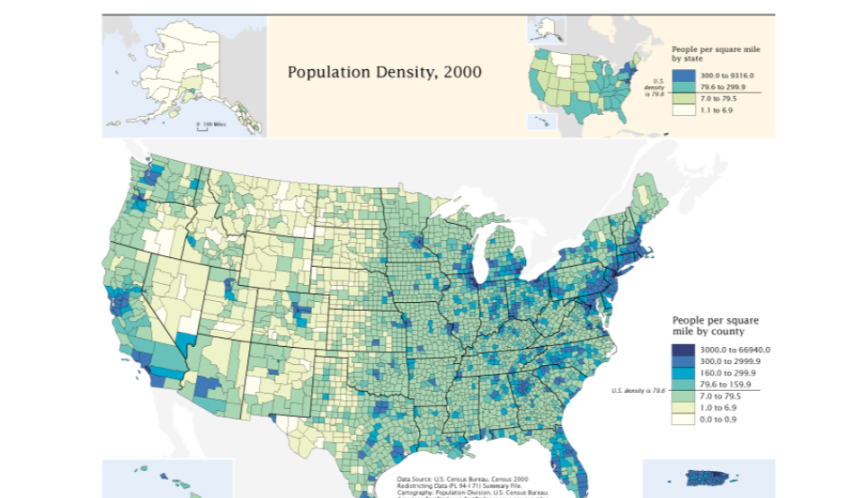


## Të Dhënat Hapësinore II

  - Kohët e fundit, ka një disponueshmëri në rritje e burimeve të reja të të dhënave hapësinore. 
  


## Si e regjistrojmë botën reale

  - Në GIS, ka dy modele të të dhënave për mënyrën se si e regjistrojmë botën. 
  
  
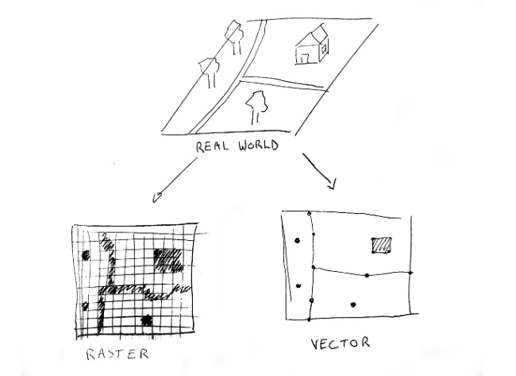
## Si e regjistrojmë botën reale

  - Modeli i parë është një **raster**, i cili kodon botën si një sipërfaqe të vazhdueshme të përfaqësuar nga një rrjetë, si p.sh. piksela të     një imazhi. 
  
  - Shembuj përfshijnë të dhënat e lartësisë ose imazhet nga sateliti. 
  
## Si e regjistrojmë botën reale

  - Modeli tjetër është të përfaqësojmë botën si një koleksion objektesh të ndara duke përdorur pika, linja dhe poligone. 
  
  - Këto quhen të dhëna vektoriale.

## Raster vs. të dhënave vektoriale

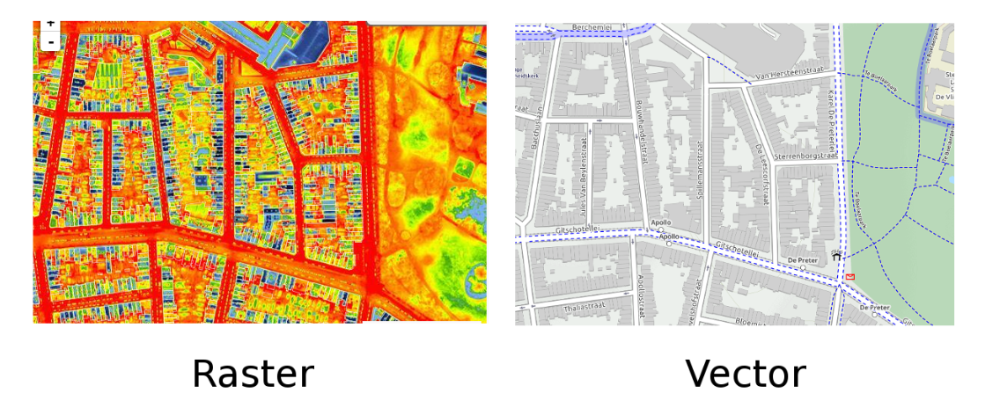
## Raster vs. të dhënave vektoriale

  - Këtu është një shembull real i dy modeleve të të dhënave të së njëjtës zonë. 
  
  - Në anën e majtë, shohim një imazh satelitor termik që tregon humbjen e ngrohtësisë së ndërtesave. 
  
  - Në anën e djathtë, sohim një vizualizim të të dhënave vektoriale të së njëjtës zonë: karakteristika të veçanta ku ndërtesat janë të përfaqësuara si poligone dhe rrugët si linja. 
  
  
## Karakteristikat vektoriale

  - Karakteristikat vektoriale përbëhen nga tre lloje të ndryshme të gjeometrive: 


## Karakteristikat vektoriale

  - Fillimisht, kemi një gjeometri pikash **point**: një vendndodhje e vetme me koordinata X dhe Y.
  
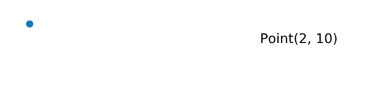  

## Karakteristikat vektoriale


  - Tjetra, një vijë **line** është një grup pikash të lidhura. 
  
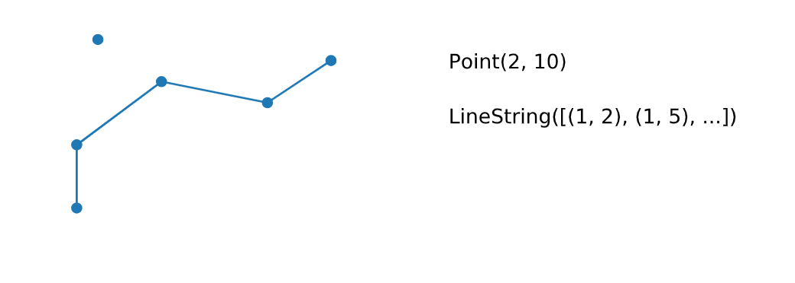    
  
  - Në kod, do të vëreni se kjo quhet "linestring".

## Karakteristikat vektoriale

  - Së fundmi, një poligon **polygon** formohet nga një vijë e mbyllur që rrethon një zonë. 
  
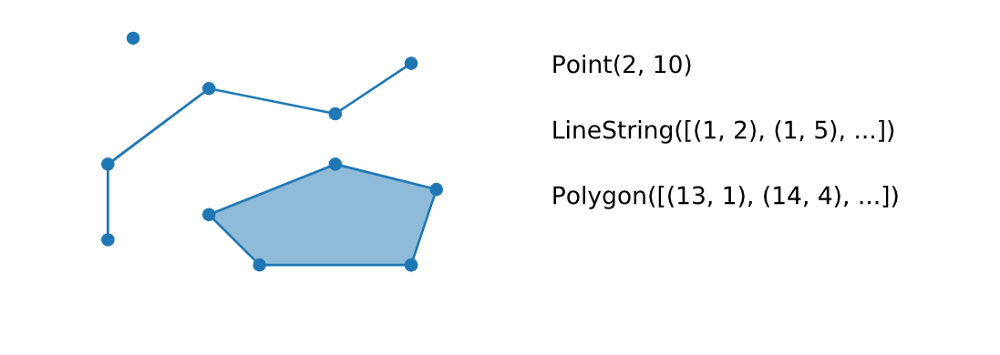

  
  - Përveç kësaj, një karakteristikë mund të përbëhet edhe nga disa gjeometri të ndryshme, siç është një "MultiPolygon".

## Shembull vektorial I

Le të japim një shembull real që ilustron ato lloje të të dhënave vektoriale: ne mund të visualizojmë vendet e botës si poligone, të treguara këtu në këtë figurë.


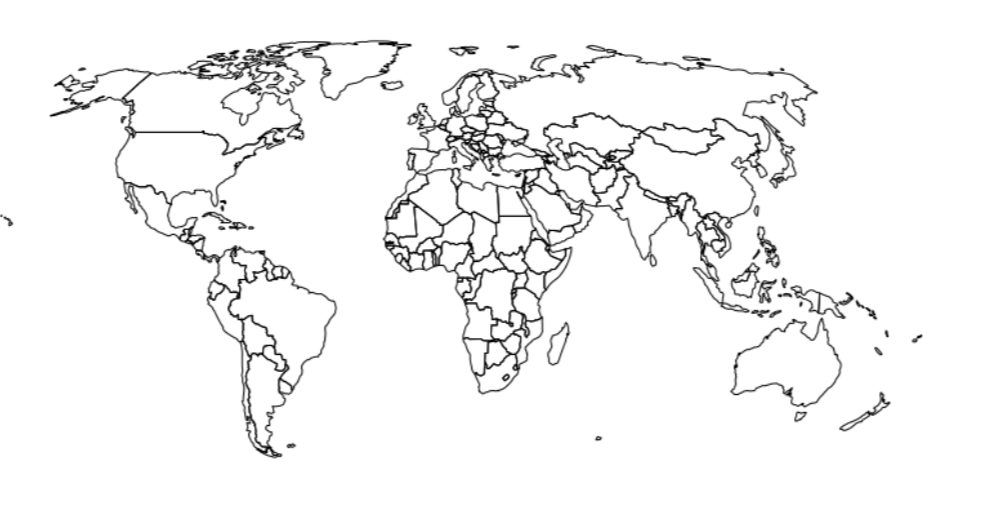

## Shembull vektorial II

Tani shtojmë vendndodhjet e kryeqyteteve si karakteristika pikash.

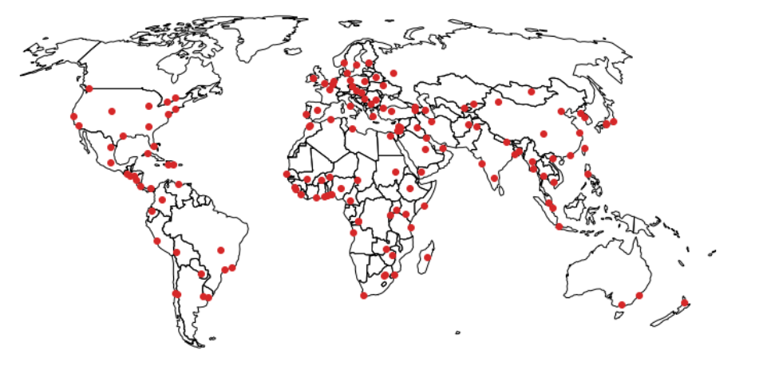

## Shembull vektorial III

Së fundmi, shtojmë disa nga lumenjtë më të mëdhenj të botës si linja.

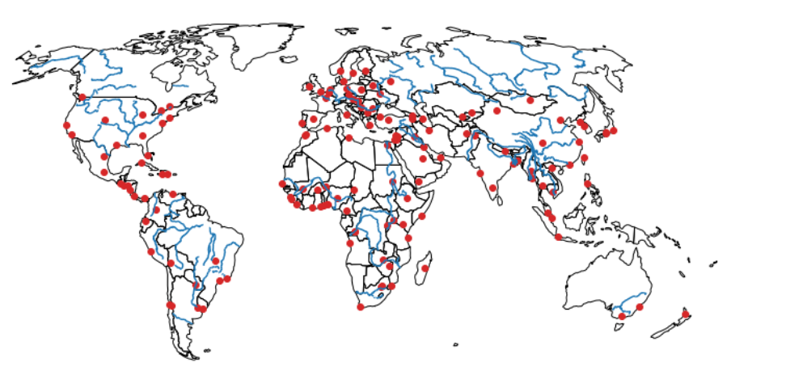

## Të dhënat e atributeve vektoriale

  - Një koncept i rëndësishëm janë atributet e karakteristikave. 
  
  - Zakonisht, ne do të kemi informacion mbi karakteristikat tona vektoriale.
  
  
## Të dhënat e atributeve vektoriale  
  
  - Duke përdorur poligonet e vendeve si shembull, mund të kemi informacion mbi emrin e vendit, kryeqytetin e tij, numrin e popullsisë, etj.
  
  - Kur kemi një koleksion të tillë karakteristikash, për shembull, të gjitha vendet në botë, të kombinuara me atributet e tij, përfundojmë me     një tabelë. 
  
  
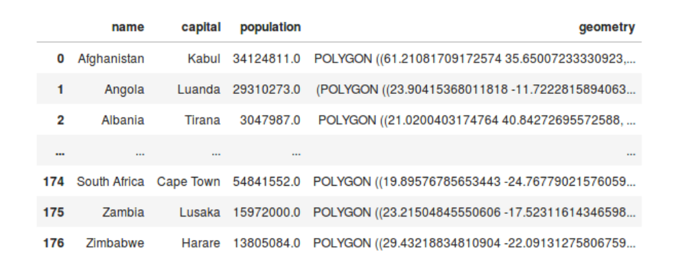  
  
  Ky është lloji i të dhënave që do të përdoret në këtë kurs.

## Le të praktikojmë!

  - Për ushtrimet, do përdorim njohuritë bazë nga pandas për të punuar me të dhënat tabelare, dhe matplotlib për vizualizimin. 
  
  - Le të bëjmë disa ushtrime të para duke përdorur këto paketa.


## Shembull: Restorantet në Paris

  - Në këtë ushtrim, do të punojmë me një dataset që përmban të dhëna mbi restorantet në qendrën e Parisit. 
  
  - Do të përdorim pandas për të lexuar të dhënat nga një skedar CSV dhe matplotlib për të krijuar një vizualizim të thjeshtë të koordinatave ````të restoranteve.

## Importimi i bibliotekave

\AddToHookNext{env/Highlighting/begin}{\scriptsize}

```{python, eval = FALSE}
import pandas as pd
import matplotlib.pyplot as plt
```

## Leximi i datasetit

\AddToHookNext{env/Highlighting/begin}{\scriptsize}

```{python, eval = FALSE}
# Lexojmë skedarin CSV që përmban të dhënat e restoranteve
restaurants = pd.read_csv("data/gis/paris_restaurants.csv")
```

## Inspektimi i të dhënave

\AddToHookNext{env/Highlighting/begin}{\scriptsize}

```{python, eval = FALSE}
# Shikojmë 5 rreshtat e parë të datasetit për të parë strukturën e tij
print(restaurants.head())
```

Kjo do të na tregojë nëse kemi kolona me koordinata X dhe Y që përfaqësojnë vendndodhjet e restoranteve.


## Vizualizimi i vendndodhjeve të restoranteve

\AddToHookNext{env/Highlighting/begin}{\scriptsize}

```{python, eval = FALSE}
# Krijojmë një figurë dhe një aks me matplotlib
fig, ax = plt.subplots()

# Përdorim metodën plot() për të vizualizuar vendndodhjet e restoranteve
# Ne përdorim kolonat që përmbajnë koordinatat X dhe Y për të krijuar grafikun
ax.plot(restaurants["x"], restaurants["y"], 'o', color = "Blue")  # 'o' për pikë të vetme

# Shtohet një titull për grafikun
ax.set_title("Vendndodhjet e Restoranteve në Qendrën e Parisit")

# Tregojmë grafikun
plt.show()
```


## Shembull: Shtimi i Hartës së Sfondit


  - Tani do të mësojmë si të shtojmë një hartë sfondi në vizualizimin tonë për të dhënë kontekst hapësinor. 
  
  - Për ta bërë këtë, do të përdorim paketën **contextily** dhe funksionin **add_basemap()** për të shtuar një hartë web në grafikun tonë.
  
  
## Instalimi i contextily


\AddToHookNext{env/Highlighting/begin}{\scriptsize}

```{python, eval = FALSE}
conda install contextily
```


## Importimi i contextily


\AddToHookNext{env/Highlighting/begin}{\scriptsize}

```{python, eval = FALSE}
import contextily as ctx
```


## Krijimi i vizualizimit me harten e sfondit

\AddToHookNext{env/Highlighting/begin}{\scriptsize}

```{python, eval = FALSE}
# Krijojmë një figurë dhe një aks me matplotlib
fig, ax = plt.subplots()

# Bëjmë një grafikun e të gjitha pikave në datasetin "restaurants" me madhësi të zvogëluar
ax.plot(restaurants["x"], restaurants["y"], 'o', markersize=1)  # Përdorim 'o' për të treguar një pikë të vetme

# Shtojmë një titull për grafikun
ax.set_title("Vendndodhjet e Restoranteve në Qendrën e Parisit me Hartë të Sfondit")

# Shtojmë hartën e sfondit me contextily
ctx.add_basemap(ax, source=ctx.providers.OpenStreetMap.Mapnik)

# Tregojmë grafikun
plt.show()
```


# Hyrje në GeoPandas

## Prezantimi i GeoPandas
  
  - Fillojmë të prezantojmë bibliotekat specifike të Python për të dhënat hapësinore.

## Formatet e të dhënave hapësinore specifike

  - Në ushtrimin e fundit, përdorëm pandas për të lexuar një skedar CSV me koordinatat e pikave dhe përdorëm matplotlib për të krijuar një         hartë të atyre pikave. 
  
  - Megjithatë, thamë se përveç të dhënave të pikave, të dhënat hapësinore mund të përbëhen nga linja ose poligone. 
  
  - Çdo objekt atëherë përbëhet nga disa pika, dhe për këtë arsye, nuk do të mund ta përfaqësojmë lehtësisht këtë në një skedar CSV ose në një     DataFrame me dy kolona për koordinatat x dhe y. 
  
## Formatet e të dhënave hapësinore specifike  
  
  - Prandaj, më tutje, do të përdorim formate specifike për të dhënat gjeohapësinore, si skedarët GeoJSON, GeoPackage, ose shapefiles, të cilët
    janë të specializuar për të ruajtur të dhënat hapësinore, përveç të dhënave tabelare tradicionale. 
    
  - Për të lexuar skedarët e tillë dhe për të punuar me të dhënat gjeohapësinore në Python, do të përdorim bibliotekën **GeoPandas**.

## Importimi i të dhënave gjeohapësinore me GeoPandas

  - GeoPandas është një bibliotekë për të punuar me të dhënat gjeohapësinore tabelare, duke zgjeruar pandas DataFrame. 
  
  - Fillojmë me importimin e disa të dhënave. 
  
  
## Importimi i të dhënave gjeohapësinore me GeoPandas  
  
  - Mund të përdorim funksionin "read_file" të GeoPandas, ku argument kemi path-in e skedarit. 
  
  - Ky funksion mund të lexojë shumicën e formateve të zakonshme të të dhënave hapësinore. 
  
  
## Krijimi i vizualizimit me harten e sfondit

\AddToHookNext{env/Highlighting/begin}{\scriptsize}

```{python, eval = FALSE}
import geopandas
countries = geopandas.read_file("data/gis/countries.geojson")
```
  
  
## Krijimi i vizualizimit me harten e sfondit  
  
  
  - Në këtë shembull, po lexojmë një skedar GeoJSON me të gjitha vendet e botës. 
  
  - Duke përdorur metodën "head" për të shfaqur pesë rreshtat e parë, mund të shihni se tani kemi një kolonë me gjeometrinë, në këtë rast         poligone që përfaqësojnë vendet. 
  
  - Dhe kolonat e tjera janë atributet që përshkruajnë ato vende.

## Krijimi i vizualizimit me harten e sfondit  

\AddToHookNext{env/Highlighting/begin}{\scriptsize}

```{python, eval = FALSE}
countries.head()
```
  
  
## Vizualizimi i shpejtë i të dhënave hapësinore me GeoPandas


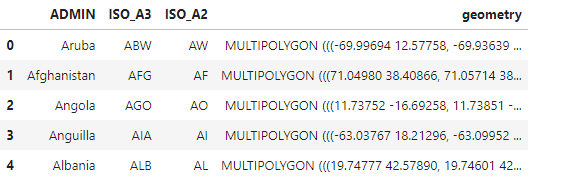


## Vizualizimi i shpejtë i të dhënave hapësinore me GeoPandas

  - Le të bëjmë një vizualizim të shpejtë të të dhënave për të parë që me të vërtetë kemi të gjitha vendet e botës. 
  
  - Për këtë, mund të përdorim metodën "plot", e cila do të krijojë një vizualizim bazë të gjeometrisë së datasetit të vendeve.


## Vizualizimi i shpejtë i të dhënave hapësinore me GeoPandas

\AddToHookNext{env/Highlighting/begin}{\scriptsize}

```{python, eval = FALSE}
countries.plot()
```

## Vizualizimi i shpejtë i të dhënave hapësinore me GeoPandas


## GeoDataFrame

  - Por çfarë është ky objekt "countries"? 
  
\AddToHookNext{env/Highlighting/begin}{\scriptsize}  

```{python, eval = FALSE}
type(countries)
```

## GeoDataFrame
  
  - Funksioni "read_file" i GeoPandas ktheu një **GeoDataFrame**. 
  
  - Mund ta mendoni si një dataframe normal të pandas, por me kapacitete hapësinore të avancuara.

## GeoDataFrame

  - Mund ta përdorim për të përfaqësuar karakteristikat gjeohapësinore me atributet e tij. 
  
  - Ai gjithmonë ka një kolonë "geometry", që mban informacionin e gjeometrisë, karakteristikat. 
  
  - Kolonat e tjera janë atributet që përshkruajnë secilën prej gjeometrive.

## Atributi 'geometry'

  - Një nga aspektet specifike të GeoDataFrame është se ai ka një atribut "geometry", i cili gjithmonë na kthen kolonën e gjeometrisë,             pavarësisht emrit të tij aktual. 
  
## Atributi 'geometry'

  Për shembull, nëse e përdorim këtë për datasetin e vendeve, shohim që marrim një Serinë me poligone. 
  
\AddToHookNext{env/Highlighting/begin}{\scriptsize}  

```{python, eval = FALSE}
countries.geometry
```  
  
## Atributi 'geometry'

  - Ajo që kthehet këtu është një GeoSeries. 
  
  - Ashtu si GeoDataFrame është ekuivalenti hapësinor i një dataframe të pandas, GeoSeries është si një pandas Series, por me metoda hapësinore     shtesë.

## DataFrame i ndërgjegjshëm për hapësirën

 - Një shembull i një funksionaliteti hapësinor është atributi "area" i GeoSeries. 

 - Ky atribut kthen një seri me sipërfaqen e çdo gjeometrie.


## Shembull: Eksplorimi i Distrikteve të Parisit

Në këtë ushtrim, do të prezantojmë një dataset të ri për Parisin: **paris_districts**, të marrë nga një dataset i hapur i Paris Data.

## Importimi i GeoPandas

\AddToHookNext{env/Highlighting/begin}{\scriptsize}  

```{python, eval = FALSE}
# Importimi i bibliotekës GeoPandas
import geopandas as gpd
```


## Leximi i të dhënave të distrikteve


\AddToHookNext{env/Highlighting/begin}{\scriptsize}  

```{python, eval = FALSE}
# Leximi i skedarit GeoPackage që përmban të dhënat për distriktet e Parisit
districts = geopandas.read_file('data/gis/paris_districts_utm.geojson')
```

## Inspektimi i të dhënave

\AddToHookNext{env/Highlighting/begin}{\scriptsize}  

```{python, eval = FALSE}
# Shikojmë 5 rreshtat e parë të datasetit për të parë strukturën e tij
print(districts.head())
```

Kjo do të na japë një ide të formatit të të dhënave dhe të llojit të gjeometrive që përmban dataset-i.

## Vizualizimi i shpejtë i distrikteve


\AddToHookNext{env/Highlighting/begin}{\scriptsize}  

```{python, eval = FALSE}
# Krijimi i një vizualizimi të shpejtë të distrikteve
districts.plot()  # Vizualizojmë gjeometrinë e distrikteve

# Shtojmë një titull për grafikun
plt.title("Distriktet Administrative të Parisit")

# Tregojmë grafikun
plt.show()
```


## Shembull: Eksplorimi i Distrikteve të Parisit 2

  - Në ushtrimin e kaluar, përdorëm metodën e personalizuar `plot()` të GeoDataFrame për të krijuar një vizualizim të thjeshtë të gjeometrive     në dataset. 
  
  - Në këtë ushtrim, do të eksplorojmë disa nga atributet dhe metodat hapësinore specifike të GeoDataFrame dhe GeoSeries.

## Çfarë lloji objekti është `districts`?

\AddToHookNext{env/Highlighting/begin}{\scriptsize}  

```{python, eval = FALSE}
# Kontrollojmë llojin e objektit "districts" me funksionin `type()`
print(type(districts))
```

Kjo do të tregojë llojin e objektit districts, që duhet të jetë një GeoDataFrame.

## Atributi geometry dhe lloji i tij

\AddToHookNext{env/Highlighting/begin}{\scriptsize}  

```{python, eval = FALSE}
# Aksesojmë atributin `geometry` të GeoDataFrame
geometry_series = districts.geometry

# Kontrollojmë llojin e këtij objekti
print(type(geometry_series))
```

Kjo do të tregojë se geometry_series është një GeoSeries.

## Shfaqja e rreshtave të parë të geometry

\AddToHookNext{env/Highlighting/begin}{\scriptsize}  

```{python, eval = FALSE}
# Shikojmë 5 rreshtat e parë të kolonës `geometry`
print(geometry_series.head())
```

Kjo do të tregojë se çfarë lloj gjeometrish përmban dataset-i.


## Inspektimi i sipërfaqes së gjeometrive


\AddToHookNext{env/Highlighting/begin}{\scriptsize}  

```{python, eval = FALSE}
# Marrim sipërfaqen e gjeometrive të distrikteve
area_series = geometry_series.area  # Atributi që kthen sipërfaqen

# Shikojmë 5 rreshtat e parë të sipërfaqes së gjeometrive
print(area_series.head())
```


## Shembull: Restorantet e Parisit si një GeoDataFrame


  - Në ushtrimin e parë të këtij leksioni, importuam vendndodhjet e restoranteve në Paris nga një skedar CSV. 
  
  - Tani duam ta konvertojmë këtë DataFrame në një GeoDataFrame për të mundësuar funksionalitetin hapësinor të GeoPandas.

## Inspektimi i rreshtave të parë të GeoDataFrame


\AddToHookNext{env/Highlighting/begin}{\scriptsize}  

```{python, eval = FALSE}
# Inspektojmë 5 rreshtat e parë të GeoDataFrame
print(restaurants.head())
```

Kjo do të na japë një pamje të shpejtë të strukturës së GeoDataFrame dhe të dhënave që përmban.


## Vizualizimi i vendndodhjeve të restoranteve

\AddToHookNext{env/Highlighting/begin}{\scriptsize}  

```{python, eval = FALSE}
import contextily as ctx

# Vizualizojmë vendndodhjet e restoranteve në Paris
fig, ax = plt.subplots()
ax.plot(restaurants['x'], restaurants['y'], 'o', markersize=1)

# Përdorim OpenStreetMap si burim për hartën e sfondit
ctx.add_basemap(ax, source=ctx.providers.OpenStreetMap.Mapnik)

# Tregojmë grafikun
plt.show()
```

# Eksplorimi dhe Vizualizimi i të Dhënave Hapësinore dhe Atributeve të Tyre"

## GeoDataFrame dhe Funksionaliteti i Tij

  - Kemi parë GeoDataFrame dhe funksionalitetin e tij bazë. 
  
  - Një GeoDataFrame nga biblioteka geopandas është një pandas DataFrame me funksionalitete hapësinore. 
  
## GeoDataFrame dhe Funksionaliteti i Tij  
  
  - Kështu, çdo gjë që dini për punën me pandas DataFrame mund të përdoret edhe këtu, që do të thotë se mund të punoni lehtësisht me               informacionet e atributit të gjeometrive për t'i manipuluar, eksploruar dhe analizuar ato.

## Filtrimi i të Dhënave

  - Një shembull është marrja e një nën-grupi nga dataframe duke filtruar mbi një nga atributet. 
  
  - Le të marrim sërish datasetin e vendeve si shembull, një dataset poligonal me të gjitha vendet e botës.

## Filtrimi i të Dhënave  

\AddToHookNext{env/Highlighting/begin}{\scriptsize}  

```{python, eval = FALSE}
world = geopandas.read_file("data/gis/ne_110m_admin_0_countries/ne_110m_admin_0_countries.shp")
world.head()
```


## Filtrimi i të Dhënave  
  
  
  - Nëse shikojmë rreshtat e parë, shohim se ka një kolonë që tregon kontinentin. 
  
  - Tani mund të bëjmë një operacion krahasimi për të gjetur të gjitha vendet e kontinentit të Afrikës. 
  
  - Kjo na jep një seri boolean me vlera True dhe False, e quajtur maskë.
  
  
  
## Filtrimi i të Dhënave  

\AddToHookNext{env/Highlighting/begin}{\scriptsize}  

```{python, eval = FALSE}
world['continent'] == 'Africa'
```


## Filtrimi i të Dhënave

  - Më pas, mund ta përdorim këtë maskë boolean për të filtruar GeoDataFrame origjinal. 
  

## Filtrimi i të Dhënave

\AddToHookNext{env/Highlighting/begin}{\scriptsize}  

```{python, eval = FALSE}  
countries_africa = world[world['continent'] == 'Africa']
countries_africa.plot()  
```  


## Filtrimi i të Dhënave

  - Duke bërë vizualizimin e nën-grupit, shohim se kemi vetëm vendet e Afrikës. 
  
  - Ky ishte një shembull i funksionalitetit bazë të pandas. 
  
  - Në ushtrimet do të hasim disa të tjerë, si "groupby" dhe bashkime të dataframe-ve.

## Vizualizimi i të Dhënave Hapësinore

  - Kemi parë mënyrën bazë për të krijuar shpejt geometrinë në një GeoDataFrame: metoda plot(). 
  
  - Do të tregojmë disa truke për të personalizuar këtë grafik dhe për të bërë vizualizime më të avancuara.

## Rregullimi i Ngjyrës: Ngjyrë Uniforme


  - Fillimisht, do të shohim dy mënyra për të rregulluar ngjyrën e gjeometrive të vizualizuara. 
  
  - Së pari, mund të specifikojmë një ngjyrë uniforme me fjalën kyçe "color". 
  
  
  
## Rregullimi i Ngjyrës: Ngjyrë Uniforme  
  
  - Për shembull, këtu specifikojmë që të gjitha vendet duhet të vizualizohen me ngjyrë të kuqe.
  
\AddToHookNext{env/Highlighting/begin}{\scriptsize}  

```{python, eval = FALSE}  
world.plot(color="red")

```    
  

## Rregullimi i Ngjyrës: Bazuar në Vlerat e Atributit

  - Në mënyrë alternative, shpesh duam të ngjyrosim çdo poligon në varësi të njërit nga atributet e atyre gjeometrive. 
  
  - Për këtë, mund të kalojmë emrin e kolonës së këtij atributi në fjalën kyçe "column" të metodës plot(). 
  
## Rregullimi i Ngjyrës: Bazuar në Vlerat e Atributit

  - Për shembull, këtu ngjyrosim vendet bazuar në 'pop_est'. 
  
  
\AddToHookNext{env/Highlighting/begin}{\scriptsize}  

```{python, eval = FALSE}  
world.plot(column='pop_est')

```    

## Grafik me Shtresa të Shumta

   - Shpesh duam të kombinojmë shumë shtresa gjeometrish në një grafik të vetëm. 
   
   - Për këtë, mund të përdorim fjalën kyçe "ax" të metodës plot(). 

## Grafik me Shtresa të Shumta

   - Me këtë fjalë kyçe, mund të kalojmë një grafik ekzistues mbi të cilin të shtojmë shtresën shtesë. 
   
   - Shtresa merr një objekt "matplotlib axes", i cili kthehet nga metoda plot(), ose i cili, siç bëhet këtu, mund të krijohet me funksionin "subplots" të matplotlib. 
   
   
## Grafik me Shtresa të Shumta   


\AddToHookNext{env/Highlighting/begin}{\scriptsize}  

```{python, eval = FALSE}  
fig, ax = plt.subplots(figsize=(12, 6))
world.plot(ax=ax)
countries_africa.plot(ax=ax, color='red', markersize=10)
ax.set_axis_off()
```  


## Ushtrim: Vizualizimi i Dendësisë së Popullsisë

  - Në këtë ushtrim, do të vizualizojmë ndryshimet hapësinore të dendësisë së popullsisë brenda qendrës së Parisit. 
  
  - Për ta bërë këtë, do të llogarisim dendësinë e popullsisë duke e ndarë numrin e popullsisë me sipërfaqen, dhe do ta shtojmë atë si një kolonë të re në dataframe.

## Inspektimi i Kolonave të Datasetit

\AddToHookNext{env/Highlighting/begin}{\scriptsize}  

```{python, eval = FALSE}  
# Shfaqim 5 rreshtat e parë të datasetit të distrikteve
districts = geopandas.read_file('data/gis/paris_districts_utm.geojson')
print(districts.head())
```

Kjo do të tregojë nëse dataset-i përmban një kolonë 'population' dhe do të konfirmojë strukturën e tij.


## Inspektimi i Sipërfaqes së Gjeometrive


\AddToHookNext{env/Highlighting/begin}{\scriptsize}  

```{python, eval = FALSE}
# Marrim sipërfaqen e gjeometrive të distrikteve
area_series = districts.geometry.area  # Atributi që kthen sipërfaqen në metra katrorë
```

Me këtë atribut, mund të marrim sipërfaqen e secilit distrikt për të llogaritur dendësinë e popullsisë.


## Shtimi i Kolonës 'population_density'

\AddToHookNext{env/Highlighting/begin}{\scriptsize}  

```{python, eval = FALSE}
# Shtojmë një kolonë për dendësinë e popullsisë
# Kjo përllogaritje ndan popullsinë me sipërfaqen (në metra katrorë), pastaj shumëzohet me 10**6 për t'i kthyer në kilometra katrorë
districts['population_density'] = (districts['population'] / area_series) * 10**6
```

Kjo krijon një kolonë të re 'population_density' që tregon numrin e banorëve për kilometër katror.


## Vizualizimi i Distrikteve me 'population_density'

\AddToHookNext{env/Highlighting/begin}{\scriptsize}  

```{python, eval = FALSE}
# Vizualizojmë distriktet duke përdorur 'population_density' për të ngjyrosur poligonet
ax = districts.plot(column='population_density', legend=True)

# Shtojmë një titull për grafikun
ax.set_title("Dendësia e Popullsisë në Distriktet e Parisit")

# Tregojmë grafikun
plt.show()
```


## Rezultati

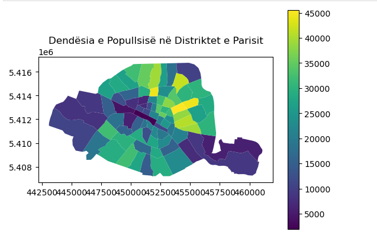


## Shembull : Përdorimi i Funksionalitetit të Pandas: Groupby

  - Në këtë ushtrim, do të përmbledhim një funksionalitet të zakonshëm: operacionin "groupby". 
  
  - Mund të përdorni këtë operacion kur keni një kolonë që përmban grupe dhe dëshironi të llogaritni një statistikë për secilin grup.
  

## Shembull : Përdorimi i Funksionalitetit të Pandas: Groupby

  - Në metodën `groupby()`, kaloni kolonën që përmban grupet. 
  
  - Në objektin që rezulton, mund të thërrisni metodën që dëshironi të llogaritni për secilin grup. Në këtë ushtrim, duam të dimë madhësinë e        çdo grupi të tipit të restoranteve.

## Përdorimi i `groupby()` për të grupuar dhe llogaritur madhësinë e secilit grup

\AddToHookNext{env/Highlighting/begin}{\scriptsize}  

```{python, eval = FALSE}

# Load the restaurants data
restaurants = geopandas.read_file("data/gis/paris_restaurants.csv")

# Grupojmë restorantet sipas llojit të restoranteve dhe llogarisim madhësinë e çdo grupi
type_counts = restaurants.groupby('type').size())
```

Kjo krijon një seri që tregon numrin e elementëve për secilin lloj restoranti.

## Printimi i Rezultatit


\AddToHookNext{env/Highlighting/begin}{\scriptsize}  

```{python, eval = FALSE}
# Tregojmë serinë që përmban madhësinë e çdo grupi
print(type_counts)
```

Kjo do të tregojë statistikat për secilin lloj restoranti, duke na dhënë një ide të shpërndarjes së restoranteve sipas llojit.


## Shembull: Vizualizimi i Shtresave të Shumta


  - Një funksionalitet tjetër tipik i pandas është filtrimi i një dataframe: marrja e një nën-grupi të rreshtave bazuar në një kusht (që          gjeneron një maskë boolean).


## Shembull: Vizualizimi i Shtresave të Shumta

  - Në këtë ushtrim, do të marrim nën-grupin e të gjitha restoranteve afrikane dhe më pas do të krijojmë një grafik me shtresa të shumta. 
  
  - Në një grafik të tillë, ne kombinojmë vizualizimin e disa GeoDataFrames në një figurë të vetme.
  
  - Për të shtuar një shtresë, mund të përdorim fjalën kyçe `ax` të metodës `plot()` të GeoDataFrame për t'i kaluar një objekt të boshtit të matplotlib.

## Filtrimi për Restorantet Afrikane

\AddToHookNext{env/Highlighting/begin}{\scriptsize}  

```{python, eval = FALSE}
# Marrim nën-grupin e të gjitha rreshtave ku tipi është 'African restaurant'
african_restaurants = restaurants[restaurants['type'] == 'African restaurant']
```

Kjo krijon një nën-grup me vetëm restorantet afrikane.


# Hyrje në Objektet Gjeografike në Python"

## Prezantimi i Objekteve Gjeografike në Python

  - Tani do të mësojmë se si objektet gjeometrike (vektor) përfaqësohen në Python duke përdorur një bibliotekë të quajtur **shapely**. 
  
  - Biblioteka **geopandas** përdor gjeometrinë **shapely** për të përfaqësuar karakteristikat gjeografike në të dhëna. 
  
## Prezantimi i Objekteve Gjeografike në Python  
  
  - Kuptimi i mënyrës se si funksionojnë këto objekte gjeometrike dhe se si mund të krijohen në Python është jashtëzakonisht i dobishëm, sepse këto objekte janë blloqet themelore që na lejojnë të bëjmë analizën e të dhënave gjeografike.
  
  
## Prezantimi i Objekteve Gjeografike në Python  

  - **Shapely** përdor një bibliotekë C++ të quajtur **GEOS** për të ndërtuar gjeometritë, e cila është një nga bibliotekat standarde e           softeve GIS si PostGIS ose QGIS. 
  

## Krijimi i Gjeometrive të Pikave

  - Kur krijojmë gjeometri me shapely, së pari duhet të importojmë klasën e objektit gjeometrik (siç është Point) që duam të krijojmë nga         **shapely.geometry**.
  
  - **shapely.geometry** është gjeometria e cila përmban të gjitha llojet e mundshme të gjeometrisë. 
  
  - Pas importimit të klasës **Point**, krijimi i një pike është i lehtë: ne thjesht kalojmë koordinatat x dhe y në klasën Point() (me një        koordinatë të mundshme z) e cila do të krijojë pikën për ne:  


## Krijimi i Gjeometrive të Pikave


\AddToHookNext{env/Highlighting/begin}{\scriptsize}  

```{python, eval = FALSE}
# Importimi i klasës Point nga shapely.geometry
from shapely.geometry import Point

# Krijimi i gjeometrive të pikave
point = Point(2.2, 4.2)  # Për pikë 2D
point3D = Point(9.26, -2.456, 0.57)  # Për pikë 3D
```

## Ekstraktimi i Koordinatave të Pikave

\AddToHookNext{env/Highlighting/begin}{\scriptsize}  

```{python, eval = FALSE}
# Ekstraktimi i koordinatave si listë
list(point.coords)  # Kthen listën e koordinatave
# Direkt nga atributet X dhe Y
print(point.x)  # Koordinata X
print(point.y)  # Koordinata Y
```


## Krijimi i Gjeometrive LineString

\AddToHookNext{env/Highlighting/begin}{\scriptsize}  

```{python, eval = FALSE}
# Importimi i klasave LineString dhe Point
from shapely.geometry import LineString, Point

# Krijimi i gjeometrive të linjave
point1 = Point(2.2, 4.2)
point2 = Point(7.2, -25.1)
point3 = Point(9.26, -2.456)

line = LineString([point1, point2, point3])
```
Linjat krijohen duke përdorur të paktën dy pika ose duke kaluar lista të tupleve koordinatash.

## Ekstraktimi i Koordinatave të LineString

\AddToHookNext{env/Highlighting/begin}{\scriptsize}  

```{python, eval = FALSE}
# Ekstraktimi i koordinatave të LineString
list(line.coords)  # Kthen listën e koordinatave të linjave
```

Kjo na jep një listë me çiftet e koordinatave (x, y).

## Krijimi i Gjeometrive Polygon

\AddToHookNext{env/Highlighting/begin}{\scriptsize}  

```{python, eval = FALSE}
# Importimi i klasës Polygon
from shapely.geometry import Polygon

# Krijimi i gjeometrive të poligoneve
poly = Polygon([point1, point2, point3])  # Poligoni me tre pika
```

Poligonet krijohen me të paktën tre pika ose një listë të koordinatave.

## Ekstraktimi i Informacionit nga Polygon

\AddToHookNext{env/Highlighting/begin}{\scriptsize}  

```{python, eval = FALSE}
# Informacioni për Polygon
print("Polygon centroid: ", poly.centroid)  # Gjen qendrën e poligonit
print("Polygon Area: ", poly.area)  # Sipërfaqja e poligonit
```

Shumë funksione mund të nxirren direkt nga Polygon, si qendra (centroid) dhe sipërfaqja.

## Krijimi i Poligonëve me Hapësirë Boshe (Holes)


\AddToHookNext{env/Highlighting/begin}{\scriptsize}  

```{python, eval = FALSE}
# Definimi i unazës së jashtme dhe së brendshme për të krijuar një poligon me hapësirë boshe
exterior = [(-180, 90), (-180, -90), (180, -90), (180, 90)]  # Unaza e jashtme
hole = [[(-170, 80), (-170, -80), (170, -80), (170, 80)]]  # Unaza e brendshme

poly_with_hole = Polygon(shell=exterior, holes=hole)  # Krijimi i poligonit me hapësirë boshe
```

Poligonet mund të kenë hapësira bosh duke përdorur parametrat shell për unazën e jashtme dhe holes për ato të brendshme.

## Krijimi i Gjeometrive MultiPoint, MultiLineString, dhe MultiPolygon


\AddToHookNext{env/Highlighting/begin}{\scriptsize}  

```{python, eval = FALSE}

# Importimi i klasave MultiPoint, MultiLineString, dhe MultiPolygon
from shapely.geometry import MultiPoint, MultiLineString, MultiPolygon

# Krijimi i MultiPoint
multipoint = MultiPoint([Point(2, 2), Point(3, 3)])  # Koleksion i pikave

# Krijimi i MultiLineString
multiline = MultiLineString([
    LineString([(2, 2), (3, 3)]),
    LineString([(4, 3), (6, 4)])
])  # Koleksion i linjave

# Krijimi i MultiPolygon
multipoly = MultiPolygon([
    Polygon([(0, 0), (0, 4), (4, 4)]),
    Polygon([(6, 6), (6, 12), (12, 12)])
])  # Koleksion i poligoneve
```


Versionet "Multi" të gjeometrive lejojnë përfaqësimin e koleksioneve të shumta me pika, linja, ose poligone.


