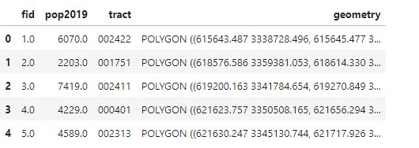
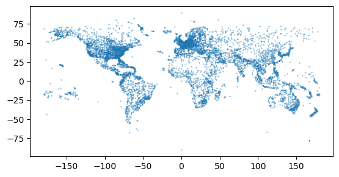
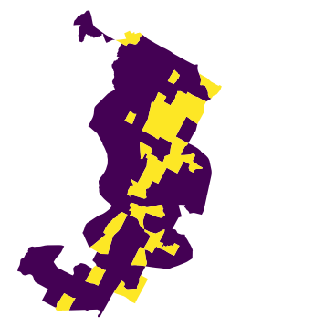
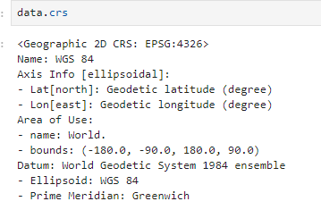
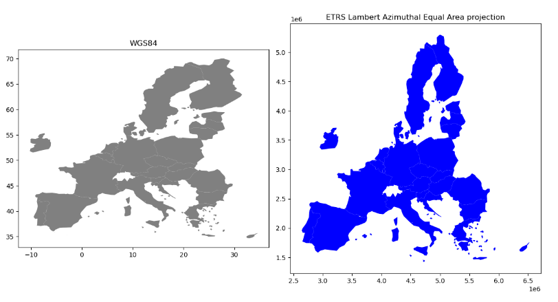

```{r setup, include=FALSE}
    library(knitr)
    library(tidyverse)
knitr::opts_chunk$set(
comment=NA,
error=F, 
warning=F,
tidy=TRUE, 
fig.align = 'center',
message=F, 
warning=F,
tidy.opts=list(width.cutoff=60),
fig.width=4, 
fig.height=4, 
fig.path='Figs/')
```


# Përgatitja e GeoDataFrames nga të dhënat gjeografike

## Përgatitja e GeoDataFrames nga të dhënat gjeografike

  - Leximi i të dhënave në Python është zakonisht hapi i parë i analizës. 
  
  - Ekzistojnë formate të ndryshme të të dhënave GIS të disponueshme si **Shapefile, GeoJSON**, **KM** dhe **GeoPackage**. 
  
  - **Geopandas** është në gjendje të lexojë të dhëna nga të gjitha këto formate (plus shumë të tjera).


## Përgatitja e GeoDataFrames nga të dhënat gjeografike

  - Do shohim fillimisht se si të lexoni (dhe shkruani) të dhëna nga burime të ndryshme. 
  

## Leximi i të dhënave vektoriale

  - Në **geopandas**, ne mund të përdorim një funksion xhenerik **.from_file()** për lexim në formate të ndryshme të të dhënave vektoriale. 
  
  - Kur lexoni skedarë me gjeopanda, të dhënat kalohen në bibliotekën **fiona** në background. 
  
  - Kjo do të thotë që ju mund të lexoni dhe shkruani të gjitha formatet e të dhënave të mbështetura nga **fiona** me **geopandas**.


## Leximi i të dhënave vektoriale


\AddToHookNext{env/Highlighting/begin}{\scriptsize}

```{python, eval = FALSE}
import geopandas as gpd
import fiona
```


## Leximi i të dhënave vektoriale

  - Le të kontrollojmë se cilët drivera supportohen nga **fiona**.

\AddToHookNext{env/Highlighting/begin}{\scriptsize}

```{python, eval = FALSE}
fiona.supported_drivers
```





## Leximi i të dhënave vektoriale


  - Në listën e drivera-ve të supportuar,**r** është për formatet e skedarëve që mund të lexojë fiona dhe **w** është për formatet e skedarëve     që mund të shkruajë. 
  
  - Shkronja **a** shënon formatet për të cilat fiona mund të shtojë të dhëna të reja në skedarët ekzistues.


## Leximi i të dhënave vektoriale

  - Le të lexojmë në disa të dhëna shembuj për të parë sintaksën bazë.

\AddToHookNext{env/Highlighting/begin}{\scriptsize}

```{python, eval = FALSE}
# Lexo nga Esri Shapefile
fp = "data/gis2/Austin/austin_pop_2019.shp"
data = gpd.read_file(fp)
data.head()
```


## Leximi i të dhënave vektoriale


## Leximi i të dhënave vektoriale

  - E njëjta sintaksë funksionon për formate të tjera të të dhënave vektoriale të zakonshme.

\AddToHookNext{env/Highlighting/begin}{\scriptsize}

```{python, eval = FALSE}
# Lexo nga Geopackage
fp = "data/gis2/Austin/austin_pop_2019.gpkg"
data = gpd.read_file(fp)

# Lexo nga GeoJSON
fp = "data/gis2/Austin/austin_pop_2019.geojson"
data = gpd.read_file(fp)

# Lexo nga MapInfo Tab
fp = "data/gis2/Austin/austin_pop_2019.tab"
data = gpd.read_file(fp)
```


## Leximi i të dhënave vektoriale


  - Disa formate skedarësh si skedarët **GeoPackage** dhe **File Geodatabase** mund të përmbajnë shtresa të shumta me emra të ndryshëm, të         cilët mund të specifikohen duke përdorur parametrin **layer**. 
  
## Leximi i të dhënave vektoriale

\AddToHookNext{env/Highlighting/begin}{\scriptsize}

```{python, eval = FALSE}
# Lexo nga GeoPackage 
fp = "data/gis2/Austin/austin_pop_2019.gpkg"
data = gpd.read_file(fp, layer="austin_pop_2019")
```


## Leximi i të dhënave vektoriale

\AddToHookNext{env/Highlighting/begin}{\scriptsize}

```{python, eval = FALSE}
# Aktivizo KML driver
gpd.io.file.fiona.drvsupport.supported_drivers["KML"] = "rw"

# Lexo nga KML
fp = "data/gis2/Austin/austin_pop_2019.kml"
# data = gpd.read_file(fp)
```


## Shkrimi i të dhënave vektoriale

  - Ne mund të ruajmë të dhëna hapësinore në formate të ndryshme të të dhënave vektoriale duke përdorur funksionin **.to_file()** në               **geopandas**, i cili gjithashtu mbështetet në **fiona**. 
  
  
  
## Shkrimi i të dhënave vektoriale

Krijoni folder **temp** brenda folderit **data**

\AddToHookNext{env/Highlighting/begin}{\scriptsize}

```{python, eval = FALSE}
# Shkruaj Shapefile (bëj kopje)
outfp = "data/temp/austin_pop_2019.shp"
data.to_file(outfp)

# Shkruaj Geopackage (bëj kopje)
outfp = "data/temp/austin_pop_2019.gpkg"
data.to_file(outfp, driver="GPKG")

# Shkruaj GeoJSON (bëj kopje)
outfp = "data/temp/austin_pop_2019.geojson"
data.to_file(outfp, driver="GeoJSON")

#Shkruaj MapInfo Tab (bëj kopje)
outfp = "data/temp/austin_pop_2019.tab"
data.to_file(outfp)


# Shkruaj KML (bëj kopje)
outfp = "data/temp/austin_pop_2019.kml"
data.to_file(outfp, driver="KML")  
```  
  
  
## Krijimi i një GeoDataFrame nga e para

  - Është e mundur të krijohen të dhëna hapësinore nga e para duke përdorur objektet gjeometrike të **shapely** dhe **geopandas**. 
  
  - Kjo është e dobishme pasi e bën të lehtë konvertimin, për shembull, një skedar teksti që përmban koordinata të të dhënave                     hapësinore. 
  
## Krijimi i një GeoDataFrame nga e para

  - Le të përpiqemi fillimisht të krijojmë një GeoDataFrame të thjeshtë bazuar në informacionin e koordinatave që përfaqësojnë skicat e sheshit     të Senatit në Helsinki, Finlandë. 
  
## Krijimi i një GeoDataFrame nga e para

  - Këtu janë koordinatat në bazë të të cilave mund të krijojmë një objekt Polygon duke përdorur `shapely.  
  
\AddToHookNext{env/Highlighting/begin}{\scriptsize}

```{python, eval = FALSE}  
from shapely.geometry import Polygon
# Koordinatat e sheshit të Senatit të Helsinkit
coordinates = [
    (24.950899, 60.169158),
    (24.953492, 60.169158),
    (24.953510, 60.170104),
    (24.950958, 60.169990),
]

# Krijo një polygon Shapely nga lista e koordinatave-tuple
poly = Polygon(coordinates)
```

## Krijimi i një GeoDataFrame nga e para

  - Tani mund ta përdorim këtë poligon dhe **geopanda** për të krijuar një GeoDataFrame nga e para. 
  
  - Të dhënat mund të kalohen si një objekt i ngjashëm me listën. 
  
## Krijimi i një GeoDataFrame nga e para

  - Në rastin tonë do të kemi vetëm një rresht dhe një kolonë të dhënash. 
  
  - Ne mund ta kalojmë poligonin brenda një liste dhe ta emërtojmë kolonën si **geometry** në mënyrë që **geopandas** të përdorin përmbajtjen e     kolonës. 
  
## Krijimi i një GeoDataFrame nga e para

\AddToHookNext{env/Highlighting/begin}{\scriptsize}

```{python, eval = FALSE}   
newdata = gpd.GeoDataFrame(data=[poly], columns=["geometry"])
newdata
```


  
## Krijimi i një GeoDataFrame nga e para


\AddToHookNext{env/Highlighting/begin}{\scriptsize}

```{python, eval = FALSE}  

# Shto shtyllë dhe fut të dhëna
newdata.at[0, "name"] = "Sheshi i Senatit"

# Kontrollo
newdata
```


## Krijimi i një GeoDataFrame nga e para

  - Tani kemi dy kolona në të dhënat tona; njëra që përfaqëson gjeometrinë dhe tjetra me informacion shtesë për atributet. 
  
  - Nga këtu, mund të vazhdoni me shtimin e rreshtave shtesë të të dhënave ose printimin e të dhënave në një skedar.

## Krijimi i një GeoDataFrame nga një skedar teksti

  - Një rast i zakonshëm është që të ketë koordinata në një **delimited textfile** që duhet të konvertohet në të dhëna hapësinore. 
  
  - Për ta bërë këtë, ne mund të përdorim **pandas, geopandas** dhe **shapely**
  
  
  
## Krijimi i një GeoDataFrame nga një skedar teksti


\AddToHookNext{env/Highlighting/begin}{\scriptsize}

```{python, eval = FALSE}  
import pandas as pd
airports = pd.read_csv(
    "data/gis2/Airports/airports.txt",
    usecols=["Airport ID", "Name", "City", "Country", "Latitude", "Longitude"],
)
airports.head()
``` 


## Krijimi i një GeoDataFrame nga një skedar teksti

  - Të dhënat e shembullit përmbajnë koordinatat e pikave të aeroporteve që rrjedhin nga **openflights.org**. 
  

## Krijimi i një GeoDataFrame nga një skedar teksti


\AddToHookNext{env/Highlighting/begin}{\scriptsize}

```{python, eval = FALSE}  
len(airports)
``` 

## Krijimi i një GeoDataFrame nga një skedar teksti

  - Ka mbi 7000 aeroporte në të dhënat dhe ne mund të përdorim informacionin e koordinatave të disponueshme në kolonat **Latitude** dhe            **Longitude** për t'i vizualizuar ato në një hartë. 
  
  - Koordinatat ruhen si gradë dhjetore, që do të thotë se sistemi i duhur i referencës së koordinatave për këto të dhëna është **WGS 84          (EPSG:4326)**.

## Krijimi i një GeoDataFrame nga një skedar teksti

  - Ekziston një metodë e dobishme në **geopandas** për gjenerimin e një grupi objektesh pikash bazuar në koordinatat x dhe y të quajtur             **.points_from_xy()**. 
  
  - Metoda supozon se koordinatat x përfaqësojnë gjatësinë dhe se koordinatat y përfaqësojnë gjerësinë gjeografike.


## Krijimi i një GeoDataFrame nga një skedar teksti


\AddToHookNext{env/Highlighting/begin}{\scriptsize}

```{python, eval = FALSE}  
airports["geometry"] = gpd.points_from_xy(
    x=airports["Longitude"], y=airports["Latitude"], crs="EPSG:4326"
)

airports = gpd.GeoDataFrame(airports)
airports.head()
``` 


## Krijimi i një GeoDataFrame nga një skedar teksti

  - Tani gjeometritë e pikave i kemi si **shapelyobjects** në kolonën **geometry** gati për t'u paraqitur në një hartë.
  

\AddToHookNext{env/Highlighting/begin}{\scriptsize}

```{python, eval = FALSE}  
airports.plot(markersize=0.1)
```   


## Krijimi i një GeoDataFrame nga një skedar teksti




# Manipulimi i të dhënave gjeometrike

## Manipulimi i të dhënave gjeometrike


  - Do shohim disa nga funksionet më të zakonshme të manipulimit të gjeometrisë në **geopandas**. 
  
  - Do të eksplorojmë të dhënat e censusit nga Austin, Teksas. 
  
## Manipulimi i të dhënave gjeometrike  
  
  - Shpesh është e dobishme të bëhen manipulime gjeometrike në kufijtë administrativë për qëllime të mëtejshme analize dhe vizualizimi.
  
  
  
## Manipulimi i të dhënave gjeometrike


\AddToHookNext{env/Highlighting/begin}{\scriptsize}

```{python, eval = FALSE}  
import geopandas as gpd
import matplotlib.pyplot as plt
from pathlib import Path
``` 
  


## Manipulimi i të dhënave gjeometrike


\AddToHookNext{env/Highlighting/begin}{\scriptsize}

```{python, eval = FALSE}  
fp = "data/gis2/Austin/austin_pop_2019.gpkg"

data = gpd.read_file(fp)
data.head()
``` 
  
## Manipulimi i të dhënave gjeometrike

  - Për manipulime gjeometrike, ne jemi të interesuar kryesisht në kolonën **geometry** e cila përmban gjeometritë e poligonit.
  
  - Lloji i të dhënave të kolonës-gjeometri është **GeoSeries**. 
  
  - Gjeometritë individuale janë objekte **shapely** dhe ne mund të përdorim të gjitha mjetet e **shapely** për manipulimin e gjeometrisë.
  
  
  

## Manipulimi i të dhënave gjeometrike


\AddToHookNext{env/Highlighting/begin}{\scriptsize}

```{python, eval = FALSE}  
# Kontrollojmë kolonen geometry
data["geometry"].head()
``` 


## Manipulimi i të dhënave gjeometrike


\AddToHookNext{env/Highlighting/begin}{\scriptsize}

```{python, eval = FALSE}  
# Kontrollojmë përmbajtjen
data["geometry"].head()
``` 


## Manipulimi i të dhënave gjeometrike


\AddToHookNext{env/Highlighting/begin}{\scriptsize}

```{python, eval = FALSE}  
# Kontrollojmë tipin e te dhenave
type(data["geometry"].values[0])
``` 


## Manipulimi i të dhënave gjeometrike


  - Le të paraqesim së pari gjeometritë origjinale. 
  


\AddToHookNext{env/Highlighting/begin}{\scriptsize}

```{python, eval = FALSE}  
data.plot(facecolor="none", linewidth=0.2)

plt.axis("off")
plt.show()
``` 


## Centroidet

  - Nxjerrja e centroidit të karakteristikave gjeometrike është e dobishme në shumë raste. 
  
  - Centroidi gjeometrik mund të përdoret, për shembull, për të vendosur etiketat e tekstit në vizualizime. 
  
  
## Centroidet

  - Ne mund të nxjerrim pikën qendrore të çdo poligoni nëpërmjet atributeve të centroidit në kolonën gjeometri. 
  
  - Të dhënat duhet të jenë në një sistem referencash të koordinatave të projektuar kur llogariten centroidet. 
  
  
## Centroidet

  - Nëse përpiqeni të llogaritni centroidet bazuar në informacionin e gjerësisë dhe gjatësisë, **geopandas** do të na paralajmërojë se             rezultatet ka shumë mundësi të jenë të pasakta. 
  
  
## Centroidet

  - Të dhënat tona janë në *WGS 84 / UTM zona 14N (EPSG:32614)*


## Centroidet

\AddToHookNext{env/Highlighting/begin}{\scriptsize}

```{python, eval = FALSE}  
data.crs.name
``` 


## Centroidet

\AddToHookNext{env/Highlighting/begin}{\scriptsize}

```{python, eval = FALSE}  
data["geometry"].centroid.head()
``` 


## Centroidet

\AddToHookNext{env/Highlighting/begin}{\scriptsize}

```{python, eval = FALSE}  
data.centroid.plot(markersize=1)

plt.axis("off")
plt.show()
``` 


## Bashkimi Unar (Unary Union)

  - Ne mund të gjenerojmë një vijë të përbashkët të zonave administrative duke krijuar një bashkim gjeometrik midis të gjitha gjeometrive. 
  
  - Kjo mund të jetë e dobishme, për shembull, për të vizualizuar vijat e jashtme të një zone studimi. 
  
  - `unary_union` kthen një objekt të vetëm të tipit gjeometri, i cili vizualizohet automatikisht kur ekzekutoni kodin në një Jupyter Notebook.


## Bashkimi Unar (Unary Union)

\AddToHookNext{env/Highlighting/begin}{\scriptsize}

```{python, eval = FALSE} 
# Kryen bashkimin unar të të gjitha gjeometrive dhe kthen një objekt të vetëm të tipit gjeometri
data.unary_union
```


## Thjeshtëzimi i Gjeometrive


  - Simplifikimi i gjeometrisë është një proces i dobishëm sidomos kur vizualizoni të dhëna që kanë gjeometri shumë të detajuar. 
  
  - Me të dhënat tona të mostrës, ne mund të gjenerojmë një version të thjeshtuar të përmasave të jashtme. 
  
  - Parametri `tolerance` kontrollon nivelin e thjeshtimit.


## Thjeshtëzimi i Gjeometrive

\AddToHookNext{env/Highlighting/begin}{\scriptsize}

```{python, eval = FALSE}  
# Kryen thjeshtimin e gjeometrisë me një nivel tolerance prej 1000 njësi
data.unary_union.simplify(tolerance = 1000)
```


## Poligoni Kufizues

  - Poligonët kufizues janë të dobishëm në shumë raste për të përshkruar përmasat e përafërta të të dhënave gjeografike. 
  
  - Një drejtkëndësh minimal kufizues, i quajtur gjithashtu një kuti kufizuese ose zarf, është poligoni drejtkëndësh më i vogël që rrethon një     objekt gjeometrik. 

## Poligoni Kufizues

  Në një `GeoDataFrame`, atributi `envelope` kthen drejtkëndëshin kufizues për çdo gjeometri.

\AddToHookNext{env/Highlighting/begin}{\scriptsize}

```{python, eval = FALSE}  
# Merr drejtkëndëshin kufizues për çdo gjeometri dhe shfaq vetëm pesë të parat
data.envelope.head()
```

## Poligoni Kufizues

  - Për të marrë drejtkëndëshin kufizues për të gjithë shtresën, ne së pari krijojmë një bashkim të të gjitha gjeometrive duke përdorur            **unary_union**, dhe më pas krijojmë drejtkëndëshin kufizues për atë poligon.

## Poligoni Kufizues

\AddToHookNext{env/Highlighting/begin}{\scriptsize}

```{python, eval = FALSE}
# Merr drejtkëndëshin kufizues për të gjitha gjeometrinë
data.unary_union.envelope
```

## Poligoni Kufizues

Koordinatat e qosheve të drejtkëndëshit kufizues për një GeoDataFrame mund të merren përmes atributit **total_bounds**.

\AddToHookNext{env/Highlighting/begin}{\scriptsize}

```{python, eval = FALSE}
# Shfaq koordinatat e kutisë kufizuese për të gjithë të dhënat
data.total_bounds
```

## Poligoni Kufizues

Atributi bounds kthen koordinatat kufizuese të çdo veçorie.

\AddToHookNext{env/Highlighting/begin}{\scriptsize}

```{python, eval = FALSE}
# Merr kufijtë e secilës veçori individuale dhe shfaq vetëm pesë të parat
data.bounds.head()
```

## Pjesa Kufitare Konvekse (Convex Hull)

  - Një përkufizim më i detajuar i përmasave të të dhënave mund të nxirret duke përdorur një kufizues konveks që përfaqëson poligonin më të        vogël të mundshëm që përmban të gjitha pikat në një objekt. 
  
## Pjesa Kufitare Konvekse (Convex Hull)

  - Nëse zbatojmë metodën e kufizuesit konveks në të gjithë `GeoDataFrame`, ne do të marrim një `GeoSeries` që përmban një kufizues konveks për     çdo poligon veç e veç.


## Pjesa Kufitare Konvekse (Convex Hull)

\AddToHookNext{env/Highlighting/begin}{\scriptsize}

```{python, eval = FALSE}
# Merr kufizuesin konveks për çdo gjeometri dhe shfaq vetëm pesë të parat
data.convex_hull.head()
```


## Pjesa Kufitare Konvekse (Convex Hull)

Për të krijuar një kufizues konveks për të gjitha përmasat, duhet së pari të krijojmë një bashkim të të gjitha poligoneve.

\AddToHookNext{env/Highlighting/begin}{\scriptsize}

```{python, eval = FALSE}
# Krijon një kufizues konveks për të gjitha poligoneve
data.unary_union.convex_hull
```


## Buffer

  - Krijimi i një buferi është një operacion i zakonshëm hapësinor që ka një sërë përdorimesh në analizat hapësinore. 
  
  - Për shembull, në analizat e rrjetit të transportit, është mirë të plotësohet rrjeti i transportit edhe me data nga jashtë zonës së studimit     për të kapur rrugët që shkojnë përtej kufirit të zonës së studimit. 
  
  
## Buffer

  -  Parametri `distance` në funksionin `buffer` përcakton rrezen ose buferin (sipas sistemit të referencës së koordinatave të të dhënave). 
  

\AddToHookNext{env/Highlighting/begin}{\scriptsize}

```{python, eval = FALSE}
# Krijo një bufer prej 1000 m për çdo poligon dhe vizualizoje atë
data.buffer(1000).plot(edgecolor = "white")

plt.axis("off")
plt.show()
```


## Buffer

Nëse duam një bufer për të gjithë zonën, fillimisht duhet të kombinojmë gjeometrinë në një objekt përpara analizës së buferit.

\AddToHookNext{env/Highlighting/begin}{\scriptsize}

```{python, eval = FALSE}
# Krijo një bufer prej 1000 m për të gjithë zonën e bashkuar
data.unary_union.buffer(1000)
```


## Bashkimi dhe Shkrirja e Gjeometrive


  - Agregimi i të dhënave hapësinore i referohet kombinimit të gjeometrive në njësi më të ashpra hapësinore bazuar në disa atribute. 
  
  - Ky proces mund të përfshijë edhe llogaritjen e statistikave përmbledhëse.

## Bashkimi dhe Shkrirja e Gjeometrive

  - Në `pandas`, mësuam se si të grupojmë dhe të agregojmë të dhëna duke përdorur metodën `groupby`. 
  
  - Në `geopandas`, ekziston një funksion i quajtur `dissolve()` që grupon të dhënat bazuar në një kolonë atributi dhe bashkon gjeometrinë për     çdo grup në atë atribut. 
  
## Bashkimi dhe Shkrirja e Gjeometrive

  - Në të njëjtën kohë, ne gjithashtu mund të marrim statistika përmbledhëse të atributeve. 
  
## Bashkimi dhe Shkrirja e Gjeometrive

  - Për të ilustruar se si funksionon `dissolve` me të dhënat tona shembull, le të krijojmë një kolonë të re për të treguar traktet e             regjistrimit me dendësi popullsie mbi mesataren. 
  
  
  - Ne mund ta bëjmë këtë duke shtuar një kolonë të re bosh `dense` dhe duke shtuar vlera që tregojnë dendësi popullsie mbi dhe nën mesataren     për çdo trakt regjistrimi.


## Bashkimi dhe Shkrirja e Gjeometrive


```{python, eval = FALSE}
fp = "data/gis2/Austin/austin_pop_2019.gpkg"

data = gpd.read_file(fp)
data.head()
```


## Bashkimi dhe Shkrirja e Gjeometrive


```{python, eval = FALSE}
data["area_km2"] = data.area / 1000000

# Llogarisim densitetin
data["pop_density_km2"] = data["pop2019"] / data["area_km2"]

# Print vlerat
print("Mesatarja:", round(data["pop_density_km2"].mean()), "pop/km2")

print("Maksimum:", round(data["pop_density_km2"].max()), "pop/km2")
```


## Bashkimi dhe Shkrirja e Gjeometrive

\AddToHookNext{env/Highlighting/begin}{\scriptsize}

```{python, eval = FALSE}
# Krijoni një kolonë të re dhe shtoni një vlerë konstante
data["dense"] = 0
# Filtroni rreshtat me dendësi popullsie mbi mesataren dhe përditësoni kolonën `dense`
data.loc[data["pop_density_km2"] > data["pop_density_km2"].mean(), "dense"] = 1
# Kontrolloni numrin e rreshtave për kategori
data.dense.value_counts()
```


## Bashkimi dhe Shkrirja e Gjeometrive

  - Tani kemi një kolonë të re me vlerën 1 që tregon dendësinë e popullsisë mbi mesataren, të cilën mund ta përdorim për të shkrirë të dhënat     në dy grupe duke përdorur funksionin **.dissolve()**. 
  
## Bashkimi dhe Shkrirja e Gjeometrive

  - Në të njëjtën kohë, ne mund të përmbledhim kolonat e popullsisë dhe sipërfaqes duke përdorur parametrin **aggfunc**. 
  
  - Agregimi kërkon që të zgjedhim kolonat numerike që duam të përfshijmë në rezultat.


## Bashkimi dhe Shkrirja e Gjeometrive

\AddToHookNext{env/Highlighting/begin}{\scriptsize}

```{python, eval = FALSE}
# Kryeni agregimin
dissolved = data[["pop2019", "area_km2", "dense", "geometry"]].dissolve(
    by = "dense", aggfunc = "sum"
)
# Kontrolloni rezultatin
dissolved
```

## Bashkimi dhe Shkrirja e Gjeometrive

  - Të dhënat e shkrira duhet të kenë po aq rreshta të dhënash sa kishte vlera unike në kolonë - një rresht për çdo vlerë unike. 
  
  - Të dhënat tona janë kompresuar në dy objekte gjeometrike dhe kolona e përdorur për shkrirjen e të dhënave tani mund të gjendet në indeks.
  
## Bashkimi dhe Shkrirja e Gjeometrive

  - Kolonat e atributeve përfaqësojnë shumën e vlerave për grup. 
  
  - Ne mund të rivendosim indeksin dhe të fusim informacionin kategorik në një kolonë të re, pas së cilës mund të bëjmë një vizualizim të        shpejtë të rezultatit.

## Bashkimi dhe Shkrirja e Gjeometrive

\AddToHookNext{env/Highlighting/begin}{\scriptsize}

```{python, eval = FALSE}
dissolved = dissolved.reset_index()
dissolved.plot(column = "dense")

plt.axis("off")
plt.show()
```


## Bashkimi dhe Shkrirja e Gjeometrive



# Puna me Projeksionet e Hartave

  
## Puna me Projeksionet e Hartave

  - Sistemi i Referencës së Koordinatave (CRS) është një përkufizim matematikor që përcakton mënyrën se si koordinatat e gjeometrive lidhën me     lokacionet e tyre reale në Tokë. 
  
## Puna me Projeksionet e Hartave  
  
  CRS përbëhet nga disa pjesë kyçe:

    **Datum**:

Një datum është një model matematik që përcakton formën e Tokës dhe përdoret për të përcaktuar origjinën dhe orientimin e një CRS.

## Puna me Projeksionet e Hartave 

Ekzistojnë dy lloje kryesore të datumeve:

  **Horizontal:** Përcakton pozitën dhe formën e sipërfaqes së Tokës në dy dimensione (gjerësia dhe gjatësia).
  
  **Vertikal:** Përcakton nivelin bazë për lartësinë.

## Puna me Projeksionet e Hartave 

  **Sistemi i Koordinatave:**

Ky sistem përcakton njësi matëse dhe boshtet (si latitudë dhe longitudë) që përdoren për të vendosur gjeometri.


## Puna me Projeksionet e Hartave 

Dy llojet kryesore të sistemeve të koordinatave janë:
  
  **Gjeografik (ellipsoidal):** Përdor një elipsoid për të përcaktuar pozitën në një sipërfaqe me koordinata gradësh (gjerësia dhe gjatësia).

  **Projektuar (planiometrik):** Projekton sipërfaqen e Tokës në një plan të sheshtë duke përdorur një projeksion hartash dhe zakonisht përdor     njësi matëse lineare.
  
## Puna me Projeksionet e Hartave 

**Projeksioni i hartave:**

Një projeksion hartash është një transformim matematik që projekton gjeometri nga një sipërfaqe elipsoidale në një sipërfaqe të sheshtë.


## Puna me Projeksionet e Hartave 

Disa lloje projeksionesh të zakonshme përfshijnë:

**Cilindrike:** Projekton globin në një formë cilindrike (si Mercator).

**Koni:** Projekton globin në një kon.

**Azimutha:** Projekton globin në një rreth.

## Puna me Projeksionet e Hartave 

**Kodi EPSG**

Një kod EPSG është një numër unik që identifikon një CRS të caktuar. Organizata EPSG mirëmban një bazë të dhënash me këta kode.


## Puna me Projeksionet e Hartave 

**Zona e Përdorimit (Area of Use):**

Përcakton rajonin gjeografik ku një CRS është i saktë dhe i përshtatshëm për t'u përdorur.  
  
  
## Puna me Projeksionet e Hartave 

  - Mjeti ynë kryesor për menaxhimin e sistemeve të referencës së koordinatave është biblioteka **PROJ**, e cila mund të përdoret nëpërmjet        bibliotekës **pyproj** të Python. 
  
  - **Pyproj** mund të përdoret për të hyrë në informacionin CRS të një grupi të caktuar të dhënash gjeografike dhe gjithashtu për të riprojektuar të dhënat nga një sistem koordinatash në një tjetër. 
  

## Puna me Projeksionet e Hartave

  - Do shohim si të punojmë me sistemet e referencës së koordinatave në `geopandas` duke përdorur një grup të dhënash të kufijve të një vendi      nga Evropa. 
  
  - Do të riprojektojmë grupin e të dhënave nga sistemi origjinal WGS84 në një projeksion Lambert Azimuthal Equal Area, të cilin BE e             rekomandon për Evropën
  
  
## Puna me Projeksionet e Hartave  

  - Fillojmë duke lexuar të dhënat nga skedari `eu_countries_2022.gpkg`. 
  
  - Kur lexoni të dhënat në `GeoDataFrame` me `geopandas`, informacioni CRS lexohet automatikisht nga skedari dhe ruhet në atributin `.crs`:


## Puna me Projeksionet e Hartave  


\AddToHookNext{env/Highlighting/begin}{\scriptsize}

```{python, eval = FALSE}

import geopandas as gpd

# Lexo skedarin
fp = "data/gis2/EU_countries/eu_countries_2022.gpkg"
data = gpd.read_file(fp)
```


## Puna me Projeksionet e Hartave  


\AddToHookNext{env/Highlighting/begin}{\scriptsize}

```{python, eval = FALSE}
# Cili është lloji?
print(type(data.crs))
# Kontrollo informacionin e sistemit të referencës së koordinatave
data.crs
```


## Puna me Projeksionet e Hartave  




## Puna me Projeksionet e Hartave

  - Ajo që kthen **geopandas** këtu është në fakt një objekt **CRS** nga biblioteka **pyproj**. 
  
  - Kodi **EPSG** i të dhënave tona është **4326** që i referohet sistemit të koordinatave **WGS84**. 
  
## Puna me Projeksionet e Hartave

  - Ky kod EPSG është ndër më të përdorurit në botë për referencë gjeohapësinore. 
  
  - Duke parë vlerat e koordinatave në kolonën geometry, ato janë në gradë dhjetore që përputhen me këtë sistem:

## Puna me Projeksionet e Hartave  


\AddToHookNext{env/Highlighting/begin}{\scriptsize}

```{python, eval = FALSE}
data["geometry"].head()
```
## Puna me Projeksionet e Hartave 

  - Siç mund ta shohim, vlerat e koordinatave të Poligonit duken vërtet si shkallë dhjetore, kështu që gjithçka duket e saktë.
  
  - Megjithatë, **WGS84** nuk është një sistem koordinatash i mirë për të përfaqësuar kufijtë evropianë në një hartë, sepse sipërfaqet             shtrembërohen. 
  
## Puna me Projeksionet e Hartave 

  - Prandaj, është një ide e mirë të konvertohen këto gjeometri në një projeksion **Lambert Azimuthal Equal Area [4] (EPSG:3035)**, i cili         është një opsion i mirë për krijimin e hartave me të dhëna në nivel shteti në Evropë.

## Riprojektimi i një GeoDataFrame


  - Ndryshimi nga një sistem koordinatash në një tjetër është një nga detyrat më të zakonshme kur punojmë me të dhëna gjeografike. 
   
  - Transformimi i koordinatave mund të bëhet shumë lehtë në `geopandas` duke përdorur metodën `.to_crs()` të një `GeoDataFrame` të caktuar. 
   

## Riprojektimi i një GeoDataFrame

Metoda ka dy parametra alternative: 
  
   - `crs` i cili pranon informacionin CRS nga formate të ndryshme, si vargjet `proj` ose teksti `OGS WKT`;
    
   - `epgs` që pranon kodin EPSG të një sistemi të caktuar koordinatash si një numër. 
      
      
## Riprojektimi i një GeoDataFrame

  - Të dyja këto mund të përdoren për të bërë transformimin e koordinatave dhe për të riprojektuar të dhënat në një CRS të dëshiruar. 
  
  - Le të riprojiktojmë të dhënat tona në EPSG:3035 duke përdorur parametrin `epsg`:


## Riprojektimi i një GeoDataFrame


\AddToHookNext{env/Highlighting/begin}{\scriptsize}

```{python, eval = FALSE}
# Le të bëjmë një kopje rezervë të të dhënave tona
data_wgs84 = data.copy()

# Riprojektimi i të dhënave
data = data.to_crs(epsg=3035)

# Kontrollo vlerat e reja të gjeometrisë
data["geometry"].head()
```


## Riprojektimi i një GeoDataFrame


\AddToHookNext{env/Highlighting/begin}{\scriptsize}

```{python, eval = FALSE}
# Cili është kodi i ri EPSG?
data.crs.to_epsg()
```

## Riprojektimi i një GeoDataFrame

  - Vlerat e koordinatave në gjeometri janë ndryshuar! 
  
  - Tani kemi ndryshuar me sukses CRS-në e shtresës sonë në një të re, dmth. në sistemin e koordinatave planar ETRS-LAEA (EPSG:3035). 
  
## Riprojektimi i një GeoDataFrame

  - Për të kuptuar vërtet se çfarë po ndodh, është mirë të eksploroni të dhënat tona vizualisht. 
  
  - Le të krahasojmë grupet e të dhënave duke bërë harta prej tyre:


## Riprojektimi i një GeoDataFrame


\AddToHookNext{env/Highlighting/begin}{\scriptsize}

```{python, eval = FALSE}
import matplotlib.pyplot as plt

# Krijo nën-dritare të vendosura pranë njëra-tjetrës
fig, (ax1, ax2) = plt.subplots(nrows = 1, ncols = 2, figsize = (12, 12))

# Vizualizo të dhënat në CRS WGS84
data_wgs84.plot(ax = ax1, facecolor = "gray")

# Shto titullin
ax1.set_title("WGS84")

# Vizualizo të dhënat me projeksion ETRS-LAEA
data.plot(ax = ax2, facecolor = "blue")

# Shto titullin
ax2.set_title("ETRS Lambert Azimuthal Equal Area projection")

# Vendos raportin si 1
ax1.set_aspect(aspect = 1)
ax2.set_aspect(aspect = 1)

# Hiq hapësirën e bardhë të panevojshme rreth grafikut
plt.tight_layout()
```


## Harta e Evropës e paraqitur me dy sisteme të ndryshme të referencës së koordinatave




## Harta e Evropës e paraqitur me dy sisteme të ndryshme të referencës së koordinatave

  - Siç mund të shohim nga figura, hartat duken shumë të ndryshme dhe ajo e riprojektuar duket dukshëm më mirë, veçanërisht në Veri, ku           gjeometria është më realiste dhe jo aq e shtrirë sa në WGS84. 
  
  
## Harta e Evropës e paraqitur me dy sisteme të ndryshme të referencës së koordinatave

  - Së fundi, le të ruajmë shtresën tonë të projektuar në një Shapefile, në mënyrë që ta përdorim më vonë. 
  
\AddToHookNext{env/Highlighting/begin}{\scriptsize}

```{python, eval = FALSE}
# Output
outfp = "data/temp/Europe_borders_epsg3035.shp"

# Ruaj në disk
data.to_file(outfp)  
```


