```{r setup, include=FALSE}
    library(knitr)
    library(tidyverse)
knitr::opts_chunk$set(
comment=NA,
error=F, 
warning=F,
tidy=TRUE, 
fig.align = 'center',
message=F, 
warning=F,
tidy.opts=list(width.cutoff=60),
fig.width=4, 
fig.height=4, 
fig.path='Figs/')
```

# Të dhënat Raster

## Të dhënat Raster

  - Të dhënat raster përfaqësojnë samples nga fusha (**fields**) të vazhdueshme, të tilla si temperatura, dendësia e      gazit, dendësia e bimësisë, etj.

## Të dhënat Raster

Një dataset raster zakonisht është një matricë me dy përmasa:


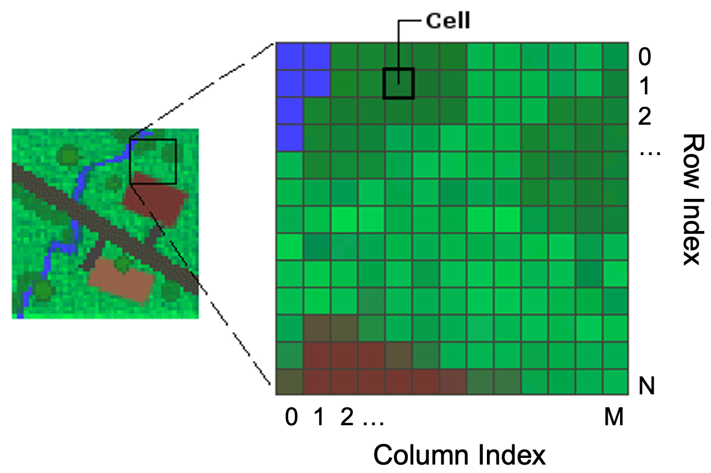

## Të dhënat Raster

  - Një qelizë raster mund të referohet me një indeks dy-dimensional, duke treguar një çift <rresht, kolonë>. Këta        indekse fillojnë nga 0.

  - Çdo vendndodhje e indeksit mund të shoqërohet me një vendndodhje gjeografike (për shembull, qeliza <12,796> mund     të korrespondojë me lon/lat <-0.34521,51.354656>).

## Të dhënat Raster

  - Kur punojmë me të dhëna raster, shpesh kalojmë nga indeksi raster te vendndodhjet gjeografike dhe anasjelltas.

## Të dhënat Raster

  - Nëse një dataset raster përmban më shumë se një matricë, ne i referohemi matricave të ndryshme si banda               (**bands**)
  
  - Bandat numërohen nga 1. 
  
  
## Të dhënat Raster

  - Për shembull, një raster i prodhuar nga një satelit mund të përmbajë 3 banda që përfaqësojnë intensitetin e kuqes,     jeshiles dhe blusë.

## Paketat Python për të dhënat raster

  - Python nuk ka një paketë standarde të vetme që ofron të gjithë funksionalitetin për të punuar me të dhëna raster.

  - Siç është shpesh rasti, në Python ne përdorim një kombinim të paketave shumë të specializuara për të arritur një      qëllim.

## Të dhënat Raster

  - **rasterio**: kjo paketë mund të lexojë dhe shkruajë të dhëna raster (https://rasterio.readthedocs.io).

 - **rasterstats**: kjo paketë ofron funksionalitet për statistikat zonale (https://pythonhosted.org/rasterstats).

 - **gdal**: shumë librari në Python (dhe gjuhë të tjera) mbështeten në këtë bibliotekë të vjetër, por të qëndrueshme,     që ofron qindra funksione gjeohapësinore, duke përfshirë përpunimin vektorial dhe raster (https://gdal.org).

 - **numpy**: kjo paketë suporton operacionet e shpejta në matricat numerike që janë thelbi i përpunimit gjeohapësinor të rasterit.


## Shkarkimi i skedarëve nga web-i

  - Deri tani ne kemi punar me skedare lokalë, por gjithashtu të shkarkojmë skedarë nga web-i.

## Shkarkimi i skedarëve nga web-i

  - Shpesh, setet e mëdha të dhënave ndahen në copa më të vogla dhe shkarkimi i tyre manualisht mund të marrë shumë       kohë.
  
 - Ky funksionalitet gjithashtu mund të përdoret në script dhe për të marrë rezultatet automatikisht.

## Shkarkimi i skedarëve nga web-i

Në këtë shembull, do të shkarkojmë skedarë nga një depo GitHub, duke shkarkuar një skedar raster me paketën. 


## Shkarkimi i skedarëve nga web-i


\AddToHookNext{env/Highlighting/begin}{\scriptsize}

```{python, eval = FALSE}
import urllib.request

# URL to download from
url = 'https://github.com/endri81/instatgis/blob/master/data/gis3/eu-2016-nox_avg.tif?raw=true'

# Local file name where the file will be saved
file_name = 'data/eu-2016-nox_avg.tif'

# Download the file
urllib.request.urlretrieve(url, file_name)

print(f"Downloaded {file_name}")
```

## Hapja dhe ndërtimi i rasterit

  - Ky skedar përmban sasinë mesatare të Nitratit dhe Nitritit (NOx) në Bashkimin Evropian nga                            [https://airindex.eea.europa.eu](https://airindex.eea.europa.eu)

## Hapja dhe ndërtimi i rasterit

  - NOx është një element i rëndësishëm i ndotjes së ajrit. 
  
  - Këto gazra kontribuojnë në smog dhe shi acid dhe mund të ndikojnë në ozonin troposferik.
  
## Hapja dhe ndërtimi i rasterit

  - Të dhënat janë në sistemin gjeografik *ETRS89 Lambert Azimuthal Equal Area*, të përdorura zakonisht për të dhënat     Evropiane
  
  -   Çdo qelizë mbulon afërsisht 2 km


## Librari rasterio

  - **rasterio** është një modul shumë i dobishëm për përpunimin raster, të cilin mund ta përdorni për të lexuar dhe        shkruar disa formate të ndryshme raster në Python. 
  
  - **rasterio** bazohet në GDAL dhe Python regjistron automatikisht të gjithë driverat e njohur GDAL për leximin e        formateve të suportuara gjatë importimit të modulit. 
  
  - Formatet më të zakonshme të skedarëve përfshijnë për shembull skedarët TIFF dhe GeoTIFF, ASCII Grid dhe Erdas         Imagine .img.

  
## Hapja dhe ndërtimi i rasterit

Tani mund të përdorni **rasterio** për të eksploruar përmbajtjen e këtij grupi të të dhënave raster:


\AddToHookNext{env/Highlighting/begin}{\scriptsize}

```{python, eval = FALSE}
import rasterio
import rasterio.plot
# Vini re se kur hapim një file, rasterio nuk e ngarkon atë në memorje.
# Kjo është një qasje e mirë pasi file-at raster mund të jenë shumë të mëdhenj.
nox_rast = rasterio.open('data/eu-2016-nox_avg.tif', mask=True)
```


## Shfaq informacion rreth file-it

\AddToHookNext{env/Highlighting/begin}{\scriptsize}

```{python, eval = FALSE}
print("Numri i bandave:", nox_rast.count)
print("Gjerësia:", nox_rast.width)
print("Gjatësia:", nox_rast.height)
```

## Shfaq informacion rreth file-it

\AddToHookNext{env/Highlighting/begin}{\scriptsize}

```{python, eval = FALSE}
# Të dhënat janë në sistemin koordinativ ETRS89 Lambert Azimuthal Equal Area (EPSG:3035)
print("Sistemi koordinativ (CRS):", nox_rast.crs)
print("Kufijtë:", nox_rast.bounds)
print("Vlera për të dhënat që mungojnë:", nox_rast.nodata)
```


## Shfaq informacion rreth file-it

\AddToHookNext{env/Highlighting/begin}{\scriptsize}

```{python, eval = FALSE}
# Të gjitha metadatat
print(nox_rast.meta)
```


## Funksioni për Vizualizimin e të Dhënave Raster


  - Meqë funksionaliteti i rasterio për vizualizim është mjaft i komplikuar, ne krijojmë një funksion për të             vizualizuar një raster
  
  
## Funksioni për Vizualizimin e të Dhënave Raster

  - Vlerat e parazgjedhura janë (Blues, 10, 10)

\AddToHookNext{env/Highlighting/begin}{\tiny}

```{python, eval = FALSE}
def plot_raster(rast, val_matrix, plot_title, value_label, cmap='Blues', width=10, 
height=10, diverge_zero=False):
    """Vizualizon një raster
        @ rast: file i rasterio (përdoret për të lexuar koordinatat gjeografike)
        @ val_matrix: vlera të nxjerra (përdoren për të lexuar vlerat e rasterit)
        @ plot_title: titulli i gjithë figurës
        @ value_label: sasia që po shfaqet
        @ cmap colormap zgjedh ngjyrat
        @ diverge_zero: e vërtetë nëse përdoret një cmap i ndryshëm për të vendosur hartën e ngjyrave në zero
    """
    fig, ax = plt.subplots(figsize=(width,height))
    # image_hidden është një hile për të treguar legjendën
    if diverge_zero:
        image_hidden = ax.imshow(val_matrix, cmap=cmap, norm=TwoSlopeNorm(0))
    else:
        image_hidden = ax.imshow(val_matrix, cmap=cmap)
    ax.clear()
```


## Funksioni për Vizualizimin e të Dhënave Raster

  - Vazhdimi i funksionit

\AddToHookNext{env/Highlighting/begin}{\tiny}   

```{python, eval = FALSE}
    # vizualizo rasterin: rast.transform lejon sistemin të tregojë koordinatat gjeografike
    if diverge_zero:
        rast_plot = rasterio.plot.show(val_matrix, cmap=cmap, ax=ax, transform=rast.transform, 
        norm=TwoSlopeNorm(0))
    else: 
        rast_plot = rasterio.plot.show(val_matrix, cmap=cmap, ax=ax, transform=rast.transform)
    # vendos titullin e figurës
    ax.set_title(plot_title, fontsize=14)
    # shfaq legjendën me etiketën
    # hile për të rregulluar lartësinë
    im_ratio = val_matrix.shape[0]/val_matrix.shape[1] 
    cbar = fig.colorbar(image_hidden, ax=ax, fraction=0.046*im_ratio, pad=0.04)
    cbar.ax.set_ylabel(value_label, rotation=270)
    cbar.ax.get_yaxis().labelpad = 15
    plt.show()
```


## Përdorim funksionin


\AddToHookNext{env/Highlighting/begin}{\tiny}   

```{python, eval = FALSE}
# lexoni brezin dhe vizualizoni atë me ngjyra të rreme.
# Vini re se duhet të lexojmë brezin me .read(1) (sepse rasterio nuk e ngarkon atë).
# Figura tregon numrin e qelizave dhe jo koordinatat gjeografike përkatëse.

# masked=True është shumë e rëndësishme për t'i thënë rasterio-s të injorojë vlerat NULL (në këtë rast
# qelizat për të cilat nuk kemi vlera të NOx).
plot_raster(nox_rast, nox_rast.read(1, masked=True), 
            'Përqendrimi mesatar i NOx (2 km katrorë qeliza, 2016)', 
            'NOx mikrogram për m3', cmap='Reds', width=14, height=14)

```


## Përdorim funksionin


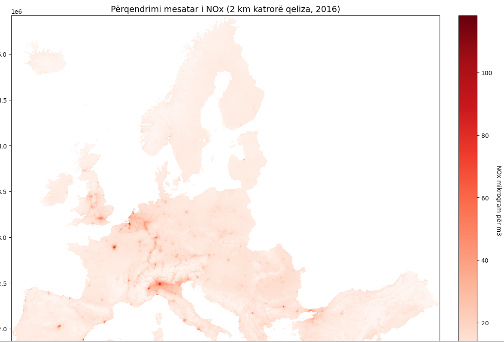


## Të dhënat Raster

  - Një operacion bazë me raster është të lexosh vlerën në një pikë të caktuar.

  - Rasteri përfaqëson përqendrimin mesatar vjetor të NOx në 2016, matur në mikrogramë për çdo metër kub të ajrit (/m³).

## Të dhënat Raster

\AddToHookNext{env/Highlighting/begin}{\tiny}   

```{python, eval = FALSE}
# një pikë në Paris (në projekcionin Lambert)
paris_centroid_lamb = [3758948, 2889291]
```


## Të dhënat Raster

\AddToHookNext{env/Highlighting/begin}{\tiny}   

```{python, eval = FALSE}
# Merrni rreshtin/kolonën në raster që korrespondon me vendndodhjen gjeografike paris_centroid_lamb
loc_idx = nox_rast.index(paris_centroid_lamb[0], paris_centroid_lamb[1])
print("Vendndodhja e qelizës në raster:", loc_idx)
```


## Të dhënat Raster

\AddToHookNext{env/Highlighting/begin}{\tiny}   

```{python, eval = FALSE}
# lexoni vlerën
nox_val = nox_rast.read(1)[loc_idx]
print("Vlera e NOx në Paris:", nox_val)
```


## Histogrami i Rasterit

  - Si gjithmonë, është e rëndësishme të vëzhgoni shpërndarjen e vlerave me një histogram.

  - Vini re se kufiri i rekomanduar NOx për BE është 40. 
  
  - Për fat të mirë, shumica e zonave shfaqen nën atë kufi, por është e mundur të vëzhgohen disa qeliza me vlera shumë të larta.


## Histogrami i Rasterit

\AddToHookNext{env/Highlighting/begin}{\tiny}   

```{python, eval = FALSE}
from rasterio.plot import show_hist

# Shfaq histogramin e vlerave të rasterit
show_hist(nox_rast, bins=20, lw=0.0, stacked=False, alpha=0.3, label='Nr. i qelizave',
    histtype='stepfilled', title="Vlerat e NOx në BE (2016)")
```    


## Riklasifikimi i Rasterit

  - Në brendësi, një grup të dhënash raster në Python është një objekt i tipit **numpy.ndarray**, nga paketa              **numpy**.
  
## Riklasifikimi i Rasterit  

  - Kemi të bëjmë me një **masiv** shumëdimensional, i cili është një mënyrë intuitive për të përfaqësuar grupet e të     dhënave raster me shumë banda.

## Riklasifikimi i Rasterit

  - Kjo strukturë e fuqishme e të dhënave përdoret shumë për llogaritje shkencore sepse supporton operacione të           shpejta në rreshta dhe kolona.

  - Për shembull, ne mund të numërojmë dhe tregojmë zona me NOx > 40.

## Riklasifikimi i Rasterit

  - **Riklasifikimi** i një rasteri është një operacion i zakonshëm ku prodhohet një raster i ri bazuar në një            klasifikim:


## Riklasifikimi i Rasterit

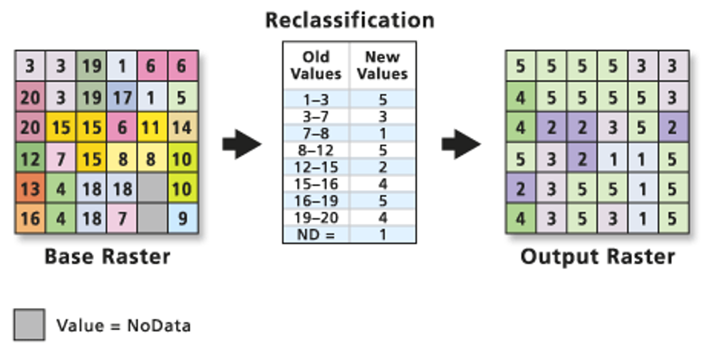
## Riklasifikimi i Rasterit

Për NOx, po riklasifikojmë rasterin sipas kategorive:

  - [0, 20): low (cat = 1)

  - [20, 40): medium (cat = 2)

  - [40, 60): high (cat = 3)

- [60, ): critical (cat = 4)


## Histogrami i Rasterit

\AddToHookNext{env/Highlighting/begin}{\tiny}   

```{python, eval = FALSE}
# Merr matricën me vlerat e rasterit
vals = nox_rast.read(1, masked=True)
print(type(vals))
print("Madhësia e matricës:", vals.shape)  # x y
```


## Histogrami i Rasterit

\AddToHookNext{env/Highlighting/begin}{\tiny}   

```{python, eval = FALSE}
# Zgjidhni vetëm vlerat > 40
high_vals = vals[vals > 40]
print(len(high_vals), 'qeliza kanë vlera të larta të NOx (>40 mikrogram/m³).')
print('% e totalit të qelizave:', (len(high_vals) / (vals.shape[0] * vals.shape[1])) * 100)
```

## Histogrami i Rasterit

\AddToHookNext{env/Highlighting/begin}{\tiny}   

```{python, eval = FALSE}
# Riklasifikimi:
# Kopjoni matricën për të ruajtur të dhënat origjinale
recl_vals = vals.copy()
```


## Histogrami i Rasterit

\AddToHookNext{env/Highlighting/begin}{\tiny}   

```{python, eval = FALSE}
# Zbato klasifikimin e ri (4 = vlera shumë të larta)
# Vini re se renditja e këtyre veprimeve është e rëndësishme për të realizuar një
# riklasifikim të saktë.
recl_vals[vals > 0] = 4
# nëse vals < 60 vendos vlerën në 3
recl_vals[vals < 60] = 3
# nëse vals < 40 vendos vlerën në 2
recl_vals[vals < 40] = 2
# nëse vals < 20 vendos vlerën në 1
recl_vals[vals < 20] = 1

# Shfaq rezultatin
plot_raster(nox_rast, recl_vals, 'Përqendrimi mesatar i NOx (2 km² qeliza, 2016)', 
    'Kategoritë e përqendrimit të NOx (4=max)', cmap='Blues', width=14, height=14)

```


## Libraria xarray


  - **xarray** është një bibliotekë në Python e specializuar për analizën dhe manipulimin e të dhënave                    shumë-dimensionale (në stilin e Pandas), e përshtatshme për dataset-e të mëdha, si p.sh., të dhënat klimatike apo     ato të analizës së rastereve. 
  
   - Ofron support të plotë për struktura të avancuara të të dhënave dhe sisteme të ndryshme koordinative, duke lejuar     qasje të lehtë dhe efikase në analiza dhe vizualizim të avancuar.


## Libraria xarray

  - **rioxarray** është një bibliotekë Python që zgjeron funksionalitetin e **xarray** për të suportuar të dhëna          gjeohapësinore, duke lejuar leximin, manipulimin dhe analizimin e të dhënave raster me lehtësi. 
  
  - Ajo integron kapacitetet e **rasterio** në kornizën fleksibël të **xarray**, duke e bërë punën me të dhënat gjeohapësinore më të fuqishme dhe efikase.


## Instalim

```{python, eval = FALSE}
conda install rioxarray
```

## Shembull

  - Bandat **Landsat 8** ruhen si skedarë të veçantë GeoTIFF në paketën origjinale. 
  
  - Çdo brez përmban informacion të reflektimit të sipërfaqes nga diapazon të ndryshëm të spektrit elektromagnetik.


## Shkarkimi i të Dhënave

\AddToHookNext{env/Highlighting/begin}{\tiny}   

```{python, eval = FALSE}
import rioxarray
import matplotlib.pyplot as plt

# Hapni skedarin raster duke përdorur rioxarray
url = "https://a3s.fi/swift/v1/AUTH_0914d8aff9684df589041a759b549fc2/PythonGIS/elevation/kilimanjaro/ASTGTMV003_S03E036_dem.tif"
data = rioxarray.open_rasterio(url, masked=True)
```


## Vizualizoni


\AddToHookNext{env/Highlighting/begin}{\tiny}   

```{python, eval = FALSE}
data.plot()
plt.title("Elevacioni i Kilimanjaros")
plt.show()
```


## Vizualizoni

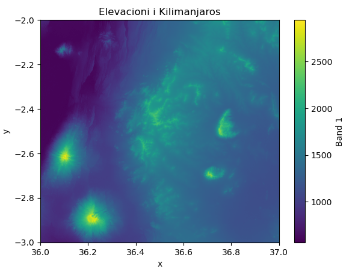


## Hapja e File-it Raster

\AddToHookNext{env/Highlighting/begin}{\tiny}   

```{python, eval = FALSE}
import rasterio
import os
import numpy as np

# Direktoria e të dhënave
data_dir = "data/gis3"
fp = os.path.join(data_dir, "Helsinki_masked_p188r018_7t20020529_z34__LV-FIN.tif")

# Hapni file-in
raster = rasterio.open(fp)
```


## Kontrolloni llojin e variablit 'raster'

\AddToHookNext{env/Highlighting/begin}{\tiny}   

```{python, eval = FALSE}
type(raster)
```

## Leximi i Karakteristikave të File-it Raster


\AddToHookNext{env/Highlighting/begin}{\tiny}   

```{python, eval = FALSE}
# Projeksioni
raster.crs
```


## Transformimi affine (si rregullohet, rrotullohet, apo zhvendoset rasteri)

\AddToHookNext{env/Highlighting/begin}{\tiny}   

```{python, eval = FALSE}
raster.transform
```


## Dimensionet

\AddToHookNext{env/Highlighting/begin}{\tiny}   

```{python, eval = FALSE}
print(raster.width)
print(raster.height)
```

## Numri i bandave

\AddToHookNext{env/Highlighting/begin}{\tiny}   

```{python, eval = FALSE}
# Numri i bandave
raster.count
```


## Kufijtë e file-it

\AddToHookNext{env/Highlighting/begin}{\tiny}   

```{python, eval = FALSE}
raster.bounds
```


## Driver-i (formati i të dhënave)

\AddToHookNext{env/Highlighting/begin}{\tiny}   

```{python, eval = FALSE}
raster.driver
```


## Vlerat pa të dhëna për të gjitha kanalet

\AddToHookNext{env/Highlighting/begin}{\tiny}   

```{python, eval = FALSE}
raster.nodatavals
```


## Të gjitha Meta të Dhënat për dataset-in e rasterit

\AddToHookNext{env/Highlighting/begin}{\tiny}   

```{python, eval = FALSE}
raster.meta
```

## Marrja e Brezeve të Rasterit

\AddToHookNext{env/Highlighting/begin}{\tiny}

```{python, eval = FALSE}

# Lexoni brezrin e rasterit si variabël të veçantë
band1 = raster.read(1)
```


## Kontrolloni llojin e variablit 'band'

\AddToHookNext{env/Highlighting/begin}{\tiny}   

```{python, eval = FALSE}
print(type(band1))

# Lloji i të dhënave të vlerave
print(band1.dtype)
```


## Statistikat e Brezit


\AddToHookNext{env/Highlighting/begin}{\tiny}   

```{python, eval = FALSE}
# Lexoni të gjithë brezin
array = raster.read()
```


## Llogarisni statistikat për çdo brez


\AddToHookNext{env/Highlighting/begin}{\tiny}   

```{python, eval = FALSE}
stats = []
for band in array:
    stats.append(
        {
            "min": band.min(),
            "mean": band.mean(),
            "median": np.median(band),
            "max": band.max(),
        }
    )
```


## Shfaqni statistikat për çdo kanal


\AddToHookNext{env/Highlighting/begin}{\tiny}   

```{python, eval = FALSE}
stats
```


## Krijimi i një Mozaiku Raster

  - Shumë shpesh ju duhet të bashkoni së bashku skedarë të shumtë raster dhe të krijoni një mozaik raster **raster        mosaic**. 
  
  
  - Kjo mund të bëhet lehtësisht me funksionin **merge_datasets()** -në **rioxarray**. 
  
  - Këtu, ne do të krijojmë një mozaik bazuar në skedarët **DEM** (gjithsej 4 skedarë) që mbulojnë rajonin e              Kilimanjaros në Tanzani. 
  
## Krijimi i një Mozaiku Raster

  Së pari do të lexojmë të dhënat e lartësisë nga një kovë S3 për rajonin e Kilimanxharos në Afrikë.


\AddToHookNext{env/Highlighting/begin}{\tiny}   

```{python, eval = FALSE}
import xarray as xr
import os
import rioxarray as rxr
from rioxarray.merge import merge_datasets

# S3 bucket që përmban të dhënat
bucket = "https://a3s.fi/swift/v1/AUTH_0914d8aff9684df589041a759b549fc2/PythonGIS"

# Gjeneroni URL-të për skedarët e lartësisë
urls = [
    os.path.join(bucket, "elevation/kilimanjaro/ASTGTMV003_S03E036_dem.tif"),
    os.path.join(bucket, "elevation/kilimanjaro/ASTGTMV003_S03E037_dem.tif"),
    os.path.join(bucket, "elevation/kilimanjaro/ASTGTMV003_S04E036_dem.tif"),
    os.path.join(bucket, "elevation/kilimanjaro/ASTGTMV003_S04E037_dem.tif"),
]
```


## Krijimi i një Mozaiku Raster

\AddToHookNext{env/Highlighting/begin}{\tiny}   

```{python, eval = FALSE}
# Lexoni skedarët
datasets = [
    xr.open_dataset(url, engine="rasterio").squeeze("band", drop=True) for url in urls
]
```

## Vizualizimi i Pllakave (Tiles)

Shohim fillimisht si duken të dhënat:

```{python, eval = FALSE}
datasets[0]
```

## Vizualizimi i Pllakave (Tiles)

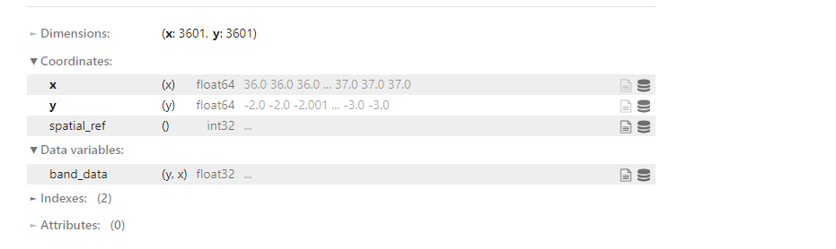

## Vizualizimi i Pllakave (Tiles)

\AddToHookNext{env/Highlighting/begin}{\tiny}   

```{python, eval = FALSE}
import matplotlib.pyplot as plt

# Vizualizoni dërrasat për të parë se si duken veç e veç
fig, axes = plt.subplots(2, 2, figsize=(16, 16))
datasets[0]["band_data"].plot(ax=axes[0][0], vmax=5900, add_colorbar=False)
datasets[1]["band_data"].plot(ax=axes[0][1], vmax=5900, add_colorbar=False)
datasets[2]["band_data"].plot(ax=axes[1][0], vmax=5900, add_colorbar=False)
datasets[3]["band_data"].plot(ax=axes[1][1], vmax=5900, add_colorbar=False)
```


## Vizualizimi i Pllakave (Tiles)


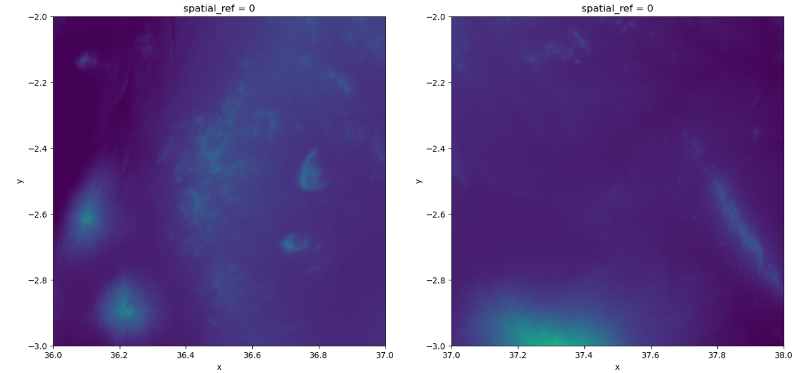


## Krijimi i Mozaikut Raster

  - Siç mund ta shohim ne kemi skedarë të shumtë raster të veçantë që ndodhen pranë njëri-tjetrit. 
  
  - Prandaj, ne duam t'i bashkojmë ato në një skedar të vetëm raster që mund të bëhet duke krijuar një mozaik raster.
  
  - Mund të krijojmë një mozaik raster duke bashkuar këto grupe të dhënash me funksionin **merge_datasets()**:


## Krijimi i Mozaikut Raster

\AddToHookNext{env/Highlighting/begin}{\tiny}   

```{python, eval = FALSE}
# Krijoni një mozaik nga dërrasat
mosaic = merge_datasets(datasets)

# Shtoni një emër më intuitiv për variablin e të dhënave
mosaic = mosaic.rename({"band_data": "elevation"})
```


## Vizualizoni mozaikun


\AddToHookNext{env/Highlighting/begin}{\tiny}   

```{python, eval = FALSE}
mosaic["elevation"].plot(figsize=(12, 12))
```

## Vizualizoni mozaikun

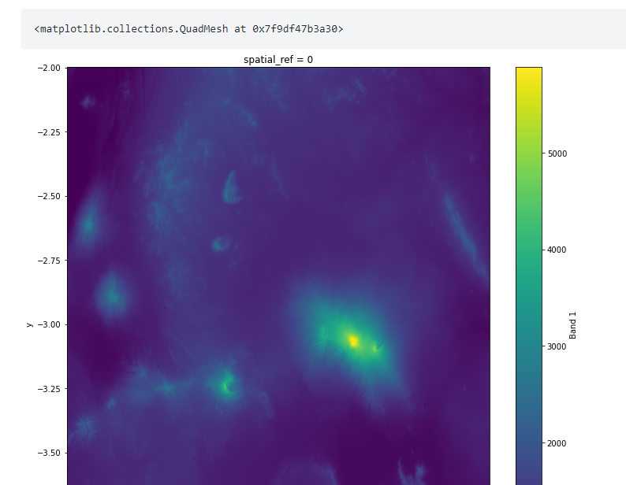

## Prerja e Rasterit


\AddToHookNext{env/Highlighting/begin}{\tiny}   

```{python, eval = FALSE}
import geopandas as gpd
from shapely.geometry import box

# Koordinatat e kutisë kufizuese
minx = 37.1
miny = -3.3
maxx = 37.6
maxy = -2.85
```


## Prerja e Rasterit

\AddToHookNext{env/Highlighting/begin}{\tiny}   

```{python, eval = FALSE}
# Krijoni një GeoDataFrame që do të përdoret për të prerë rasterin
geom = box(minx, miny, maxx, maxy)
clipping_gdf = gpd.GeoDataFrame({"geometry": [geom]}, index=[0], crs="epsg:4326")
```


## Prerja e Rasterit

\AddToHookNext{env/Highlighting/begin}{\tiny}   

```{python, eval = FALSE}
# Eksploroni shtrirjen në hartë
clipping_gdf.explore()
```


## Prerja e Rasterit

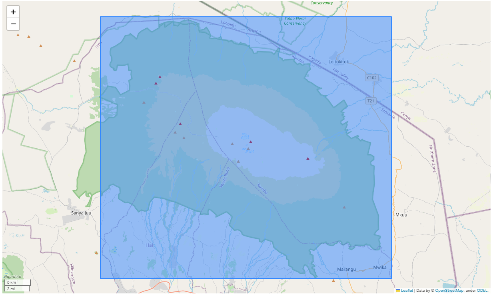


## Prerja e Mozaikut me GeoDataFrame


\AddToHookNext{env/Highlighting/begin}{\tiny}   

```{python, eval = FALSE}
# Priteni mozaikun me GeoDataFrame dhe specifikoni CRS
kilimanjaro = mosaic.rio.clip(clipping_gdf.geometry, crs=mosaic.elevation.rio.crs)
kilimanjaro["elevation"].plot()
```


## Prerja e Mozaikut me GeoDataFrame


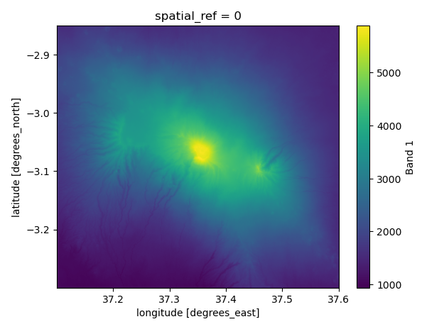

## Ruajtja e Rasterit në një GeoTIFF


\AddToHookNext{env/Highlighting/begin}{\tiny}   


```{python, eval = FALSE}
# Ruani file-in në GeoTIFF
kilimanjaro.rio.to_raster("data/kilimanjaro.tif", compress="LZMA", tiled=True)
```


# Analiza e Modeleve Dixhitale të Lartësisë (DEM)

## Shkarkimi i Skedarit DEM

  - **DEM** janë një lloj i zakonshëm i rasterit që përfaqëson lartësinë.

  - Ky grup të dhënash përfaqëson lartësinë e Himalajeve në një rezolucion prej 1 km


## Shkarkimi i Skedarit DEM

\AddToHookNext{env/Highlighting/begin}{\tiny}   


```{python, eval = FALSE}
import urllib.request

# Shkarkoni file-in nga 'url' dhe ruajeni lokalisht nën 'file_name'
url = 'https://github.com/andrea-ballatore/open-geo-data-education/blob/main/datasets/digital_elevation_models/dem_srtm_1km_himalayas_2009.tif?raw=true'
rast_file_name = 'data/dem_srtm_1km_himalayas_2009.tif'
urllib.request.urlretrieve(url, rast_file_name)
```


## Hapja dhe Vizualizimi i DEM

\AddToHookNext{env/Highlighting/begin}{\tiny}   


```{python, eval = FALSE}
import rasterio

# Hapni file-in DEM duke përdorur rasterio
him_rast = rasterio.open('data/dem_srtm_1km_himalayas_2009.tif')
```


## Hapja dhe Vizualizimi i DEM

\AddToHookNext{env/Highlighting/begin}{\tiny}   


```{python, eval = FALSE}
# Shfaqni informacionin e file-it
print(him_rast.meta)
print(him_rast.bounds)
```

## Shfaqja e Vlerave të DEM

\AddToHookNext{env/Highlighting/begin}{\tiny}   


```{python, eval = FALSE}
# Vini re se duhet të lexojmë një brez (sepse rasterio nuk e ngarkon atë)
vals = him_rast.read(1, masked=True)
```


## Shfaqni statistika bazë

\AddToHookNext{env/Highlighting/begin}{\tiny}   


```{python, eval = FALSE}
print("Vlera minimale (m):", vals.min())
# vini re se për median përdorim np.median
print("Vlera mesatare (m):", np.median(vals))
print("Vlera maksimale (m):", vals.max())
```


## Ndërtojmë


\AddToHookNext{env/Highlighting/begin}{\tiny}   


```{python, eval = FALSE}
plot_raster(him_rast, vals, 'Himalaya DEM (rezolucion 1km, 2009)', 'Elevation (m)')
```


## Ndërtojmë

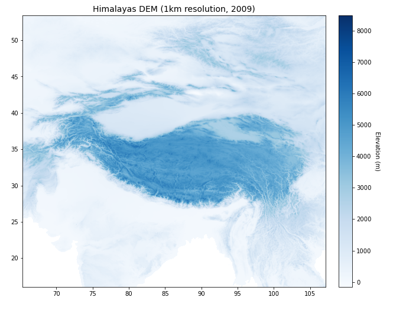

# Operacione DEM me GDAL

## Operacione DEM me GDAL

- GDAL mund të përdoret për të kryer operacione të thjeshta në DEM pa i ngarkuar ato tërësisht në memorje.

- `gdal.DEMProcessing(...)` mbështet operacione të zakonshme si aspekti, pjerrësia dhe hijezimi i kodrës.

## Përgatitja e Mjedisit

\AddToHookNext{env/Highlighting/begin}{\tiny}   


```{python, eval = FALSE}
# Importoni paketën GDAL dhe rasterio
from osgeo import gdal
import rasterio
import os

# Sigurohuni që drejtoria e daljes ekziston
os.makedirs('tmp', exist_ok=True)

# Specifikoni skedarin hyrës të DEM
input_raster = 'data/dem_srtm_1km_himalayas_2009.tif'
```


## Përgatitja e Mjedisit

\AddToHookNext{env/Highlighting/begin}{\tiny}   


```{python, eval = FALSE}
# Shfaqni ndihmën për funksionin DEMProcessing
help(gdal.DEMProcessing)
```


## Llogaritja e Aspektit

\AddToHookNext{env/Highlighting/begin}{\tiny}   


```{python, eval = FALSE}
# Llogaritni aspektin duke përdorur GDAL
out_raster = 'tmp/dem_srtm_1km_himalayas_2009_aspect.tif'
out = gdal.DEMProcessing(out_raster, input_raster, 'aspect')
```


## Llogaritja e Aspektit

\AddToHookNext{env/Highlighting/begin}{\tiny}   


```{python, eval = FALSE}
# Sigurohuni që file-i të shkruhet
out.FlushCache()
aspect_rast = rasterio.open(out_raster).read(1, masked=True)
print("Gama e aspektit: ", aspect_rast.min(), aspect_rast.max())
```


## Llogaritja e Aspektit

\AddToHookNext{env/Highlighting/begin}{\tiny}   


```{python, eval = FALSE}
# Vizualizoni aspektin e Himalajave
plot_raster(rasterio.open(out_raster), aspect_rast, 
            'Aspekti i Himalajave (rezolucion 1 km, 2009)', 
            'Aspekti (gradë)', cmap="Spectral", width=3)
```


## Ndërtojmë

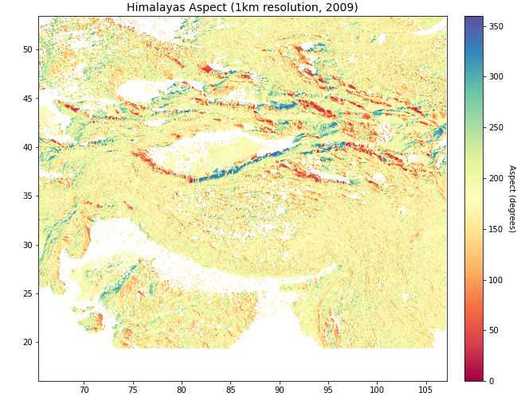


## Ndërtojmë


\AddToHookNext{env/Highlighting/begin}{\tiny}   


```{python, eval = FALSE}
# llogarisim hillshade
out_raster = 'tmp/dem_srtm_1km_himalayas_2009_hillshade.tif'
out = gdal.DEMProcessing(out_raster, input_raster, 'hillshade')
```

## Ndërtojmë


\AddToHookNext{env/Highlighting/begin}{\tiny}  

```{python, eval = FALSE}
# sigurohemi që skedari u shkrua
out.FlushCache()
# out_raster duhet të ekzistojë
hillshade_rast = rasterio.open(out_raster).read(1, masked=True)
print("diapazoni i hillshade (në gradë):",hillshade_rast.min(),hillshade_rast.max())
```


## Ndërtojmë


\AddToHookNext{env/Highlighting/begin}{\tiny}  

```{python, eval = FALSE}
plot_raster(rasterio.open(out_raster), hillshade_rast, 
            'Himalayas Hillshade (rezolucioni 1km, 2009)',
            'Hillshade (degrees)', cmap="Greys", width=3)
```


## Ndërtojmë

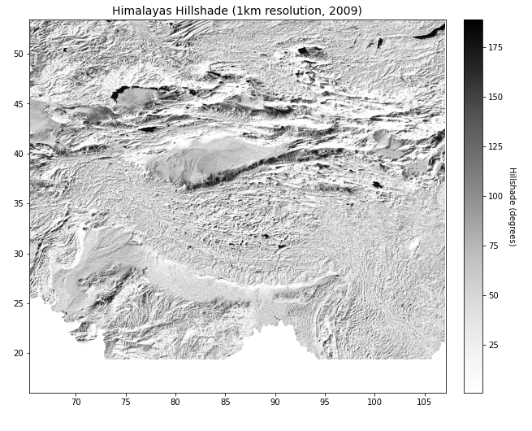

