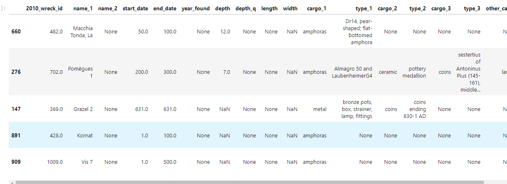
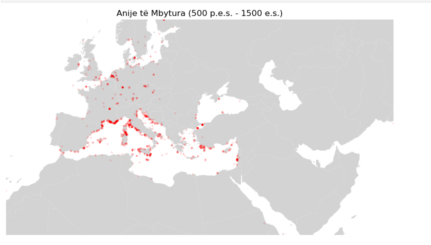
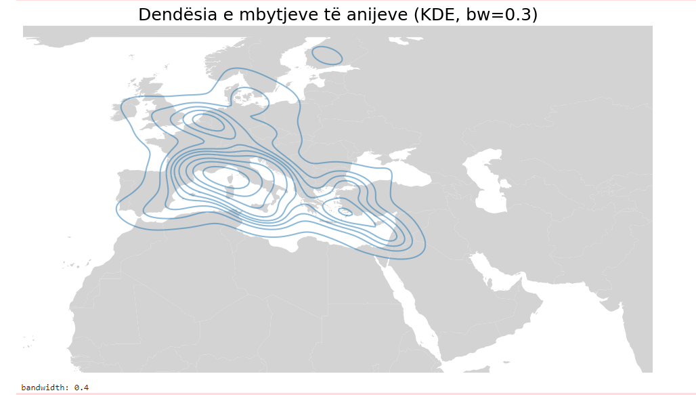
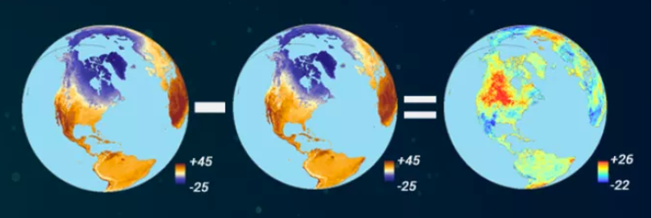
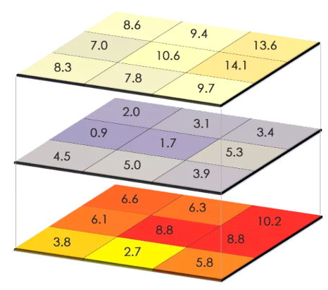
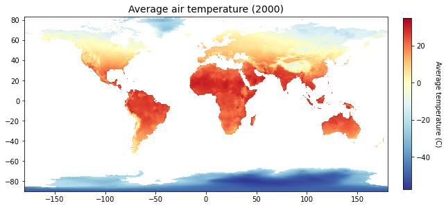
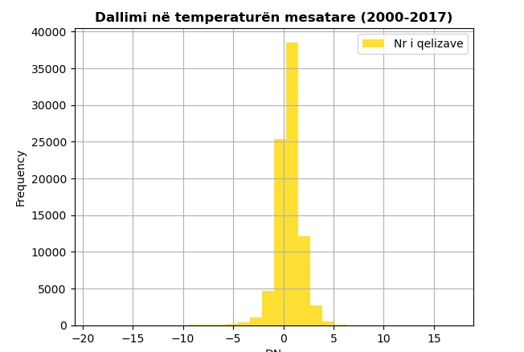

```{r setup, include=FALSE}
    library(knitr)
    library(tidyverse)
knitr::opts_chunk$set(
comment=NA,
error=F, 
warning=F,
tidy=TRUE, 
fig.align = 'center',
message=F, 
warning=F,
tidy.opts=list(width.cutoff=60),
fig.width=4, 
fig.height=4, 
fig.path='Figs/')
```

# Të dhënat Raster (vazhdim)

## Analiza e Pikave dhe Vlerësimi i Dendësisë së Kernelit (KDE)

\AddToHookNext{env/Highlighting/begin}{\tiny}   


```{python, eval = FALSE}
import urllib.request

# Shkarkoni të dhënat e anijeve të mbytura historike
url_shipwrecks = 'https://github.com/endri81/instatgis/blob/master/data/gis4/darmc_historical_shipwrecks_500bce_1500ce.geojson?raw=true'
file_name_shipwrecks = 'data/darmc_historical_shipwrecks_500bce_1500ce.geojson'
urllib.request.urlretrieve(url_shipwrecks, file_name_shipwrecks)

# Shkarkoni gjithashtu kufijtë e vendeve
url_boundaries = 'https://github.com/endri81/instatgis/blob/master/data/gis4/natural_earth_world_boundaries_50m_2018.geojson?raw=true'
file_name_boundaries = 'data/natural_earth_world_boundaries_50m_2018.geojson'
urllib.request.urlretrieve(url_boundaries, file_name_boundaries)

```


## Ngarkimi dhe Projekti i Dataset-eve


\AddToHookNext{env/Highlighting/begin}{\tiny}   


```{python, eval = FALSE}
import geopandas as gpd

# Ngarkoni dataset-in dhe projektoni në 3035 (Lambert, i përshtatshëm për Evropën)
ship_df = gpd.read_file('data/darmc_historical_shipwrecks_500bce_1500ce.geojson').to_crs(3035)
countries_df = gpd.read_file('data/natural_earth_world_boundaries_50m_2018.geojson').to_crs(3035)
```


## Shfaqni një shembull të të dhënave


\AddToHookNext{env/Highlighting/begin}{\tiny}   


```{python, eval = FALSE}
ship_df.sample(5)
```

## Shfaqni një shembull të të dhënave




## Vizualizimi i Pikave


\AddToHookNext{env/Highlighting/begin}{\tiny}   


```{python, eval = FALSE}
import geoplot
import matplotlib.pyplot as plt

# Përkufizoni kanavacën
f, ax = plt.subplots(figsize=(10,7))

# Vizualizoni dy shtresa
countries_df.plot(ax=ax, color='lightgray', edgecolor="none", linewidth=.5)
geoplot.pointplot(ship_df, s=2, color='red', ax=ax, alpha=.1)

# Vendosni kufijtë e hartës
# Krijoni një buffer për të shtuar një margjinë
buff = ship_df.buffer(1)
xlim = ([buff.total_bounds[0], buff.total_bounds[2]])
ylim = ([buff.total_bounds[1], buff.total_bounds[3]])
ax.set_xlim(xlim)
ax.set_ylim(ylim)

# Vendosni titullin e hartës
ax.set_title('Anije të Mbytura (500 p.e.s. - 1500 e.s.)')

# Shfaqni rezultatet
plt.show()
```


## Vizualizimi i Pikave




## Histogram 2D

  - Një mënyrë më e mirë për të përfaqësuar një densitet hapësinor është një histogram dy-dimensional (hist2d), i        njohur gjithashtu si një grafik rrjeti.

## Histogram 2D

  - Vini re se një nga avantazhet e Python është mundësia e ndryshimit të parametrave të një funksioni përmes një         cikli for (për shembull, numri i shtyllave në një histogram) dhe krahasimi i rezultateve.

## Histogram 2D


\AddToHookNext{env/Highlighting/begin}{\tiny}   


```{python, eval = FALSE}
# riprojektojmë në lon/lat për të pasur koordinata më të interpretueshme
ship_df = ship_df.to_crs(4326)

# le të luajmë me numrin e bins:
for bin_n in [10,20,30,40]:
    print("bin_n",bin_n)
    h = plt.hist2d(ship_df.geometry.x, ship_df.geometry.y, bins=bin_n, density=False)
    plt.colorbar(h[3])
    plt.title('2D histograma e anijeve (bins='+str(bin_n)+")")
    plt.show()
```


## Histogram 2D

  Këto grafikë tregojnë praninë e një zone me densitet jashtëzakonisht të lartë midis Francës, Korsikës dhe Italisë:


## Grafiku KDE

  - Një qasje më shkencore është vlerësimi i densitetit të bërthamës (KDE). 
  
  - **geoplot.kdeplot(...)** mund të vizatojë një KDE duke u nisur nga të dhënat e pikës.
  
## Grafiku KDE

  - Një parametër vendimtar është **bandwidth** (bw), që është pragu i distancës që përdoret për të prodhuar                 sipërfaqen (distancat më të shkurtra rezultojnë në një sipërfaqe më të detajuar):


## Grafiku KDE


\AddToHookNext{env/Highlighting/begin}{\tiny}   


```{python, eval = FALSE}
# transformojmë në lon/lat
ship_df_ll = ship_df.to_crs(4326)

# gjenerojmë KDE me bandwidth të ndryshëm
for bandwidth in [.1, .2, .3, .4]:
    print("bandwidth:",bandwidth)
    # konturet e KDE
    ax = geoplot.kdeplot(ship_df_ll, shade=False, bw=bandwidth, figsize=(12, 12), alpha=.5)
    # shtojmë vijën bregdetare
    countries_df.to_crs(4326).plot(ax=ax, color='lightgray', edgecolor="none", linewidth=.5)
    # shtojmë titull
    plt.title('Dendësia e mbytjeve të anijeve (KDE, bw='+str(bandwidth)+")", fontsize=18)
    # figura
    plt.show()
```


## Grafiku KDE




## Analiza e të dhënave

  - Këta grafikë KDE tregojnë se dataset-i ka një përqendrim shumë të lartë të pikave në Detin Mesdhe, midis Francës      Jugore, Korsikës dhe Bregut Perëndimor të Italisë. 
  
  - Në të gjitha grafikët, kjo qendër graviteti shfaqet qartë.

## Analiza e të dhënave

  - Në aspektin shkencor, kjo mund të tregojë se kishte shumë më tepër mbytje anijesh aty se gjetkë, ose (më e            mundshme) që të dhënat historike janë më të pasura dhe më të hollësishme për atë zonë.
  

# Algjebra e Hartave

## Algjebra e Hartave

  - Termi "algjebra e hartave" i referohet idesë së aplikimit të operacioneve algjebrike në dataset-e raster.

  - Për shembull, mund të dëshirojmë të zbresim nga njëri- tjetri dy rastera të temperaturës të kapur në kohë të          ndryshme për të vëzhguar ndryshimin e temperaturës:
  
## Algjebra e Hartave  



## Algjebra e Hartave

Në praktikë, ky është një operacion aritmetik i aplikuar në çdo qelizë të të dy raster-ve:



## Algjebra e hartave në Python

  - Kur aksesojmë raster me **rasterio** ose **gdal**, ne mund të kryejmë çdo lloj llogaritjeje algjebrike lineare mbi     të dhënat duke përdorur **numpy, scipy** dhe shumë paketa të tjera të fuqishme të Python. 
  
  - Statistikat zonale suportohen në librarinë **rasterstats**.


## Algjebra e hartave në Python

  - Kjo është arsyeja kryesore pse Python përdoret gjerësisht në komunitetet e remote sensing, machine learning, dhe      AI. 
  
  
## Ngarkoni të dhënat e temperaturës

  - Si një shembull, le të shkarkojmë dhe vizualizojmë dy datasete raster që përfaqësojnë temperaturën mesatare në        vitin 2000 dhe 2017.

## Ngarkoni të dhënat e temperaturës

\AddToHookNext{env/Highlighting/begin}{\tiny}   


```{python, eval = FALSE}
import urllib.request

# Define new URLs and file names
url_2000 = "https://github.com/endri81/instatgis/blob/master/data/gis4/air_temp_2000-average.tif?raw=true"
url_2017 = "https://github.com/endri81/instatgis/blob/master/data/gis4/air_temp_2017-average.tif?raw=true"
file_name_2000 = 'data/air_temp_2000-average.tif'
file_name_2017 = 'data/air_temp_2017-average.tif'

# Download the files
urllib.request.urlretrieve(url_2000, file_name_2000)
urllib.request.urlretrieve(url_2017, file_name_2017)

```


## Ngarkoni të dhënat e temperaturës

\AddToHookNext{env/Highlighting/begin}{\tiny}   


```{python, eval = FALSE}
temp00 = rasterio.open('data/air_temp_2000-average.tif')
print(temp00.meta)
temp17 = rasterio.open('data/air_temp_2017-average.tif')
print(temp17.meta)
```


## Ngarkoni të dhënat e temperaturës

\AddToHookNext{env/Highlighting/begin}{\tiny}   


```{python, eval = FALSE}
import matplotlib.pyplot as plt
import rasterio
from matplotlib.colors import TwoSlopeNorm
# Vini re diverge_zero: kjo përdoret sepse temperatura në Celsius mund të vizualizohet si diverguese nga zero
plot_raster(temp00, temp00.read(1, masked=True), 'Temperatura mesatare e ajrit (2000)', 'Temperatura mesatare (C)', 
    'RdYlBu_r', diverge_zero=True)
plot_raster(temp17, temp17.read(1, masked=True), 'Temperatura mesatare e ajrit (2017)', 'Temperatura mesatare (C)', 
    'RdYlBu_r', diverge_zero=True)
```


## Ngarkoni të dhënat e temperaturës




## Krahasimi i të dhënave raster

  - Vizualisht, nuk është e mundur të dallohen ndryshimet midis të dhënave të vitit 2000 dhe atyre të vitit 2017.

  - Prandaj, do të zbresim dy rasterat e temperaturës, duke përdorur Algjebrën e Hartave. 
  
## Krahasimi i të dhënave raster  
  
  - Në praktikë, Python lejon të bëhet kjo në mënyrë intuitive si **raster_vals2 - raster_vals1**. 
  
  - Këto janë operacione algjebrike lineare të aplikuara në çdo qelizë të matricave.


## Krahasimi i të dhënave raster

  - Pastaj do të ndërtojmë një histogram të vlerave dhe raster-it, duke treguar se temperaturat mesatare janë më të       larta me 0.5 gradë, me disa raste ekstreme pozitive dhe negative që mund të shkaktohen nga gabimet e sensorëve.


## Krahasimi i të dhënave raster

Rezultati do të ruhet në një skedar të ri raster, duke ripërdorur metadatat nga raster-at hyrës.


## Krahasimi i të dhënave raster

\AddToHookNext{env/Highlighting/begin}{\tiny}   


```{python, eval = FALSE}
vals17 = temp17.read(1, masked=True)
vals00 = temp00.read(1, masked=True)
```


## Krahasimi i të dhënave raster

\AddToHookNext{env/Highlighting/begin}{\tiny}   


```{python, eval = FALSE}
# zbresim të dy raster-at
vals_diff = vals17 - vals00
print("Statistikat e Diferencës:", vals_diff.min(), round(vals_diff.mean(), 2), vals_diff.max())
print("Diferenca midis mesatareve:", round(vals17.mean()-vals00.mean(), 3))
```


## Krahasimi i të dhënave raster

\AddToHookNext{env/Highlighting/begin}{\tiny}   


```{python, eval = FALSE}
# vizatoni histogramin
show_hist(vals_diff, bins=30, lw=0.2, stacked=False, alpha=0.8, label='Nr i qelizave',
    histtype='stepfilled', title="Dallimi në temperaturën mesatare (2000-2017)")
```


## Krahasimi i të dhënave raster




