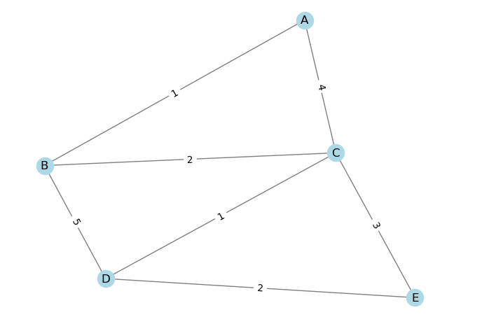

```{r setup, include=FALSE}
    library(knitr)
    library(tidyverse)
knitr::opts_chunk$set(
comment=NA,
error=F, 
warning=F,
tidy=TRUE, 
fig.align = 'center',
message=F, 
warning=F,
tidy.opts=list(width.cutoff=60),
fig.width=4, 
fig.height=4, 
fig.path='Figs/')
```


# Python për Analizën e Rrjetit


## Python për Analizën e Rrjetit

  - Në Python ne përdorim një kombinim të librarive të specializuara për analizimin e rrjetave.

## Python për Analizën e Rrjetit

  - **networkx** (importuar si nx): Një nga paketat kryesore për të punuar me të dhëna rrjeti

  - **osmnx**: Një paketë për të nxjerrë të dhëna rrjeti nga OpenStreetMap dhe për t'i manipuluar ato në networkx për      analizë komplekse të rrjeteve (https://github.com/gboeing/osmnx).

## Python për Analizën e Rrjetit

  - Këto paketa mbështesin disa nga funksionalitetet e njëjta të implementuara në ESRI-të e famshme ArcGIS Network         Analyst.

# Shkenca e Rrjetave

## Teoria e Grafeve

  - Rrjetet, të njohura gjithashtu si grafe, janë një strukturë thelbësore e të dhënave që lejon përfaqësimin e            sistemeve.

  - Një **nyje** (node) (e quajtur gjithashtu vertex) është një element i rrjetit që përfaqëson një entitet (p.sh., një     person, një mjet, një kafshë, një stacion, një organizatë).

## Teoria e Grafeve

  - Një **skaj** (edge) (i quajtur gjithashtu link) është një lidhje midis dy nyjeve dhe mund të ketë atribute. 
  
  - Një skaj përfaqëson një marrëdhënie midis dy nyjeve (p.sh., një miqësi midis dy personave, një hekurudhë midis dy     stacioneve të trenit, një telefonatë midis dy përdoruesve të telefonit).

  - Një skaj mund të jetë **i drejtuar** (directed) (a --> b dhe b --> a janë dy skaje të veçanta) ose **i pa drejtuar** (undirected) (a -- b nuk ka       drejtim).


## Teoria e Grafeve

  - *networkx* mbështet krijimin e llojeve të ndryshme të rrjeteve dhe ofron implementime të shumë algoritmeve dhe        metrikave të grafeve.

## Problemet e Grafeve

  - Një nga shembujt më të hershëm të problemeve teorike të grafeve është shtatë urat e Königsberg. 
  
  - A ka një rrugë që kalon çdo urë saktësisht një herë? 

## Teoria e Grafeve

  - Leonhard Euler (1735) tregoi se një shëtitje e tillë nuk ekzistonte duke formuluar problemin si një graf 
  
  
  

## Rrjetet Gjeohapësinore

  - Në shkencën e të dhënave gjeografike, rrjetet gjeohapësinore janë rrjete ku vendndodhja e nyjeve dhe skajeve është     e nevojshme për t'i studiuar dhe përdorur për analizë.

  - Të tilla rrjete janë të kudogjendura dhe përfshijnë rrjetet e transportit, rrjetet hidrologjike, matricat             origjinë-destinacion (të dhëna të rrjedhës), rrjetet e energjisë dhe rrjetet tregtare.

## Algoritmet e Rrjetit

  - Një nga problemet themelore në grafe është llogaritja e rrugës më të shkurtër midis dy nyjeve. 
  
  - Ky problem ka aplikime të panumërta në sektorin gjeohapësinor, duke përfshirë rrugëtimin nga pika A në B.

## Algoritmet e Rrjetit

  - Që nga viti 1956, algoritmi i Dijkstra ka qenë mënyra më e famshme për të llogaritur një rrugë më të shkurtër në      një graf me peshë. 
  

## Algoritmi i Dijkstra


\AddToHookNext{env/Highlighting/begin}{\tiny}   


```{python, eval = FALSE}
## Prezantimi i Grafit dhe Nyjeve

import networkx as nx
import matplotlib.pyplot as plt

# Krijoni graf-in
G = nx.Graph()
edges = [
    ('A', 'B', 1),
    ('A', 'C', 4),
    ('B', 'C', 2),
    ('B', 'D', 5),
    ('C', 'D', 1),
    ('C', 'E', 3),
    ('D', 'E', 2)
]
G.add_weighted_edges_from(edges)

# Vizualizoni graf-in
pos = nx.spring_layout(G)
nx.draw(G, pos, with_labels=True, node_color='lightblue', edge_color='grey')
labels = nx.get_edge_attributes(G, 'weight')
nx.draw_networkx_edge_labels(G, pos, edge_labels=labels)
plt.show()
```

## Algoritmi i Dijkstra




## Algoritmi i Dijkstra - Hapi 1

Filloni me nyjen fillestare (A)

  - Distanca nga A në A: 0
      

## Algoritmi i Dijkstra - Hapi 2

Filloni me nyjen fillestare (A)


  - Distanca nga A te fqinjët:

      B: 1

      C: 4

  - Rrugët më të shkurtra:

      A -> A: 0

      A -> B: 1

      A -> C: 4
      


## Algoritmi i Dijkstra - Hapi 3

Zgjidhni nyjen më të afërt (B)

  - Distanca nga B te fqinjët:

    C: 3 (1 + 2)
    
    D: 6 (1 + 5)

  - Rrugët më të shkurtra:

  - A -> B: 1

  - A -> C: 3 (via B)

  - A -> D: 6 (via B)
      


## Algoritmi i Dijkstra - Hapi 4

Zgjidhni nyjen më të afërt të ardhshme (C)

  - Distanca nga C te fqinjët:

    D: 4 (3 + 1)

    E: 6 (3 + 3)

  - Rrugët më të shkurtra:

    A -> B: 1

    A -> C: 3 (via B)

    A -> D: 4 (via C)

    A -> E: 6 (via C)

## Algoritmi i Dijkstra - Hapi 5

Zgjidhni nyjen më të afërt të ardhshme (D)

  - Distanca nga D te fqinjët:
      
    E: 6 (via C)

  - Rrugët më të shkurtra:

    A -> B: 1

    A -> C: 3 (via B)

    A -> D: 4 (via C)
  
    A -> E: 6 (via C)


Distancat më të shkurtra janë: {'A': (None, 0), 'B': ('A', 1), 'C': ('B', 3), 'D': ('C', 4), 'E': ('C', 6)}
Rruga më e shkurtër nga A në E është: ['A', 'B', 'C', 'E'] me total 6.


      
## Algoritmi i Dijkstra - Hapi 4

\AddToHookNext{env/Highlighting/begin}{\tiny}   


```{python, eval = FALSE}
import networkx as nx

# Krijoni graf-in
G = nx.Graph()
edges = [
    ('A', 'B', 1),
    ('A', 'C', 4),
    ('B', 'C', 2),
    ('B', 'D', 5),
    ('C', 'D', 1),
    ('C', 'E', 3),
    ('D', 'E', 2)
]
G.add_weighted_edges_from(edges)

# Filloni me nyjen 'A'
shortest_paths = {'A': (None, 0)}  # Nyja 'A' me kosto zero
current_node = 'A'
visited = set()

# Hapi 2 dhe 3: Zgjidhni nyjen më të afërt dhe llogaritni distancat
def calculate_shortest_paths(graph, start_node):
    visited = set()
    shortest_paths = {start_node: (None, 0)}
    current_node = start_node

    while current_node:
        visited.add(current_node)
        destinations = graph[current_node]
        weight_to_current_node = shortest_paths[current_node][1]
```

  
## Algoritmi i Dijkstra - Hapi 4

\AddToHookNext{env/Highlighting/begin}{\tiny}   


```{python, eval = FALSE}        
        

        for next_node, weight in destinations.items():
            weight = weight['weight']
            total_weight = weight_to_current_node + weight
            if next_node not in shortest_paths:
                shortest_paths[next_node] = (current_node, total_weight)
            else:
                current_weight = shortest_paths[next_node][1]
                if current_weight > total_weight:
                    shortest_paths[next_node] = (current_node, total_weight)

        next_destinations = {node: shortest_paths[node] for node in shortest_paths if node not in visited}
        if not next_destinations:
            break
        current_node = min(next_destinations, key=lambda k: next_destinations[k][1])

    return shortest_paths
```
  
## Algoritmi i Dijkstra - Hapi 4

\AddToHookNext{env/Highlighting/begin}{\tiny}   


```{python, eval = FALSE} 

# Llogaritni rrugët më të shkurtra nga 'A' në të gjitha nyjet
shortest_paths = calculate_shortest_paths(G, 'A')
print("Distancat më të shkurtra janë:", shortest_paths)

# Për rrugën më të shkurtër nga A në E
def get_path(shortest_paths, end_node):
    path = []
    while end_node:
        path.append(end_node)
        next_node = shortest_paths[end_node][0]
        end_node = next_node
    path = path[::-1]
    return path

# Gjeni rrugën më të shkurtër nga A në E
shortest_path = get_path(shortest_paths, 'E')
print("Rruga më e shkurtër nga A në E është:", shortest_path)

```


## Krijimi i Grafit

  - Le të krijojmë një graf me skaje të peshësuara.

  - Peshat mund të përfaqësojnë për shembull koston e përshkimit të një skaji (p.sh., një skaj i gjatë ka një peshë më     të madhe se një i shkurtër) dhe përdoren shumë shpesh për të përfaqësuar sisteme.

## Krijimi i Grafit

Në disa skenarë, grafet mund të krijohen dhe popullohen drejtpërdrejt me networkx:

\AddToHookNext{env/Highlighting/begin}{\tiny}   


```{python, eval = FALSE} 
import networkx as nx
import matplotlib.pyplot as plt

# krijoni një graf të thjeshtë të pa drejtuar
g = nx.Graph(name='graf i vogël')

# shtoni skaje me një atribut (peshë)
g.add_edge('a', 'b', weight=0.1)
g.add_edge('b', 'c', weight=1.5)
g.add_edge('a', 'c', weight=1.0)
g.add_edge('c', 'd', weight=2.2)

# Printoni informacionin e grafit
print("Emri:", g.graph['name'])
print("Tipi:", type(g))
print("Numri i nyjeve:", g.number_of_nodes())
print("Numri i skajeve:", g.number_of_edges())
print("Shkalla mesatare:", sum(dict(g.degree()).values()) / g.number_of_nodes())

```


## Vizualizimi i Grafit

  - Veçanërisht për rrjete të vogla, është e mundur t'i vizatojmë ato drejtpërdrejt.

  - Vini re se ky graf i pa drejtuar është jo-hapësinor, në kuptimin që nyjet nuk kanë një vendndodhje të caktuar         hapësinore.


## Vizualizimi i Grafit

\AddToHookNext{env/Highlighting/begin}{\tiny}   


```{python, eval = FALSE}
# gjeneroni pozicionet e nyjeve duke përdorur një paraqitje të njohur
pos = nx.spring_layout(g)

# hapni vizatimin
nx.draw_networkx(g, pos=pos, font_color='white')

# vizatoni etiketat e skajeve
nx.draw_networkx_edge_labels(g, pos=pos)

# vizatoni skajet
nx.draw_networkx_edges(g, pos=pos)

# shfaqni graf-in
plt.show()
```

## Aksesimi i Elementeve të Grafit

  - Elementet e grafit mund të aksesohen drejtpërdrejt
  
  
\AddToHookNext{env/Highlighting/begin}{\tiny}   


```{python, eval = FALSE}  
# Nyjet e grafit
g.nodes
# NodeView(('a', 'b', 'c', 'd'))

# Skajet e grafit
g.edges
# EdgeView([('a', 'b'), ('a', 'c'), ('b', 'c'), ('c', 'd')])
```


## Aksesimi i Elementeve të Grafit

\AddToHookNext{env/Highlighting/begin}{\tiny}   


```{python, eval = FALSE}
# shikoni nyjet fqinje të nyjës 'a':
for node_nei in g.neighbors('a'):
    print(node_nei)
```

## Aksesimi i Atributeve

\AddToHookNext{env/Highlighting/begin}{\tiny}   


```{python, eval = FALSE}
weights = nx.get_edge_attributes(g, 'weight')
weights
# {('a', 'b'): 0.1, ('a', 'c'): 1.0, ('b', 'c'): 1.5, ('c', 'd'): 2.2}
```


## Llogaritja e Rrugës më të Shkurtër

  - Tani mund të përdorim **networkx** për të llogaritur rrugën më të shkurtër midis nyjeve.

  - Fillimisht, mund të llogarisim rrugën më të shkurtër të peshuar (**unweighted shortest path**), duke supozuar se      të gjitha skajet kanë të njëjtën peshë:


## Llogaritja e Rrugës më të Shkurtër

\AddToHookNext{env/Highlighting/begin}{\tiny}   


```{python, eval = FALSE}
unweighted_path = nx.shortest_path(g, 'b', 'd')
unweighted_path
```

## Rruga e Peshuar

  - Tani, mund të shohim rrugën më të shkurtër të peshuar (**weighted shortest path**), duke vënë re se shuma e           peshave të **(bacd)** është më e lehtë se **(bcd)**:


## Rruga e Peshua

\AddToHookNext{env/Highlighting/begin}{\tiny}   


```{python, eval = FALSE}
weighted_path = nx.shortest_path(g, 'b', 'd', weight='weight')
weighted_path
```


## Metrikat e Rrjetit

  - Për të përshkruar dhe kuptuar rrjetet, janë krijuar shumë metrika.

  - Për shembull, ne mund të shohim se sa skaje janë të lidhura me një nyje (shkalla (**degree **) e një nyje).

## Metrikat e Rrjetit

  - Nyja 'a' ka dy skaje, ndërsa 'c' ka 3. 
  
  - Disa nyje me shkallë të lartë janë "qendra", duke lidhur shumë nyje: Për shembull, në rrjetet sociale, politikanët     janë qendra.

## Metrikat e Rrjetit

  - Qendra (**centrality**) i një nyje është gjithashtu i rëndësishëm: Sa "hapje" në skaje janë të nevojshme për të      arritur të gjitha nyjet e tjera?

## Metrikat e Rrjetit

  - Për shembull, Londra është një qendër e udhëtimeve ajrore më e rëndësishme se çdo qytet tjetër në Mbretërinë e Bashkuar
  
## Metrikat e Rrjetit  

\AddToHookNext{env/Highlighting/begin}{\tiny}   


```{python, eval = FALSE}
import networkx as nx

# Krijo graf-in
g = nx.Graph(name='graf i vogël')
g.add_edge('a', 'b', weight=0.1)
g.add_edge('b', 'c', weight=1.5)
g.add_edge('a', 'c', weight=1.0)
g.add_edge('c', 'd', weight=2.2)

# Ekstraktoni të gjitha shkallët: kjo është zakonisht një pjesë e rëndësishme e informacionit për të kuptuar strukturën e grafit.
g.degree()
```


## Metrikat e Rrjetit  

\AddToHookNext{env/Highlighting/begin}{\tiny}   


```{python, eval = FALSE}
# Nxirrni shkallët në një listë të thjeshtë
degrees = [deg for node, deg in g.degree()]
degrees
```


## Metrikat e Rrjetit  

\AddToHookNext{env/Highlighting/begin}{\tiny}   


```{python, eval = FALSE}
# 'c' është nyja më qendrore, pasi mund të arrijmë të gjitha nyjet e tjera me numrin më të vogël të hapave, ndërsa 'd' është nyja më e izoluar.
nx.algorithms.centrality.degree_centrality(g)
```

## Centraliteti dhe Pesha

  - Një tjetër metrikë popullore e qendralitetit është **betweeness centrality** i bazuar në rrugët më të shkurtra        midis nyjeve
  
## Centraliteti dhe Pesha

  - Peshat e skajeve **Edge weights** mund të jenë të rëndësishme për të llogaritur centralitetin dhe metrika të          tjera.

## Metrikat e Rrjetit  

\AddToHookNext{env/Highlighting/begin}{\tiny}   


```{python, eval = FALSE}
# Centraliteti i nyjeve
nx.algorithms.centrality.betweenness_centrality(g, weight='weight')
# 'a' dhe 'b' janë nyjet më qendrore të grafit
```

## Metrikat e Rrjetit  

\AddToHookNext{env/Highlighting/begin}{\tiny}   


```{python, eval = FALSE}
# Centraliteti i skajeve
nx.algorithms.centrality.edge_betweenness_centrality(g, weight='weight')
# 'ac' është skaji më qendror i grafit
```


## Rrjetet Tregtare

  - Analiza e rrjetave aplikohet me sukses për të modeluar ndërveprimet në ekonomi, sociologji dhe fusha të tjera.

  - Të dhënat nga kjo analizë përfaqësojnë ndërveprimet tregtare midis palëve (p.sh. tregtia e kafshëve midis             Argjentinës dhe Brazilit në vitin 2017). 
  

## Rrjetet Tregtare

Rrjetet e marra nga këto të dhëna do të ofrojnë një pamje të anuar mbi tregtinë botërore.

\AddToHookNext{env/Highlighting/begin}{\tiny}   


```{python, eval = FALSE}
import pandas as pd

# ngarkoni të dhënat nga një skedar TSV duke përdorur pandas
trade_df = pd.read_csv('data/gis4/trade_network_wits-1988_2018.tsv', sep='\t')
# shfaqni katër rreshta shembuj nga të dhënat e ngarkuara
trade_df.sample(4)
```

## Rrjetet Tregtare


## Rrjetet Tregtare

  Pasi kemi ngarkuar dhe shfaqur disa rreshta shembull nga të dhënat, le të përqendrohemi në të dhënat e vitit 2018     dhe të heqim të dhënat e paplota:


## Rrjetet Tregtare


\AddToHookNext{env/Highlighting/begin}{\tiny}   


```{python, eval = FALSE}
import pandas as pd
# përzgjedhja e kolonave të interesit për analizë
trade_df = trade_df[['reporter_country_code','reporter','partner_country_code','partner',
                     'product_categories','indicator_type','indicator','2018']]

# përqendrimi në vëllimin total në USD të importit/eksportit midis vendeve
trade_df = trade_df[~trade_df['reporter_country_code'].isnull()]
trade_df = trade_df[~trade_df['partner_country_code'].isnull()]
# heqja e të dhënave të paplota
trade_df = trade_df[~trade_df['2018'].isnull()]
trade_df = trade_df[trade_df['product_categories']=='all_products']

# përqendrimi në tregtarët më të mëdhenj të importit/eksportit
trade_df = trade_df[trade_df['indicator'].isin(['partner_share_pc_top_5_import_partner','partner_share_pc_top_5_export_partner'])]
# kolonat e tjera interesante janë: 'trade_us_mil_top_5_export_partner','trade_us_mil_top_5_import_partner'
```


## Rrjetet Tregtare


\AddToHookNext{env/Highlighting/begin}{\tiny}   


```{python, eval = FALSE}
# numri total i rreshtave të filtruar
len(trade_df)
```


## Rrjetet Tregtare

Për të parë shembullin e rrjetit tregtar të Kinës:

\AddToHookNext{env/Highlighting/begin}{\tiny}   


```{python, eval = FALSE}
# shembull i rrjetit tregtar të Kinës
trade_df[trade_df.reporter_country_code=='CHN']
```


## Rrjetet Tregtare


## Grafet nga dataframe

\AddToHookNext{env/Highlighting/begin}{\tiny}   


```{python, eval = FALSE}
import networkx as nx
import matplotlib.pyplot as plt

# Define a function to print graph information manually
def print_graph_info(g):
    num_nodes = g.number_of_nodes()
    num_edges = g.number_of_edges()
    avg_in_degree = sum(dict(g.in_degree()).values()) / num_nodes
    avg_out_degree = sum(dict(g.out_degree()).values()) / num_nodes

    print(f"Emri:")
    print(f"Tipi: {type(g).__name__}")
    print(f"Numri i nyjeve: {num_nodes}")
    print(f"Numri i degeve: {num_edges}")
    print(f"Mesatarja brenda në gradë: {avg_in_degree:.4f}")
    print(f"Mesatarja jashtë në gradë: {avg_out_degree:.4f}")

# Gjeneroni grafikun nga data frame (lista e degeve)
df = trade_df[trade_df.indicator == 'partner_share_pc_top_5_import_partner']
trade_import_g = nx.from_pandas_edgelist(df, 'reporter', 'partner', ['2018'], create_using=nx.DiGraph())
print_graph_info(trade_import_g)
```

## Grafet nga dataframe


## Grafet nga dataframe

\AddToHookNext{env/Highlighting/begin}{\tiny}   


```{python, eval = FALSE}
# Gjeneroni grafikun nga data frame  (lista e skajeve)
df = trade_df[trade_df.indicator=='partner_share_pc_top_5_export_partner']
trade_export_g = nx.from_pandas_edgelist(df, 'reporter', 'partner', ['2018'], create_using=nx.DiGraph())
print_graph_info(trade_export_g)
```

## Grafet nga dataframe


## Shkalla e plot in- and out

Hapi i parë për të kuptuar strukturën e një rrjeti është llogaritja e shkallës së çdo nyje (numri i skajeve).

\AddToHookNext{env/Highlighting/begin}{\tiny}   


```{python, eval = FALSE}
def plot_graph_degrees(g, title, logscale=False):
    """
    Paraqitni shkallën e hyrjes dhe daljes së grafikut g në një grafik linje.
    @ g: një grafik
    @ title: titulli i grafikës
    @ logscale: transformoni boshtet x dhe y me log10
    """
    # merrni shkallët
    indegrees = [deg for node, deg in g.in_degree()]
    outdegrees = [deg for node, deg in g.out_degree()]
    # numërimi i shkallës në hyrje
    indeg_vals = sorted(list(set(indegrees)))
    indeg_hist = [indegrees.count(x) for x in indeg_vals]
    # numërimi i shkallës në dalje
    outdeg_vals = sorted(list(set(outdegrees)))
    outdeg_hist = [outdegrees.count(x) for x in outdeg_vals]
    # shtoni informacionin në titull
    title = title + " [" + str(len(g.nodes)) + " nyje, " + str(len(g.edges)) + " skaje]"
    # paraqitni
    plt.figure()
    plt.grid()
    # paraqitni shkallët
    plt.plot(indeg_vals, indeg_hist, 'ro-')
    plt.plot(outdeg_vals, outdeg_hist, 'bv-')
```

## Shkalla e plot in- and out (vazhdim)


\AddToHookNext{env/Highlighting/begin}{\tiny}   


```{python, eval = FALSE}
    if logscale:
        plt.xscale("log")
        plt.yscale("log")
        title = title + " [log]"

    # shtoni legjendën dhe etiketat
    plt.legend(['shkalla në hyrje','shkalla në dalje'])
    plt.xlabel('Shkalla')
    plt.ylabel('Numri i nyjeve')
    plt.title(title)
    plt.show()
# paraqitni strukturën e rrjetit
plot_graph_degrees(trade_export_g, 'Rrjeti i eksportit tregtar', logscale=False)
plot_graph_degrees(trade_export_g, 'Rrjeti i eksportit tregtar', logscale=True)
plot_graph_degrees(trade_import_g, 'Rrjeti i importit tregtar', logscale=False)
plot_graph_degrees(trade_import_g, 'Rrjeti i importit tregtar', logscale=True)
```


## Shkalla e plot in- and out (vazhdim)


\AddToHookNext{env/Highlighting/begin}{\tiny}   


```{python, eval = FALSE}
# ndërto strukturën e rrjetit
plot_graph_degrees(trade_export_g, 'Rrjeti i eksportit tregtar', logscale=False)
plot_graph_degrees(trade_export_g, 'Rrjeti i eksportit tregtar', logscale=True)
plot_graph_degrees(trade_import_g, 'Rrjeti i importit tregtar', logscale=False)
plot_graph_degrees(trade_import_g, 'Rrjeti i importit tregtar', logscale=True)
```


## Shkalla e plot in- and out (vazhdim)


## Vizualizimi i Nyjeve dhe Skajeve

  - Gjenerimi i vizualizimeve të mira të rrjeteve nuk është i lehtë. 
  
  - Kur një rrjet rritet në numër të nyjeve dhe shkallë, mbivendosja bëhet e pashmangshme. 
  
## Vizualizimi i Nyjeve dhe Skajeve

  - Libraria ofron funksionalitet për vizualizim të avancuar
  
  - Me grafet hapësinore, është e nevojshme të zgjidhni një paraqitje për të rregulluar nyjet në një mënyrë të            përshtatshme.


## Vizualizimi i Nyjeve dhe Skajeve

python\AddToHookNext{env/Highlighting/begin}{\tiny}   


```{python, eval = FALSE}

# përkufizoni funksionin e ripërdorshëm për të vizatuar paraqitjen e rrjetit
def plot_graph(g, title, edge_label_attribute, layout='spring', fig_sz=10):
    """
    Funksioni për të vizatuar një grafik të drejtuar me vlera të përshtatshme të parazgjedhura.
    @ g: një grafik
    @ title: titulli i grafikut
    @ edge_label_attribute: emri i atributit të skajit që do të përdoret si etiketa e skajit
    @ layout: paraqitja e rrjetit që do të përdoret
    @ fig_sz: madhësia e kanavacës
    """
    # gjeneroni pozicionet e nyjeve bazuar në paraqitjen e zgjedhur
    if layout == 'spring':
        pos = nx.spring_layout(g, k=0.55, iterations=30)
    elif layout == 'circular':
        pos = nx.circular_layout(g)
    else:
        raise ValueError("Paraqitje e pavlefshme")
```  


## Vizualizimi i Nyjeve dhe Skajeve (vazhdim)

python\AddToHookNext{env/Highlighting/begin}{\tiny}   


```{python, eval = FALSE}

    # rregulloni figurën
    plt.figure(figsize=(fig_sz, fig_sz))
    # hapni vizatimin
    nx.draw_networkx(g, pos=pos, node_color='lightblue', alpha=.8)
    # nxirrni etiketat e skajeve
    edge_labels = nx.get_edge_attributes(g, edge_label_attribute)
    # vizatoni etiketat e skajeve
    nx.draw_networkx_edge_labels(g, pos=pos, edge_labels=edge_labels, alpha=.6)
    # vizatoni skajet
    nx.draw_networkx_edges(g, pos=pos, arrows=True, alpha=.6, edge_color='lightgray')
    plt.title(title)
    plt.show()
```


## Vizualizimi i Nyjeve dhe Skajeve (vazhdim)

python\AddToHookNext{env/Highlighting/begin}{\tiny}   


```{python, eval = FALSE}
# vizatoni grafikun me dy paraqitje të ndryshme
plot_graph(trade_export_g, "Rrjeti i eksportit (% i eksportit total)", '2018', 'circular', fig_sz=40)
plot_graph(trade_import_g, "Rrjeti i importit (% i importit total)", '2018', 'spring', fig_sz=40)
```


## Vizualizimi i Nyjeve dhe Skajeve (vazhdim)


## Vizualizimi i Nyjeve dhe Skajeve

  - Këto vizualizime në thelb janë të padobishme pasi nuk mund të dallojmë strukturën e rrjeteve. 
  
  - Një strategji për të vizualizuar një rrjet të madh është të përfshini vetëm nyje të lidhura relativisht. 
  
  - Për shembull, le të zgjedhim nyje me shkallë të lartë nga grafiku **trade_export_g**:


## Vizualizimi i Nyjeve dhe Skajeve

python\AddToHookNext{env/Highlighting/begin}{\tiny}   


```{python, eval = FALSE}
# zgjedhni nyjet me shkallë të lartë
degrees = trade_export_g.degree()
nodes_to_remove = [n for n, degree in degrees if degrees[n] < 20]

# kopjoni dhe hiqni nyjet nga grafiku
hideg_trade_export_g = trade_export_g.copy()
hideg_trade_export_g.remove_nodes_from(nodes_to_remove)

# shtypni informacionin e grafikut të shkallës së lartë
def print_graph_info(g):
    num_nodes = g.number_of_nodes()
    num_edges = g.number_of_edges()
    avg_in_degree = sum(dict(g.in_degree()).values()) / num_nodes
    avg_out_degree = sum(dict(g.out_degree()).values()) / num_nodes

    print(f"Name:")
    print(f"Type: {type(g).__name__}")
    print(f"Number of nodes: {num_nodes}")
    print(f"Number of edges: {num_edges}")
    print(f"Average in degree: {avg_in_degree:.4f}")
    print(f"Average out degree: {avg_out_degree:.4f}")

print_graph_info(hideg_trade_export_g)
```


## Vizualizimi i Nyjeve dhe Skajeve


## Vizualizimi i Nyjeve dhe Skajeve

  Grafiku me shkallë të lartë është më i lehtë për t'u vizatuar dhe ne mund të shohim lidhjet midis vendeve me shkallë   të lartë:

## Vizualizimi i Nyjeve dhe Skajeve

python\AddToHookNext{env/Highlighting/begin}{\tiny}   


```{python, eval = FALSE}
# grafiku i shkallës së lartë
plot_graph(hideg_trade_export_g, "Rrjeti i eksportit (% i eksportit total)", '2018', 'spring', fig_sz=10)
```


## Vizualizimi i Nyjeve dhe Skajeve


## Vizualizimi i Nyjeve dhe Skajeve

Një qasje tjetër është të zgjidhni nën-grafikë, për shembull fqinjët e një nyje të synuar:


python\AddToHookNext{env/Highlighting/begin}{\tiny}   


```{python, eval = FALSE}
# tregoni nën-grafikë për secilin vend me shkallë të lartë
for country in hideg_trade_export_g.nodes:
    # nxirrni nën-grafikun për rrjetin e eksportit të një vendi
    # skajet në dalje
    edges = trade_export_g.out_edges(country, data=True)
    g = nx.DiGraph(edges)
    plot_graph(g, "Rrjeti i eksportit nga\n" + country + ' (% i eksportit total)', '2018', fig_sz=6)
    # skajet në hyrje
    edges = trade_export_g.in_edges(country, data=True)
    g = nx.DiGraph(edges)
    plot_graph(g, "Rrjeti i eksportit për\n" + country + ' (% i eksportit total)', '2018', fig_sz=6)

```


## Vizualizimi i Nyjeve dhe Skajeve


## Eksportimi i grafikut

  - Shpesh është e nevojshme të eksportoni një grafik në një format standard të skedarit
  
  - **networkX** supporton shumë formate. 
  
  - Ndër formatet më të supportuara janë **GraphML** dhe **GEXF**, të dy bazuar në XML. 
  
  
## Eksportimi i grafikut  
  
  Ekzaminoni skedarët e eksportuar me një redaktues teksti për të parë se si kodohen të dhënat.


## Eksportimi i grafikut

python\AddToHookNext{env/Highlighting/begin}{\tiny}   


```{python, eval = FALSE}
# eksportoni grafikun si GraphML dhe GEXF
nx.write_graphml(hideg_trade_export_g, "tmp/street_network.graphml")
nx.write_gexf(hideg_trade_export_g, "tmp/street_network.gexf")
```


## Qëndra e Nyjeve

  - Ne mund të përdorim **networkX** për të llogaritur metrikat e rrjetit, për shembull për të parë qendrën e 
    ndërmjetësimit të vendeve në të dy rrjetet e ndryshme që përfaqësojnë importin dhe eksportin:


## Qëndra e Nyjeve


python\AddToHookNext{env/Highlighting/begin}{\tiny}   


```{python, eval = FALSE}
# llogarisni qendrën e ndërmjetësimit bazuar në dendësinë e nyjeve
country_centrality = nx.algorithms.centrality.betweenness_centrality(trade_export_g)

# konvertoni të dhënat në një kuadër të dhënash
country_centrality_df = pd.DataFrame.from_dict(country_centrality, 
                                orient='index', columns=['betw_centrality_export'])
country_centrality_df['country'] = country_centrality_df.index

# renditni dhe tregoni rezultatet
country_centrality_df = country_centrality_df.sort_values('betw_centrality_export', ascending=False)
country_centrality_df.head(10)
```


## Qëndra e Nyjeve


## Importo Rrjetin

python\AddToHookNext{env/Highlighting/begin}{\tiny}   


```{python, eval = FALSE}
# llogarisni qendrën e ndërmjetësimit të rrjetit të importit
country_centrality = nx.algorithms.centrality.betweenness_centrality(trade_import_g)
imp_df = pd.DataFrame.from_dict(country_centrality, 
                            orient='index', columns=['betw_centrality_import'])

# renditni dhe tregoni rezultatet
imp_df = imp_df.sort_values('betw_centrality_import', ascending=False)
imp_df['country'] = imp_df.index
imp_df.head(10)
```


## Importo Rrjetin


## Kombinimi i Treguesve për të Krahasuar

python\AddToHookNext{env/Highlighting/begin}{\tiny}   


```{python, eval = FALSE}
# kombinoni dy treguesit për t'i krahasuar ata
impexp_df = country_centrality_df.merge(imp_df, on='country')
impexp_df = impexp_df[['country','betw_centrality_import','betw_centrality_export']]
impexp_df = impexp_df.sort_values('betw_centrality_export', ascending=False)
impexp_df.to_csv('tmp/trade_importexport_centrality_2018.csv')
impexp_df.head(10)
```


## Kombinimi i Treguesve për të Krahasuar


## Rrjetet Rrugore

  - Rrjetet rrugore janë një lloj rrjeti që është veçanërisht i rëndësishëm në analizën e të dhënave gjeografike. 
  
  - Libraria **osmnx** ofron funksione për të nxjerrë lehtësisht rrjetet rrugore nga **OpenStreetMap**. 
  
## Rrjetet Rrugore

  - Mënyra më efikase për të ruajtur këto rrjete kur punoni në Python është formati **pickle**. 
  
  - Do të përdorim skedarë pickle të kompresuar. 
  
  - Shumë formate të tjera rrjeti ekzistojnë, duke përfshirë GeoPackages dhe GraphML, që mund të përdoren .


## Merrni Rrjetet Rrugore

python\AddToHookNext{env/Highlighting/begin}{\tiny}   


```{python, eval = FALSE}
import osmnx as ox
import pickle

# Emri i vendit të synuar
place_name = "City of London, UK"

# Shkarkoni rrjetin rrugor nga OpenStreetMap bazuar në një emër vendi
graph = ox.graph_from_place(place_name, network_type='drive')

# Ruani rrjetin në disk duke përdorur gzip (.gz) për të zvogëluar madhësinë e skedarit
net_file = "data/streets_citylondon.gpik"

# Use pickle to write the graph to a file
with open(net_file, 'wb') as f:
    pickle.dump(graph, f)

print("Skedari i grafikut të rrugëve në", place_name, "shkarkuar në", net_file)
```


## Merrni Rrjetet Rrugore

python\AddToHookNext{env/Highlighting/begin}{\tiny}   


```{python, eval = FALSE}
# 'del' (fshij) shkatërron një objekt. Është e dobishme për të siguruar që ky objekt
# nuk mund të përdoret në qeliza të tjera gabimisht.
del graph, net_file
```

## Merrni Rrjetet Rrugore


Në mënyrë alternative, paketa supporton një **point and radius search** bazuar në adresa ose nga poligonet:

python\AddToHookNext{env/Highlighting/begin}{\tiny}   


```{python, eval = FALSE}
import osmnx as ox
import pickle
import gzip

# Vendndodhja e Birkbeck, rreze 1 km
radius_m = 1000
graph = ox.graph_from_address('Malet St, London, UK', network_type='drive', dist=radius_m)

# Ruani rrjetin në disk duke përdorur gzip (.gz) për të zvogëluar madhësinë e skedarit
net_file = "data/streets_birkbeck_1km.gpik.gz"

# Use pickle to write the graph to a compressed file
with gzip.open(net_file, 'wb') as f:
    pickle.dump(graph, f)

print(f"Rrjeti rrugor i ruajtur në {net_file}")

# Delete the graph object to free up memory
del graph

```


## Vizato Rrjetin e Rrugës

  - Rrjeti rrugor shprehet si **networkx.classes.multidigraph.MultiDiGraph**. 

  - Le të ngarkojmë një skedar **pickle** dhe të vizatojmë rrjetin.

## Vizato Rrjetin e Rrugës


python\AddToHookNext{env/Highlighting/begin}{\tiny}   


```{python, eval = FALSE}
import pickle
import gzip

# Load the graph from the compressed file
net_file = "data/streets_birkbeck_1km.gpik.gz"
with gzip.open(net_file, 'rb') as f:
    streets_g = pickle.load(f)

# Print the number of nodes and edges in the graph
print("N i nyjeve:", len(streets_g.nodes))
print("N i skajeve:", len(streets_g.edges))
```


## Vizato Rrjetin e Rrugës


python\AddToHookNext{env/Highlighting/begin}{\tiny}   


```{python, eval = FALSE}
# vizatoni rrjetin
osmnx.plot_graph(streets_g, figsize=(10,10))
```


## Vizato Rrjetin e Rrugës


## Vizato Rrjetin e Rrugës

Skajet përmbajnë atribute, si emri i rrugës dhe lloji, të cilat mund të aksesohen si një dataframe gjeografik.

python\AddToHookNext{env/Highlighting/begin}{\tiny}   


```{python, eval = FALSE}
# Merrni vetëm skajet nga grafiku
edges_df = osmnx.graph_to_gdfs(streets_g, nodes=False, edges=True)
edges_df.sample(3)
```


## Vizato Rrjetin e Rrugës


## Vizato Rrjetin e Rrugës


python\AddToHookNext{env/Highlighting/begin}{\tiny}   


```{python, eval = FALSE}
edges_df.plot()
```


## Vizato Rrjetin e Rrugës


## Vizato Rrjetin e Rrugës

Nyjet gjithashtu mund të kenë atribute, të tilla si vendndodhja dhe numri i skajeve ndërprerëse:

python\AddToHookNext{env/Highlighting/begin}{\tiny}   


```{python, eval = FALSE}
# Merrni nyjet nga grafiku si një kuadër të dhënash
nodes_df = osmnx.graph_to_gdfs(streets_g, nodes=True, edges=False)
nodes_df.sample(5)

# vizatoni nyjet
nodes_df.plot()
```


## Vizato Rrjetin e Rrugës


## Projekto Rrjetin

Për të punuar në rrjetet rrugore, është e nevojshme t'i projektoni ato në një sistem të përshtatshëm të referencës koordinative.

python\AddToHookNext{env/Highlighting/begin}{\tiny}   


```{python, eval = FALSE}
print("Sistemi i koordinatave të nyjeve:", nodes_df.crs)
print("Sistemi i koordinatave të skajeve:", edges_df.crs)
```


## Projekto Rrjetin


## Projekto Rrjetin

Projektimi i këtij rrjeti rrugor në British National Grid:

python\AddToHookNext{env/Highlighting/begin}{\tiny}   


```{python, eval = FALSE}
streets_g = osmnx.project_graph(streets_g, 27700)

# kontrolloni nëse projektimi funksionoi
nodes_proj, edges_proj = osmnx.graph_to_gdfs(streets_g, nodes=True, edges=True)
print(nodes_proj.crs)
print(edges_proj.crs)
```


## Projekto Rrjetin


## Projekto Rrjetin

Tani koordinatat janë projektuar


python\AddToHookNext{env/Highlighting/begin}{\tiny}   


```{python, eval = FALSE}

edges_proj.sample(5)

```


## Projekto Rrjetin


## Ndërtojmë përsëri


python\AddToHookNext{env/Highlighting/begin}{\tiny}   

```{python, eval = FALSE}

osmnx.plot_graph(streets_g, figsize=(10,10))

```


## Ndërtojmë përsëri


## Analiza e Rrjetit

Rrjetet rrugore mund të analizohen në aspektin e strukturës së tyre (morfologji) duke përdorur një sërë treguesish:


python\AddToHookNext{env/Highlighting/begin}{\tiny}   

```{python, eval = FALSE}
import osmnx as ox

# Merrni statistikat bazike të rrjetit
basic_stats = ox.basic_stats(streets_g)
basic_stats
```


## Llogaritja e Rrugëve

Një pjesë qendrore në udhëzime është llogaritja e rrugëve më të shkurtra në rrjetet rrugore.

python\AddToHookNext{env/Highlighting/begin}{\tiny}   

```{python, eval = FALSE}
import random
import networkx as nx
import matplotlib.pyplot as plt
from networkx.exception import NetworkXNoPath

# zgjidhni dy nyje të rastësishme
nodes = [n for n in streets_g.nodes]
orig_node = random.choice(nodes)
dest_node = random.choice(nodes)
print("Nyja e origjinës:", orig_node, ", nyja e destinacionit:", dest_node)
```


## Llogaritja e Rrugëve (vazhdim)


python\AddToHookNext{env/Highlighting/begin}{\tiny}   

```{python, eval = FALSE}
# Përpiquni/gjeni se për shkak se ndonjëherë rrugët nuk mund të gjenden
try:
    # gjeni rrugën më të shkurtër midis dy nyjeve
    route = nx.shortest_path(streets_g, orig_node, dest_node, weight='length')
    route_len_m = nx.shortest_path_length(streets_g, orig_node, dest_node, weight='length')
    print("Rruga e udhëtimit e gjetur:", len(route), "segmente; gjatësi (m)", round(route_len_m))
    
    # vizatoni rrugën
    plt.figure(figsize=(6, 6))
    fig, ax = ox.plot_graph_route(streets_g, route, route_linewidth=6, node_size=0, bgcolor='k')
except NetworkXNoPath as e: 
    print("Rruga nuk u gjet", e)
```    
    

## Llogaritja e Rrugëve


    
## Gjetja e Nyjeve Më të Afërta

  - Kur udhëtoni nga pika A në pikën B, hapi i parë është të gjeni nyjet më të afërta me A dhe B.


python\AddToHookNext{env/Highlighting/begin}{\tiny}   

```{python, eval = FALSE}
import networkx as nx
import osmnx as ox

# Funksioni për të gjetur nyjen më të afërt
def get_nearest_node(graph, point):
    nearest_node = min(graph.nodes, key=lambda n: ox.distance.great_circle_vec(point[1], point[0], graph.nodes[n]['y'], graph.nodes[n]['x']))
    return nearest_node


birkbeck_node = get_nearest_node(streets_g, birkbeck_loc_bg)
britishmus_node = get_nearest_node(streets_g, britishmus_loc_bg)

print("Nyjet më të afërta (ID-të):", birkbeck_node, britishmus_node)
```


## Llogaritja e Rrugës së Udhëtimit


python\AddToHookNext{env/Highlighting/begin}{\tiny}   

```{python, eval = FALSE}
# llogarisni rrugën e udhëtimit
route = nx.shortest_path(streets_g, birkbeck_node, britishmus_node, weight='length')
route_len_m = nx.shortest_path_length(streets_g, orig_node, dest_node, weight='length')
print("Rruga midis Birkbeck dhe British Museum e gjetur:", len(route), "segmente; gjatësi (m)", round(route_len_m))
```


## vizatoni rrugën

python\AddToHookNext{env/Highlighting/begin}{\tiny}   

```{python, eval = FALSE}
plt.figure(figsize=(6, 6))
fig, ax = ox.plot_graph_route(streets_g, route, route_linewidth=6, node_size=0, bgcolor='k')
```

Këto të dhëna të rrjetit dhe mjetet mund të përdoren në një sërë aplikimesh.


## vizatoni rrugën


