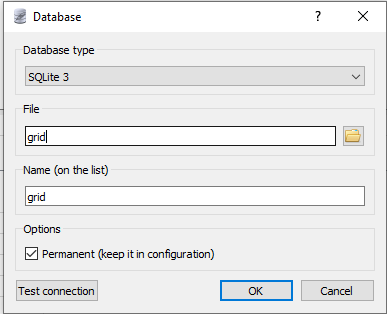
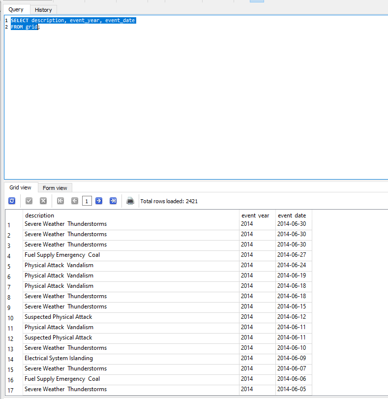

```{r setup, include=FALSE}
    library(knitr)
    library(tidyverse)
knitr::opts_chunk$set(
comment=NA,
error=F, 
warning=F,
tidy=TRUE, 
fig.align = 'center',
message=F, 
warning=F,
tidy.opts=list(width.cutoff=60),
fig.width=4, 
fig.height=4, 
fig.path='Figs/')
library(DBI)
library(RSQLite)
```


# Hyrje në SQL

## Si të Shkarkoni dhe Instaloni Mjetet e SQLite

  - Shko në faqen zyrtare: [https://www.sqlite.org](https://www.sqlite.org)
  
  - Hap faqen e shkarkimit: [https://www.sqlite.org/download.html](https://www.sqlite.org/download.html)
  
  
## Si të Shkarkoni dhe Instaloni Mjetet e SQLite

Zgjidh dhe shkarko versionin përkatës për sistemin tënd operativ (p.sh., Windows, x64 ose x86)


## Instalimi i Mjeteve SQLite

  - Krijo një dosje të re, p.sh **sqlite**

  - Ekstrakto përmbajtjen e skedarit të shkarkuar në këtë dosje


## Ekzekutimi i SQLite nga Command Line

  - Hap dritaren e Command Line 
  
  
  
  
## Ekzekutimi i SQLite nga Command Line

  - Navigo në dosjen **sqlite**

 


## Ekzekutimi i SQLite nga Command Line


  - Ekzekuto SQLite duke shkruar: sqlite3
  


## Instalimi dhe Përdorimi i SQLiteStudio

  - Tani shohim hap pas hapi se si të instaloni dhe përdorni SQLiteStudio, një mjet falas dhe intuitiv GUI për menaxhimin e bazave të të        dhënave SQLite.

## Shkarkimi i SQLiteStudio

SQLiteStudio është një mjet GUI falas dhe i lehtë për t'u përdorur që mund të shkarkohet nga faqja zyrtare. 

  1. Hapni faqen e internetit [https://github.com/pawelsalawa/sqlitestudio/releases](https://github.com/pawelsalawa/sqlitestudio/releases).

  2. Zgjidhni versionin që dëshironi të shkarkoni, siç është versioni i instaluesit ose versioni portativ.

  3. Ruajeni skedarin e shkarkuar në një dosje në kompjuterin tuaj, për shembull `C:\\sqlite\\gui`.

## Instalimi i SQLiteStudio

Pas shkarkimit, ndiqni këto hapa për të instaluar SQLiteStudio:

  1. Navigoni tek dosja ku keni ruajtur skedarin e shkarkuar.

  2. Ekstraktoni përmbajtjen e skedarit ZIP nëse keni shkarkuar versionin portativ.

  3. Nëse keni shkarkuar instaluesin, klikoni dyfish mbi të për të filluar procesin e instalimit dhe ndiqni udhëzimet në ekran.

## Nisja e SQLiteStudio

Për të hapur SQLiteStudio pas instalimit:

  1. Shkoni tek dosja ku e keni instaluar programin, për shembull `C:\\sqlite\\gui\\SQLiteStudio`.

  2. Klikoni dy herë mbi ikonën e SQLiteStudio për ta hapur programin.


## Hyrje në SQL Server

  - SQL Server është një sistem databaze relacionale të zhvilluar nga Microsoft. 
  

## Hyrje në SQL Server

Do mësojmë:

  - Si të shkruani pyetje (queries)

  - Konceptet bazë të SQL Server

## Hyrje në SQL Server

  - SQL Server është **dyqani** që përmban bazat e të dhënave dhe tabelat
  
  - **Queries** janë mënyra si i marrim **produktet** nga **raftet** dhe ngarkojmë **koshin**

  - **SELECT** është termi kyç për të marrë të dhëna

# Si të Importoni një Skedar CSV në SQLiteStudio

## Hapi 1: Hapni SQLiteStudio

  - Hapni SQLiteStudio në kompjuterin tuaj.


## Hapi 2: Krijoni ose Hapni një Bazë të Të Dhënave

Nëse nuk keni një bazë të të dhënave ku do të importoni CSV-në, krijoni një të re:
 
  - Shkoni te menuja **Database** dhe zgjidhni **Add a database**.
 
  - Zgjidhni një emër për bazën e të dhënave (p.sh., `MyDatabase.db`) dhe vendndodhjen, më pas klikoni **OK**.


## Hapi 2: Krijoni ose Hapni një Bazë të Të Dhënave


 

## Hapi 2: Krijoni ose Hapni një Bazë të Të Dhënave

  - Nëse tashmë keni një bazë të të dhënave, sigurohuni që ajo është e hapur në SQLiteStudio.
  
  - Krijoni lidhjen me databazën.

 

## Hapi 3: Importoni Skedarin CSV

  - Me bazën e të dhënave të hapur, shkoni te menuja **Tools** dhe zgjidhni **Import**.
  
  
   
  
## Hapi 3: Importoni Skedarin CSV 

   

## Hapi 3: Importoni Skedarin CSV 

  - Në dritaren e importit, zgjidhni **CSV** si formatin dhe klikoni **Next**.
  
   
  
## Hapi 4: Konfiguroni Importimin e CSV-së

- Shfletoni për të gjetur skedarin CSV që dëshironi të importoni.

- Pasi ta zgjidhni skedarin tuaj CSV, do të kërkoheni të konfiguroni cilësimet e importit:

  - **Emri i tabelës**: Është zakonisht e zakonshme të emëroni tabelën pas skedarit CSV, pa prapashtesën e skedarit.

  - **Emrat dhe llojet e kolonave**: SQLiteStudio do t'ju ofrojë mundësinë të konfiguroni kolonat duke përcaktuar emrat dhe llojet e të         dhënave për secilën kolonë.
  

## Hapi 5: Përfundo Importimin

  - Pas konfigurimit të cilësimeve, vazhdoni me importimin duke ndjekur udhëzimet në SQLiteStudio.

  - Kontrolloni të dhënat e importuara për të siguruar se janë saktë dhe siç pritej.


## Fillojmë

  - **SELECT** është termi kyç për të marrë të dhëna

  - Shembull: `SELECT description FROM grid;`
  
  
## Anatomia e një pyetjeje të thjeshtë SELECT

  - Deklaratat **SELECT** specifikojnë atë që duam të marrim nga një tabelë. 
  
  - Query më e thjeshtë zgjedh një kolonë, nga një tabelë. 
  
## Anatomia e një pyetjeje të thjeshtë SELECT

  - Në këtë query, ne zgjedhim shtyllën **description**, nga tabela **grid**. 
  
  
## Anatomia e një pyetjeje të thjeshtë SELECT

  - Vini re pikëpresjen që tregon fundin e qyery-t.
  
  - Fjala tjetër kyçe që do t'ju duhet gjithmonë është **FROM** - për të specifikuar vendndodhjen e tabelës burimore. 
  
  
## Fillojmë

\AddToHookNext{env/Highlighting/begin}{\tiny} 

```{sql, eval=FALSE}
SELECT description
FROM grid;
```


## Fillojmë

Këtu janë rezultatet. Query kthen çdo rresht në kolonën e zgjedhur.  


  


## Praktikë

  - Përsëritni hapat e mësipërm për të lidhur një databazë **artist**
  
  - Do përdorim skedarin csv **artist** nga folder **db**
  
  
## Query me më shumë se një kolonë

  - Ju mund të zgjidhni kolona të shumta, duke e ndarë çdo emër kolone me një presje. 
  
  - Nuk keni nevojë për presje për kolonën e fundit të zgjedhur përpara 'FROM'.


## Query me më shumë se një kolonë

  - Sigurohemi që kemi bërë **disconnect** nga databaza **artist**
    
  
## Zgjedhja e më shumë se një kolone

\AddToHookNext{env/Highlighting/begin}{\tiny} 

```{sql, eval=FALSE}
SELECT artistId, Name
FROM artist;
```


## Formatimi i Query




## Formatimi i Query  


  
## Formatimi i Query 

  - Këtu janë 2 query të ngjashme, me paraqitje të ndryshme. 
  
  - Query e sipërme tregon të gjitha kolonat që do të zgjidhen në një rresht. 
  
  - Query e poshtme tregon çdo kolonë të zgjedhur në një rresht të ri. 
  
  
## Formatimi i Query

  - Rezultatet e të dy query-ve do të jenë identike. 
  
  - Ne do të përdorim kryesisht paraqitjen e poshtme gjatë gjithë leksioneve. 
  
  
## Formatimi i Query

  Mbajtja e fjalëve kyçe si SELECT dhe FROM me shkronja të mëdha, dhe emrat e tabelave dhe kolonave me shkronja të vogla, i bën query më të lehta për t'u lexuar.
  
  
  
## Formatimi i Query


\AddToHookNext{env/Highlighting/begin}{\tiny} 

```{sql, eval=FALSE}
SELECT 
  description, 
  event_year, 
  event_date
FROM 
  grid;
```

## Formatimi i Query


## Select LIMIT

  - Në vend që të kthejmë çdo rresht, ne mund të përdorim **LIMIT** për të kufizuar numrin e rreshtave të kthyer. 
  
  - Specifikoni numrin e rreshtave që do të kthehen. 
  

  
## Select LIMIT

\AddToHookNext{env/Highlighting/begin}{\tiny} 

```{sql, eval=FALSE}
SELECT 
artist_id, 
artist_name 
FROM 
artist 
LIMIT 5;

```


## Select LIMIT


## Select DISTINCT

  - Përdorni **SELECT DISTINCT** për të kthyer një listë me vlera unike nga një kolonë. 
  
  - Nëse përdorni **SELECT DISTINCT** me dy ose më shumë kolona, do të ktheni çdo kombinim unik vlerash.


## Select DISTINCT

Krahasojmë rezultatin kur nuk përdorim **DISTINCT**

\AddToHookNext{env/Highlighting/begin}{\tiny} 

```{sql, eval=FALSE}
SELECT 
nerc_region
FROM 
grid;

```


## Select DISTINCT


## Select DISTINCT

Krahasojmë rezultatin kur përdorim **DISTINCT**

\AddToHookNext{env/Highlighting/begin}{\tiny} 

```{sql, eval=FALSE}
SELECT DISTINCT
nerc_region
FROM 
grid;

```


## Select DISTINCT


## Select *

  - Përdorni **SELECT**, e ndjekur nga tasti $\star$, për të kthyer të gjitha rreshtat dhe kolonat në një tabelë. 
  
  - Kjo është e mirë për eksplorimin e shpejtë të tabelave të vogla, por jo për tabelat shumë të mëdha. 
  
  
## Select *

\AddToHookNext{env/Highlighting/begin}{\tiny} 

```{sql, eval=FALSE}
SELECT *
FROM 
grid;

```


## Select *


## Përcaktimi i emrave të kolonave me AS

  - Ju mund të riemërtoni, ose **ALIAS**, një kolonë për t'i bërë rezultatet tuaja më kuptimplote. 
  
  - Thjesht zgjidhni kolonën, e ndjekur nga **AS**, dhe më pas emrin e kolonës që dëshironi. 
  
  - Vini re se si **demand_loss_mw** kthehet si **lost_demand**, ndërsa **description** kthehet si **cause_of_outage**.
  
  
## Përcaktimi i emrave të kolonave me AS

\AddToHookNext{env/Highlighting/begin}{\tiny} 

```{sql, eval=FALSE}
SELECT  demand_loss_mw AS lost_demand
FROM 
grid;

```


## Përcaktimi i emrave të kolonave me AS

  


## Përcaktimi i emrave të kolonave me AS

\AddToHookNext{env/Highlighting/begin}{\tiny} 

```{sql, eval=FALSE}
SELECT  description AS cause_of_outage
FROM 
grid;

```


## Select DISTINCT

  


