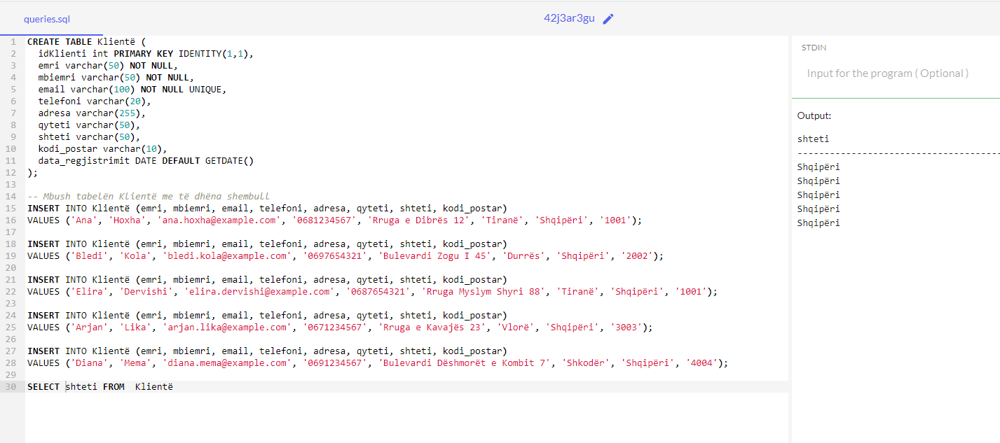

```{r setup, include=FALSE}
    library(knitr)
    library(tidyverse)
knitr::opts_chunk$set(
comment=NA,
error=F, 
warning=F,
tidy=TRUE, 
fig.align = 'center',
message=F, 
warning=F,
tidy.opts=list(width.cutoff=60),
fig.width=4, 
fig.height=4, 
fig.path='Figs/')
library(DBI)
library(RSQLite)
```


# Hyrje në SQL


## Si të shkarkoni SQL Server Setup


**Hapi 1** Shkoni te URL-ja: [https://www.microsoft.com/en-in/sql-server/sql-server-downloads](https://www.microsoft.com/en-in/sql-server/sql-server-downloads) për shkarkim të serverit Microsoft SQL.

## Si të shkarkoni SQL Server Setup

Microsoft ofron dy edicione të specializuara të shkarkimit falas të SQL për të punuar në MS SQL Server:


## Si të shkarkoni SQL Server Setup

**Developer** – Ka të gjitha veçoritë që ofron MS SQL Server, por nuk mund ta përdorim atë në prodhim. 

Nga këndvështrimi i të mësuarit, a është një kandidat ideal për të filluar.

## Si të shkarkoni SQL Server Setup

**Express**: Ky është gjithashtu një version falas i MS SQL Server, por me disa kufizime në aplikimet e inteligjencës së biznesit.


## Si të shkarkoni SQL Server Setup

Ne do të zgjedhim versionin Developer për të shkarkuar serverin Microsoft SQL për instalim.

**Hapi 2** Klikoni në "Download Now"

Shkarkoni SQL Server Setup

## Si të shkarkoni SQL Server Setup

Ne do të marrim instalimin e serverit SQL të konfiguruar si 'SQLServer2022SSEI-Dev.exe' në një mjedis Windows, duke siguruar përputhshmëri dhe performancë të optimizuar për aplikacionet SQL Server Windows.


## Si të instaloni Microsoft SQL Server

Këtu është një proces hap pas hapi se si të instaloni SQL në Windows 10:

**Hapi 1** Hapni skedarin **.exe**

Klikoni dy herë në "SQLServer2017-SSEI-Dev.exe". 


## Si të instaloni Microsoft SQL Server

Ekrani i mëposhtëm do të shfaqet me tre opsione: Basic, Custom dhe Download Files.


## Instaloni SQL Server


**Hapi 2** Zgjidhni versionin

## Instaloni SQL Server

Zgjidhni versionin bazë duke klikuar në opsionin "Basic", pasi ai ka të gjithë konfigurimin e paracaktuar të kërkuar për të mësuar MS SQL.

## Instaloni SQL Server

**Hapi 3** Pranoni kushtet

Do të shfaqet ekrani "Kushtet e licencës së serverit të Microsoft". Lexoni Kushtet e Licencës dhe më pas klikoni "Prano".


## Instaloni SQL Server

**Hapi 4** Zgjidhni vendndodhjen

Më poshtë do të shfaqet dritarja "Vendndodhja e instalimit të serverit SQL", e cila është një hap vendimtar në procesin e instalimit të Microsoft SQL Server.


## Instaloni SQL Server


Vendndodhja e parazgjedhur është Program Files Microsoft SQL Server.


## Instaloni SQL Server

  - Opsionale, ne gjithashtu mund të ndryshojmë vendndodhjen e instalimit duke klikuar në **Browse**.

  - Pasi të zgjidhet vendndodhja, klikoni butonin "Instalo" për të filluar instalimin e SQL Windows 10.

## Instaloni SQL Server

 - Më poshtë do të shfaqet ekrani i progresit të "Shkarkimit të paketës së instalimit". 
 
 

  - Prisni derisa të përfundojë shkarkimi i softuerit SQL.

## Instaloni SQL Server

Pasi shkarkimi të ketë përfunduar, sistemi do të fillojë instalimin e versionit Developer.

## Instaloni SQL Server

Më poshtë ekrani tregon përparimin e instalimit.

 

## Instaloni SQL Server

**Hapi 5** Përfundoni procesin e instalimit

Pasi instalimi të përfundojë me sukses, do të shfaqet ekrani më poshtë.

 

## Tani na duhet editor

Hapim linkun :

[https://learn.microsoft.com/en-us/sql/ssms/download-sql-server-management-studio-ssms?view=sql-server-ver16#download-ssms](https://learn.microsoft.com/en-us/sql/ssms/download-sql-server-management-studio-ssms?view=sql-server-ver16#download-ssms)


## Tani na duhet editor

Shkarkojmë SQL Server Management Studio (SSMS) 20.1


 

## Tani na duhet editor

Instalojmë hap pas hapi


## Instaloni SQL Server

Ky konfigurim është i vetë-mjaftueshëm për të vazhduar më tej me mësimin e serverit SQL dhe ne mund ta 'Mbyllim' këtë dritare.


# Fillojmë

## Hyrje në SQL

  - SQL qëndron për **Structured Query Language** e cila përdoret për të punuar me bazat e të dhënave.
  
  - Serveri SQL dhe T-SQL (Transact-SQL) janë të dy RDMS (Sistemi i Menaxhimit të Bazave të të Dhënave Relacionale) ku ky i fundit ka         funksione shtesë.

## Hyrje në SQL

  - SQL Server ruan të dhënat në formën e tabelave dhe lidhjeve. 
  
  - Ne nuk mund të qasemi drejtpërdrejt në të gjitha të dhënat, kështu që përdorim pyetje **query** për të marrë të dhënat e duhura.
  
  
## Importimi i tabelës Excel në SQL

  - Hapim SQL Server Management Studio
  
  - Selectojmë majtas **Databases**
  
## Importimi i tabelës Excel në SQL

  - Me butonin e djathtë zgjedhim **New Database**

 

## Importimi i tabelës Excel në SQL

  - Te faqja e hapur vendosim emrin e databazës **grid** dhe OK

 


## Importimi i tabelës Excel në SQL

  - Te databaza e krijuar **grid** zgjedhim me butonin e djathtë Tasks - Import Data

 


## Importimi i tabelës Excel në SQL

  - Navigojmë në folder ku kemi skedarin Excel **grid**

 


## Importimi i tabelës Excel në SQL

  - Në menunë e destinacionit zgjedhim **Microsoft Ole Db Provider for SQL Server**

 

## Importimi i tabelës Excel në SQL

  - Në dritaret e tjera zgjedhim Next dhe Finish
  
  
## Importimi i tabelës Excel në SQL

  - Në qoftë se procesi ka shkuar OK do shfaqet tabela si në figurë
  
  
  

## Hyrje në SQL

  - Deklarata **SELECT** specifikon atë që duam të marrim nga tabela.

  - **FROM** specifikon vendndodhjen e tabelës burimore.

## Hyrje në SQL

Gjithmonë përfundoni një pyetje me një **;**.


## Shembull

```{sql, eval=FALSE}
SELECT description 
FROM dbo.grid$
```

## Shembull

 
## Hyrje në SQL

  - Përdorni **TOP** për të kufizuar numrin e rreshtave të kthyer. 
  
  - Ne gjithashtu mund të specifikojmë përqindjen e rreshtave duke përdorur **TOP (5) PERCENT**.
  
## Shembull

```{sql, eval=FALSE}
SELECT TOP (5) PERCENT description
FROM dbo.grid$
```

## Shembull

 

## Hyrje në SQL

  - Përdorni SELECT DISTINCT për të kthyer një listë me vlera unike nga një kolonë.
  
  
## Shembull

```{sql, eval=FALSE}
SELECT
  DISTINCT country AS unique_country
FROM
  dbo.eurovis$;
```

## Shembull

   
## Hyrje në SQL

  - Përdorni SELECT * për të kthyer të gjitha rreshtat e një kolone. (Nuk rekomandohet për tabela të mëdha).

## Shembull

```{sql, eval=FALSE}
SELECT * FROM
  dbo.eurovis$;
```

## Shembull

  

