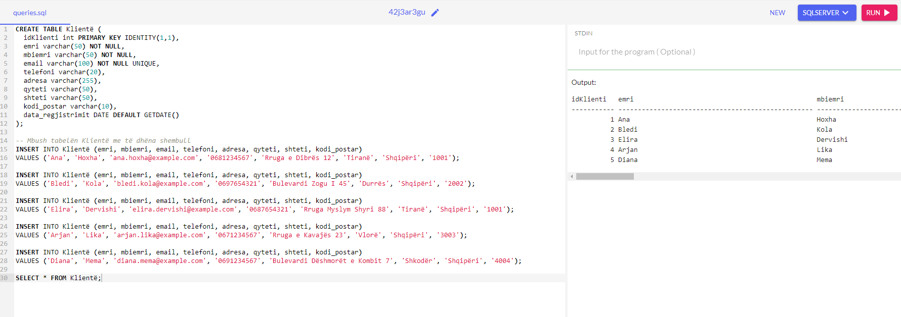
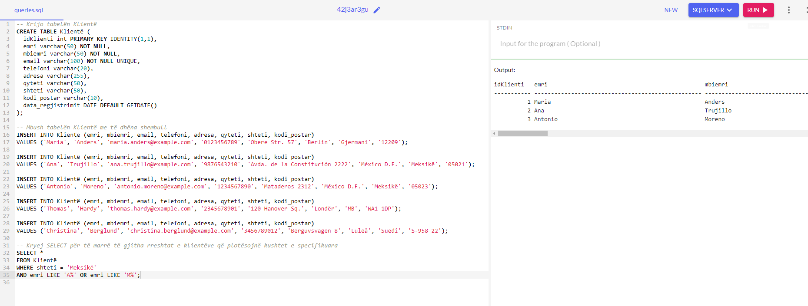
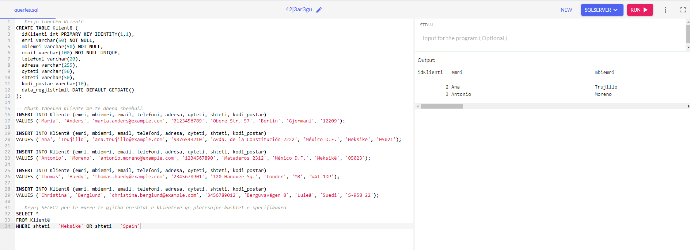

```{r setup, include=FALSE}
    library(knitr)
    library(tidyverse)
knitr::opts_chunk$set(
comment=NA,
error=F, 
warning=F,
tidy=TRUE, 
fig.align = 'center',
message=F, 
warning=F,
tidy.opts=list(width.cutoff=60),
fig.width=4, 
fig.height=4, 
fig.path='Figs/')
library(DBI)
library(RSQLite)
```


# Hyrje në SQL

## Hyrje në SQL

SQL është një gjuhë standarde për aksesin dhe manipulimin e bazave të të dhënave.

## Çfarë është SQL?

  - SQL qëndron për Structured Query Language

  - SQL ju lejon të aksesoni dhe manipuloni bazat e të dhënave


## Çfarë mund të bëjë SQL?

  - SQL mund të ekzekutojë pyetje **query** në një baze të dhënash

  - SQL mund të marrë të dhëna nga një bazë të dhënash

  - SQL mund të fusë të dhëna në një bazë të dhënash

## Çfarë mund të bëjë SQL?

  - SQL mund të përditësojë të dhënat në një bazë të dhënash

  - SQL mund të fshijë të dhënat nga një bazë të dhënash

  - SQL mund të krijojë baza të reja të dhënash


## Çfarë mund të bëjë SQL?

  - SQL mund të krijojë tabela të reja në një bazë të dhënash

  - SQL mund të krijojë procedura të ruajtura në një bazë të dhënash

  SQL mund të krijojë pamje **views** në një bazë të dhënash


## Çfarë mund të bëjë SQL?

  - Megjithëse SQL është një standard ANSI/ISO, ekzistojnë versione të ndryshme të gjuhës SQL.

## Çfarë mund të bëjë SQL?

  Sidoqoftë, për të qenë në përputhje me standardin ANSI, të gjitha ato mbështesin të paktën komandat kryesore (siç janë SELECT, UPDATE, DELETE, INSERT, WHERE) në një mënyrë të ngjashme.


## RDBMS

  - RDBMS do të thotë Sistemi i Menaxhimit të Bazave të të Dhënave Relacionale.

  - RDBMS është baza për SQL dhe për të gjitha sistemet moderne të bazës së të dhënave si MS SQL Server, IBM DB2, Oracle, MySQL dhe Microsoft Access.

## RDBMS

  - Të dhënat në RDBMS ruhen në objektet e bazës së të dhënave të quajtura tabela. 
  

## Fillojmë me një tabelë

\AddToHookNext{env/Highlighting/begin}{\tiny}  

```{sql, eval=FALSE}
-- Krijo tabelën Klientë
CREATE TABLE Klientë (
  idKlienti int PRIMARY KEY IDENTITY(1,1),
  emri varchar(50) NOT NULL,
  mbiemri varchar(50) NOT NULL,
  email varchar(100) NOT NULL UNIQUE,
  telefoni varchar(20),
  adresa varchar(255),
  qyteti varchar(50),
  shteti varchar(50),
  kodi_postar varchar(10),
  data_regjistrimit DATE DEFAULT GETDATE()
);

```


## Fillojmë me një tabelë

\AddToHookNext{env/Highlighting/begin}{\tiny}  

```{sql, eval=FALSE}
-- Mbush tabelën Klientë me të dhëna shembull
INSERT INTO Klientë (emri, mbiemri, email, telefoni, adresa, qyteti, shteti, kodi_postar)
VALUES ('Ana', 'Hoxha', 'ana.hoxha@example.com', '0681234567', 'Rruga e Dibrës 12', 'Tiranë', 'Shqipëri', '1001');

-- Mbush tabelën Klientë me të dhëna shembull
INSERT INTO Klientë (emri, mbiemri, email, telefoni, adresa, qyteti, shteti, kodi_postar)
VALUES ('Maria', 'Anders', 'maria.anders@alfredsfutterkiste.com', '0123456789', 'Obere Str. 57', 'Berlin', 'Germany', '12209');

INSERT INTO Klientë (emri, mbiemri, email, telefoni, adresa, qyteti, shteti, kodi_postar)
VALUES ('Ana', 'Trujillo', 'ana.trujillo@emparedadosyhelados.com', '9876543210', 'Avda. de la Constitución 2222', 'México D.F.', 'Mexico', '05021');

INSERT INTO Klientë (emri, mbiemri, email, telefoni, adresa, qyteti, shteti, kodi_postar)
VALUES ('Antonio', 'Moreno', 'antonio.moreno@taqueria.com', '1234567890', 'Mataderos 2312', 'México D.F.', 'Mexico', '05023');

INSERT INTO Klientë (emri, mbiemri, email, telefoni, adresa, qyteti, shteti, kodi_postar)
VALUES ('Thomas', 'Hardy', 'thomas.hardy@aroundthehorn.com', '2345678901', '120 Hanover Sq.', 'London', 'UK', 'WA1 1DP');

INSERT INTO Klientë (emri, mbiemri, email, telefoni, adresa, qyteti, shteti, kodi_postar)
VALUES ('Christina', 'Berglund', 'christina.berglund@berglundssnabbkop.com', '3456789012', 'Berguvsvägen 8', 'Luleå', 'Sweden', 'S-958 22');


```


## Shikoni tabelën "Klientë"

```{sql, eval=FALSE}
SELECT * FROM Klientë;


```


## Shikoni tabelën "Klientë"

 


## Struktura e Databazave

  - Çdo tabelë ndahet në entitete më të vogla të quajtura fusha. 
  
  - Fushat në tabelën e klientëve përbëhen nga ID-ja e klientit, emri i klientit, emri i kontaktit, adresa, qyteti, kodi postar dhe shteti. 
  
## Struktura e Databazave

  - Një fushë është një kolonë në një tabelë që është krijuar për të mbajtur informacion specifik për çdo regjistrim në tabelë.


## Struktura e Databazave

  - Një rekord, i quajtur gjithashtu një rresht, është çdo hyrje individuale që ekziston në një tabelë. 
  
  - Për shembull, ka 5 regjistrime në tabelën e mësipërme të klientëve. 
  
## Struktura e Databazave

  - Një rekord është një entitet horizontal në një tabelë.

  - Një kolonë është një entitet vertikal në një tabelë që përmban të gjithë informacionin e lidhur me një fushë specifike në një tabelë.
  
  

## Deklarata SELECT

Deklarata SELECT përdoret për të zgjedhur të dhënat nga një bazë të dhënash.


## Shembull : Ktheni të dhënat nga tabela e klientëve


```{sql, eval=FALSE}
SELECT emri, qyteti FROM Klientë;
```

## Shembull : Ktheni të dhënat nga tabela e klientëve

 


## Sintaksë

```{sql, eval=FALSE}
SELECT kolonën 1, kolonën 2, ...
FROM emri_tabelës;
```

Këtu, kolona 1, kolona 2, ... janë emrat e fushave të tabelës nga të cilat dëshironi të zgjidhni të dhënat.

Emri_tabela përfaqëson emrin e tabelës nga e cila dëshironi të zgjidhni të dhënat.


## Zgjidhni TË GJITHA kolonat

Nëse dëshironi të ktheni të gjitha kolonat, pa specifikuar emrin e çdo kolone, mund të përdorni sintaksën SELECT *:

## Zgjidhni TË GJITHA kolonat

Ktheni të gjitha kolonat nga tabela Klientë:

```{sql, eval=FALSE}
SELECT * NGA Klientë
```


## Zgjidhni TË GJITHA kolonat

 


## Deklarata SELECT DISTINCT

  - Deklarata SELECT DISTINCT përdoret për të kthyer vetëm vlera të dallueshme (të ndryshme).

## Zgjidhni të gjitha shtetet e ndryshme

Zgjidhni të gjitha shtetet e ndryshme nga tabela "Klientë"

```{sql, eval=FALSE}
SELECT DISTINCT shteti FROM  Klientë
```

## Zgjidhni të gjitha shtetet e ndryshme

 


## Zgjidhni të gjitha shtetet e ndryshme

  - Brenda një tabele, një kolonë shpesh përmban shumë vlera të kopjuara; dhe ndonjëherë ju dëshironi vetëm të listoni vlerat e ndryshme (të dallueshme).

## Zgjidhni pa DISTINCT

  - Nëse e hiqni fjalën kyçe DISTINCT, deklarata SQL kthen vlerën "shteti" nga të gjitha të dhënat e tabelës "Klientë":

## Zgjidhni të gjitha shtetet e ndryshme

Zgjidhni të gjitha shtetet e ndryshme nga tabela "Klientë"

```{sql, eval=FALSE}
SELECT shteti FROM  Klientë
```

## Zgjidhni të gjitha shtetet e ndryshme

 


## Numërimi me DISTINCT

  - Duke përdorur fjalën kyçe DISTINCT në një funksion të quajtur COUNT, ne mund të kthejmë numrin e vendeve të ndryshme.

## Shembull


```{sql, eval=FALSE}
SELECT COUNT(DISTINCT shteti) FROM Klientë
```

## Zgjidhni të gjitha shtetet e ndryshme

 

## Deklarata WHERE

  - Klauzola WHERE përdoret për të filtruar të dhënat.

  - Përdoret për të nxjerrë vetëm ato rekorde që plotësojnë një kusht të caktuar.


## Shembull


```{sql, eval=FALSE}
SELECT * FROM Klientë
WHERE shteti='Mexico'
```

## Shembull

 


## Fushat tekst kundrejt fushave numerike

  - SQL kërkon thonjëza të vetme rreth vlerave të tekstit (shumica e sistemeve të bazës së të dhënave do të lejojnë gjithashtu thonjëza të dyfishta).

  - Sidoqoftë, fushat numerike nuk duhet të mbyllen në thonjëza:


## Shembull


```{sql, eval=FALSE}
SELECT * FROM Klientë
WHERE idKlienti =1
```

## Shembull

 


## Operatorët IN klauzolën WHERE

  - Ju mund të përdorni operatorë të tjerë përveç operatorit **=** për të filtruar kërkimin.

## Shembull

Zgjidhni të gjithë klientët me një ID klienti më të madh se 80:


## Shembull


```{sql, eval=FALSE}
SELECT * FROM Klientë
WHERE idKlienti > 80
```

## Shembull

 

## Fjala kyç ORDER BY

Fjala kyç ORDER BY përdoret për të renditur grupin e rezultateve në rend rritës ose zbritës.


## Fillojmë me një tabelë

\AddToHookNext{env/Highlighting/begin}{\tiny}  

```{sql, eval=FALSE}
-- Krijo tabelën Produkte
CREATE TABLE Produkte (
  idProdukt int PRIMARY KEY IDENTITY(1,1),
  Emri varchar(50) NOT NULL,
  Kategoria varchar(50),
  Cmimi decimal(10, 2)
);

```


## Fillojmë me një tabelë

\AddToHookNext{env/Highlighting/begin}{\tiny}  

```{sql, eval=FALSE}
-- Mbush tabelën Produkte me të dhëna shembull
INSERT INTO Produkte (Emri, Kategoria, Cmimi)
VALUES ('Laptop', 'Elektronikë', 700.00);

INSERT INTO Produkte (Emri, Kategoria, Cmimi)
VALUES ('Telefon', 'Elektronikë', 300.00);

INSERT INTO Produkte (Emri, Kategoria, Cmimi)
VALUES ('Televizor', 'Elektronikë', 400.00);

INSERT INTO Produkte (Emri, Kategoria, Cmimi)
VALUES ('Frigorifer', 'Elektroshtëpiake', 600.00);

INSERT INTO Produkte (Emri, Kategoria, Cmimi)
VALUES ('Fshesë me korrent', 'Elektroshtëpiake', 150.00);

-- Kryej SELECT për të marrë të gjitha produktet të renditura sipas çmimit
SELECT * FROM Produkte
ORDER BY Cmimi;
```


## Shembull

Renditni produktet sipas çmimit:

## Shembull


```{sql, eval=FALSE}
SELECT * FROM Produkte
ORDER BY Cmimi;
```

## Shembull

 

## DESC

  - Fjala kyçe ORDER BY i rendit të dhënat në rend rritës si parazgjedhje. 
  
  - Për të renditur të dhënat në rend zbritës, përdorni fjalën kyçe DESC.

## Shembull

Renditni produktet nga çmimi më i lartë tek ai më i ulët:


## Shembull


```{sql, eval=FALSE}
SELECT * FROM Produkte
ORDER BY Cmimi DESC;
```

## Shembull

 


## Alfabetikisht DESC

  - Për të renditur tabelën në mënyrë alfabetike nga e kundërta, përdorni fjalën kyçe DESC:

## Shembull

  - Renditni produktet sipas emrit të produktit në rend të kundërt:


## Shembull


```{sql, eval=FALSE}
SELECT * FROM Produkte
ORDER BY Emri DESC;
```

## Shembull

 


## RENDIT ME disa kolona

  - Deklarata e mëposhtme SQL zgjedh të gjithë klientët nga tabela "Klientë", të renditur sipas kolonës "Shteti" dhe "Emri i klientit". 
  
  - Kjo do të thotë se renditet sipas vendit, por nëse disa rreshta kanë të njëjtin shtet, ai i rendit sipas Emrit të Klientit:


## Shembull


```{sql, eval=FALSE}
SELECT * FROM Klientë
ORDER BY shteti, emri;
```

## Shembull

 


## Përdorimi bashkë i ASC dhe DESC

Deklarata e mëposhtme SQL zgjedh të gjithë klientët nga tabela "Klientë", të renditur në rritje sipas "shteti" dhe duke zbritur sipas kolonës "Emri i klientit":


## Shembull


```{sql, eval=FALSE}
SELECT * FROM Klientë
ORDER BY shteti, emri;
```

## Shembull

 


## Operatori AND

  - Klauzola WHERE mund të përmbajë një ose shumë operatorë AND.

  - Operatori AND përdoret për të filtruar të dhënat bazuar në më shumë se një kusht, si p.sh. nëse doni të ktheni të gjithë klientët nga       Spanja që fillon me shkronjën "G"
  
  
## Fillojmë me një tabelë

\AddToHookNext{env/Highlighting/begin}{\tiny}  

```{sql, eval=FALSE}
-- Krijo tabelën Klientë
CREATE TABLE Klientë (
  idKlienti int PRIMARY KEY IDENTITY(1,1),
  emri varchar(50) NOT NULL,
  mbiemri varchar(50) NOT NULL,
  email varchar(100) NOT NULL UNIQUE,
  telefoni varchar(20),
  adresa varchar(255),
  qyteti varchar(50),
  shteti varchar(50),
  kodi_postar varchar(10),
  data_regjistrimit DATE DEFAULT GETDATE()
);

```


## Fillojmë me një tabelë

\AddToHookNext{env/Highlighting/begin}{\tiny}  

```{sql, eval=FALSE}
-- Mbush tabelën Klientë me të dhëna shembull
INSERT INTO Klientë (emri, mbiemri, email, telefoni, adresa, qyteti, shteti, kodi_postar)
VALUES ('Ana', 'Hoxha', 'ana.hoxha@example.com', '0681234567', 'Rruga e Dibrës 12', 'Tiranë', 'Shqipëri', '1001');

INSERT INTO Klientë (emri, mbiemri, email, telefoni, adresa, qyteti, shteti, kodi_postar)
VALUES ('Bledi', 'Kola', 'bledi.kola@example.com', '0697654321', 'Bulevardi Zogu I 45', 'Durrës', 'Shqipëri', '2002');

INSERT INTO Klientë (emri, mbiemri, email, telefoni, adresa, qyteti, shteti, kodi_postar)
VALUES ('Elira', 'Dervishi', 'elira.dervishi@example.com', '0687654321', 'Rruga Myslym Shyri 88', 'Tiranë', 'Shqipëri', '1001');

INSERT INTO Klientë (emri, mbiemri, email, telefoni, adresa, qyteti, shteti, kodi_postar)
VALUES ('Arjan', 'Lika', 'arjan.lika@example.com', '0671234567', 'Rruga e Kavajës 23', 'Vlorë', 'Shqipëri', '3003');

INSERT INTO Klientë (emri, mbiemri, email, telefoni, adresa, qyteti, shteti, kodi_postar)
VALUES ('Diana', 'Mema', 'diana.mema@example.com', '0691234567', 'Bulevardi Dëshmorët e Kombit 7', 'Shkodër', 'Shqipëri', '4004');

INSERT INTO Klientë (emri, mbiemri, email, telefoni, adresa, qyteti, shteti, kodi_postar)
VALUES ('Gabriel', 'Garcia', 'gabriel.garcia@example.com', '0698765432', 'Calle Mayor 5', 'Madrid', 'Spain', '28013');

INSERT INTO Klientë (emri, mbiemri, email, telefoni, adresa, qyteti, shteti, kodi_postar)
VALUES ('Gonzalo', 'Perez', 'gonzalo.perez@example.com', '0687654321', 'Gran Via 12', 'Barcelona', 'Spain', '08010');

INSERT INTO Klientë (emri, mbiemri, email, telefoni, adresa, qyteti, shteti, kodi_postar)
VALUES ('Maria', 'Anders', 'maria.anders@example.com', '0123456789', 'Obere Str. 57', 'Berlin', 'Germany', '12209');

INSERT INTO Klientë (emri, mbiemri, email, telefoni, adresa, qyteti, shteti, kodi_postar)
VALUES ('Thomas', 'Hardy', 'thomas.hardy@example.com', '2345678901', '120 Hanover Sq.', 'London', 'UK', 'WA1 1DP');

```  

## Shembull

Zgjidhni të gjithë klientët nga Spanja që fillojnë me shkronjën "G":


## Shembull

\AddToHookNext{env/Highlighting/begin}{\tiny}  

```{sql, eval=FALSE}
-- Kryej SELECT për të marrë të gjitha rreshtat e klientëve të renditur sipas kritereve të specifikuara
SELECT * 
FROM Klientë
WHERE shteti = 'Spain' AND emri LIKE 'G%';
```

## Shembull

 


## AND vs OR

  - Operatori AND shfaq një rekord nëse të gjitha kushtet janë të vërteta.

  - Operatori OR shfaq një rekord nëse ndonjë nga kushtet është e VËRTETË.


## Të gjitha kushtet duhet të jenë të vërteta

  - Deklarata e mëposhtme SQL zgjedh të gjitha fushat nga klientët ku vendi është "Gjermania" DHE qyteti është "Berlin" DHE Kodi Postar është më i lartë se 12000:


## Fillojmë me një tabelë

\AddToHookNext{env/Highlighting/begin}{\tiny}  

```{sql, eval=FALSE}
-- Krijo tabelën Klientë
CREATE TABLE Klientë (
  idKlienti int PRIMARY KEY IDENTITY(1,1),
  emri varchar(50) NOT NULL,
  mbiemri varchar(50) NOT NULL,
  email varchar(100) NOT NULL UNIQUE,
  telefoni varchar(20),
  adresa varchar(255),
  qyteti varchar(50),
  shteti varchar(50),
  kodi_postar varchar(10),
  data_regjistrimit DATE DEFAULT GETDATE()
);


```


## Fillojmë me një tabelë

\AddToHookNext{env/Highlighting/begin}{\tiny}  

```{sql, eval=FALSE}
-- Mbush tabelën Klientë me të dhëna shembull
INSERT INTO Klientë (emri, mbiemri, email, telefoni, adresa, qyteti, shteti, kodi_postar)
VALUES ('Maria', 'Anders', 'maria.anders@example.com', '0123456789', 'Obere Str. 57', 'Berlin', 'Gjermani', '12209');

INSERT INTO Klientë (emri, mbiemri, email, telefoni, adresa, qyteti, shteti, kodi_postar)
VALUES ('Ana', 'Trujillo', 'ana.trujillo@example.com', '9876543210', 'Avda. de la Constitución 2222', 'México D.F.', 'Meksikë', '05021');

INSERT INTO Klientë (emri, mbiemri, email, telefoni, adresa, qyteti, shteti, kodi_postar)
VALUES ('Antonio', 'Moreno', 'antonio.moreno@example.com', '1234567890', 'Mataderos 2312', 'México D.F.', 'Meksikë', '05023');

INSERT INTO Klientë (emri, mbiemri, email, telefoni, adresa, qyteti, shteti, kodi_postar)
VALUES ('Thomas', 'Hardy', 'thomas.hardy@example.com', '2345678901', '120 Hanover Sq.', 'Londër', 'MB', 'WA1 1DP');

INSERT INTO Klientë (emri, mbiemri, email, telefoni, adresa, qyteti, shteti, kodi_postar)
VALUES ('Christina', 'Berglund', 'christina.berglund@example.com', '3456789012', 'Berguvsvägen 8', 'Luleå', 'Suedi', 'S-958 22');

```  


## Shembull

\AddToHookNext{env/Highlighting/begin}{\tiny}  

```{sql, eval=FALSE}
-- Kryej SELECT për të marrë të gjitha rreshtat e klientëve që plotësojnë kushtet e specifikuara
SELECT * 
FROM Klientë
WHERE shteti = 'Gjermani'
AND qyteti = 'Berlin'
AND kodi_postar > '12000';
```

## Shembull

 


## Kombinimi AND dhe OR

  - Mund të kombinoni operatorët AND dhe OR.

  - Deklarata e mëposhtme SQL zgjedh të gjithë klientët nga Spanja që fillojnë me një "G" ose një "R".

  - Sigurohuni që të përdorni kllapa për të marrë rezultatin e saktë.

## Shembull

Zgjidhni të gjithë klientët meksikanë që fillojnë me "A" ose "M":


## Shembull

\AddToHookNext{env/Highlighting/begin}{\tiny}  

```{sql, eval=FALSE}
-- Kryej SELECT për të marrë të gjitha rreshtat e klientëve që plotësojnë kushtet e specifikuara
SELECT * 
FROM Klientë
WHERE shteti = 'Meksikë'
AND (emri LIKE 'A%' OR emri LIKE 'M%');
```

## Shembull

 

## Kombinimi AND dhe OR

  - Pa kllapa, deklarata e përzgjedhur do t'i kthejë të gjithë klientët nga Spanja që fillojnë me një "A", plus të gjithë klientët që fillojnë me një "M", pavarësisht nga vlera e vendit:

## Shembull

Zgjidhni të gjithë klientët që ose:

  - janë nga Meksika dhe fillon ose me "A" ose fillon me shkronjën "R":


## Shembull
\AddToHookNext{env/Highlighting/begin}{\tiny}  

```{sql, eval=FALSE}
-- Kryej SELECT për të marrë të gjitha rreshtat e klientëve që plotësojnë kushtet e specifikuara
SELECT * 
FROM Klientë
WHERE shteti = 'Meksikë'
AND emri LIKE 'A%' OR emri LIKE 'M%';
```

## Shembull

 

## Operatori OR

  - Klauzola WHERE mund të përmbajë një ose më shumë operatorë OR.

  - Operatori OR përdoret për të filtruar të dhënat bazuar në më shumë se një kusht, si p.sh. nëse dëshironi të ktheni të gjithë klientët         nga Meksika, por edhe ata nga Spanja:

## Shembull 

Zgjidhni të gjithë klientët nga Meksika ose Spanja:

## Shembull

\AddToHookNext{env/Highlighting/begin}{\tiny}  

```{sql, eval=FALSE}
-- Kryej SELECT për të marrë të gjitha rreshtat e klientëve që plotësojnë kushtet e specifikuara
SELECT * 
FROM Klientë
WHERE shteti = 'Meksikë' OR shteti = 'Spain'
```

## Shembull

 

## Të paktën një kusht duhet të jetë i vërtetë

  - Deklarata e mëposhtme SQL zgjedh të gjitha fushat nga Klientë ku secili qytet është "Berlin"
  
  - Emri i Klientit fillon me shkronjën "G" ose Vendi është "Norvegji":
  
  
## Fillojmë me një tabelë

\AddToHookNext{env/Highlighting/begin}{\tiny}  

```{sql, eval=FALSE}
-- Krijo tabelën Klientë
CREATE TABLE Klientë (
  idKlienti int PRIMARY KEY IDENTITY(1,1),
  emri varchar(50) NOT NULL,
  mbiemri varchar(50) NOT NULL,
  email varchar(100) NOT NULL UNIQUE,
  telefoni varchar(20),
  adresa varchar(255),
  qyteti varchar(50),
  shteti varchar(50),
  kodi_postar varchar(10),
  data_regjistrimit DATE DEFAULT GETDATE()
);

```


## Fillojmë me një tabelë

\AddToHookNext{env/Highlighting/begin}{\tiny}  

```{sql, eval=FALSE}
-- Mbush tabelën Klientë me të dhëna shembull
INSERT INTO Klientë (emri, mbiemri, email, telefoni, adresa, qyteti, shteti, kodi_postar)
VALUES ('Maria', 'Anders', 'maria.anders@example.com', '0123456789', 'Obere Str. 57', 'Berlin', 'Gjermani', '12209');

INSERT INTO Klientë (emri, mbiemri, email, telefoni, adresa, qyteti, shteti, kodi_postar)
VALUES ('Ana', 'Trujillo', 'ana.trujillo@example.com', '9876543210', 'Avda. de la Constitución 2222', 'México D.F.', 'Meksikë', '05021');

INSERT INTO Klientë (emri, mbiemri, email, telefoni, adresa, qyteti, shteti, kodi_postar)
VALUES ('Antonio', 'Moreno', 'antonio.moreno@example.com', '1234567890', 'Mataderos 2312', 'México D.F.', 'Meksikë', '05023');

INSERT INTO Klientë (emri, mbiemri, email, telefoni, adresa, qyteti, shteti, kodi_postar)
VALUES ('Thomas', 'Hardy', 'thomas.hardy@example.com', '2345678901', '120 Hanover Sq.', 'Londër', 'MB', 'WA1 1DP');

INSERT INTO Klientë (emri, mbiemri, email, telefoni, adresa, qyteti, shteti, kodi_postar)
VALUES ('Christina', 'Berglund', 'christina.berglund@example.com', '3456789012', 'Berguvsvägen 8', 'Luleå', 'Suedi', 'S-958 22');

INSERT INTO Klientë (emri, mbiemri, email, telefoni, adresa, qyteti, shteti, kodi_postar)
VALUES ('Gabriel', 'Garcia', 'gabriel.garcia@example.com', '0698765432', 'Calle Mayor 5', 'Madrid', 'Spanjë', '28013');

INSERT INTO Klientë (emri, mbiemri, email, telefoni, adresa, qyteti, shteti, kodi_postar)
VALUES ('Gonzalo', 'Perez', 'gonzalo.perez@example.com', '0687654321', 'Gran Via 12', 'Barcelona', 'Spanjë', '08010');

INSERT INTO Klientë (emri, mbiemri, email, telefoni, adresa, qyteti, shteti, kodi_postar)
VALUES ('Rita', 'Sanchez', 'rita.sanchez@example.com', '0571234567', 'Avenida Diagonal 123', 'Barcelona', 'Spanjë', '08018');

```  
  

## Shembull


```{sql, eval=FALSE}
-- Kryej SELECT për të marrë të gjitha rreshtat e klientëve që plotësojnë kushtet e specifikuara
SELECT * FROM Klientë
WHERE qyteti = 'Berlin' OR emri LIKE 'G%' OR shteti = 'Norway';
```

## Shembull

 


## Kombinimi AND dhe OR

  - Mund të kombinoni operatorët AND dhe OR.

  - Deklarata e mëposhtme SQL zgjedh të gjithë klientët nga Spanja që fillojnë me një "G" ose një "R".

  - Sigurohuni që të përdorni kllapa për të marrë rezultatin e saktë.

## Shembull

Zgjidhni të gjithë klientët spanjollë që fillojnë me "G" ose "R":

## Shembull

\AddToHookNext{env/Highlighting/begin}{\tiny}  

```{sql, eval=FALSE}
-- Kryej SELECT për të marrë të gjitha rreshtat e klientëve që plotësojnë kushtet e specifikuara
SELECT * FROM Klientë
WHERE shteti = 'Spanjë' AND (emri LIKE 'G%' OR emri LIKE 'R%');
```

## Shembull

 


## Kombinimi AND dhe OR

Pa kllapa, deklarata e përzgjedhur do t'i kthejë të gjithë klientët nga Spanja që fillojnë me një "G", plus të gjithë klientët që fillojnë me një "R", pavarësisht nga vlera e vendit:

## Shembull

Zgjidhni të gjithë klientët që ose:

  - janë nga Spanja dhe fillon ose me "G", ose

  - ju fillon me shkronjën "R":

## Shembull

\AddToHookNext{env/Highlighting/begin}{\tiny}  

```{sql, eval=FALSE}
-- Kryej SELECT për të marrë të gjitha rreshtat e klientëve që plotësojnë kushtet e specifikuara
SELECT * FROM Klientë
WHERE shteti = 'Spanjë' AND (emri LIKE 'G%' OR emri LIKE 'R%');
```

## Shembull

 

## Operatori NOT 

  - Operatori NOT përdoret në kombinim me operatorë të tjerë për të dhënë rezultatin e kundërt, i quajtur edhe rezultat negativ.

  - Në deklaratën e përzgjedhur më poshtë duam të kthejmë të gjithë klientët që NUK janë nga Spanja:

## Shembull 

Zgjidhni vetëm klientët që NUK janë nga Spanja:

## Shembull

\AddToHookNext{env/Highlighting/begin}{\tiny}  

```{sql, eval=FALSE}
-- Kryej SELECT për të marrë të gjitha rreshtat e klientëve që plotësojnë kushtet e specifikuara
SELECT * FROM Klientë
WHERE NOT shteti = 'Spanjë'
```

## Shembull

 

## NOT LIKE

Zgjidhni klientët që nuk fillojnë me shkronjën "A":

## NOT LIKE

\AddToHookNext{env/Highlighting/begin}{\tiny}  

```{sql, eval=FALSE}
-- Kryej SELECT për të marrë të gjitha rreshtat e klientëve që plotësojnë kushtet e specifikuara
SELECT * FROM Klientë
WHERE emri NOT LIKE 'A%';
```

## NOT LIKE

 


## NOT BETWEEN

Zgjidhni klientët me një ID klienti jo midis 10 dhe 60:

## NOT BETWEEN

\AddToHookNext{env/Highlighting/begin}{\tiny}  

```{sql, eval=FALSE}
-- Kryej SELECT për të marrë të gjitha rreshtat e klientëve që plotësojnë kushtet e specifikuara

SELECT * FROM Klientë
WHERE idKlienti NOT BETWEEN 10 AND 60;
```

## NOT BETWEEN

 


## NOT IN

Zgjidhni klientët që nuk janë nga Parisi ose Londra:


## NOT IN

\AddToHookNext{env/Highlighting/begin}{\tiny}  

```{sql, eval=FALSE}
-- Kryej SELECT për të marrë të gjitha rreshtat e klientëve që plotësojnë kushtet e specifikuara

SELECT * FROM Klientë
WHERE qyteti NOT IN ('Paris', 'London');
```

## NOT IN

 


## NOT Greater Than

Zgjidhni klientët me një ID klienti jo më të madh se 50:

## NOT Greater Than

\AddToHookNext{env/Highlighting/begin}{\tiny}  

```{sql, eval=FALSE}
-- Kryej SELECT për të marrë të gjitha rreshtat e klientëve që plotësojnë kushtet e specifikuara

SELECT * FROM Klientë
WHERE NOT idKlienti > 50;
```

## NOT Greater Than

 


Shënim: Ekziston një operator jo më i madh se: !> që do t'ju jepte të njëjtin rezultat.

## NOT Less Than


Zgjidhni klientët me një ID klienti jo më pak se 50:

## NOT Less Than


\AddToHookNext{env/Highlighting/begin}{\tiny}  

```{sql, eval=FALSE}
-- Kryej SELECT për të marrë të gjitha rreshtat e klientëve që plotësojnë kushtet e specifikuara

SELECT * FROM Klientë
WHERE NOT idKlienti < 50;
```

## NOT Less Than


 