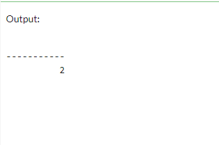

```{r setup, include=FALSE}
    library(knitr)
    library(tidyverse)
knitr::opts_chunk$set(
comment=NA,
error=F, 
warning=F,
tidy=TRUE, 
fig.align = 'center',
message=F, 
warning=F,
tidy.opts=list(width.cutoff=60),
fig.width=4, 
fig.height=4, 
fig.path='Figs/')
library(DBI)
library(RSQLite)
```


# 
## Fillojmë me një tabelë

\AddToHookNext{env/Highlighting/begin}{\tiny}  

```{sql, eval=FALSE}
-- Krijo tabelën Klientë
CREATE TABLE Klientë (
  idKlienti int PRIMARY KEY IDENTITY(1,1),
  emri varchar(50),
  mbiemri varchar(50),
  email varchar(100) UNIQUE,
  telefoni varchar(20),
  adresa varchar(255),
  qyteti varchar(50),
  shteti varchar(50),
  kodi_postar varchar(10),
  data_regjistrimit DATE DEFAULT GETDATE()
);

```


## Fillojmë me një tabelë

\AddToHookNext{env/Highlighting/begin}{\tiny}  

```{sql, eval=FALSE}
-- Mbush tabelën Klientë me të dhëna shembull
INSERT INTO Klientë (emri, mbiemri, email, telefoni, adresa, qyteti, shteti, kodi_postar)
VALUES ('Ana', 'Hoxha', 'ana.hoxha@example.com', '0681234567', 'Rruga e Dibrës 12', 'Tiranë', 'Shqipëri', '1001');

INSERT INTO Klientë (emri, mbiemri, email, telefoni, adresa, qyteti, shteti, kodi_postar)
VALUES ('Maria', 'Anders', 'maria.anders@alfredsfutterkiste.com', '0123456789', 'Obere Str. 57', 'Berlin', 'Germany', '12209');

INSERT INTO Klientë (emri, mbiemri, email, telefoni, adresa, qyteti, shteti, kodi_postar)
VALUES ('Ana', 'Trujillo', 'ana.trujillo@emparedadosyhelados.com', '9876543210', 'Avda. de la Constitución 2222', 'México D.F.', 'Mexico', '05021');

INSERT INTO Klientë (emri, mbiemri, email, telefoni, adresa, qyteti, shteti, kodi_postar)
VALUES ('Antonio', 'Moreno', 'antonio.moreno@taqueria.com', '1234567890', 'Mataderos 2312', 'México D.F.', 'Mexico', '05023');

INSERT INTO Klientë (emri, mbiemri, email, telefoni, adresa, qyteti, shteti, kodi_postar)
VALUES ('Thomas', 'Hardy', 'thomas.hardy@aroundthehorn.com', '2345678901', '120 Hanover Sq.', 'London', 'UK', 'WA1 1DP');

INSERT INTO Klientë (emri, mbiemri, email, telefoni, adresa, qyteti, shteti, kodi_postar)
VALUES ('Christina', 'Berglund', 'christina.berglund@berglundssnabbkop.com', '3456789012', 'Berguvsvägen 8', 'Luleå', 'Sweden', 'S-958 22');

INSERT INTO Klientë (emri, mbiemri, email, telefoni, adresa, qyteti, shteti, kodi_postar)
VALUES ('Kardinali', 'Tom B. Erichsen', 'tom.kardinal@gmail.com', '454664446', 'Skagen 21', 'Stavanger','Norvegji', '4006');


```


## Deklarata INSERT INTO

Deklarata INSERT INTO përdoret për të futur të dhëna të reja në një tabelë.

## Sintaksa INSERT INTO

  - Është e mundur të shkruhet deklarata **INSERT INTO** në dy mënyra:

    1. Specifikoni emrat e kolonave dhe vlerat që do të futen:

```sql
    INSERT NË emrin e tabelës (kolona 1, kolona 2, kolona 3, ...)
    VALUES (vlera1, vlera2, vlera3, ...);
``` 


## Sintaksa INSERT INTO

  2. Nëse po shtoni vlera për të gjitha kolonat e tabelës, nuk keni nevojë të specifikoni emrat e kolonave në query-n SQL.
  
  - Megjithatë, sigurohuni që rendi i vlerave të jetë në të njëjtin rend si kolonat në tabelë. 

## Sintaksa INSERT INTO

  - Këtu, sintaksa **INSERT INTO** do të ishte si më poshtë:

```sql
  INSERT INTO table_name
  VALUES (vlera1, vlera2, vlera3, ...);

``` 


## Shembull

Deklarata e mëposhtme SQL fut një rekord të ri në tabelën "Klientë":

## Shembull 

```sql
INSERT INTO Klientë (emri, mbiemri, email, telefoni, adresa, qyteti, shteti, kodi_postar)
VALUES ('Kardinali', 'Tom B. Erichsen', 'tom.kardinal@gmail.com', '454664446', 'Skagen 21', 'Stavanger','Norvegji',  '4006');
``` 

## Shembull 

Zgjedhja nga tabela "Klientë" tani do të duket kështu:

```{sql, eval=FALSE}
SELECT * FROM Klientë;
```


## Shembull

 


## Sintaksa INSERT INTO

  - A e keni vënë re që nuk kemi futur ndonjë numër në fushën e ID-së së klientit?

  - Kolona **idKlienti** është një fushë me rritje automatike dhe do të gjenerohet automatikisht kur një rekord i ri futet në tabelë.

## Futja e të dhënave vetëm në kolonat e specifikuara

  - Është gjithashtu e mundur që të futen të dhëna vetëm në kolona specifike.

## Futja e të dhënave vetëm në kolonat e specifikuara

  - Deklarata e mëposhtme SQL do të fusë një rekord të ri, por fut vetëm të dhëna në kolonat "emri", "qyteti" dhe "shteti" 
  
  (ID-ja e klientit do të përditësohet automatikisht):


## Shembull

\AddToHookNext{env/Highlighting/begin}{\tiny}  

```sql
-- Mbush tabelën Klientë me të dhëna shtesë, duke siguruar që email-i të jetë unik ose i bosh
INSERT INTO Klientë (emri, qyteti, shteti)
VALUES ('John', 'Wayne', 'Albania');
``` 

## Sintaksa INSERT INTO

  - Zgjedhja nga tabela "Klientë" tani do të duket kështu:

## Shembull

 


## Futja e shumë rreshtave

  - Është gjithashtu e mundur që të futen shumë rreshta në një deklaratë.

  - Për të futur shumë rreshta të dhënash, ne përdorim të njëjtën deklaratë **INSERT INTO**, por me vlera të shumta:

## Shembull

\AddToHookNext{env/Highlighting/begin}{\tiny}  

```{sql, eval=FALSE}
INSERT INTO Klientë (emri, mbiemri, adresa, qyteti, kodi_postar, shteti, email)
VALUES
('Cardinal', 'Tom B. Erichsen', 'Skagen 21', 'Stavanger', '4006', 'Norway', 'cardinal.erichsen@norway.com'),
('Greasy Burger', 'Per Olsen', 'Gateveien 15', 'Sandnes', '4306', 'Norway', 'greasy.burger@norway.com'),
('Tasty Tee', 'Finn Egan', 'Streetroad 19B', 'Liverpool', 'L1 0AA', 'UK', 'tasty.tee@uk.com');

-- Kontrollo të dhënat e futura përsëri
SELECT * FROM Klientë;
```

## Sintaksa INSERT INTO

  - Zgjedhja nga tabela "Klientë" tani do të duket kështu:

## Shembull

 

## Çfarë është një Vlerë NULL?

Një fushë me një vlerë NULL është një fushë pa vlerë.


## Çfarë është një Vlerë NULL?

  - Nëse një fushë në një tabelë është opsionale, është e mundur të futni një rekord të ri ose të përditësoni një rekord pa shtuar një vlerë     në këtë fushë. 
  
  - Atëherë, fusha do të ruhet me një vlerë NULL.

## Çfarë është një Vlerë NULL?

  - Një vlerë NULL është e ndryshme nga një vlerë zero ose një fushë që përmban hapësira. 
  
  - Një fushë me një vlerë NULL është një fushë që është lënë bosh gjatë krijimit të rekordit!

## Si të Testoni për Vlera NULL?

  - Nuk është e mundur të testoni për vlera NULL me operatorët e krahasimit, të tillë si =, <, ose <>.

  - Ne do të duhet të përdorim operatorët IS NULL dhe IS NOT NULL.

## Sintaksa IS NULL

\AddToHookNext{env/Highlighting/begin}{\tiny}  

```
SELECT emrat_e_kolonave
FROM emri_i_tabelës
WHERE emri_i_kolonës IS NULL;

```

## Sintaksa IS NOT NULL

\AddToHookNext{env/Highlighting/begin}{\tiny}  

```
SELECT emrat_e_kolonave
FROM emri_i_tabelës
WHERE emri_i_kolonës IS NOT NULL;


```


## Operator IS NULL

  - Operatori IS NULL përdoret për të testuar për vlera bosh (vlera NULL).

  - SQL-ja e mëposhtme rendit të gjithë klientët me një vlerë NULL në fushën "adresa":


## Tabela

\AddToHookNext{env/Highlighting/begin}{\tiny}  

```{sql, eval=FALSE}
-- Krijo tabelën Klientë
CREATE TABLE Klientë (
  idKlienti int PRIMARY KEY IDENTITY(1,1),
  emri varchar(50),
  mbiemri varchar(50),
  email varchar(100) UNIQUE,
  telefoni varchar(20),
  adresa varchar(255),
  qyteti varchar(50),
  shteti varchar(50),
  kodi_postar varchar(10),
  data_regjistrimit DATE DEFAULT GETDATE()
);


```


## Tabela

\AddToHookNext{env/Highlighting/begin}{\tiny}  

```{sql, eval=FALSE}

-- Mbush tabelën Klientë me të dhëna shembull, përfshirë disa me fusha adresa bosh
INSERT INTO Klientë (emri, mbiemri, email, telefoni, adresa, qyteti, shteti, kodi_postar)
VALUES 
('Ana', 'Hoxha', 'ana.hoxha@example.com', '0681234567', 'Rruga e Dibrës 12', 'Tiranë', 'Shqipëri', '1001'),
('Maria', 'Anders', 'maria.anders@alfredsfutterkiste.com', '0123456789', NULL, 'Berlin', 'Gjermani', '12209'),
('Ana', 'Trujillo', 'ana.trujillo@emparedadosyhelados.com', '9876543210', 'Avda. de la Constitución 2222', 'México D.F.', 'Meksikë', '05021'),
('Antonio', 'Moreno', 'antonio.moreno@taqueria.com', '1234567890', 'Mataderos 2312', 'México D.F.', 'Meksikë', '05023'),
('Thomas', 'Hardy', 'thomas.hardy@aroundthehorn.com', '2345678901', NULL, 'London', 'MB', 'WA1 1DP'),
('Christina', 'Berglund', 'christina.berglund@berglundssnabbkop.com', '3456789012', 'Berguvsvägen 8', 'Luleå', 'Suedi', 'S-958 22'),
('Kardinali', 'Tom B. Erichsen', 'tom.kardinal@gmail.com', '454664446', 'Skagen 21', 'Stavanger','Norvegji', '4006'),
('John', 'Wayne', NULL, NULL, NULL, 'Wayne', 'Albania', NULL);

```


## Testimi për Vlera NULL


\AddToHookNext{env/Highlighting/begin}{\tiny}  

```{sql, eval=FALSE}
SELECT emri, mbiemri, adresa
FROM Klientë
WHERE adresa IS NULL;

```


## Shembull

 


## Testimi për Vlera NOT NULL


\AddToHookNext{env/Highlighting/begin}{\tiny}  

```{sql, eval=FALSE}
SELECT emri, mbiemri, adresa
FROM Klientë
WHERE adresa IS NOT NULL;


```


## Shembull

 


## Deklarata SQL UPDATE

Deklarata `UPDATE` përdoret për të modifikuar rekordet ekzistuese në një tabelë.

## Sintaksa UPDATE

```sql
UPDATE emri_i_tabelës
SET kolona1 = vlera1, kolona2 = vlera2, ...
WHERE kushti;

```

## Sintaksa UPDATE

  - Bëni kujdes kur përditësoni rekordet në një tabelë! 
  
  - Vini re klauzolën WHERE në deklaratën UPDATE. Klauzola WHERE specifikon cilat rekorde do të përditësohen. 
  
  - Nëse e lini jashtë klauzolën WHERE, të gjitha rekordet në tabelë do të përditësohen!


## Përditësimi i Një Rekordi

  Deklarata SQL më poshtë përditëson klientin e parë (idKlienti = 1) me një kontakt të ri dhe një qytet të ri.

\AddToHookNext{env/Highlighting/begin}{\tiny}  

```{sql, eval=FALSE}
UPDATE Klientë
SET mbiemri = 'Schmidt', qyteti = 'Frankfurt'
WHERE idKlienti = 1;
```


## Sintaksa INSERT INTO

  - Zgjedhja nga tabela "Klientë" tani do të duket kështu:

## Shembull

 


## Përditësimi i Rekordeve të Shumta

  - Është klauzola **WHERE** që përcakton se sa rekorde do të përditësohen.

  - Deklarata SQL më poshtë do të përditësojë mbiemrin në "Juan" për të gjitha rekordet ku shteti është "Meksikë":


## Përditësimi i Rekordeve të Shumta

\AddToHookNext{env/Highlighting/begin}{\tiny}  

```{sql, eval=FALSE}
UPDATE Klientë
SET mbiemri = 'Juan'
WHERE shteti = 'Meksikë';
```


## Sintaksa INSERT INTO

  - Zgjedhja nga tabela "Klientë" tani do të duket kështu:

## Shembull

 


## Paralajmërim për Përditësimin

  - Bëni kujdes kur përditësoni rekordet. 
  
  - Nëse e lini jashtë klauzolën WHERE, të gjitha rekordet do të përditësohen!

## Pa Klauzolën WHERE

\AddToHookNext{env/Highlighting/begin}{\tiny}  

```{sql, eval=FALSE}
UPDATE Klientë
SET mbiemri = 'Juan';
```


## Pa Klauzolën WHERE

  - Zgjedhja nga tabela "Klientë" tani do të duket kështu:

## Shembull

 


## Deklarata SQL DELETE

Deklarata `DELETE` përdoret për të fshirë rekordet ekzistuese në një tabelë.

## Sintaksa DELETE

```sql
DELETE FROM emri_i_tabelës WHERE kushti;
```

## Sintaksa DELETE

  - Bëni kujdes kur fshini rekorde në një tabelë! 
  
  - Vini re klauzolën WHERE në deklaratën DELETE. 
  
  - Klauzola WHERE specifikon cilat rekorde do të fshihen. 
  
  - Nëse e lini jashtë klauzolën WHERE, të gjitha rekordet në tabelë do të fshihen!


## Shembulli DELETE

  - Deklarata SQL më poshtë fshin klientin "Alfreds Futterkiste" nga tabela Klientë:


## Shembulli DELETE

\AddToHookNext{env/Highlighting/begin}{\tiny}  

```{sql, eval=FALSE}
DELETE FROM Klientë WHERE emri='John' AND mbiemri='Wayne';
```


## Shembulli DELETE

  - Zgjedhja nga tabela "Klientë" tani do të duket kështu:

## Shembulli DELETE

 


## Fshirja e të Gjitha Rekordeve

  - Është e mundur të fshini të gjitha rreshtat në një tabelë pa e fshirë tabelën. 
  
  - Kjo do të thotë që struktura e tabelës, atributet dhe indekset do të mbeten të paprekura:


## Fshirja e të Gjitha Rekordeve

```sql
DELETE FROM emri_i_tabelës;
```

## Fshirja e të Gjitha Rekordeve

  - Deklarata SQL më poshtë fshin të gjitha rreshtat në tabelën Klientë, pa e fshirë tabelën:
  
  
## Fshirja e të Gjitha Rekordeve

\AddToHookNext{env/Highlighting/begin}{\tiny}  

```{sql, eval=FALSE}
DELETE FROM Klientë;
```


## Fshirja e të Gjitha Rekordeve

  - Zgjedhja nga tabela "Klientë" tani do të duket kështu:

## Fshirja e të Gjitha Rekordeve

   
  
  

## Fshirja e një Tabele

Për të fshirë plotësisht një tabelë, përdorni deklaratën DROP TABLE:

\AddToHookNext{env/Highlighting/begin}{\tiny} 

```{sql, eval=FALSE}
DROP TABLE Klientë;
```


## Klauzola SQL SELECT TOP

  - Klauzola `SELECT TOP` përdoret për të specifikuar numrin e rekordeve që do të kthehen.

  - Klauzola `SELECT TOP` është e dobishme në tabelat e mëdha me mijëra rekorde. 
  
  - Kthimi i një numri të madh rekordesh mund të ndikojë në performancë.

## Sintaksa për SQL Server 

\AddToHookNext{env/Highlighting/begin}{\tiny} 

```sql
SELECT TOP numri|përqindja kolona(t)
FROM emri_i_tabelës
WHERE kushti;
```


## Shembull

  - Zgjedh vetëm tre rekordet e para të tabelës Klientë:


## Shembull

\AddToHookNext{env/Highlighting/begin}{\tiny} 

```{sql, eval=FALSE}
SELECT TOP 3 * FROM Klientë;
```


## Shembull

   


## Shembulli i Përqindjes në SQL Server


  - Zgjedh 50% të parë të rekordeve nga tabela Klientë:
  
  \AddToHookNext{env/Highlighting/begin}{\tiny} 

```{sql, eval=FALSE}
SELECT TOP 50 PERCENT * FROM Klientë;
```


## Shtimi i Klauzolës WHERE

  - Zgjedh tre rekordet e para nga tabela Klientë, ku shteti është "Gjermani":


## Shtimi i Klauzolës WHERE

\AddToHookNext{env/Highlighting/begin}{\tiny} 


```{sql, eval=FALSE}
SELECT TOP 3 * FROM Klientë
WHERE shteti='Gjermani';
```


## Shembull

  

## Shtimi i Fjalës Kyçe ORDER BY

  - Shtoni fjalën kyçe **ORDER BY** kur dëshironi të renditni rezultatin dhe të ktheni tre rekordet e para të rezultatit të renditur.

## Shembull

  - Renditni rezultatin në mënyrë alfabetike të kundërt sipas emrit, dhe ktheni tre rekordet e para:
  
\AddToHookNext{env/Highlighting/begin}{\tiny}   

```{sql, eval=FALSE}
SELECT TOP 3 * FROM Klientë
ORDER BY emri DESC;
```


## Shembull

  


## Funksionet Agreguese në SQL

  - Një funksion agregues është një funksion që kryen një llogaritje mbi një grup vlerash dhe kthen një vlerë të vetme.


## Funksionet Agreguese në SQL

  - Funksionet agreguese shpesh përdoren me klauzolën `GROUP BY` të deklaratës `SELECT`. 
  
  - Klauzola `GROUP BY` ndan grupin e rezultateve në grupe vlerash dhe funksioni agregues mund të përdoret për të kthyer një vlerë të vetme     për secilin grup.

## Funksionet Agreguese në SQL

Funksionet agreguese më të përdorura në SQL janë:

  - **MIN()** - kthen vlerën më të vogël brenda kolonës së zgjedhur
  - **MAX()** - kthen vlerën më të madhe brenda kolonës së zgjedhur
  - **COUNT()** - kthen numrin e rreshtave në një grup
  - **SUM()** - kthen shumën totale të një kolone numerike
  - **AVG()** - kthen vlerën mesatare të një kolone numerike

## Funksionet Agreguese në SQL

Funksionet agreguese injorojnë vlerat null (përveç **COUNT()**).


## Funksionet SQL MIN() dhe MAX()

  - Funksioni `MIN()` kthen vlerën më të vogël të kolonës së zgjedhur.

  - Funksioni `MAX()` kthen vlerën më të madhe të kolonës së zgjedhur.

## Shembull për MIN()

Gjeni çmimin më të ulët në kolonën `Çmimi`:

\AddToHookNext{env/Highlighting/begin}{\tiny} 

```sql
SELECT MIN(Çmimi)
FROM Produkte;
```

## Tabela

\AddToHookNext{env/Highlighting/begin}{\tiny} 

```{sql, eval=FALSE}
-- Krijo tabelën Produkte
CREATE TABLE Produkte (
  ProduktID int PRIMARY KEY IDENTITY(1,1),
  EmriProduktit varchar(255) NOT NULL,
  FurnizuesiID int NOT NULL,
  KategoriaID int NOT NULL,
  Njesia varchar(255) NOT NULL,
  Çmimi decimal(10, 2) NOT NULL
);
```

## Tabela

\AddToHookNext{env/Highlighting/begin}{\tiny} 

```{sql, eval=FALSE}
-- Mbush tabelën Produkte me të dhëna shembull
INSERT INTO Produkte (EmriProduktit, FurnizuesiID, KategoriaID, Njesia, Çmimi)
VALUES 
('Chais', 1, 1, '10 kuti x 20 qese', 18.00),
('Chang', 1, 1, '24 - 12 oz shishe', 19.00),
('Aniseed Syrup', 1, 2, '12 - 550 ml shishe', 10.00),
('Chef Anton''s Cajun Seasoning', 2, 2, '48 - 6 oz kavanoza', 22.00),
('Chef Anton''s Gumbo Mix', 2, 2, '36 kuti', 21.35);
```


## Shembull për MAX()

  Gjeni çmimin më të lartë në kolonën Çmimi:

```{sql, eval=FALSE}
SELECT MAX(Çmimi)
FROM Produkte;
```


## Shembull

  

## Përcaktoni Emrin e Kolonës (Alias)

  - Kur përdorni MIN() ose MAX(), kolona e kthyer nuk do të ketë një emër përshkrues. 
  
  - Për t'i dhënë kolonës një emër përshkrues, përdorni fjalën kyçe AS:


## Përcaktoni Emrin e Kolonës (Alias)

\AddToHookNext{env/Highlighting/begin}{\tiny} 


```{sql, eval=FALSE}
SELECT MIN(Çmimi) AS ÇmimiMeIUlët
FROM Produkte;
```


## Shembull

 


## Përdorni MIN() me GROUP BY

  Këtu përdorim funksionin MIN() dhe klauzolën GROUP BY, për të kthyer çmimin më të ulët për secilën kategori në tabelën Produkte:

## Përdorni MIN() me GROUP BY

\AddToHookNext{env/Highlighting/begin}{\tiny} 


```{sql, eval=FALSE}
SELECT MIN(Çmimi) AS ÇmimiMeIUlët, KategoriaID
FROM Produkte
GROUP BY KategoriaID;
```


## Shembull

 


## Funksioni SQL COUNT()

  - Funksioni `COUNT()` kthen numrin e rreshtave që përputhen me një kriter të specifikuar.

## Shembull

Gjeni numrin total të rreshtave në tabelën `Produkte`:

\AddToHookNext{env/Highlighting/begin}{\tiny} 

```{sql, eval=FALSE}
SELECT COUNT(*)
FROM Produkte;
```

## Shembull

 


## Sintaksa

\AddToHookNext{env/Highlighting/begin}{\tiny}

```sql
SELECT COUNT(emri_i_kolonës)
FROM emri_i_tabelës
WHERE kushti;
```

## Përcaktoni Emrin e Kolonës

  - Ju mund të përcaktoni një emër kolone në vend të simbolit yll (). 
  
  - Nëse përcaktoni një emër kolone në vend të (), vlerat NULL nuk do të numërohen.

## Shembull

Gjeni numrin e produkteve ku EmriProduktit nuk është null:

\AddToHookNext{env/Highlighting/begin}{\tiny}

## Shembull

Gjeni numrin total të rreshtave në tabelën `Produkte`:

\AddToHookNext{env/Highlighting/begin}{\tiny} 

```{sql, eval=FALSE}
SELECT COUNT(EmriProduktit)
FROM Produkte;
```

## Shembull

 


## Shtimi i Klauzolës WHERE

Ju mund të shtoni një klauzolë WHERE për të specifikuar kushtet:

## Shembull

Gjeni numrin e produkteve ku çmimi është më i lartë se 20:

\AddToHookNext{env/Highlighting/begin}{\tiny}

```{sql, eval=FALSE}
SELECT COUNT(ProduktID)
FROM Produkte
WHERE Çmimi > 20;
```


## Shembull

 
## Injoroni Dublikatat

  - Ju mund të injoroni dublikatat duke përdorur fjalën kyçe DISTINCT në funksionin COUNT().

  - Nëse specifikohet DISTINCT, rreshtat me të njëjtën vlerë për kolonën e specifikuar do të numërohen si një.

## Shembull

Sa çmime të ndryshme ka në tabelën Produkte:

\AddToHookNext{env/Highlighting/begin}{\tiny}

```{sql, eval=FALSE}
SELECT COUNT(DISTINCT Çmimi)
FROM Produkte;
```

## Shembull

 

## Përdorimi i Një Alias

Jepni kolonës së numëruar një emër duke përdorur fjalën kyçe AS.

## Shembull

Jepni kolonës emrin "Numri i Rekordeve":

\AddToHookNext{env/Highlighting/begin}{\tiny}

```{sql, eval=FALSE}
SELECT COUNT(*) AS [Numri i Rekordeve]
FROM Produkte;
```


## Shembull

 


## Përdorni COUNT() me GROUP BY

  - Këtu përdorim funksionin COUNT() dhe klauzolën GROUP BY, për të kthyer numrin e rekordeve për secilën kategori në tabelën Produkte:

## Shembull


\AddToHookNext{env/Highlighting/begin}{\tiny}

```{sql, eval=FALSE}
SELECT COUNT(*) AS [Numri i Rekordeve], KategoriaID
FROM Produkte
GROUP BY KategoriaID;
```

## Shembull

 


## Funksioni SQL SUM()

Funksioni `SUM()` kthen shumën totale të një kolone numerike.


## Tabela

\AddToHookNext{env/Highlighting/begin}{\tiny}

```{sql, eval=FALSE}
-- Krijo tabelën DetajetPorosi
CREATE TABLE DetajetPorosi (
  DetajetPorosiID int PRIMARY KEY IDENTITY(1,1),
  PorosiaID int NOT NULL,
  ProduktiID int NOT NULL,
  Sasia int NOT NULL
);

```


## Tabela

\AddToHookNext{env/Highlighting/begin}{\tiny}

```{sql, eval=FALSE}
-- Mbush tabelën DetajetPorosi me të dhëna shembull
INSERT INTO DetajetPorosi (PorosiaID, ProduktiID, Sasia)
VALUES 
(10248, 11, 12),
(10248, 42, 10),
(10248, 72, 5),
(10249, 14, 9),
(10249, 51, 40);
```


## Shembull

Ktheni shumën e të gjitha fushave `Sasia` në tabelën `DetajetPorosi`:

\AddToHookNext{env/Highlighting/begin}{\tiny} 

```{sql, eval=FALSE}
SELECT SUM(Sasia)
FROM DetajetPorosi;
```


## Shembull

 


## Sintaksa

\AddToHookNext{env/Highlighting/begin}{\tiny}

```sql
SELECT SUM(emri_i_kolonës)
FROM emri_i_tabelës
WHERE kushti;
```


## Shtimi i Klauzolës WHERE

Ju mund të shtoni një klauzolë WHERE për të specifikuar kushtet:

## Shembull

Ktheni shumën e fushës Sasia për produktin me ProduktiID 11:

\AddToHookNext{env/Highlighting/begin}{\tiny}

```{sql, eval=FALSE}
SELECT SUM(Sasia)
FROM DetajetPorosi
WHERE ProduktiID = 11;
```


## Shembull

 

## Përdorimi i Një Alias

Jepni kolonës së përmbledhur një emër duke përdorur fjalën kyçe AS.

## Shembull

Jepni kolonës emrin "totali":

\AddToHookNext{env/Highlighting/begin}{\tiny}

```{sql, eval=FALSE}
SELECT SUM(Sasia) AS totali
FROM DetajetPorosi;
```


## Shembull

 


## Përdorni SUM() me GROUP BY

Këtu përdorim funksionin SUM() dhe klauzolën GROUP BY, për të kthyer shumën e Sasia për secilin PorosiaID në tabelën DetajetPorosi:

## Shembull

\AddToHookNext{env/Highlighting/begin}{\tiny}

```{sql, eval=FALSE}
SELECT PorosiaID, SUM(Sasia) AS [Sasia Totale]
FROM DetajetPorosi
GROUP BY PorosiaID;
```

## Shembull

 

## SUM() me Një Shprehje

  - Parametri brenda funksionit SUM() mund të jetë gjithashtu një shprehje.

  - Nëse supozojmë se secili produkt në tabelën DetajetPorosi kushton 10 dollarë, mund të gjejmë fitimet totale në dollarë duke shumëzuar    çdo sasi me 10:

## Shembull

Përdorni një shprehje brenda funksionit SUM():

\AddToHookNext{env/Highlighting/begin}{\tiny}

```{sql, eval=FALSE}
SELECT SUM(Sasia * 10)
FROM DetajetPorosi;
```

## Shembull

 


## SUM() me Një Shprehje


Ne gjithashtu mund të bashkojmë tabelën DetajetPorosi me tabelën Produkte për të gjetur shumën aktuale, në vend që të supozojmë se është 10 dollarë:


## Tabela

```{sql, eval=FALSE}
-- Krijo tabelën Produkte
CREATE TABLE Produkte (
  ProduktiID int PRIMARY KEY IDENTITY(1,1),
  EmriProduktit varchar(255) NOT NULL,
  Çmimi decimal(10, 2) NOT NULL
);

```


## Tabela

```{sql, eval=FALSE}
-- Mbush tabelën Produkte me të dhëna shembull
INSERT INTO Produkte (EmriProduktit, Çmimi)
VALUES 
('Produkt1', 10.00),
('Produkt2', 20.00),
('Produkt3', 15.00);
```

## Tabela

```{sql, eval=FALSE}
-- Krijo tabelën DetajetPorosi
CREATE TABLE DetajetPorosi (
  DetajetPorosiID int PRIMARY KEY IDENTITY(1,1),
  PorosiaID int NOT NULL,
  ProduktiID int NOT NULL,
  Sasia int NOT NULL
);

```


## Tabela

```{sql, eval=FALSE}
-- Mbush tabelën DetajetPorosi me të dhëna shembull
INSERT INTO DetajetPorosi (PorosiaID, ProduktiID, Sasia)
VALUES 
(1, 1, 2),
(1, 2, 1),
(2, 3, 3);
```


## Shembull

Bashkoni tabelën DetajetPorosi me Produkte, dhe përdorni SUM() për të gjetur shumën totale:

\AddToHookNext{env/Highlighting/begin}{\tiny}


```{sql, eval=FALSE}
SELECT SUM(Çmimi * Sasia) AS ShumaTotale
FROM DetajetPorosi
LEFT JOIN Produkte ON DetajetPorosi.ProduktiID = Produkte.ProduktiID;

```

## Shembull

 


