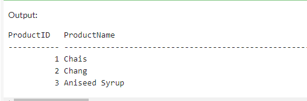

```{r setup, include=FALSE}
    library(knitr)
    library(tidyverse)
knitr::opts_chunk$set(
comment=NA,
error=F, 
warning=F,
tidy=TRUE, 
fig.align = 'center',
message=F, 
warning=F,
tidy.opts=list(width.cutoff=60),
fig.width=4, 
fig.height=4, 
fig.path='Figs/')
library(DBI)
library(RSQLite)
```


# 


## Funksioni SQL AVG()

  - Funksioni `AVG()` kthen vlerën mesatare të një kolone numerike.

## Funksioni SQL AVG()

  - Sintaksa:

```{sql, eval=FALSE}
SELECT AVG(kolona_emri)
FROM tabela_emri
WHERE kushti;
```


## Shembull: Mesatarja e Çmimit të Produkteve


\AddToHookNext{env/Highlighting/begin}{\tiny} 

```{sql, eval=FALSE}
## Tabela e produkteve që do të përdorim 

-- Krijo tabelën Products
CREATE TABLE Products (
    ProductID int,
    ProductName varchar(255),
    SupplierID int,
    CategoryID int,
    Unit varchar(255),
    Price float
);
```

## Shembull: Mesatarja e Çmimit të Produkteve

\AddToHookNext{env/Highlighting/begin}{\tiny} 

```{sql, eval=FALSE}
-- Shto të dhënat në tabelën Products
INSERT INTO Products (ProductID, ProductName, SupplierID, CategoryID, Unit, Price) VALUES
(1, 'Chais', 1, 1, '10 boxes x 20 bags', 18),
(2, 'Chang', 1, 1, '24 - 12 oz bottles', 19),
(3, 'Aniseed Syrup', 1, 2, '12 - 550 ml bottles', 10),
(4, 'Chef Anton''s Cajun Seasoning', 2, 2, '48 - 6 oz jars', 22),
(5, 'Chef Anton''s Gumbo Mix', 2, 2, '36 boxes', 21.35);
```


## Shtimi i Klauzolës WHERE

Shembull: Mesatarja e çmimit të produkteve në kategorinë 1:

\AddToHookNext{env/Highlighting/begin}{\tiny} 

```{sql, eval=FALSE}
SELECT AVG(Price)
FROM Products
WHERE CategoryID = 1;
```


## Shembull

 


## Përdorimi i Alias-it

Shembull: Emërtimi i kolonës mesatare të çmimit si "çmimi mesatar":

\AddToHookNext{env/Highlighting/begin}{\tiny} 

```{sql, eval=FALSE}

SELECT AVG(Price) AS [çmimi mesatar]
FROM Products;
```


## Shembull

 


## Produkte me Çmim Më të Lartë se Mesatarja

Shembull: Të gjitha produktet me çmim më të lartë se mesatarja:

\AddToHookNext{env/Highlighting/begin}{\tiny} 

```{sql, eval=FALSE}
SELECT *
FROM Products
WHERE Price > (SELECT AVG(Price) FROM Products);
```

## Shembull

 


## Përdorimi i AVG() me GROUP BY

Shembull: Mesatarja e çmimit për çdo kategori në tabelën e Produkteve:

\AddToHookNext{env/Highlighting/begin}{\tiny} 

```{sql, eval=FALSE}
SELECT AVG(Price) AS MesatarjaECmimit, CategoryID
FROM Products
GROUP BY CategoryID;
```


## Shembull

 


## Funksioni SQL LIKE

  Operatori LIKE përdoret në klauzolën **WHERE** për të kërkuar një model të specifikuar në një kolonë.

\AddToHookNext{env/Highlighting/begin}{\tiny} 

```{sql, eval=FALSE}
SELECT kolona1, kolona2, ...
FROM tabela_emri
WHERE kolonaN LIKE modeli;
```


## Tabela e klientëve që do të përdorim për shembujt

\AddToHookNext{env/Highlighting/begin}{\tiny} 

```{sql, eval=FALSE}
-- Krijo tabelën Customers
CREATE TABLE Customers (
    CustomerID int,
    CustomerName varchar(255),
    ContactName varchar(255),
    Address varchar(255),
    City varchar(255),
    PostalCode varchar(50),
    Country varchar(100)
);
```

## Tabela e klientëve që do të përdorim për shembujt

\AddToHookNext{env/Highlighting/begin}{\tiny} 

```{sql, eval=FALSE}
-- Shto të dhënat në tabelën Customers
INSERT INTO Customers (CustomerID, CustomerName, ContactName, Address, City, PostalCode, Country) VALUES
(1, 'Alfreds Futterkiste', 'Maria Anders', 'Obere Str. 57', 'Berlin', '12209', 'Germany'),
(2, 'Ana Trujillo Emparedados y helados', 'Ana Trujillo', 'Avda. de la Constitución 2222', 'México D.F.', '05021', 'Mexico'),
(3, 'Antonio Moreno Taquería', 'Antonio Moreno', 'Mataderos 2312', 'México D.F.', '05023', 'Mexico'),
(4, 'Around the Horn', 'Thomas Hardy', '120 Hanover Sq.', 'London', 'WA1 1DP', 'UK'),
(5, 'Berglunds snabbköp', 'Christina Berglund', 'Berguvsvägen 8', 'Luleå', 'S-958 22', 'Sweden');
```


## Fillon me një shkronjë të caktuar

```{sql, eval=FALSE}
SELECT *
FROM Customers
WHERE CustomerName LIKE 'a%';
```


## Shembull

 

##  Wildcard

  - Wildcard $\_$ përfaqëson një karakter të vetëm.

  - Shembull: Qyteti që fillon me 'L' dhe përfundon me dy wildcard karaktere


##  Wildcard

```{sql, eval=FALSE}
SELECT *
FROM Customers
WHERE City LIKE 'L_nd__';
```


## Shembull

  - The $%$ Wildcard
  
  - Wildcard $%$ përfaqëson çdo numër karakteresh, përfshirë zero karaktere.

  - Shembull: Qyteti që përmban shkronjën 'L'


##  Wildcard

```{sql, eval=FALSE}
SELECT *
FROM Customers
WHERE City LIKE '%L%';
```


## Shembull

 

##  Fillon me

  Për të kthyer të dhëna që fillojnë me një shkronjë ose frazë specifike, shtoni $%$ në fund të shkronjës ose frazës.

## Shembull: Fillon me 'Al'

\AddToHookNext{env/Highlighting/begin}{\tiny} 

```{sql, eval=FALSE}
SELECT *
FROM Customers
WHERE CustomerName LIKE 'Al%';
```

## Shembull

 

## Përfundon me

  Për të kthyer të dhëna që përfundojnë me një shkronjë ose frazë specifike, shtoni $%$ në fillim të shkronjës ose frazës.

##  Shembull: Përfundon me 'a'

```{sql, eval=FALSE}
SELECT *
FROM Customers
WHERE CustomerName LIKE '%a';
```

## Shembull

 

## Përmban

  - Për të kthyer të dhëna që përmbajnë një shkronjë ose frazë specifike, shtoni $%$ para dhe pas shkronjës ose frazës.
## Shembull: Përmban frazën 'or'

```{sql, eval=FALSE}
SELECT *
FROM Customers
WHERE CustomerName LIKE '%or%';
```

## Shembull

 
## Kombinimi i Wildcards

  - Çdo wildcard, si $%$ dhe $\_$, mund të përdoret në kombinim me wildcard të tjerë.


## Shembull: Fillon me 'a' dhe ka të paktën 3 karaktere

```{sql, eval=FALSE}
SELECT *
FROM Customers
WHERE CustomerName LIKE 'a__%';
```

## Shembull

 

## Pa Wildcard

  - Nëse nuk specifikohet asnjë wildcard, fraza duhet të ketë një përputhje të saktë për të kthyer një rezultat.

## Shembull: Nga Spanja

```{sql, eval=FALSE}
SELECT *
FROM Customers
WHERE Country LIKE 'Spain';
```


## Karakteret Wildcard në SQL

  - Një karakter wildcard përdoret për të zëvendësuar një ose më shumë karaktere në një varg.

  - Karakteret wildcard përdoren me operatorin LIKE. 
  
  - Operatori LIKE përdoret në klauzolën WHERE për të kërkuar një model të specifikuar në një kolonë.


## Sintaksa

```{sql, eval=FALSE}
SELECT kolona1, kolona2, ...
FROM tabela_emri
WHERE kolonaN LIKE modeli;
```

## SQL Query për Krijimin e Tabelës "Customers" dhe Shtimin e Të Dhënave

\AddToHookNext{env/Highlighting/begin}{\tiny} 

```{sql, eval=FALSE}
-- Krijo tabelën Customers
CREATE TABLE Customers (
    CustomerID int,
    CustomerName varchar(255),
    ContactName varchar(255),
    Address varchar(255),
    City varchar(255),
    PostalCode varchar(50),
    Country varchar(100)
);
```


## SQL Query për Krijimin e Tabelës "Customers" dhe Shtimin e Të Dhënave

\AddToHookNext{env/Highlighting/begin}{\tiny} 

```{sql, eval=FALSE}
-- Shto të dhënat në tabelën Customers
INSERT INTO Customers (CustomerID, CustomerName, ContactName, Address, City, PostalCode, Country) VALUES
(1, 'Alfreds Futterkiste', 'Maria Anders', 'Obere Str. 57', 'Berlin', '12209', 'Germany'),
(2, 'Ana Trujillo Emparedados y helados', 'Ana Trujillo', 'Avda. de la Constitución 2222', 'México D.F.', '05021', 'Mexico'),
(3, 'Antonio Moreno Taquería', 'Antonio Moreno', 'Mataderos 2312', 'México D.F.', '05023', 'Mexico'),
(4, 'Around the Horn', 'Thomas Hardy', '120 Hanover Sq.', 'London', 'WA1 1DP', 'UK'),
(5, 'Berglunds snabbköp', 'Christina Berglund', 'Berguvsvägen 8', 'Luleå', 'S-958 22', 'Sweden');
```


## Përdorimi i Wildcard percentage

  - Wildcard $%$ përfaqëson çdo numër karakteresh, përfshirë zero karaktere.
  
  
  
## Shembull: Përfundon me 's'


```{sql, eval=FALSE}
SELECT *
FROM Customers
WHERE CustomerName LIKE '%s';
```

## Shembull

 

## Shembull

Shembull: Përmban 'rou'

```{sql, eval=FALSE}
SELECT *
FROM Customers
WHERE CustomerName LIKE '%rou%';
```

## Shembull

 

## Përdorimi i Wildcard $\_$

Wildcard $\_$ përfaqëson një karakter të vetëm.


## Shembull: Qyteti që fillon me ndonjë karakter dhe përfundon me 'ondon'

```{sql, eval=FALSE}
SELECT *
FROM Customers
WHERE City LIKE '_ondon';
```


## Shembull

 

## Shembull: Qyteti që fillon me 'L', ndjekur nga 3 karaktere, përfundon me 'on'

```{sql, eval=FALSE}
SELECT *
FROM Customers
WHERE City LIKE 'L___on';
```

## Shembull

 

## Përdorimi i Wildcard []

  - Wildcard [] kthen një rezultat nëse ndonjë nga karakteret brenda ka një përputhje.

## Shembull: Fillon me 'b', 's' ose 'p'

```{sql, eval=FALSE}
SELECT *
FROM Customers
WHERE CustomerName LIKE '[bsp]%';
```


## Shembull

 

## Përdorimi i Wildcard -

  - Wildcard - lejon specifikimin e një intervali karakteresh brenda wildcard [].

## Shembull: Fillon me 'a', 'b', 'c', 'd', 'e' ose 'f'


```{sql, eval=FALSE}
SELECT *
FROM Customers
WHERE CustomerName LIKE '[a-f]%';
```

## Shembull

 

## Kombinimi i Wildcards

  - Çdo wildcard, si $%$ dhe $\_$, mund të përdoret në kombinim me wildcard të tjerë.


## Shembull: Fillon me 'a' dhe ka të paktën 3 karaktere

```{sql, eval=FALSE}
SELECT *
FROM Customers
WHERE CustomerName LIKE 'a__%';
```

## Shembull

 

## Shembull: Ka 'r' në pozicionin e dytë

```{sql, eval=FALSE}
SELECT *
FROM Customers
WHERE CustomerName LIKE '_r%';
```

## Shembull

 


## Funksioni SQL IN

  - Operatori IN lejon specifikimin e vlerave të shumta në një klauzolë WHERE.

  - Operatori IN është një formë e shkurtër për kushtet e shumëfishta OR.

## Sintaksa

\AddToHookNext{env/Highlighting/begin}{\tiny} 

```{sql, eval=FALSE}
SELECT kolona_emri(a)
FROM tabela_emri
WHERE kolona_emri IN (vlera1, vlera2, ...);
```


##  SQL Query për Krijimin e Tabelës "Customers" dhe Shtimin e Të Dhënave

\AddToHookNext{env/Highlighting/begin}{\tiny} 

```{sql, eval=FALSE}
-- Krijo tabelën Customers
CREATE TABLE Customers (
    CustomerID int,
    CustomerName varchar(255),
    ContactName varchar(255),
    Address varchar(255),
    City varchar(255),
    PostalCode varchar(50),
    Country varchar(100)
);
```


##  SQL Query për Krijimin e Tabelës "Customers" dhe Shtimin e Të Dhënave

\AddToHookNext{env/Highlighting/begin}{\tiny} 

```{sql, eval=FALSE}
-- Shto të dhënat në tabelën Customers
INSERT INTO Customers (CustomerID, CustomerName, ContactName, Address, City, PostalCode, Country) VALUES
(1, 'Alfreds Futterkiste', 'Maria Anders', 'Obere Str. 57', 'Berlin', '12209', 'Germany'),
(2, 'Ana Trujillo Emparedados y helados', 'Ana Trujillo', 'Avda. de la Constitución 2222', 'México D.F.', '05021', 'Mexico'),
(3, 'Antonio Moreno Taquería', 'Antonio Moreno', 'Mataderos 2312', 'México D.F.', '05023', 'Mexico'),
(4, 'Around the Horn', 'Thomas Hardy', '120 Hanover Sq.', 'London', 'WA1 1DP', 'UK'),
(5, 'Berglunds snabbköp', 'Christina Berglund', 'Berguvsvägen 8', 'Luleå', 'S-958 22', 'Sweden');
```


## Përdorimi i IN

Shembull: Të gjithë klientët nga 'Germany', 'France', ose 'UK':


```{sql, eval=FALSE}
SELECT *
FROM Customers
WHERE Country IN ('Germany', 'France', 'UK');
```

## Shembull

 

## Përdorimi i NOT IN

Shembull: Të gjithë klientët që nuk janë nga 'Germany', 'France', ose 'UK':


```{sql, eval=FALSE}
SELECT *
FROM Customers
WHERE Country NOT IN ('Germany', 'France', 'UK');
```


## Shembull

 
## Tabela Orders

\AddToHookNext{env/Highlighting/begin}{\tiny} 

```{sql, eval=FALSE}
-- Krijo tabelën Orders
CREATE TABLE Orders (
    OrderID int,
    CustomerID int,
    EmployeeID int,
    OrderDate date,
    ShipperID int
);
```

## Tabela Orders

\AddToHookNext{env/Highlighting/begin}{\tiny} 

```{sql, eval=FALSE}
-- Shto të dhënat në tabelën Orders
INSERT INTO Orders (OrderID, CustomerID, EmployeeID, OrderDate, ShipperID) VALUES
(10248, 1, 5, '1996-07-04', 3),
(10249, 2, 6, '1996-07-05', 1),
(10250, 3, 4, '1996-07-08', 2),
(10251, 4, 3, '1996-07-08', 1),
(10252, 5, 4, '1996-07-09', 2);
```


## Përdorimi i IN me Subquery

Shembull: Të gjithë klientët që kanë një porosi në tabelën Orders:


```{sql, eval=FALSE}
SELECT *
FROM Customers
WHERE CustomerID IN (SELECT CustomerID FROM Orders);
```


## Shembull

 


## Përdorimi i NOT IN me Subquery


Shembull: Të gjithë klientët që NUK kanë bërë asnjë porosi në tabelën Orders:


```{sql, eval=FALSE}
SELECT *
FROM Customers
WHERE CustomerID NOT IN (SELECT CustomerID FROM Orders);
```


## Ushtrime

Ushtrim: Përdorni operatorin IN për të zgjedhur të gjitha të dhënat ku Country është 'Norway' ose 'France':

```{sql, eval=FALSE}
SELECT *
FROM Customers
WHERE Country IN ('Norway', 'France');
```

## Funksioni SQL BETWEEN

  - Operatori BETWEEN zgjedh vlerat brenda një diapazoni të dhënë.

  - Vlerat mund të jenë numra, tekste, ose data.

  - Operatori BETWEEN është gjithëpërfshirës: vlerat e fillimit dhe të fundit janë të përfshira.


## Sintaksa

```{sql, eval=FALSE}
SELECT kolona_emri(a)
FROM tabela_emri
WHERE kolona_emri BETWEEN vlera1 AND vlera2;
```

## SQL Query për Krijimin e Tabelës "Products" dhe "Orders" dhe Shtimin e Të Dhënave

```{sql, eval=FALSE}
-- Krijo tabelën Products
CREATE TABLE Products (
    ProductID int,
    ProductName varchar(255),
    SupplierID int,
    CategoryID int,
    Unit varchar(255),
    Price float
);
```

## SQL Query për Krijimin e Tabelës "Products" dhe "Orders" dhe Shtimin e Të Dhënave

\AddToHookNext{env/Highlighting/begin}{\tiny} 

```{sql, eval=FALSE}
-- Shto të dhënat në tabelën Products
INSERT INTO Products (ProductID, ProductName, SupplierID, CategoryID, Unit, Price) VALUES
(1, 'Chais', 1, 1, '10 boxes x 20 bags', 18),
(2, 'Chang', 1, 1, '24 - 12 oz bottles', 19),
(3, 'Aniseed Syrup', 1, 2, '12 - 550 ml bottles', 10),
(4, 'Chef Anton''s Cajun Seasoning', 2, 2, '48 - 6 oz jars', 22),
(5, 'Chef Anton''s Gumbo Mix', 2, 2, '36 boxes', 21.35);
```


## SQL Query për Krijimin e Tabelës "Products" dhe "Orders" dhe Shtimin e Të Dhënave

```{sql, eval=FALSE}
-- Krijo tabelën Orders
CREATE TABLE Orders (
    OrderID int,
    CustomerID int,
    EmployeeID int,
    OrderDate date,
    ShipperID int
);
```


## SQL Query për Krijimin e Tabelës "Products" dhe "Orders" dhe Shtimin e Të Dhënave

\AddToHookNext{env/Highlighting/begin}{\tiny} 

```{sql, eval=FALSE}

-- Shto të dhënat në tabelën Orders
INSERT INTO Orders (OrderID, CustomerID, EmployeeID, OrderDate, ShipperID) VALUES
(10248, 1, 5, '1996-07-04', 3),
(10249, 2, 6, '1996-07-05', 1),
(10250, 3, 4, '1996-07-08', 2),
(10251, 4, 3, '1996-07-08', 1),
(10252, 5, 4, '1996-07-09', 2);

```

## Përdorimi i BETWEEN për Numra

Shembull: Zgjedh të gjitha produktet me çmim midis 10 dhe 20:


```{sql, eval=FALSE}
SELECT *
FROM Products
WHERE Price BETWEEN 10 AND 20;
```

## Shembull

 

## Përdorimi i NOT BETWEEN për Numra

Shembull: Zgjedh të gjitha produktet jashtë diapazonit 10 dhe 20:

```{sql, eval=FALSE}
SELECT *
FROM Products
WHERE Price NOT BETWEEN 10 AND 20;
```


## Shembull

 

## Përdorimi i BETWEEN me IN

Shembull: Zgjedh të gjitha produktet me çmim midis 10 dhe 20 dhe CategoryID të jetë 1, 2 ose 3:


```{sql, eval=FALSE}
SELECT *
FROM Products
WHERE Price BETWEEN 10 AND 20
AND CategoryID IN (1, 2, 3);

```


## Shembull

 

## Përdorimi i BETWEEN për Tekste

Shembull: Zgjedh të gjitha produktet me emër alfabetikisht midis 'Carnarvon Tigers' dhe 'Mozzarella di Giovanni':

\AddToHookNext{env/Highlighting/begin}{\tiny} 

```{sql, eval=FALSE}
SELECT *
FROM Products
WHERE ProductName BETWEEN 'Carnarvon Tigers' AND 'Mozzarella di Giovanni'
ORDER BY ProductName;
```


## Shembull

 

## Përdorimi i NOT BETWEEN për Tekste

Shembull: Zgjedh të gjitha produktet me emër që nuk janë midis 'Carnarvon Tigers' dhe 'Mozzarella di Giovanni':

\AddToHookNext{env/Highlighting/begin}{\tiny} 

```{sql, eval=FALSE}
SELECT *
FROM Products
WHERE ProductName NOT BETWEEN 'Carnarvon Tigers' AND 'Mozzarella di Giovanni'
ORDER BY ProductName;
```


## Shembull

 

## Përdorimi i BETWEEN për Data

Shembull: Zgjedh të gjitha porositë me datë porosie midis '01-Korrik-1996' dhe '31-Korrik-1996':

\AddToHookNext{env/Highlighting/begin}{\tiny} 

```{sql, eval=FALSE}
SELECT *
FROM Orders
WHERE OrderDate BETWEEN '1996-07-01' AND '1996-07-31';

```


## Shembull

 


## Ushtrim: Përdorni operatorin BETWEEN për të zgjedhur të gjitha të dhënat ku vlera e kolonës Price është midis 10 dhe 20:

\AddToHookNext{env/Highlighting/begin}{\tiny} 

```{sql, eval=FALSE}
SELECT *
FROM Products
WHERE Price BETWEEN 10 AND 20;
```


## SQL JOIN

Një klauzolë JOIN përdoret për të kombinuar rreshtat nga dy ose më shumë tabela, bazuar në një kolonë të lidhur midis tyre.


## Sintaksa

\AddToHookNext{env/Highlighting/begin}{\tiny} 

```{sql, eval=FALSE}
SELECT kolona_emri(a)
FROM tabela1
JOIN tipi_i_join
ON tabela1.kolona_e_lidhur = tabela2.kolona_e_lidhur;
```

## SQL Query për Krijimin e Tabelave "Customers" dhe "Orders" dhe Shtimin e Të Dhënave

\AddToHookNext{env/Highlighting/begin}{\tiny} 

```{sql, eval=FALSE}

-- Krijo tabelën Customers
CREATE TABLE Customers (
    CustomerID int,
    CustomerName varchar(255),
    ContactName varchar(255),
    Country varchar(100)
);
```


## SQL Query për Krijimin e Tabelave "Customers" dhe "Orders" dhe Shtimin e Të Dhënave


\AddToHookNext{env/Highlighting/begin}{\tiny} 

```{sql, eval=FALSE}

-- Shto të dhënat në tabelën Customers
INSERT INTO Customers (CustomerID, CustomerName, ContactName, Country) VALUES
(1, 'Alfreds Futterkiste', 'Maria Anders', 'Germany'),
(2, 'Ana Trujillo Emparedados y helados', 'Ana Trujillo', 'Mexico'),
(3, 'Antonio Moreno Taquería', 'Antonio Moreno', 'Mexico');
```


## SQL Query për Krijimin e Tabelave "Customers" dhe "Orders" dhe Shtimin e Të Dhënave

\AddToHookNext{env/Highlighting/begin}{\tiny} 

```{sql, eval=FALSE}

-- Krijo tabelën Orders
CREATE TABLE Orders (
    OrderID int,
    CustomerID int,
    OrderDate date
);
```


## SQL Query për Krijimin e Tabelave "Customers" dhe "Orders" dhe Shtimin e Të Dhënave

\AddToHookNext{env/Highlighting/begin}{\tiny} 

```{sql, eval=FALSE}
-- Shto të dhënat në tabelën Orders
INSERT INTO Orders (OrderID, CustomerID, OrderDate) VALUES
(10308, 2, '1996-09-18'),
(10309, 37, '1996-09-19'),
(10310, 77, '1996-09-20');
```


## Shembull: INNER JOIN

Shembull: Zgjedh rreshtat që kanë vlera të përshtatshme në të dyja tabelat:


\AddToHookNext{env/Highlighting/begin}{\tiny} 


```{sql, eval=FALSE}

SELECT Orders.OrderID, Customers.CustomerName, Orders.OrderDate
FROM Orders
INNER JOIN Customers ON Orders.CustomerID=Customers.CustomerID;
```

## Shembull

 

## Llojet e Ndryshme të JOINs në SQL

  - INNER JOIN: Kthen rreshtat që kanë vlera të përshtatshme në të dyja tabelat.

  - LEFT (OUTER) JOIN: Kthen të gjithë rreshtat nga tabela e majtë dhe rreshtat e përshtatshme nga tabela e djathtë.
  
  - RIGHT (OUTER) JOIN: Kthen të gjithë rreshtat nga tabela e djathtë dhe rreshtat e përshtatshme nga tabela e majtë.

  - FULL (OUTER) JOIN: Kthen të gjithë rreshtat kur ka një përputhje në secilën nga tabelat e majta ose të djathta.

## Përdorimi i LEFT JOIN

Shembull: Zgjedh të gjithë rreshtat nga tabela e majtë dhe rreshtat e përshtatshme nga tabela e djathtë:

\AddToHookNext{env/Highlighting/begin}{\tiny} 

```{sql, eval=FALSE}
SELECT Orders.OrderID, Customers.CustomerName, Orders.OrderDate
FROM Orders
LEFT JOIN Customers ON Orders.CustomerID=Customers.CustomerID;
```

## Shembull

 

## Përdorimi i RIGHT JOIN

Shembull: Zgjedh të gjithë rreshtat nga tabela e djathtë dhe rreshtat e përshtatshme nga tabela e majtë:

\AddToHookNext{env/Highlighting/begin}{\tiny} 

```{sql, eval=FALSE}
SELECT Orders.OrderID, Customers.CustomerName, Orders.OrderDate
FROM Orders
RIGHT JOIN Customers ON Orders.CustomerID=Customers.CustomerID;
```

## Shembull

 

## Përdorimi i FULL OUTER JOIN

Shembull: Zgjedh të gjithë rreshtat kur ka një përputhje në secilën nga tabelat e majta ose të djathta:

\AddToHookNext{env/Highlighting/begin}{\tiny} 

```{sql, eval=FALSE}
SELECT Orders.OrderID, Customers.CustomerName, Orders.OrderDate
FROM Orders
FULL OUTER JOIN Customers ON Orders.CustomerID=Customers.CustomerID;
```


## Shembull

 

## Ushtrim

Ushtrim: Përmbushni pjesët e mungesë në klauzolën JOIN për të bashkuar tabelat Orders dhe Customers, duke përdorur fushën CustomerID si lidhje midis të dyjave:

\AddToHookNext{env/Highlighting/begin}{\tiny} 

```{sql, eval=FALSE}
SELECT *
FROM Orders
LEFT JOIN Customers
ON Orders.CustomerID = Customers.CustomerID;
```

