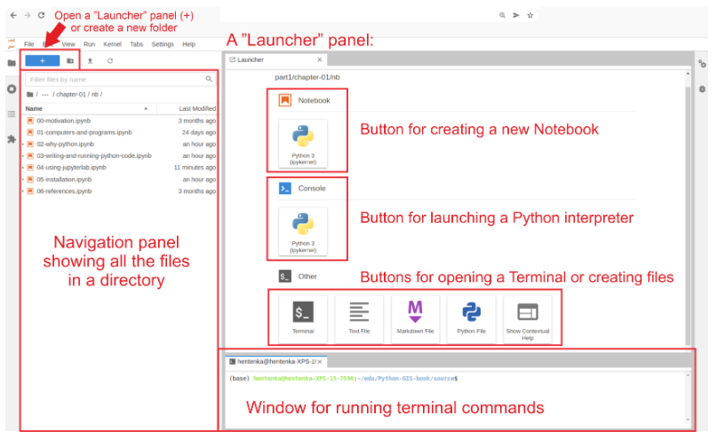
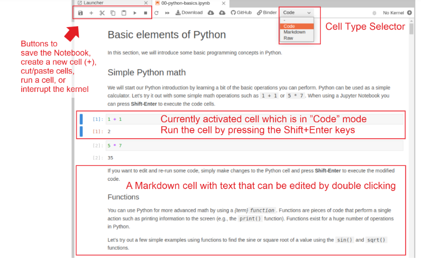
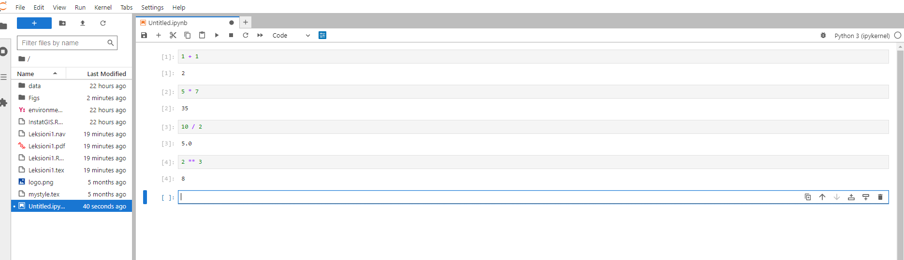
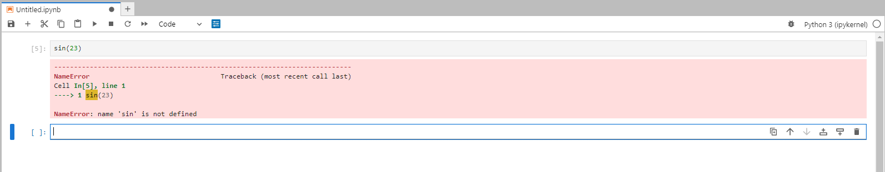
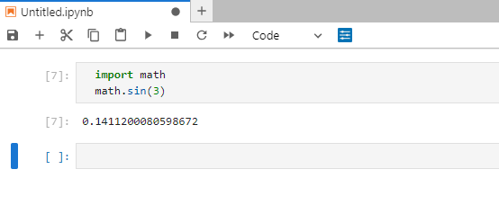
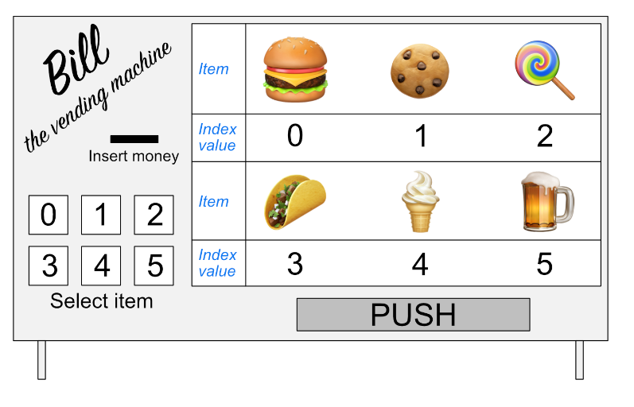

```{r setup, include=FALSE}
    library(knitr)
    library(tidyverse)
knitr::opts_chunk$set(
comment=NA,
error=T, 
warning=T,
tidy=TRUE, 
fig.align = 'center',
message=F, 
warning=F,
tidy.opts=list(width.cutoff=60),
fig.width=4, 
fig.height=4, 
fig.path='Figs/')
```

# Hyrje {-}

## Organizimi i kursit - Python

  - Instalimi i Python
  
  - Konceptet bazë të programimit në Python
  
  - Analizimi i të dhënave me Python
  
  - Vizualizimi i të dhënave në Python
  
  
## Organizimi i kursit - Python dhe GIS

  - Procesimi i të dhënave vektor
  
  - Procesimi i të dhënave raster
  
  - Vizualizimi i të dhënave gjeografike
  
  - Lidhja me burimet gjeografike online
  
  
## Organizimi i kursit - Python dhe GIS

  - Interpolimi hapësinor
  
  - Analiza e rrjetit hapësinor
  
  - Analiza e terrenit
  
  
# Instalimi {-}

## Instalimi i Python-it

  - Python dhe libraritë e tij mund të instalohen lehtësisht duke përdorur paketa të ndryshme.

  - Për të instaluar Python-in, **Miniconda** është një zgjedhje e mirë sepse ofron një mjedis të qëndrueshëm dhe mënjanon konfliktin e librarive.


## Menaxhimi i Varësive midis librarive (dependency)

  - Python ka një numër të madh librarish të disponueshme që mund të kenë varësi të ndërsjella.
  
  - Është e rëndësishme që libraritë dhe versionet e tyre të punojnë mirë së bashku.

  - Menaxhimi i librarive (package managers)

## Pluset e përdorimit të Miniconda

   - Miniconda përfshin një menaxher librarish që lehtëson instalimin dhe përditësimin.

  - Ka support shumë të mirë
  
   - Falas

  - Ofron ndërfaqe grafike për lehtësi përdorimi
  

## Mjediset Virtuale (Virtual environments)

  - Mjediset virtuale krijojnë një hapësirë të izoluar për projektet tona Python.
  
  - Krijimi i mjediseve virtuale ndihmon për të shmangur konfliktet midis librarive dhe instalimeve të ndryshme.

  - Mund të krijojmë mjedise të shumta dhe të kalojmë lehtësisht mes tyre.

## Konfigurimi dhe Dokumentimi i Mjediseve

  - Përdorim skedarët **YAML** për të dokumentuar konfigurimet e mjediseve që krijojmë.
  
  - Në skedarët YAML, mund të përcaktojmë specifikat e mjedisit, përfshirë versionin e Python-it dhe libraritë që do përdorim.
  
  
## Konfigurimi dhe Dokumentimi i Mjediseve  
  
  - Formati tipik për mjediset Conda/Mamba është **environment.yaml**
  
[](./Figs/enviroment.png)  

## Praktika të Mira

  - Është një praktikë e mirë të instalojmë të gjitha libraritë (kur është e mundur) nga i njëjti kanal Conda, si p.sh., **conda-forge**, dhe të     mos përziejmë **Conda** dhe **Pip** për instalime nëse nuk është e domosdoshme.

## Çfarë është një Kanal Conda

  - Një kanal Conda është një vendndodhje/server me një adresë të dedikuar në internet, ku ruhen libraritë.

  - Kanali shërben si bazë për strehimin(repository) e librarive, dhe menaxherët e paketave (si Conda/Mamba) kërkojnë dhe shkarkojnë libraritë nga këto kanale.
  
  
##  Instalimi i Python dhe i librarive të rekomanduara

**Windows:**

  - Shkarkojmë versionin Miniconda të bazuar në Python 3 që është i përshtatshëm për sistemin operativ ku do punojmë.

[https://docs.conda.io/en/latest/miniconda.html#latest-miniconda-installer-links](https://docs.conda.io/en/latest/miniconda.html#latest-miniconda-installer-links)

  
  - Ndjekim udhëzimet e instalimit nga faqja e Miniconda.


## Kontrolli i instalimit

  - Hapim **Terminalin** ose **Anaconda Prompt**
  
  


## Kontrolli i instalimit

  - Për të siguruar që conda është instaluar siç duhet, ekzekutojmë komandën:
  
  


## Instalimi i Mamba

  - Mamba është një menaxher librarish për Miniconda.

  - Për të instaluar **mamba**, hapim **Terminalin** ose **Command Prompt** në Windows si administrator.

  - Ekzekutojmë komandën:
  
```shell
  conda install mamba -n base -c conda-forge
```

## Shkarkimi i Skedarit të Mjedisit Python

  - Do përdorim skedarin **environment.yml** që përmban listën e librarive të nevojshme
  
  - Hapim Terminalin dhe shkoni te direktoria ku keni shkarkuar [environment.yml](https://github.com/endri81/instatgis/blob/master/environment.yml)

## Mjedisi Python

  - Krijojmë mjedisin Python duke ekzekutuar:

```shell
mamba env create -f environment.yml
```
## Mjedisi Python

Për të aktivizuar mjedisin e ri:

```shell
conda activate pythongis
```

## Ekzekutimi i JupyterLab

  - Për të filluar **JupyterLab**, ekzekutojmë komandën në **Terminal** ose **Command Prompt**:

```shell
jupyter lab
```

## Ekzekutimi i JupyterLab

  - JupyterLab duhet të hapet automatikisht në një faqe browser
  
  
## Instalimi i Librarive Shtesë

Për të instaluar paketa të reja, përdorim komandën:

```shell
mamba install -c conda-forge package-name
```

## Instalimi i Librarive Shtesë

  - Një shembull për instalimin e librarisë pandas nga kanali conda-forge:

```shell
mamba install -c conda-forge pandas
```

## Instalimi i Librarive Shtesë

   - Në rast se shfaqet ndonjë gabim, kontrollojmë versionet dhe kanalet e librarive ekzistuese me komandën:

```shell
mamba list
```

## Çfarë është JupyterLab?

  - JupyterLab është një mjet programimi i bazuar në shfletues (browser) për programim dhe data science.

  - Ofron një mjedis të integruar që përfshin interpretues Python, redaktor teksti, terminal, dhe shumë më tepër.

## Përbërësit Kryesorë të JupyterLab

- **File Browser (Paneli i Navigimit)**:


## Përbërësit Kryesorë të JupyterLab

  - I vendosur në anën e majtë të ndërfaqes.
  
  - Përdoret për të naviguar në sistemin e skedarëve, për të krijuar skedarë të rinj ose dosje (folder).
  
  - Mund të hapim një skedar duke double-klikuar mbi të.
  
  - Për opsione të tjera, siç janë riemërtimi, kopjimi, ose fshirja e skedarëve, klikojmë me butonin e djathtë.

## Përbërësit Kryesorë të JupyterLab


## Përbërësit Kryesorë të JupyterLab

- **Launcher Panel (Paneli i Nisjes)**:

  - I vendosur në të djathtë të ndërfaqes.

  - Përdoret për të krijuar elemente të rinj, si Jupyter Notebooks, skedarë të rinj teksti, ose terminale të reja.

  - Mund të krijojmë dokumente të reja ose sesione të reja për programim nga ky panel.

## Përbërësit Kryesorë të JupyterLab



# Programimi bazik në Python {-}

# Matematika e Thjeshtë në Python {-}

## Veprimet Bazë Matematike

  - Python mund të përdoret për të kryer operacione të thjeshta matematikore.

  - Shembuj: `1 + 1`, `5 * 7`, `10 / 2`, `2 ** 3`.

## Veprimet Bazë Matematike

  - Në Jupyter Notebook, shtypim **Shift-Enter** për të ekzekutuar kodin.



## Më shumë Veprime



## Çfarë është Një Funksion?

  - Funksionet janë pjesë të kodit që kryejnë një veprim të vetëm, si p.sh., printimi i informacionit në ekran.

  - Python ka një shumëllojshmëri të madhe funksionesh për operacione të ndryshme.

## Shembuj të Funksioneve Bazë

  - Funksioni **print()** përdoret për të shfaqur tekst në ekran.

  - Funksioni **len()** kthen gjatësinë e një liste ose vargu.

  - Funksioni **sum()** llogarit shumën e elementeve në një listë.

## Më shumë Veprime

  - Për të bërë veprime më komplekse, përdorim module të tilla si `math`.
  
  - Importojmë modulin `math` për të përdorur funksione si `math.sin()`, `math.sqrt()`, etj.

## Shembull 
  
```python
  import math
  math.sin(3)
  math.sqrt(4)
```

## Shembull



## Përmbledhje

Ja përmbledhja e asaj që pamë:

  - Çfarë Është Një Modul?

    - Një modul është një grup pjesësh kodi, si p.sh funksione, që janë të lidhura me njëri-tjetrin.

    - Modulet individuale shpesh përfshihen në një grup të quajtur bibliotekë.

## Përmbledhje

  - Si Të Ngarkoni Një Modul?

    - Për të ngarkuar një modul, përdorni deklaratën **import**.
    
    - Funksionet që janë pjesë e një moduli mund të përdoren duke shkruar **modulename.functionname()**
    
    - Për shembull, **sin()** është një funksion i modulit **math**, dhe përdoret duke shkruar **math.sin()** me një numër brenda kllapave.

## Përmbledhje

  - Përdorimi i Moduleve në Jupyter Notebook

    - Në Jupyter Notebook, variablat që përcaktohen në qelizat e mëparshme janë të disponueshme për përdorim në qelizat që pasojnë, për sa kohë që ato janë ekzekutuar më parë.

    - Kjo lejon ruajtjen e variablave për përdorim të mëtejshëm gjatë ekzekutimit të kodit.
Konstantet në Module

    - Modulet gjithashtu mund të përmbajnë konstante si **math.pi**
    
*Për të thirrur konstante, nuk përdoren kllapa; thjesht shkruajmë emrin e konstantes*


# Kombinimi i Funksioneve në Python {-}

## Kombinimi i Funksioneve me print()

  - Funksioni `print()` shfaq tekstin në ekran.

  - Për të printuar rezultatin e një funksioni tjetër, përdorim `print()` brenda kodit:

```python
  import math
  print(math.sqrt(4))  # Shfaq 2.0
```

## Kombinimi i Tekstit me Vlerat e Llogaritura

  - Përdorim **print()** për të shfaqur tekst dhe vlera të llogaritura së bashku.

Shembull:

```python
print("Dy plus dy është", 2 + 2)  # Shfaq "Dy plus dy është 4"
```


## Kombinimi i Funksioneve 

  - Kombinojmë funksione të ndryshme për të prodhuar rezultat më të avancuar:

Shembull:

```python
print("Rrënja katrore e 4 është", math.sqrt(4))
```


## Përdorimi i Variablave në Python

  - Për të caktuar vlerën e një variabli, përdorni `=`:
  
```python
  temp_celsius = 10.0
```

## Përdorimi i Variablave në Python

  - Për të parë vlerën e një variabli, përdorim **print()** ose thjesht emrin e variablit në një qelizë Jupyter Notebook:
  
```python
temp_celsius  # Kthen 10.0
```  

## Kombinimi i Variablave me Tekst

  - Për të kombinuar tekst dhe vlera të llogaritura, përdorim **print()**
  
Shembull:

```python
print("Temperatura në Fahrenheit:", 9 / 5 * temp_celsius + 32)  # Shfaq "Temperatura në Fahrenheit: 50.0"
```


## Përditësimi i Variablave

  - Variablat mund të përditësohen me vlera të reja:

Shembull:

```python
temp_celsius = 15.0
print("Temperatura në Celsius është tani:", temp_celsius)
```

## Kujdes me Gabimet

  - Nëse përpiqeni të përdorni një variabël që nuk është definuar, do të merrni një  **NameError**


## Trajtimi i Gabimeve të Zakonshme në Python

Gabimi **NameError**

  - Ky gabim ndodh kur një variabël ose funksion nuk është definuar.
  
```python
print("Temperature in Celsius:", 5 / 9 * (tempFahrenheit - 32))
```  
  
## Trajtimi i Gabimeve të Zakonshme në Python

  - Për të zgjidhur këtë gabim, sigurohemi që të gjitha variablat dhe funksionet të jenë të definuara dhe të importuara siç duhet.

```python
tempFahrenheit = 9 / 5 * temp_celsius + 32
```  

# Llojet e të Dhënave në Python {-}

## Llojet e të Dhënave në Python

  - Lloji i të dhënave përcakton karakteristikat e të dhënave në një program.

  - Python ka katër lloje bazë të të dhënave: *int, float, str* dhe *bool*.

## Llojet Bazë të të Dhënave

  - **int:** vlera të plota të numrave të plotë.

  - **float:** vlera dhjetore.

  - **str:** vargje karakteresh (tekste).

  - **bool:** vlera të tipit të vërtetë/false.

## Shembuj të Llojeve të të Dhënave

int: 4

float: 3.1415

str: 'Hot'

bool: True

## Kontrollimi i Llojit të të Dhënave

  - Përdorim funksionin **type()** për të marrë llojin e të dhënave të një variabli.

Shembull:

```python
weatherForecast = "Hot"
type(weatherForecast)  # Kthen "str"
```
## Kujdes me Llojet e Dhënave

  - Llojet e të dhënave janë të rëndësishme sepse disa prej tyre nuk janë kompatibël me njëri-tjetrin.
  
  - Për shembull, nuk mund të mbledhim një int me një str.


## Trajtimi i Gabimeve të Zakonshme në Python

Gabimi **TypeError**

  - Ky gabim ndodh kur përpiqeni të kryejmë operacione me tipe të ndryshme të dhënave që nuk janë kompatibël.

Shembull:
  
```python
  tempFahrenheit + 5.0 * "Hot"  # Kthen TypeError
```
  - Për të shmangur këtë gabim, sigurohemi që të gjitha llojet e dhënave të jenë të kompatibël përpara se të kryejmë veprime.
  
  
## Çfarë Është Një Listë?

  - Një listë është një koleksion vlerash të lidhura së bashku me një variabël të vetme.

  - Listat mund të përmbajnë lloje të ndryshme të dhënash, si numra, vargje, ose madje edhe lista të tjera.

## Krijimi i Një Liste

  - Për të krijuar një listë, përdorim kllapat katrore `[]` dhe ndajmë elementët me presje.

  - Shembull:

```python
  station_names = ["Tirane", "Durrës", "Elbasan", "Sarandë"]  
```  
  
## Kontrollimi i Llojit të Një Liste

  - Përdorim funksionin **type()** për të kontrolluar nëse një variabël është një listë.

  - Shembull:

```python
type(station_names)  # Kthen "list"
```  
  
## Përdorimi i Listave

  - Listat mund të përdoren për të ruajtur shumë vlera të lidhura.

  - Në Python, listat janë një nga llojet më të zakonshme të koleksioneve.  
  

## Indeksimi në Python

  - Një indeks është një numër që tregon një pozicion në listë.

  - Indeksi i parë është gjithmonë 0, prandaj për të marrë elementin e parë të një liste, përdorim indeksin 0.
  
```python
  station_names[0]  # Kthen "Tirane"
```  
  
## Marrja e Një Vlere nga Një Listë

  - Për të marrë një vlerë nga një listë, përdorim indeksin e duhur.

  - Shembull:

```python
station_names[1]  # Kthen "Durres"
```

## Indekse Negativë

Për të marrë elementë nga fundi i një liste, përdorim indekse negativë.

  - Shembull:

```python
  station_names[-1]  # Kthen "Sarande"
```

## Kujdes me Indekset Jashtë Kufijve

  - Nëse përdorim një indeks që është jashtë kufijve të listës, do të marrim një **IndexError**.

  - Shembull:

```python
station_names[4]  # Kthen "IndexError: list index out of range"
```

## Ilustrim



## Ilustrim

  - Makina automatike që përmban 6 artikuj.

  - Si Python, makina automatike përdor indekse për të zgjedhur artikujt.

  - Indeksi i parë është gjithmonë 0, dhe numri rritet me njësi.

  - Për të marrë një artikull nga makina automatike, duhet të përdorim indeksin e duhur.

## Shembull me Makinë Automatike

  - Për të marrë një taco, do të zgjidhnit butonin 3.

  - Në Python, për të marrë një artikull nga një listë, përdorim indeksin përkatës:
  
```python
  Bill[3]  # Kthen "Taco"
```


## Gjetja e Gjatësisë së Një Liste

  - Për të marrë gjatësinë e një liste, përdorim funksionin `len()`:

```python
  qytete = ["Tiranë", "Durrës", "Shkodër", "Vlorë"]
  len(qytete)  # Kthen 4
```


## Përdorimi i len() për të gjetur vlerën e fundit të një liste

  - Duke përdorur **len()**, mund të gjejmë indeksin e fundit të një liste.

  - Indeksi i fundit është gjithmonë **len(qytete) - 1**:
  
```python
qytete[len(qytete) - 1]  # Kthen "Vlorë"
```

## Përdorimi i len() për të gjetur vlerën e fundit të një liste

  - Për të marrë vlerën e fundit, përdorim indeksin -1:

```python
qytete[-1]  # Kthen "Vlorë"
```


## Kujdes me Indekset Jashtë Kufijve

  - Nëse përdorim një indeks që është jashtë kufijve të listës, do të merrni një IndexError.

```python
qytete[4]  # Kthen "IndexError: list index out of range"
```


## Përdorimi i Indeksimit Negativ

  - Indeksimi negativ na lejon të marrim elementë nga fundi i një liste.
  
  - Indeksi `-1` jep vlerën e fundit, ndërsa indekset me vlera më të mëdha negative shkojnë drejt fillimit të listës:
  
```python
  qytete = ["Tiranë", "Durrës", "Shkodër", "Vlorë"]
  qytete[-1]  # Kthen "Vlorë"
  qytete[-2]  # Kthen "Shkodër"
```

## Kujdes me Indekset Negativë

  Edhe pse indeksimi negativ është i dobishëm, përdorimi i një indeksi jashtë kufijve shkakton **IndexError**:

```python
qytete[-5]  # Kthen "IndexError: list index out of range"
```

## Shembuj të Tjerë të Indeksimit Negativ

  - Indeksi **-len(qytete)** jep vlerën e parë në listë:

```python
qytete[-len(qytete)]  # Kthen "Tiranë"
```


## Listat janë të Ndryshueshme

  - Një nga avantazhet e listave është se ato mund të ndryshohen pasi të krijohen.

  - Për të ndryshuar një vlerë në një listë, përdorim indeksin për të përcaktuar pozicionin e vlerës që duam të ndryshojmë.

## Shembull: Listë e Qyteteve Shqiptare

  - Le të krijojmë një listë që përfshin qytetet kryesore shqiptare:
  
```python
  qytete = ["Tiranë", "Durrës", "Shkodër", "Vlorë"]
```

## Shembull: Listë e Qyteteve Shqiptare

  - Për të ndryshuar qytetin e tretë në listë, përdorim indeksin përkatës:

```python
qytete[2] = "Elbasan"  # Ndryshon Shkodrën në Elbasan
```

## Shembull: Listë e Qyteteve Shqiptare

Pas modifikimit të vlerës, mund të printojmë listën për të parë ndryshimin:

```python
print(qytete)  # Kthen ["Tiranë", "Durrës", "Elbasan", "Vlorë"]
```

## Përdorimi i Indekseve për Modifikim

  - Indeksi i parë është gjithmonë 0, kështu që për të ndryshuar vlerën e parë, përdorim indeksin 0:

```python
qytete[0] = "Korçë"  # Ndryshon Tiranën në Korçë
```

## Përdorimi i Indekseve për Modifikim

  - Për të ndryshuar vlerën e fundit, përdorim indeksin -1:

```python
qytete[-1] = "Sarandë"  # Ndryshon Vlorën në Sarandë
```

## Përdorimi i Indekseve për Modifikim

Pas modifikimit, printoni listën për të verifikuar ndryshimin:

```python
print(qytete)  # Kthen ["Korçë", "Durrës", "Elbasan", "Sarandë"]
```

## Kujdes me Indekset Jashtë Kufijve

  Nëse përdorni një indeks që është jashtë kufijve të listës, do të marrim një **IndexError**.


## Shembuj të Tjerë të Modifikimit

  Për të ndryshuar vlerat e mesme, përdorim indeksin përkatës:

```python
qytete[1] = "Fier"  # Ndryshon Durrësin në Fier
```

## Përdorimi i Indekseve për Modifikim

Pas modifikimit, printoni listën për të verifikuar ndryshimin:

```python
print(qytete)  # Kthen ["Korçë", "Fier", "Elbasan", "Sarandë"]
```


## Lista që Përmban Tipa të Ndryshëm të Dhënave

  - Një nga përfitimet e një liste është se ajo mund të përmbajë lloje të ndryshme të dhënash në të njëjtin koleksion.

  - Për shembull, le të krijojmë një listë që përmban emrin e një qyteti shqiptar, kodin e postës, koordinatat gjeografike, dhe një atribut tjetër.
  
```python
  city_name = "Tiranë"
  postal_code = 1001
  city_lat = 41.3275
  city_lon = 19.8189
  major_landmark = "Sheshi Skënderbej"
```

## Lista që Përmban Tipa të Ndryshëm të Dhënave

  - Kombinojmë këto variabla në një listë që përmban lloje të ndryshme të dhënash:

```python
city_info = [city_name, postal_code, city_lat, city_lon, major_landmark]
```

## Kontrollimi i Llojit të Listës

  - Përdorim **type()** për të konfirmuar se është një listë:

```python
type(city_info)  # Kthen "list"
```

## Kontrollimi i Llojit të Listës

  - Për të kontrolluar llojet e të dhënave brenda listës, përdorim indekse të ndryshme:

```python
type(city_info[0])  # Kthen "str"
type(city_info[1])  # Kthen "int"
type(city_info[2])  # Kthen "float"
```

## Kujdes me Përzierjen e Llojeve të Dhënave

  - Edhe pse një listë mund të përmbajë lloje të ndryshme, mund të jetë problematike në disa raste.

  - Rekomandohet që listat të kenë lloje të ngjashme për të shmangur probleme në analizat e të dhënave.


## Shtimi dhe Heqja e Vlerave nga Listat

  - Le të kemi një listë me emrat e disa qyteteve kryesore në Shqipëri:

```python
  qytete = ["Tiranë", "Durrës", "Vlorë", "Shkodër"]
```

## Heqja e Vlerave

  - Për të hequr vlerën e parë nga lista, përdorni del me indeksin e duhur:

```python
del qytete[0]  # Heq "Tiranë"
print(qytete)  # Kthen ['Durrës', 'Vlorë', 'Shkodër']
```

## Heqja e Vlerave
  
  - Metoda **remove()** mund të përdoret për të hequr një element specifik nga lista pa përdorur indeksin:

```python
qytete.remove("Durrës")  # Heq "Durrës"
print(qytete)  # Kthen ['Vlorë', 'Shkodër']
```

## Shtimi i Vlerave

  - Për të shtuar vlera në fund të listës, përdorni append():

```python
qytete.append("Elbasan")
qytete.append("Korçë")
print(qytete)  # Kthen ['Vlorë', 'Shkodër', 'Elbasan', 'Korçë']
```

## Kufizimet e Metodës append në Python

  - Metoda `append()` është projektuar për listat, duke shtuar elementë në fund të një liste.

  - Nuk ka kuptim ta përdorim për lloje të tjera të dhënash si `int`, sepse një numër i plotë nuk është një koleksion.

## Shembull me Indeksimin e Një Liste

  - Le të kemi një listë me emrat e disa qyteteve shqiptare:
  
```python
  qytete = ["Tiranë", "Durrës", "Vlorë", "Shkodër"]
```

## Kur gjatësia e listës llogaritet, rezultati është një int:

```python
qytete_length = len(qytete)  # Kthen 4
```

## Çfarë ndodh kur përdorim append me int?

  - Duke qenë se int është një lloj i dhënash që përfaqëson vlera të plota, nuk mund të shtojmë vlera në mënyrë sekuenciale si te një listë.

  - Përpjekja për të përdorur **append()** me një int shkakton një **AttributeError**:

```python
qytete_length.append(1)  # Kthen "AttributeError: 'int' object has no attribute 'append'"
```

## Zgjidhje për Shtimin e Vlerave të Tipit int

  - Për të rritur një int, përdorim operacionet aritmetike të zakonshme:

```python
qytete_length += 1  # Rrit vlerën me 1
```


## Numërimi i Një Vlere në Listë

  - Përdorim metodën `count()` për të parë sa herë një vlerë shfaqet në një listë.

  - Shembull:

```python
  qytete = ["Tiranë", "Durrës", "Vlorë", "Shkodër", "Tiranë"]
  qytete.count("Tiranë")  # Kthen 2
```

## Gjetja e Indeksit të Një Vlere

  - Metoda *index()* na lejon të gjejmë indeksin e parë ku shfaqet një vlerë.

  - Shembull:

```python
qytete.index("Vlorë")  # Kthen 2
```

## Kthimi i Renditjes së Një Liste

  - Për të kthyer renditjen e listës, përdorim metodën *reverse()*:

```python
qytete.reverse()
print(qytete)  # Kthen ['Shkodër', 'Vlorë', 'Durrës', 'Tiranë']
```

## Kthimi i Renditjes së Një Liste

Kujdes kur përdorni *reverse()* dhe mos caktoni rezultatin në të njëjtën listë, pasi kjo do të shkaktojë një None:

```python
qytete = qytete.reverse()  # Gabim! Kthen None dhe fshin përmbajtjen e listës
```

## Renditja e Një Liste Alfabetikisht

  - Metoda *sort()* mund të përdoret për të renditur listën në mënyrë alfabetike:

```python
qytete.sort()
print(qytete)  # Kthen ['Durrës', 'Shkodër', 'Tiranë', 'Vlorë']
```
## Renditja e Një Liste Alfabetikisht

  - Për të shmangur gabimet, mos caktoni rezultatin e *sort()* në listën e njëjtë, pasi kjo do të shkaktojë një None:

```python
qytete = qytete.sort()  # Gabim! Kthen None dhe fshin përmbajtjen e listës
```


## Definimi i Variablave me Tipa të Ndryshëm

  - Në këtë shembull, kemi pesë variabla që përfaqësojnë të dhëna të ndryshme për një qytet ose një stacion:
  
```python
  station_name = "Tiranë"
  station_id = 1001
  station_lat = 41.3275
  station_lon = 19.8189
  station_type = "Kryeqytet"
```

## Kontrollimi i Llojeve të Të Dhënave

  - Përdorim funksionin *type()* për të kontrolluar llojin e një variabli:

```python
type(station_name)  # Kthen "str"
type(station_id)  # Kthen "int"
type(station_lat)  # Kthen "float"
```

## Gabime të Zakonshme me Llojet e Të Dhënave

  - Nëse përpiqeni të bashkoni një varg me një numër të plotë, do të shkaktoni një TypeError:

```python
station_name + station_id  # Kthen "TypeError: can only concatenate str (not 'int') to str"
```
## Konvertimi i Të Dhënave për Përputhshmëri

  - Për të kombinuar një varg me një numër të plotë, duhet të konvertojmë numrin në një varg duke përdorur funksionin **str()**:

```python
station_id_str = str(station_id)
station_name + station_id_str  # Kthen "Tiranë1001"
```

## Konvertimi i Të Dhënave për Përputhshmëri

  - Në mënyrë të ngjashme, mund të konvertojmë një varg ose një numër dhjetor në një numër të plotë duke përdorur *int()*, ose në një numër dhjetor duke përdorur *float()*:
python

```python
float("3.14")  # Kthen 3.14 (numër dhjetor)
int("1001")  # Kthen 1001 (numër i plotë)
```

# Manipulimi i tekstit {-}

## Kombinimi i Tekstit dhe Numrave në Python

  - Një mënyrë e zakonshme për të kombinuar vargje dhe numra është përdorimi i operatorit të shtimit `+`.

  - Në këtë shembull, ne kombinojmë një emër qyteti dhe një kod postar për të krijuar një varg të ri:
  
```python
  city_name = "Tiranë"
  postal_code = 1001
  city_info = city_name + " - " + str(postal_code)
  city_info  # Kthen "Tiranë - 1001"
```

## Përdorimi i F-Strings për Manipulimin e Tekstit

  - Një metodë më e avancuar për të bashkuar vargjet dhe numrat është përdorimi i f-strings.

  - F-strings lejojnë futjen e variablave brenda vargjeve në mënyrë dinamike.

  - Shembull:

```python
temp = 18.56789876
f_string_example = f"Temperatura në {city_name} është {temp:.2f} gradë Celsius"
f_string_example  # Kthen "Temperatura në Tiranë është 18.57 gradë Celsius"
```

## Shpjegimi i F-Strings
  
  - Përdorni shkronjën f para vargut për të krijuar një f-string.

  - Variablat mund të futen brenda vargut duke përdorur kllapat {}.

## Shpjegimi i F-Strings

  - Është gjithashtu e mundur të përdorni formatime për të rregulluar precizionin e numrave:

```python
f_string_example = f"Temperatura është {temp:.2f} gradë Celsius"
```

## Teknikat e Tjera për Manipulimin e Tekstit

  - Përveç f-strings, ekzistojnë edhe metodat **.format()** dhe **%** për manipulimin e tekstit.

  - Megjithatë, f-strings janë metoda e rekomanduar për shkak të thjeshtësisë dhe fleksibilitetit.

  - Shembull me **.format()**:

```python
format_example = "Temperatura në {} është {:.2f} gradë".format(city_name, temp)
format_example  # Kthen "Temperatura në Tiranë është 18.57 gradë"
```

## Shembull me % (më pak i rekomanduar):

```python
percent_example = "Temperatura në %s është %.2f gradë" % (city_name, temp)
percent_example  # Kthen "Temperatura në Tiranë është 18.57 gradë"
```


## Ndarja e Një Vargu me .split()

  - Metoda `.split()` lejon ndarjen e një vargu bazuar në një karakter të caktuar.

  - Shembull:

```python
  tekst = "Qytete: Tiranë, Durrës, Shkodër"
  pjese_te_ndara = tekst.split(":")
  pjese_te_ndara  # Kthen ['Qytete', ' Tiranë, Durrës, Shkodër']
```


## Zëvendësimi i Një Fjale me .replace()

  - Metoda *.replace()* lejon zëvendësimin e një fjale ose grupi karakteresh me një tjetër.

  - Shembull:

```python
tekst_ndryshuar = pjese_te_ndaura[1].replace("Tiranë", "Elbasan")
tekst_ndryshuar  # Kthen ' Elbasan, Durrës, Shkodër'
```

## Prerja e Një Vargu për të Hequr Hapësirat e Panevojshme

  - Për të prerë karakteret e panevojshme nga fillimi ose fundi i një vargu, mund të përdorim metodën *.strip()* ose të përdorim prerjen:

```python
tekst_prere = pjese_te_ndaura[1][1:]  # Hiq hapësirën në fillim
tekst_prere.strip()  # Hiq hapësirat nga fillimi dhe fundi
```

## Ndryshimi i Shkronjave me .upper() dhe .lower()

  - Për të ndryshuar të gjitha shkronjat në shkronja të mëdha, përdorni metodën **.upper()**:

```python
tekst_prere.upper()  # Kthen 'ELBASAN, DURRËS, SHKODËR'
```

## Ndryshimi i Shkronjave me .upper() dhe .lower()

  - Për të kthyer të gjitha shkronjat në të vogla, përdorni metodën **.lower()**:

```python
tekst_prere.lower()  # Kthen 'elbasan, durrës, shkodër'
```
## Ndryshimi i Shkronjave

  - Për të kapitalizuar vetëm shkronjën e parë, përdorni metodën **.capitalize()**:

```python
tekst_prere.capitalize()  # Kthen 'Elbasan, durrës, shkodër'
```

# Ciklet "For" {-}

## Ciklet "For"

  - Ciklet "for" na lejojnë të përsërisim një bllok kodi disa herë, si iterimi mbi një listë dhe kryerja e një veprimi për çdo element.

  - Ato janë të dobishme për të automatizuar veprimet që përsëriten, për të shmangur gabimet dhe për të përmirësuar shkallëzueshmërinë e kodit.


## Shembull i keq

Si shembull, le të përpiqemi të marrim qytetet shqiptare me indeksim manual:

```python
qytete_shqiptare = ["Tiranë", "Durrës", "Shkodër", "Vlorë"]
qytete_shqiptare[0]  # 'Tiranë'
qytete_shqiptare[1]  # 'Durrës'
qytete_shqiptare[2]  # 'Shkodër'
qytete_shqiptare[3]  # 'Vlorë'
qytete_shqiptare[4]  # Kjo do të shkaktojë IndexError
```

## Shembulli i Keq

  - Shembulli i përdorimit të indeksimit manual në listë

  - Mund të shkaktojë gabime IndexError dhe nuk është i shkallëzueshëm për lista të gjata.
  
## Përdorimi i ciklit "for" për të iteruar mbi një listë

  - Kjo metodë është më fleksibël dhe e shkallëzueshme.

  - Shembulli i përdorimit të ciklit "for" për të iteruar mbi listën e qyteteve shqiptare


## Përdorimi i ciklit "for" për të iteruar mbi një listë

```python
qytete_shqiptare = ["Tiranë", "Durrës", "Shkodër", "Vlorë"]
for qytet në qytete_shqiptare:
    print(qytet)
```

