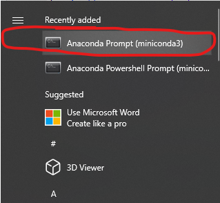
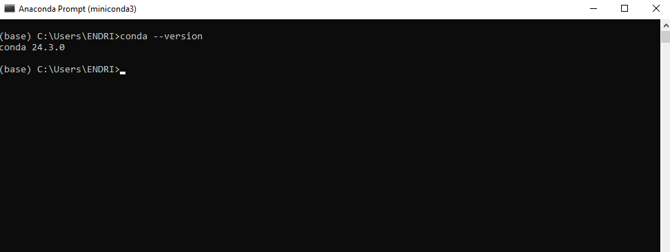

```{r setup, include=FALSE}
    library(knitr)
    library(tidyverse)
knitr::opts_chunk$set(
comment=NA,
error=T, 
warning=T,
tidy=TRUE, 
fig.align = 'center',
message=F, 
warning=F,
tidy.opts=list(width.cutoff=60),
fig.width=4, 
fig.height=4, 
fig.path='Figs/')
```


## Organizimi i kursit - Python

  - Instalimi i Python
  
  - Konceptet bazë të programimit në Python
  
  - Analizimi i të dhënave me Python
  
  - Vizualizimi i të dhënave në Python
  
  
## Organizimi i kursit - Python dhe GIS

  - Procesimi i të dhënave vektor
  
  - Procesimi i të dhënave raster
  
  - Vizualizimi i të dhënave gjeografike
  
  - Lidhja me burimet gjeografike online
  
  
## Organizimi i kursit - Python dhe GIS

  - Interpolimi hapësinor
  
  - Analiza e rrjetit hapësinor
  
  - Analiza e terrenit
  
  
## Instalimi i Python-it

  - Python dhe libraritë e tij mund të instalohen lehtësisht duke përdorur paketa të ndryshme.

  - Për të instaluar Python-in, **Miniconda** është një zgjedhje e mirë sepse ofron një mjedis të qëndrueshëm dhe mënjanon konfliktin e librarive.


## Menaxhimi i Varësive midis librarive (dependency)

  - Python ka një numër të madh librarish të disponueshme që mund të kenë varësi të ndërsjella.
  
  - Është e rëndësishme që libraritë dhe versionet e tyre të punojnë mirë së bashku.

  - Menaxhimi i librarive (package managers)

## Pluset e përdorimit të Miniconda

   - Miniconda përfshin një menaxher librarish që lehtëson instalimin dhe përditësimin.

  - Ka support shumë të mirë
  
   - Falas

  - Ofron ndërfaqe grafike për lehtësi përdorimi
  

## Mjediset Virtuale (Virtual environments)

  - Mjediset virtuale krijojnë një hapësirë të izoluar për projektet tona Python.
  
  - Krijimi i mjediseve virtuale ndihmon për të shmangur konfliktet midis librarive dhe instalimeve të ndryshme.

  - Mund të krijojmë mjedise të shumta dhe të kalojmë lehtësisht mes tyre.

## Konfigurimi dhe Dokumentimi i Mjediseve

  - Përdorim skedarët **YAML** për të dokumentuar konfigurimet e mjediseve që krijojmë.
  
  - Në skedarët YAML, mund të përcaktojmë specifikat e mjedisit, përfshirë versionin e Python-it dhe libraritë që do përdorim.
  
  - Formati tipik për mjediset Conda/Mamba është **environment.yaml**
  
  

## Praktika të Mira

  - Është një praktikë e mirë të instalojmë të gjitha libraritë (kur është e mundur) nga i njëjti kanal Conda, si p.sh., **conda-forge**, dhe të     mos përziejmë **Conda** dhe **Pip** për instalime nëse nuk është e domosdoshme.

## Çfarë është një Kanal Conda

  - Një kanal Conda është një vendndodhje/server me një adresë të dedikuar në internet, ku ruhen libraritë.

  - Kanali shërben si bazë për strehimin(repository) e librarive, dhe menaxherët e paketave (si Conda/Mamba) kërkojnë dhe shkarkojnë libraritë nga këto kanale.
  
  
##  Instalimi i Python dhe i librarive të rekomanduara

**Windows:**

  - Shkarkojmë versionin Miniconda të bazuar në Python 3 që është i përshtatshëm për sistemin operativ ku do punojmë.

[https://docs.conda.io/en/latest/miniconda.html#latest-miniconda-installer-links](https://docs.conda.io/en/latest/miniconda.html#latest-miniconda-installer-links)

  
  - Ndjekim udhëzimet e instalimit nga faqja e Miniconda.


## Kontrolli i instalimit

  - Hapim **Terminalin** ose **Anaconda Prompt**
  
  


## Kontrolli i instalimit

  - Për të siguruar që conda është instaluar siç duhet, ekzekutojmë komandën:
  
  


## Instalimi i Mamba

  - Mamba është një menaxher librarish për Miniconda.

  - Për të instaluar **mamba**, hapim **Terminalin** ose **Command Prompt** në Windows si administrator.

  - Ekzekutojmë komandën:
  
```shell
  conda install mamba -n base -c conda-forge
```

## Shkarkimi i Skedarit të Mjedisit Python

  - Do përdorim skedarin **environment.yml** që përmban listën e librarive të nevojshme
  
  - Hapim Terminalin dhe shkoni te direktoria ku keni shkarkuar "environment.yml".

## Mjedisi Python

  - Krijojmë mjedisin Python duke ekzekutuar:

```shell
mamba env create -f environment.yml
```
## Mjedisi Python

Për të aktivizuar mjedisin e ri:

```shell
conda activate pythongis
```

## Ekzekutimi i JupyterLab

  - Për të filluar **JupyterLab**, ekzekutojmë komandën në **Terminal** ose **Command Prompt**:

```shell
jupyter lab
```

## Ekzekutimi i JupyterLab

  - JupyterLab duhet të hapet automatikisht në një faqe browser
  
  
## Instalimi i Librarive Shtesë

Për të instaluar paketa të reja, përdorim komandën:

```shell
mamba install -c conda-forge package-name
```

## Instalimi i Librarive Shtesë

  - Një shembull për instalimin e librarisë pandas nga kanali conda-forge:

```shell
mamba install -c conda-forge pandas
```

## Instalimi i Librarive Shtesë

   - Në rast se shfaqet ndonjë gabim, kontrollojmë versionet dhe kanalet e librarive ekzistuese me komandën:

```shell
mamba list
```
